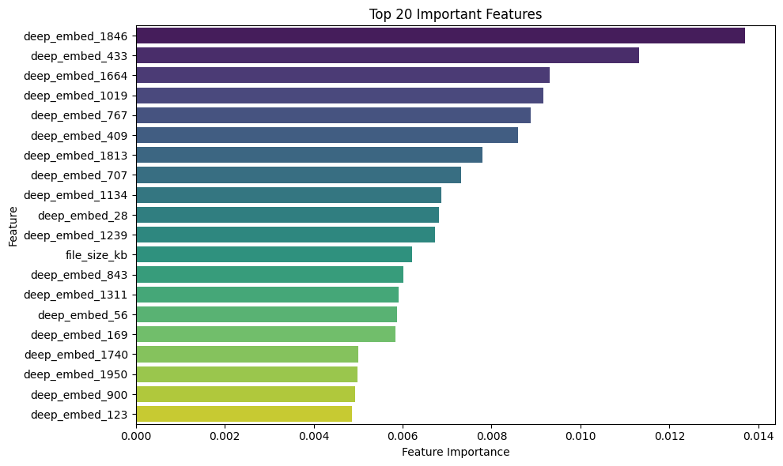
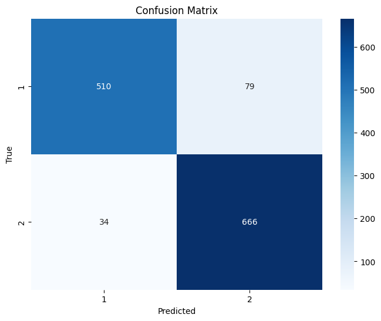
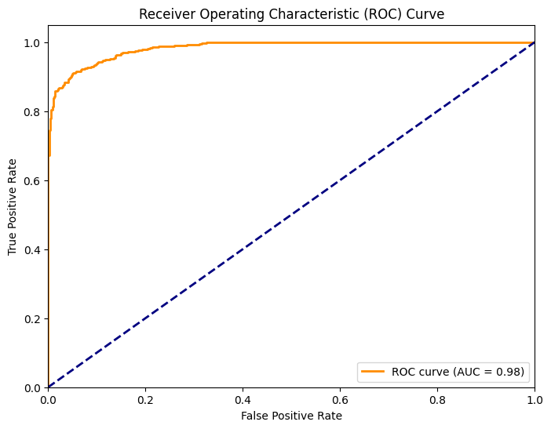
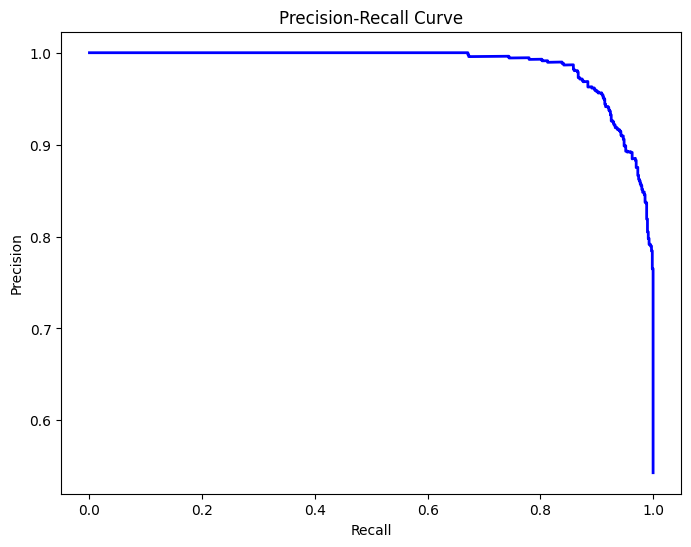

```python
from google.colab import drive
drive.mount('/content/drive')
```

    Mounted at /content/drive
    


```python
# ============================================================================
# COMPREHENSIVE CATBOOST HYPERPARAMETER TUNING - OPTIMIZED VERSION
# ============================================================================

# Import all necessary libraries
import pandas as pd
import numpy as np
import warnings
from pathlib import Path
import time
from datetime import datetime
import itertools
import pickle
import joblib
import json

# Machine Learning libraries
from sklearn.model_selection import train_test_split, cross_val_score
from sklearn.preprocessing import LabelEncoder
from sklearn.metrics import (
    accuracy_score, precision_score, recall_score, f1_score,
    confusion_matrix, classification_report, roc_auc_score,
    precision_recall_curve, roc_curve, matthews_corrcoef,
    cohen_kappa_score, balanced_accuracy_score
)

from sklearn.ensemble import RandomForestClassifier

# Visualization
import matplotlib.pyplot as plt
import seaborn as sns

#from google.colab import files

# Suppress warnings for cleaner output
warnings.filterwarnings('ignore')
plt.style.use('default')

print("="*80)
print("OPTIMIZED RANDOM FOREST HYPERPARAMETER TUNING PIPELINE")
print("="*80)
print("✅ All libraries imported successfully!")
```

    ================================================================================
    OPTIMIZED RANDOM FOREST HYPERPARAMETER TUNING PIPELINE
    ================================================================================
    ✅ All libraries imported successfully!
    


```python
file_path = "../dataset/01_feature_csv/TRAIN_StyleGAN.csv"
df = pd.read_csv(file_path)
print(f"✅ Dataset loaded successfully!")
print(f"📊 Dataset shape: {df.shape}")
print(f"💾 Memory usage: {df.memory_usage(deep=True).sum() / 1024**2:.2f} MB")
```

    ✅ Dataset loaded successfully!
    📊 Dataset shape: (12890, 2184)
    💾 Memory usage: 216.56 MB
    


```python
columns_to_drop = ['file_name', 'aspect_ratio', 'resolution', 'deep_embed_999']
original_cols = df.shape[1]
df = df.drop(columns=columns_to_drop, errors='ignore')
dropped = original_cols - df.shape[1]
if dropped > 0:
  print(f"🗑️ Dropped {dropped} columns")

print(f"Dataset Head: {df.head()}")
print(f"Dataset Info: {df.info()}")
print(df.columns.tolist())
```

    🗑️ Dropped 1 columns
    Dataset Head:    bit_depth_total  blue_channel_kurtosis  blue_channel_mean  \
    0             24.0                  -0.79             121.78   
    1             24.0                  -0.84             101.71   
    2             24.0                  -1.04             104.44   
    3             24.0                  -0.65             154.19   
    4             24.0                  -0.94             154.09   
    
       blue_channel_skewness  blue_channel_std_dev  canny_edge_count  \
    0                   0.28                 60.84            3973.0   
    1                   0.40                 54.01            2743.0   
    2                   0.27                 76.54            4690.0   
    3                  -0.69                 62.85            3554.0   
    4                  -0.12                 62.79            4579.0   
    
       canny_edge_density  color_hist_blue_0  color_hist_blue_1  \
    0              0.0606              665.0              716.0   
    1              0.0419               51.0             1099.0   
    2              0.0716             7634.0             3845.0   
    3              0.0542              178.0              470.0   
    4              0.0699                1.0                5.0   
    
       color_hist_blue_10  ...  num_channels  overall_brightness_mean_gray  \
    0              3016.0  ...             3                        113.34   
    1              3747.0  ...             3                        111.18   
    2              1839.0  ...             3                        120.24   
    3               842.0  ...             3                        171.22   
    4              2225.0  ...             3                        159.31   
    
       overall_contrast_std_dev_gray  red_channel_kurtosis  red_channel_mean  \
    0                          48.58                 -1.37             78.25   
    1                          47.28                 -0.94            121.21   
    2                          74.08                 -1.28            135.54   
    3                          57.73                  0.59            187.73   
    4                          63.85                 -0.55            170.24   
    
       red_channel_skewness  red_channel_std_dev  skewness_gray  width_pixels  \
    0                  0.06                60.74           0.18           256   
    1                 -0.46                49.74          -0.20           256   
    2                 -0.54                75.48          -0.24           256   
    3                 -1.09                59.25          -1.00           256   
    4                 -0.69                64.18          -0.37           256   
    
       class  
    0      1  
    1      1  
    2      1  
    3      1  
    4      1  
    
    [5 rows x 2180 columns]
    <class 'pandas.core.frame.DataFrame'>
    RangeIndex: 12890 entries, 0 to 12889
    Columns: 2180 entries, bit_depth_total to class
    dtypes: float64(2175), int64(5)
    memory usage: 214.4 MB
    Dataset Info: None
    ['bit_depth_total', 'blue_channel_kurtosis', 'blue_channel_mean', 'blue_channel_skewness', 'blue_channel_std_dev', 'canny_edge_count', 'canny_edge_density', 'color_hist_blue_0', 'color_hist_blue_1', 'color_hist_blue_10', 'color_hist_blue_11', 'color_hist_blue_12', 'color_hist_blue_13', 'color_hist_blue_14', 'color_hist_blue_15', 'color_hist_blue_16', 'color_hist_blue_17', 'color_hist_blue_18', 'color_hist_blue_19', 'color_hist_blue_2', 'color_hist_blue_20', 'color_hist_blue_21', 'color_hist_blue_22', 'color_hist_blue_23', 'color_hist_blue_24', 'color_hist_blue_25', 'color_hist_blue_26', 'color_hist_blue_27', 'color_hist_blue_28', 'color_hist_blue_29', 'color_hist_blue_3', 'color_hist_blue_30', 'color_hist_blue_31', 'color_hist_blue_4', 'color_hist_blue_5', 'color_hist_blue_6', 'color_hist_blue_7', 'color_hist_blue_8', 'color_hist_blue_9', 'color_hist_green_0', 'color_hist_green_1', 'color_hist_green_10', 'color_hist_green_11', 'color_hist_green_12', 'color_hist_green_13', 'color_hist_green_14', 'color_hist_green_15', 'color_hist_green_16', 'color_hist_green_17', 'color_hist_green_18', 'color_hist_green_19', 'color_hist_green_2', 'color_hist_green_20', 'color_hist_green_21', 'color_hist_green_22', 'color_hist_green_23', 'color_hist_green_24', 'color_hist_green_25', 'color_hist_green_26', 'color_hist_green_27', 'color_hist_green_28', 'color_hist_green_29', 'color_hist_green_3', 'color_hist_green_30', 'color_hist_green_31', 'color_hist_green_4', 'color_hist_green_5', 'color_hist_green_6', 'color_hist_green_7', 'color_hist_green_8', 'color_hist_green_9', 'color_hist_red_0', 'color_hist_red_1', 'color_hist_red_10', 'color_hist_red_11', 'color_hist_red_12', 'color_hist_red_13', 'color_hist_red_14', 'color_hist_red_15', 'color_hist_red_16', 'color_hist_red_17', 'color_hist_red_18', 'color_hist_red_19', 'color_hist_red_2', 'color_hist_red_20', 'color_hist_red_21', 'color_hist_red_22', 'color_hist_red_23', 'color_hist_red_24', 'color_hist_red_25', 'color_hist_red_26', 'color_hist_red_27', 'color_hist_red_28', 'color_hist_red_29', 'color_hist_red_3', 'color_hist_red_30', 'color_hist_red_31', 'color_hist_red_4', 'color_hist_red_5', 'color_hist_red_6', 'color_hist_red_7', 'color_hist_red_8', 'color_hist_red_9', 'deep_embed_0', 'deep_embed_1', 'deep_embed_10', 'deep_embed_100', 'deep_embed_1000', 'deep_embed_1001', 'deep_embed_1002', 'deep_embed_1003', 'deep_embed_1004', 'deep_embed_1005', 'deep_embed_1006', 'deep_embed_1007', 'deep_embed_1008', 'deep_embed_1009', 'deep_embed_101', 'deep_embed_1010', 'deep_embed_1011', 'deep_embed_1012', 'deep_embed_1013', 'deep_embed_1014', 'deep_embed_1015', 'deep_embed_1016', 'deep_embed_1017', 'deep_embed_1018', 'deep_embed_1019', 'deep_embed_102', 'deep_embed_1020', 'deep_embed_1021', 'deep_embed_1022', 'deep_embed_1023', 'deep_embed_1024', 'deep_embed_1025', 'deep_embed_1026', 'deep_embed_1027', 'deep_embed_1028', 'deep_embed_1029', 'deep_embed_103', 'deep_embed_1030', 'deep_embed_1031', 'deep_embed_1032', 'deep_embed_1033', 'deep_embed_1034', 'deep_embed_1035', 'deep_embed_1036', 'deep_embed_1037', 'deep_embed_1038', 'deep_embed_1039', 'deep_embed_104', 'deep_embed_1040', 'deep_embed_1041', 'deep_embed_1042', 'deep_embed_1043', 'deep_embed_1044', 'deep_embed_1045', 'deep_embed_1046', 'deep_embed_1047', 'deep_embed_1048', 'deep_embed_1049', 'deep_embed_105', 'deep_embed_1050', 'deep_embed_1051', 'deep_embed_1052', 'deep_embed_1053', 'deep_embed_1054', 'deep_embed_1055', 'deep_embed_1056', 'deep_embed_1057', 'deep_embed_1058', 'deep_embed_1059', 'deep_embed_106', 'deep_embed_1060', 'deep_embed_1061', 'deep_embed_1062', 'deep_embed_1063', 'deep_embed_1064', 'deep_embed_1065', 'deep_embed_1066', 'deep_embed_1067', 'deep_embed_1068', 'deep_embed_1069', 'deep_embed_107', 'deep_embed_1070', 'deep_embed_1071', 'deep_embed_1072', 'deep_embed_1073', 'deep_embed_1074', 'deep_embed_1075', 'deep_embed_1076', 'deep_embed_1077', 'deep_embed_1078', 'deep_embed_1079', 'deep_embed_108', 'deep_embed_1080', 'deep_embed_1081', 'deep_embed_1082', 'deep_embed_1083', 'deep_embed_1084', 'deep_embed_1085', 'deep_embed_1086', 'deep_embed_1087', 'deep_embed_1088', 'deep_embed_1089', 'deep_embed_109', 'deep_embed_1090', 'deep_embed_1091', 'deep_embed_1092', 'deep_embed_1093', 'deep_embed_1094', 'deep_embed_1095', 'deep_embed_1096', 'deep_embed_1097', 'deep_embed_1098', 'deep_embed_1099', 'deep_embed_11', 'deep_embed_110', 'deep_embed_1100', 'deep_embed_1101', 'deep_embed_1102', 'deep_embed_1103', 'deep_embed_1104', 'deep_embed_1105', 'deep_embed_1106', 'deep_embed_1107', 'deep_embed_1108', 'deep_embed_1109', 'deep_embed_111', 'deep_embed_1110', 'deep_embed_1111', 'deep_embed_1112', 'deep_embed_1113', 'deep_embed_1114', 'deep_embed_1115', 'deep_embed_1116', 'deep_embed_1117', 'deep_embed_1118', 'deep_embed_1119', 'deep_embed_112', 'deep_embed_1120', 'deep_embed_1121', 'deep_embed_1122', 'deep_embed_1123', 'deep_embed_1124', 'deep_embed_1125', 'deep_embed_1126', 'deep_embed_1127', 'deep_embed_1128', 'deep_embed_1129', 'deep_embed_113', 'deep_embed_1130', 'deep_embed_1131', 'deep_embed_1132', 'deep_embed_1133', 'deep_embed_1134', 'deep_embed_1135', 'deep_embed_1136', 'deep_embed_1137', 'deep_embed_1138', 'deep_embed_1139', 'deep_embed_114', 'deep_embed_1140', 'deep_embed_1141', 'deep_embed_1142', 'deep_embed_1143', 'deep_embed_1144', 'deep_embed_1145', 'deep_embed_1146', 'deep_embed_1147', 'deep_embed_1148', 'deep_embed_1149', 'deep_embed_115', 'deep_embed_1150', 'deep_embed_1151', 'deep_embed_1152', 'deep_embed_1153', 'deep_embed_1154', 'deep_embed_1155', 'deep_embed_1156', 'deep_embed_1157', 'deep_embed_1158', 'deep_embed_1159', 'deep_embed_116', 'deep_embed_1160', 'deep_embed_1161', 'deep_embed_1162', 'deep_embed_1163', 'deep_embed_1164', 'deep_embed_1165', 'deep_embed_1166', 'deep_embed_1167', 'deep_embed_1168', 'deep_embed_1169', 'deep_embed_117', 'deep_embed_1170', 'deep_embed_1171', 'deep_embed_1172', 'deep_embed_1173', 'deep_embed_1174', 'deep_embed_1175', 'deep_embed_1176', 'deep_embed_1177', 'deep_embed_1178', 'deep_embed_1179', 'deep_embed_118', 'deep_embed_1180', 'deep_embed_1181', 'deep_embed_1182', 'deep_embed_1183', 'deep_embed_1184', 'deep_embed_1185', 'deep_embed_1186', 'deep_embed_1187', 'deep_embed_1188', 'deep_embed_1189', 'deep_embed_119', 'deep_embed_1190', 'deep_embed_1191', 'deep_embed_1192', 'deep_embed_1193', 'deep_embed_1194', 'deep_embed_1195', 'deep_embed_1196', 'deep_embed_1197', 'deep_embed_1198', 'deep_embed_1199', 'deep_embed_12', 'deep_embed_120', 'deep_embed_1200', 'deep_embed_1201', 'deep_embed_1202', 'deep_embed_1203', 'deep_embed_1204', 'deep_embed_1205', 'deep_embed_1206', 'deep_embed_1207', 'deep_embed_1208', 'deep_embed_1209', 'deep_embed_121', 'deep_embed_1210', 'deep_embed_1211', 'deep_embed_1212', 'deep_embed_1213', 'deep_embed_1214', 'deep_embed_1215', 'deep_embed_1216', 'deep_embed_1217', 'deep_embed_1218', 'deep_embed_1219', 'deep_embed_122', 'deep_embed_1220', 'deep_embed_1221', 'deep_embed_1222', 'deep_embed_1223', 'deep_embed_1224', 'deep_embed_1225', 'deep_embed_1226', 'deep_embed_1227', 'deep_embed_1228', 'deep_embed_1229', 'deep_embed_123', 'deep_embed_1230', 'deep_embed_1231', 'deep_embed_1232', 'deep_embed_1233', 'deep_embed_1234', 'deep_embed_1235', 'deep_embed_1236', 'deep_embed_1237', 'deep_embed_1238', 'deep_embed_1239', 'deep_embed_124', 'deep_embed_1240', 'deep_embed_1241', 'deep_embed_1242', 'deep_embed_1243', 'deep_embed_1244', 'deep_embed_1245', 'deep_embed_1246', 'deep_embed_1247', 'deep_embed_1248', 'deep_embed_1249', 'deep_embed_125', 'deep_embed_1250', 'deep_embed_1251', 'deep_embed_1252', 'deep_embed_1253', 'deep_embed_1254', 'deep_embed_1255', 'deep_embed_1256', 'deep_embed_1257', 'deep_embed_1258', 'deep_embed_1259', 'deep_embed_126', 'deep_embed_1260', 'deep_embed_1261', 'deep_embed_1262', 'deep_embed_1263', 'deep_embed_1264', 'deep_embed_1265', 'deep_embed_1266', 'deep_embed_1267', 'deep_embed_1268', 'deep_embed_1269', 'deep_embed_127', 'deep_embed_1270', 'deep_embed_1271', 'deep_embed_1272', 'deep_embed_1273', 'deep_embed_1274', 'deep_embed_1275', 'deep_embed_1276', 'deep_embed_1277', 'deep_embed_1278', 'deep_embed_1279', 'deep_embed_128', 'deep_embed_1280', 'deep_embed_1281', 'deep_embed_1282', 'deep_embed_1283', 'deep_embed_1284', 'deep_embed_1285', 'deep_embed_1286', 'deep_embed_1287', 'deep_embed_1288', 'deep_embed_1289', 'deep_embed_129', 'deep_embed_1290', 'deep_embed_1291', 'deep_embed_1292', 'deep_embed_1293', 'deep_embed_1294', 'deep_embed_1295', 'deep_embed_1296', 'deep_embed_1297', 'deep_embed_1298', 'deep_embed_1299', 'deep_embed_13', 'deep_embed_130', 'deep_embed_1300', 'deep_embed_1301', 'deep_embed_1302', 'deep_embed_1303', 'deep_embed_1304', 'deep_embed_1305', 'deep_embed_1306', 'deep_embed_1307', 'deep_embed_1308', 'deep_embed_1309', 'deep_embed_131', 'deep_embed_1310', 'deep_embed_1311', 'deep_embed_1312', 'deep_embed_1313', 'deep_embed_1314', 'deep_embed_1315', 'deep_embed_1316', 'deep_embed_1317', 'deep_embed_1318', 'deep_embed_1319', 'deep_embed_132', 'deep_embed_1320', 'deep_embed_1321', 'deep_embed_1322', 'deep_embed_1323', 'deep_embed_1324', 'deep_embed_1325', 'deep_embed_1326', 'deep_embed_1327', 'deep_embed_1328', 'deep_embed_1329', 'deep_embed_133', 'deep_embed_1330', 'deep_embed_1331', 'deep_embed_1332', 'deep_embed_1333', 'deep_embed_1334', 'deep_embed_1335', 'deep_embed_1336', 'deep_embed_1337', 'deep_embed_1338', 'deep_embed_1339', 'deep_embed_134', 'deep_embed_1340', 'deep_embed_1341', 'deep_embed_1342', 'deep_embed_1343', 'deep_embed_1344', 'deep_embed_1345', 'deep_embed_1346', 'deep_embed_1347', 'deep_embed_1348', 'deep_embed_1349', 'deep_embed_135', 'deep_embed_1350', 'deep_embed_1351', 'deep_embed_1352', 'deep_embed_1353', 'deep_embed_1354', 'deep_embed_1355', 'deep_embed_1356', 'deep_embed_1357', 'deep_embed_1358', 'deep_embed_1359', 'deep_embed_136', 'deep_embed_1360', 'deep_embed_1361', 'deep_embed_1362', 'deep_embed_1363', 'deep_embed_1364', 'deep_embed_1365', 'deep_embed_1366', 'deep_embed_1367', 'deep_embed_1368', 'deep_embed_1369', 'deep_embed_137', 'deep_embed_1370', 'deep_embed_1371', 'deep_embed_1372', 'deep_embed_1373', 'deep_embed_1374', 'deep_embed_1375', 'deep_embed_1376', 'deep_embed_1377', 'deep_embed_1378', 'deep_embed_1379', 'deep_embed_138', 'deep_embed_1380', 'deep_embed_1381', 'deep_embed_1382', 'deep_embed_1383', 'deep_embed_1384', 'deep_embed_1385', 'deep_embed_1386', 'deep_embed_1387', 'deep_embed_1388', 'deep_embed_1389', 'deep_embed_139', 'deep_embed_1390', 'deep_embed_1391', 'deep_embed_1392', 'deep_embed_1393', 'deep_embed_1394', 'deep_embed_1395', 'deep_embed_1396', 'deep_embed_1397', 'deep_embed_1398', 'deep_embed_1399', 'deep_embed_14', 'deep_embed_140', 'deep_embed_1400', 'deep_embed_1401', 'deep_embed_1402', 'deep_embed_1403', 'deep_embed_1404', 'deep_embed_1405', 'deep_embed_1406', 'deep_embed_1407', 'deep_embed_1408', 'deep_embed_1409', 'deep_embed_141', 'deep_embed_1410', 'deep_embed_1411', 'deep_embed_1412', 'deep_embed_1413', 'deep_embed_1414', 'deep_embed_1415', 'deep_embed_1416', 'deep_embed_1417', 'deep_embed_1418', 'deep_embed_1419', 'deep_embed_142', 'deep_embed_1420', 'deep_embed_1421', 'deep_embed_1422', 'deep_embed_1423', 'deep_embed_1424', 'deep_embed_1425', 'deep_embed_1426', 'deep_embed_1427', 'deep_embed_1428', 'deep_embed_1429', 'deep_embed_143', 'deep_embed_1430', 'deep_embed_1431', 'deep_embed_1432', 'deep_embed_1433', 'deep_embed_1434', 'deep_embed_1435', 'deep_embed_1436', 'deep_embed_1437', 'deep_embed_1438', 'deep_embed_1439', 'deep_embed_144', 'deep_embed_1440', 'deep_embed_1441', 'deep_embed_1442', 'deep_embed_1443', 'deep_embed_1444', 'deep_embed_1445', 'deep_embed_1446', 'deep_embed_1447', 'deep_embed_1448', 'deep_embed_1449', 'deep_embed_145', 'deep_embed_1450', 'deep_embed_1451', 'deep_embed_1452', 'deep_embed_1453', 'deep_embed_1454', 'deep_embed_1455', 'deep_embed_1456', 'deep_embed_1457', 'deep_embed_1458', 'deep_embed_1459', 'deep_embed_146', 'deep_embed_1460', 'deep_embed_1461', 'deep_embed_1462', 'deep_embed_1463', 'deep_embed_1464', 'deep_embed_1465', 'deep_embed_1466', 'deep_embed_1467', 'deep_embed_1468', 'deep_embed_1469', 'deep_embed_147', 'deep_embed_1470', 'deep_embed_1471', 'deep_embed_1472', 'deep_embed_1473', 'deep_embed_1474', 'deep_embed_1475', 'deep_embed_1476', 'deep_embed_1477', 'deep_embed_1478', 'deep_embed_1479', 'deep_embed_148', 'deep_embed_1480', 'deep_embed_1481', 'deep_embed_1482', 'deep_embed_1483', 'deep_embed_1484', 'deep_embed_1485', 'deep_embed_1486', 'deep_embed_1487', 'deep_embed_1488', 'deep_embed_1489', 'deep_embed_149', 'deep_embed_1490', 'deep_embed_1491', 'deep_embed_1492', 'deep_embed_1493', 'deep_embed_1494', 'deep_embed_1495', 'deep_embed_1496', 'deep_embed_1497', 'deep_embed_1498', 'deep_embed_1499', 'deep_embed_15', 'deep_embed_150', 'deep_embed_1500', 'deep_embed_1501', 'deep_embed_1502', 'deep_embed_1503', 'deep_embed_1504', 'deep_embed_1505', 'deep_embed_1506', 'deep_embed_1507', 'deep_embed_1508', 'deep_embed_1509', 'deep_embed_151', 'deep_embed_1510', 'deep_embed_1511', 'deep_embed_1512', 'deep_embed_1513', 'deep_embed_1514', 'deep_embed_1515', 'deep_embed_1516', 'deep_embed_1517', 'deep_embed_1518', 'deep_embed_1519', 'deep_embed_152', 'deep_embed_1520', 'deep_embed_1521', 'deep_embed_1522', 'deep_embed_1523', 'deep_embed_1524', 'deep_embed_1525', 'deep_embed_1526', 'deep_embed_1527', 'deep_embed_1528', 'deep_embed_1529', 'deep_embed_153', 'deep_embed_1530', 'deep_embed_1531', 'deep_embed_1532', 'deep_embed_1533', 'deep_embed_1534', 'deep_embed_1535', 'deep_embed_1536', 'deep_embed_1537', 'deep_embed_1538', 'deep_embed_1539', 'deep_embed_154', 'deep_embed_1540', 'deep_embed_1541', 'deep_embed_1542', 'deep_embed_1543', 'deep_embed_1544', 'deep_embed_1545', 'deep_embed_1546', 'deep_embed_1547', 'deep_embed_1548', 'deep_embed_1549', 'deep_embed_155', 'deep_embed_1550', 'deep_embed_1551', 'deep_embed_1552', 'deep_embed_1553', 'deep_embed_1554', 'deep_embed_1555', 'deep_embed_1556', 'deep_embed_1557', 'deep_embed_1558', 'deep_embed_1559', 'deep_embed_156', 'deep_embed_1560', 'deep_embed_1561', 'deep_embed_1562', 'deep_embed_1563', 'deep_embed_1564', 'deep_embed_1565', 'deep_embed_1566', 'deep_embed_1567', 'deep_embed_1568', 'deep_embed_1569', 'deep_embed_157', 'deep_embed_1570', 'deep_embed_1571', 'deep_embed_1572', 'deep_embed_1573', 'deep_embed_1574', 'deep_embed_1575', 'deep_embed_1576', 'deep_embed_1577', 'deep_embed_1578', 'deep_embed_1579', 'deep_embed_158', 'deep_embed_1580', 'deep_embed_1581', 'deep_embed_1582', 'deep_embed_1583', 'deep_embed_1584', 'deep_embed_1585', 'deep_embed_1586', 'deep_embed_1587', 'deep_embed_1588', 'deep_embed_1589', 'deep_embed_159', 'deep_embed_1590', 'deep_embed_1591', 'deep_embed_1592', 'deep_embed_1593', 'deep_embed_1594', 'deep_embed_1595', 'deep_embed_1596', 'deep_embed_1597', 'deep_embed_1598', 'deep_embed_1599', 'deep_embed_16', 'deep_embed_160', 'deep_embed_1600', 'deep_embed_1601', 'deep_embed_1602', 'deep_embed_1603', 'deep_embed_1604', 'deep_embed_1605', 'deep_embed_1606', 'deep_embed_1607', 'deep_embed_1608', 'deep_embed_1609', 'deep_embed_161', 'deep_embed_1610', 'deep_embed_1611', 'deep_embed_1612', 'deep_embed_1613', 'deep_embed_1614', 'deep_embed_1615', 'deep_embed_1616', 'deep_embed_1617', 'deep_embed_1618', 'deep_embed_1619', 'deep_embed_162', 'deep_embed_1620', 'deep_embed_1621', 'deep_embed_1622', 'deep_embed_1623', 'deep_embed_1624', 'deep_embed_1625', 'deep_embed_1626', 'deep_embed_1627', 'deep_embed_1628', 'deep_embed_1629', 'deep_embed_163', 'deep_embed_1630', 'deep_embed_1631', 'deep_embed_1632', 'deep_embed_1633', 'deep_embed_1634', 'deep_embed_1635', 'deep_embed_1636', 'deep_embed_1637', 'deep_embed_1638', 'deep_embed_1639', 'deep_embed_164', 'deep_embed_1640', 'deep_embed_1641', 'deep_embed_1642', 'deep_embed_1643', 'deep_embed_1644', 'deep_embed_1645', 'deep_embed_1646', 'deep_embed_1647', 'deep_embed_1648', 'deep_embed_1649', 'deep_embed_165', 'deep_embed_1650', 'deep_embed_1651', 'deep_embed_1652', 'deep_embed_1653', 'deep_embed_1654', 'deep_embed_1655', 'deep_embed_1656', 'deep_embed_1657', 'deep_embed_1658', 'deep_embed_1659', 'deep_embed_166', 'deep_embed_1660', 'deep_embed_1661', 'deep_embed_1662', 'deep_embed_1663', 'deep_embed_1664', 'deep_embed_1665', 'deep_embed_1666', 'deep_embed_1667', 'deep_embed_1668', 'deep_embed_1669', 'deep_embed_167', 'deep_embed_1670', 'deep_embed_1671', 'deep_embed_1672', 'deep_embed_1673', 'deep_embed_1674', 'deep_embed_1675', 'deep_embed_1676', 'deep_embed_1677', 'deep_embed_1678', 'deep_embed_1679', 'deep_embed_168', 'deep_embed_1680', 'deep_embed_1681', 'deep_embed_1682', 'deep_embed_1683', 'deep_embed_1684', 'deep_embed_1685', 'deep_embed_1686', 'deep_embed_1687', 'deep_embed_1688', 'deep_embed_1689', 'deep_embed_169', 'deep_embed_1690', 'deep_embed_1691', 'deep_embed_1692', 'deep_embed_1693', 'deep_embed_1694', 'deep_embed_1695', 'deep_embed_1696', 'deep_embed_1697', 'deep_embed_1698', 'deep_embed_1699', 'deep_embed_17', 'deep_embed_170', 'deep_embed_1700', 'deep_embed_1701', 'deep_embed_1702', 'deep_embed_1703', 'deep_embed_1704', 'deep_embed_1705', 'deep_embed_1706', 'deep_embed_1707', 'deep_embed_1708', 'deep_embed_1709', 'deep_embed_171', 'deep_embed_1710', 'deep_embed_1711', 'deep_embed_1712', 'deep_embed_1713', 'deep_embed_1714', 'deep_embed_1715', 'deep_embed_1716', 'deep_embed_1717', 'deep_embed_1718', 'deep_embed_1719', 'deep_embed_172', 'deep_embed_1720', 'deep_embed_1721', 'deep_embed_1722', 'deep_embed_1723', 'deep_embed_1724', 'deep_embed_1725', 'deep_embed_1726', 'deep_embed_1727', 'deep_embed_1728', 'deep_embed_1729', 'deep_embed_173', 'deep_embed_1730', 'deep_embed_1731', 'deep_embed_1732', 'deep_embed_1733', 'deep_embed_1734', 'deep_embed_1735', 'deep_embed_1736', 'deep_embed_1737', 'deep_embed_1738', 'deep_embed_1739', 'deep_embed_174', 'deep_embed_1740', 'deep_embed_1741', 'deep_embed_1742', 'deep_embed_1743', 'deep_embed_1744', 'deep_embed_1745', 'deep_embed_1746', 'deep_embed_1747', 'deep_embed_1748', 'deep_embed_1749', 'deep_embed_175', 'deep_embed_1750', 'deep_embed_1751', 'deep_embed_1752', 'deep_embed_1753', 'deep_embed_1754', 'deep_embed_1755', 'deep_embed_1756', 'deep_embed_1757', 'deep_embed_1758', 'deep_embed_1759', 'deep_embed_176', 'deep_embed_1760', 'deep_embed_1761', 'deep_embed_1762', 'deep_embed_1763', 'deep_embed_1764', 'deep_embed_1765', 'deep_embed_1766', 'deep_embed_1767', 'deep_embed_1768', 'deep_embed_1769', 'deep_embed_177', 'deep_embed_1770', 'deep_embed_1771', 'deep_embed_1772', 'deep_embed_1773', 'deep_embed_1774', 'deep_embed_1775', 'deep_embed_1776', 'deep_embed_1777', 'deep_embed_1778', 'deep_embed_1779', 'deep_embed_178', 'deep_embed_1780', 'deep_embed_1781', 'deep_embed_1782', 'deep_embed_1783', 'deep_embed_1784', 'deep_embed_1785', 'deep_embed_1786', 'deep_embed_1787', 'deep_embed_1788', 'deep_embed_1789', 'deep_embed_179', 'deep_embed_1790', 'deep_embed_1791', 'deep_embed_1792', 'deep_embed_1793', 'deep_embed_1794', 'deep_embed_1795', 'deep_embed_1796', 'deep_embed_1797', 'deep_embed_1798', 'deep_embed_1799', 'deep_embed_18', 'deep_embed_180', 'deep_embed_1800', 'deep_embed_1801', 'deep_embed_1802', 'deep_embed_1803', 'deep_embed_1804', 'deep_embed_1805', 'deep_embed_1806', 'deep_embed_1807', 'deep_embed_1808', 'deep_embed_1809', 'deep_embed_181', 'deep_embed_1810', 'deep_embed_1811', 'deep_embed_1812', 'deep_embed_1813', 'deep_embed_1814', 'deep_embed_1815', 'deep_embed_1816', 'deep_embed_1817', 'deep_embed_1818', 'deep_embed_1819', 'deep_embed_182', 'deep_embed_1820', 'deep_embed_1821', 'deep_embed_1822', 'deep_embed_1823', 'deep_embed_1824', 'deep_embed_1825', 'deep_embed_1826', 'deep_embed_1827', 'deep_embed_1828', 'deep_embed_1829', 'deep_embed_183', 'deep_embed_1830', 'deep_embed_1831', 'deep_embed_1832', 'deep_embed_1833', 'deep_embed_1834', 'deep_embed_1835', 'deep_embed_1836', 'deep_embed_1837', 'deep_embed_1838', 'deep_embed_1839', 'deep_embed_184', 'deep_embed_1840', 'deep_embed_1841', 'deep_embed_1842', 'deep_embed_1843', 'deep_embed_1844', 'deep_embed_1845', 'deep_embed_1846', 'deep_embed_1847', 'deep_embed_1848', 'deep_embed_1849', 'deep_embed_185', 'deep_embed_1850', 'deep_embed_1851', 'deep_embed_1852', 'deep_embed_1853', 'deep_embed_1854', 'deep_embed_1855', 'deep_embed_1856', 'deep_embed_1857', 'deep_embed_1858', 'deep_embed_1859', 'deep_embed_186', 'deep_embed_1860', 'deep_embed_1861', 'deep_embed_1862', 'deep_embed_1863', 'deep_embed_1864', 'deep_embed_1865', 'deep_embed_1866', 'deep_embed_1867', 'deep_embed_1868', 'deep_embed_1869', 'deep_embed_187', 'deep_embed_1870', 'deep_embed_1871', 'deep_embed_1872', 'deep_embed_1873', 'deep_embed_1874', 'deep_embed_1875', 'deep_embed_1876', 'deep_embed_1877', 'deep_embed_1878', 'deep_embed_1879', 'deep_embed_188', 'deep_embed_1880', 'deep_embed_1881', 'deep_embed_1882', 'deep_embed_1883', 'deep_embed_1884', 'deep_embed_1885', 'deep_embed_1886', 'deep_embed_1887', 'deep_embed_1888', 'deep_embed_1889', 'deep_embed_189', 'deep_embed_1890', 'deep_embed_1891', 'deep_embed_1892', 'deep_embed_1893', 'deep_embed_1894', 'deep_embed_1895', 'deep_embed_1896', 'deep_embed_1897', 'deep_embed_1898', 'deep_embed_1899', 'deep_embed_19', 'deep_embed_190', 'deep_embed_1900', 'deep_embed_1901', 'deep_embed_1902', 'deep_embed_1903', 'deep_embed_1904', 'deep_embed_1905', 'deep_embed_1906', 'deep_embed_1907', 'deep_embed_1908', 'deep_embed_1909', 'deep_embed_191', 'deep_embed_1910', 'deep_embed_1911', 'deep_embed_1912', 'deep_embed_1913', 'deep_embed_1914', 'deep_embed_1915', 'deep_embed_1916', 'deep_embed_1917', 'deep_embed_1918', 'deep_embed_1919', 'deep_embed_192', 'deep_embed_1920', 'deep_embed_1921', 'deep_embed_1922', 'deep_embed_1923', 'deep_embed_1924', 'deep_embed_1925', 'deep_embed_1926', 'deep_embed_1927', 'deep_embed_1928', 'deep_embed_1929', 'deep_embed_193', 'deep_embed_1930', 'deep_embed_1931', 'deep_embed_1932', 'deep_embed_1933', 'deep_embed_1934', 'deep_embed_1935', 'deep_embed_1936', 'deep_embed_1937', 'deep_embed_1938', 'deep_embed_1939', 'deep_embed_194', 'deep_embed_1940', 'deep_embed_1941', 'deep_embed_1942', 'deep_embed_1943', 'deep_embed_1944', 'deep_embed_1945', 'deep_embed_1946', 'deep_embed_1947', 'deep_embed_1948', 'deep_embed_1949', 'deep_embed_195', 'deep_embed_1950', 'deep_embed_1951', 'deep_embed_1952', 'deep_embed_1953', 'deep_embed_1954', 'deep_embed_1955', 'deep_embed_1956', 'deep_embed_1957', 'deep_embed_1958', 'deep_embed_1959', 'deep_embed_196', 'deep_embed_1960', 'deep_embed_1961', 'deep_embed_1962', 'deep_embed_1963', 'deep_embed_1964', 'deep_embed_1965', 'deep_embed_1966', 'deep_embed_1967', 'deep_embed_1968', 'deep_embed_1969', 'deep_embed_197', 'deep_embed_1970', 'deep_embed_1971', 'deep_embed_1972', 'deep_embed_1973', 'deep_embed_1974', 'deep_embed_1975', 'deep_embed_1976', 'deep_embed_1977', 'deep_embed_1978', 'deep_embed_1979', 'deep_embed_198', 'deep_embed_1980', 'deep_embed_1981', 'deep_embed_1982', 'deep_embed_1983', 'deep_embed_1984', 'deep_embed_1985', 'deep_embed_1986', 'deep_embed_1987', 'deep_embed_1988', 'deep_embed_1989', 'deep_embed_199', 'deep_embed_1990', 'deep_embed_1991', 'deep_embed_1992', 'deep_embed_1993', 'deep_embed_1994', 'deep_embed_1995', 'deep_embed_1996', 'deep_embed_1997', 'deep_embed_1998', 'deep_embed_1999', 'deep_embed_2', 'deep_embed_20', 'deep_embed_200', 'deep_embed_2000', 'deep_embed_2001', 'deep_embed_2002', 'deep_embed_2003', 'deep_embed_2004', 'deep_embed_2005', 'deep_embed_2006', 'deep_embed_2007', 'deep_embed_2008', 'deep_embed_2009', 'deep_embed_201', 'deep_embed_2010', 'deep_embed_2011', 'deep_embed_2012', 'deep_embed_2013', 'deep_embed_2014', 'deep_embed_2015', 'deep_embed_2016', 'deep_embed_2017', 'deep_embed_2018', 'deep_embed_2019', 'deep_embed_202', 'deep_embed_2020', 'deep_embed_2021', 'deep_embed_2022', 'deep_embed_2023', 'deep_embed_2024', 'deep_embed_2025', 'deep_embed_2026', 'deep_embed_2027', 'deep_embed_2028', 'deep_embed_2029', 'deep_embed_203', 'deep_embed_2030', 'deep_embed_2031', 'deep_embed_2032', 'deep_embed_2033', 'deep_embed_2034', 'deep_embed_2035', 'deep_embed_2036', 'deep_embed_2037', 'deep_embed_2038', 'deep_embed_2039', 'deep_embed_204', 'deep_embed_2040', 'deep_embed_2041', 'deep_embed_2042', 'deep_embed_2043', 'deep_embed_2044', 'deep_embed_2045', 'deep_embed_2046', 'deep_embed_2047', 'deep_embed_205', 'deep_embed_206', 'deep_embed_207', 'deep_embed_208', 'deep_embed_209', 'deep_embed_21', 'deep_embed_210', 'deep_embed_211', 'deep_embed_212', 'deep_embed_213', 'deep_embed_214', 'deep_embed_215', 'deep_embed_216', 'deep_embed_217', 'deep_embed_218', 'deep_embed_219', 'deep_embed_22', 'deep_embed_220', 'deep_embed_221', 'deep_embed_222', 'deep_embed_223', 'deep_embed_224', 'deep_embed_225', 'deep_embed_226', 'deep_embed_227', 'deep_embed_228', 'deep_embed_229', 'deep_embed_23', 'deep_embed_230', 'deep_embed_231', 'deep_embed_232', 'deep_embed_233', 'deep_embed_234', 'deep_embed_235', 'deep_embed_236', 'deep_embed_237', 'deep_embed_238', 'deep_embed_239', 'deep_embed_24', 'deep_embed_240', 'deep_embed_241', 'deep_embed_242', 'deep_embed_243', 'deep_embed_244', 'deep_embed_245', 'deep_embed_246', 'deep_embed_247', 'deep_embed_248', 'deep_embed_249', 'deep_embed_25', 'deep_embed_250', 'deep_embed_251', 'deep_embed_252', 'deep_embed_253', 'deep_embed_254', 'deep_embed_255', 'deep_embed_256', 'deep_embed_257', 'deep_embed_258', 'deep_embed_259', 'deep_embed_26', 'deep_embed_260', 'deep_embed_261', 'deep_embed_262', 'deep_embed_263', 'deep_embed_264', 'deep_embed_265', 'deep_embed_266', 'deep_embed_267', 'deep_embed_268', 'deep_embed_269', 'deep_embed_27', 'deep_embed_270', 'deep_embed_271', 'deep_embed_272', 'deep_embed_273', 'deep_embed_274', 'deep_embed_275', 'deep_embed_276', 'deep_embed_277', 'deep_embed_278', 'deep_embed_279', 'deep_embed_28', 'deep_embed_280', 'deep_embed_281', 'deep_embed_282', 'deep_embed_283', 'deep_embed_284', 'deep_embed_285', 'deep_embed_286', 'deep_embed_287', 'deep_embed_288', 'deep_embed_289', 'deep_embed_29', 'deep_embed_290', 'deep_embed_291', 'deep_embed_292', 'deep_embed_293', 'deep_embed_294', 'deep_embed_295', 'deep_embed_296', 'deep_embed_297', 'deep_embed_298', 'deep_embed_299', 'deep_embed_3', 'deep_embed_30', 'deep_embed_300', 'deep_embed_301', 'deep_embed_302', 'deep_embed_303', 'deep_embed_304', 'deep_embed_305', 'deep_embed_306', 'deep_embed_307', 'deep_embed_308', 'deep_embed_309', 'deep_embed_31', 'deep_embed_310', 'deep_embed_311', 'deep_embed_312', 'deep_embed_313', 'deep_embed_314', 'deep_embed_315', 'deep_embed_316', 'deep_embed_317', 'deep_embed_318', 'deep_embed_319', 'deep_embed_32', 'deep_embed_320', 'deep_embed_321', 'deep_embed_322', 'deep_embed_323', 'deep_embed_324', 'deep_embed_325', 'deep_embed_326', 'deep_embed_327', 'deep_embed_328', 'deep_embed_329', 'deep_embed_33', 'deep_embed_330', 'deep_embed_331', 'deep_embed_332', 'deep_embed_333', 'deep_embed_334', 'deep_embed_335', 'deep_embed_336', 'deep_embed_337', 'deep_embed_338', 'deep_embed_339', 'deep_embed_34', 'deep_embed_340', 'deep_embed_341', 'deep_embed_342', 'deep_embed_343', 'deep_embed_344', 'deep_embed_345', 'deep_embed_346', 'deep_embed_347', 'deep_embed_348', 'deep_embed_349', 'deep_embed_35', 'deep_embed_350', 'deep_embed_351', 'deep_embed_352', 'deep_embed_353', 'deep_embed_354', 'deep_embed_355', 'deep_embed_356', 'deep_embed_357', 'deep_embed_358', 'deep_embed_359', 'deep_embed_36', 'deep_embed_360', 'deep_embed_361', 'deep_embed_362', 'deep_embed_363', 'deep_embed_364', 'deep_embed_365', 'deep_embed_366', 'deep_embed_367', 'deep_embed_368', 'deep_embed_369', 'deep_embed_37', 'deep_embed_370', 'deep_embed_371', 'deep_embed_372', 'deep_embed_373', 'deep_embed_374', 'deep_embed_375', 'deep_embed_376', 'deep_embed_377', 'deep_embed_378', 'deep_embed_379', 'deep_embed_38', 'deep_embed_380', 'deep_embed_381', 'deep_embed_382', 'deep_embed_383', 'deep_embed_384', 'deep_embed_385', 'deep_embed_386', 'deep_embed_387', 'deep_embed_388', 'deep_embed_389', 'deep_embed_39', 'deep_embed_390', 'deep_embed_391', 'deep_embed_392', 'deep_embed_393', 'deep_embed_394', 'deep_embed_395', 'deep_embed_396', 'deep_embed_397', 'deep_embed_398', 'deep_embed_399', 'deep_embed_4', 'deep_embed_40', 'deep_embed_400', 'deep_embed_401', 'deep_embed_402', 'deep_embed_403', 'deep_embed_404', 'deep_embed_405', 'deep_embed_406', 'deep_embed_407', 'deep_embed_408', 'deep_embed_409', 'deep_embed_41', 'deep_embed_410', 'deep_embed_411', 'deep_embed_412', 'deep_embed_413', 'deep_embed_414', 'deep_embed_415', 'deep_embed_416', 'deep_embed_417', 'deep_embed_418', 'deep_embed_419', 'deep_embed_42', 'deep_embed_420', 'deep_embed_421', 'deep_embed_422', 'deep_embed_423', 'deep_embed_424', 'deep_embed_425', 'deep_embed_426', 'deep_embed_427', 'deep_embed_428', 'deep_embed_429', 'deep_embed_43', 'deep_embed_430', 'deep_embed_431', 'deep_embed_432', 'deep_embed_433', 'deep_embed_434', 'deep_embed_435', 'deep_embed_436', 'deep_embed_437', 'deep_embed_438', 'deep_embed_439', 'deep_embed_44', 'deep_embed_440', 'deep_embed_441', 'deep_embed_442', 'deep_embed_443', 'deep_embed_444', 'deep_embed_445', 'deep_embed_446', 'deep_embed_447', 'deep_embed_448', 'deep_embed_449', 'deep_embed_45', 'deep_embed_450', 'deep_embed_451', 'deep_embed_452', 'deep_embed_453', 'deep_embed_454', 'deep_embed_455', 'deep_embed_456', 'deep_embed_457', 'deep_embed_458', 'deep_embed_459', 'deep_embed_46', 'deep_embed_460', 'deep_embed_461', 'deep_embed_462', 'deep_embed_463', 'deep_embed_464', 'deep_embed_465', 'deep_embed_466', 'deep_embed_467', 'deep_embed_468', 'deep_embed_469', 'deep_embed_47', 'deep_embed_470', 'deep_embed_471', 'deep_embed_472', 'deep_embed_473', 'deep_embed_474', 'deep_embed_475', 'deep_embed_476', 'deep_embed_477', 'deep_embed_478', 'deep_embed_479', 'deep_embed_48', 'deep_embed_480', 'deep_embed_481', 'deep_embed_482', 'deep_embed_483', 'deep_embed_484', 'deep_embed_485', 'deep_embed_486', 'deep_embed_487', 'deep_embed_488', 'deep_embed_489', 'deep_embed_49', 'deep_embed_490', 'deep_embed_491', 'deep_embed_492', 'deep_embed_493', 'deep_embed_494', 'deep_embed_495', 'deep_embed_496', 'deep_embed_497', 'deep_embed_498', 'deep_embed_499', 'deep_embed_5', 'deep_embed_50', 'deep_embed_500', 'deep_embed_501', 'deep_embed_502', 'deep_embed_503', 'deep_embed_504', 'deep_embed_505', 'deep_embed_506', 'deep_embed_507', 'deep_embed_508', 'deep_embed_509', 'deep_embed_51', 'deep_embed_510', 'deep_embed_511', 'deep_embed_512', 'deep_embed_513', 'deep_embed_514', 'deep_embed_515', 'deep_embed_516', 'deep_embed_517', 'deep_embed_518', 'deep_embed_519', 'deep_embed_52', 'deep_embed_520', 'deep_embed_521', 'deep_embed_522', 'deep_embed_523', 'deep_embed_524', 'deep_embed_525', 'deep_embed_526', 'deep_embed_527', 'deep_embed_528', 'deep_embed_529', 'deep_embed_53', 'deep_embed_530', 'deep_embed_531', 'deep_embed_532', 'deep_embed_533', 'deep_embed_534', 'deep_embed_535', 'deep_embed_536', 'deep_embed_537', 'deep_embed_538', 'deep_embed_539', 'deep_embed_54', 'deep_embed_540', 'deep_embed_541', 'deep_embed_542', 'deep_embed_543', 'deep_embed_544', 'deep_embed_545', 'deep_embed_546', 'deep_embed_547', 'deep_embed_548', 'deep_embed_549', 'deep_embed_55', 'deep_embed_550', 'deep_embed_551', 'deep_embed_552', 'deep_embed_553', 'deep_embed_554', 'deep_embed_555', 'deep_embed_556', 'deep_embed_557', 'deep_embed_558', 'deep_embed_559', 'deep_embed_56', 'deep_embed_560', 'deep_embed_561', 'deep_embed_562', 'deep_embed_563', 'deep_embed_564', 'deep_embed_565', 'deep_embed_566', 'deep_embed_567', 'deep_embed_568', 'deep_embed_569', 'deep_embed_57', 'deep_embed_570', 'deep_embed_571', 'deep_embed_572', 'deep_embed_573', 'deep_embed_574', 'deep_embed_575', 'deep_embed_576', 'deep_embed_577', 'deep_embed_578', 'deep_embed_579', 'deep_embed_58', 'deep_embed_580', 'deep_embed_581', 'deep_embed_582', 'deep_embed_583', 'deep_embed_584', 'deep_embed_585', 'deep_embed_586', 'deep_embed_587', 'deep_embed_588', 'deep_embed_589', 'deep_embed_59', 'deep_embed_590', 'deep_embed_591', 'deep_embed_592', 'deep_embed_593', 'deep_embed_594', 'deep_embed_595', 'deep_embed_596', 'deep_embed_597', 'deep_embed_598', 'deep_embed_599', 'deep_embed_6', 'deep_embed_60', 'deep_embed_600', 'deep_embed_601', 'deep_embed_602', 'deep_embed_603', 'deep_embed_604', 'deep_embed_605', 'deep_embed_606', 'deep_embed_607', 'deep_embed_608', 'deep_embed_609', 'deep_embed_61', 'deep_embed_610', 'deep_embed_611', 'deep_embed_612', 'deep_embed_613', 'deep_embed_614', 'deep_embed_615', 'deep_embed_616', 'deep_embed_617', 'deep_embed_618', 'deep_embed_619', 'deep_embed_62', 'deep_embed_620', 'deep_embed_621', 'deep_embed_622', 'deep_embed_623', 'deep_embed_624', 'deep_embed_625', 'deep_embed_626', 'deep_embed_627', 'deep_embed_628', 'deep_embed_629', 'deep_embed_63', 'deep_embed_630', 'deep_embed_631', 'deep_embed_632', 'deep_embed_633', 'deep_embed_634', 'deep_embed_635', 'deep_embed_636', 'deep_embed_637', 'deep_embed_638', 'deep_embed_639', 'deep_embed_64', 'deep_embed_640', 'deep_embed_641', 'deep_embed_642', 'deep_embed_643', 'deep_embed_644', 'deep_embed_645', 'deep_embed_646', 'deep_embed_647', 'deep_embed_648', 'deep_embed_649', 'deep_embed_65', 'deep_embed_650', 'deep_embed_651', 'deep_embed_652', 'deep_embed_653', 'deep_embed_654', 'deep_embed_655', 'deep_embed_656', 'deep_embed_657', 'deep_embed_658', 'deep_embed_659', 'deep_embed_66', 'deep_embed_660', 'deep_embed_661', 'deep_embed_662', 'deep_embed_663', 'deep_embed_664', 'deep_embed_665', 'deep_embed_666', 'deep_embed_667', 'deep_embed_668', 'deep_embed_669', 'deep_embed_67', 'deep_embed_670', 'deep_embed_671', 'deep_embed_672', 'deep_embed_673', 'deep_embed_674', 'deep_embed_675', 'deep_embed_676', 'deep_embed_677', 'deep_embed_678', 'deep_embed_679', 'deep_embed_68', 'deep_embed_680', 'deep_embed_681', 'deep_embed_682', 'deep_embed_683', 'deep_embed_684', 'deep_embed_685', 'deep_embed_686', 'deep_embed_687', 'deep_embed_688', 'deep_embed_689', 'deep_embed_69', 'deep_embed_690', 'deep_embed_691', 'deep_embed_692', 'deep_embed_693', 'deep_embed_694', 'deep_embed_695', 'deep_embed_696', 'deep_embed_697', 'deep_embed_698', 'deep_embed_699', 'deep_embed_7', 'deep_embed_70', 'deep_embed_700', 'deep_embed_701', 'deep_embed_702', 'deep_embed_703', 'deep_embed_704', 'deep_embed_705', 'deep_embed_706', 'deep_embed_707', 'deep_embed_708', 'deep_embed_709', 'deep_embed_71', 'deep_embed_710', 'deep_embed_711', 'deep_embed_712', 'deep_embed_713', 'deep_embed_714', 'deep_embed_715', 'deep_embed_716', 'deep_embed_717', 'deep_embed_718', 'deep_embed_719', 'deep_embed_72', 'deep_embed_720', 'deep_embed_721', 'deep_embed_722', 'deep_embed_723', 'deep_embed_724', 'deep_embed_725', 'deep_embed_726', 'deep_embed_727', 'deep_embed_728', 'deep_embed_729', 'deep_embed_73', 'deep_embed_730', 'deep_embed_731', 'deep_embed_732', 'deep_embed_733', 'deep_embed_734', 'deep_embed_735', 'deep_embed_736', 'deep_embed_737', 'deep_embed_738', 'deep_embed_739', 'deep_embed_74', 'deep_embed_740', 'deep_embed_741', 'deep_embed_742', 'deep_embed_743', 'deep_embed_744', 'deep_embed_745', 'deep_embed_746', 'deep_embed_747', 'deep_embed_748', 'deep_embed_749', 'deep_embed_75', 'deep_embed_750', 'deep_embed_751', 'deep_embed_752', 'deep_embed_753', 'deep_embed_754', 'deep_embed_755', 'deep_embed_756', 'deep_embed_757', 'deep_embed_758', 'deep_embed_759', 'deep_embed_76', 'deep_embed_760', 'deep_embed_761', 'deep_embed_762', 'deep_embed_763', 'deep_embed_764', 'deep_embed_765', 'deep_embed_766', 'deep_embed_767', 'deep_embed_768', 'deep_embed_769', 'deep_embed_77', 'deep_embed_770', 'deep_embed_771', 'deep_embed_772', 'deep_embed_773', 'deep_embed_774', 'deep_embed_775', 'deep_embed_776', 'deep_embed_777', 'deep_embed_778', 'deep_embed_779', 'deep_embed_78', 'deep_embed_780', 'deep_embed_781', 'deep_embed_782', 'deep_embed_783', 'deep_embed_784', 'deep_embed_785', 'deep_embed_786', 'deep_embed_787', 'deep_embed_788', 'deep_embed_789', 'deep_embed_79', 'deep_embed_790', 'deep_embed_791', 'deep_embed_792', 'deep_embed_793', 'deep_embed_794', 'deep_embed_795', 'deep_embed_796', 'deep_embed_797', 'deep_embed_798', 'deep_embed_799', 'deep_embed_8', 'deep_embed_80', 'deep_embed_800', 'deep_embed_801', 'deep_embed_802', 'deep_embed_803', 'deep_embed_804', 'deep_embed_805', 'deep_embed_806', 'deep_embed_807', 'deep_embed_808', 'deep_embed_809', 'deep_embed_81', 'deep_embed_810', 'deep_embed_811', 'deep_embed_812', 'deep_embed_813', 'deep_embed_814', 'deep_embed_815', 'deep_embed_816', 'deep_embed_817', 'deep_embed_818', 'deep_embed_819', 'deep_embed_82', 'deep_embed_820', 'deep_embed_821', 'deep_embed_822', 'deep_embed_823', 'deep_embed_824', 'deep_embed_825', 'deep_embed_826', 'deep_embed_827', 'deep_embed_828', 'deep_embed_829', 'deep_embed_83', 'deep_embed_830', 'deep_embed_831', 'deep_embed_832', 'deep_embed_833', 'deep_embed_834', 'deep_embed_835', 'deep_embed_836', 'deep_embed_837', 'deep_embed_838', 'deep_embed_839', 'deep_embed_84', 'deep_embed_840', 'deep_embed_841', 'deep_embed_842', 'deep_embed_843', 'deep_embed_844', 'deep_embed_845', 'deep_embed_846', 'deep_embed_847', 'deep_embed_848', 'deep_embed_849', 'deep_embed_85', 'deep_embed_850', 'deep_embed_851', 'deep_embed_852', 'deep_embed_853', 'deep_embed_854', 'deep_embed_855', 'deep_embed_856', 'deep_embed_857', 'deep_embed_858', 'deep_embed_859', 'deep_embed_86', 'deep_embed_860', 'deep_embed_861', 'deep_embed_862', 'deep_embed_863', 'deep_embed_864', 'deep_embed_865', 'deep_embed_866', 'deep_embed_867', 'deep_embed_868', 'deep_embed_869', 'deep_embed_87', 'deep_embed_870', 'deep_embed_871', 'deep_embed_872', 'deep_embed_873', 'deep_embed_874', 'deep_embed_875', 'deep_embed_876', 'deep_embed_877', 'deep_embed_878', 'deep_embed_879', 'deep_embed_88', 'deep_embed_880', 'deep_embed_881', 'deep_embed_882', 'deep_embed_883', 'deep_embed_884', 'deep_embed_885', 'deep_embed_886', 'deep_embed_887', 'deep_embed_888', 'deep_embed_889', 'deep_embed_89', 'deep_embed_890', 'deep_embed_891', 'deep_embed_892', 'deep_embed_893', 'deep_embed_894', 'deep_embed_895', 'deep_embed_896', 'deep_embed_897', 'deep_embed_898', 'deep_embed_899', 'deep_embed_9', 'deep_embed_90', 'deep_embed_900', 'deep_embed_901', 'deep_embed_902', 'deep_embed_903', 'deep_embed_904', 'deep_embed_905', 'deep_embed_906', 'deep_embed_907', 'deep_embed_908', 'deep_embed_909', 'deep_embed_91', 'deep_embed_910', 'deep_embed_911', 'deep_embed_912', 'deep_embed_913', 'deep_embed_914', 'deep_embed_915', 'deep_embed_916', 'deep_embed_917', 'deep_embed_918', 'deep_embed_919', 'deep_embed_92', 'deep_embed_920', 'deep_embed_921', 'deep_embed_922', 'deep_embed_923', 'deep_embed_924', 'deep_embed_925', 'deep_embed_926', 'deep_embed_927', 'deep_embed_928', 'deep_embed_929', 'deep_embed_93', 'deep_embed_930', 'deep_embed_931', 'deep_embed_932', 'deep_embed_933', 'deep_embed_934', 'deep_embed_935', 'deep_embed_936', 'deep_embed_937', 'deep_embed_938', 'deep_embed_939', 'deep_embed_94', 'deep_embed_940', 'deep_embed_941', 'deep_embed_942', 'deep_embed_943', 'deep_embed_944', 'deep_embed_945', 'deep_embed_946', 'deep_embed_947', 'deep_embed_948', 'deep_embed_949', 'deep_embed_95', 'deep_embed_950', 'deep_embed_951', 'deep_embed_952', 'deep_embed_953', 'deep_embed_954', 'deep_embed_955', 'deep_embed_956', 'deep_embed_957', 'deep_embed_958', 'deep_embed_959', 'deep_embed_96', 'deep_embed_960', 'deep_embed_961', 'deep_embed_962', 'deep_embed_963', 'deep_embed_964', 'deep_embed_965', 'deep_embed_966', 'deep_embed_967', 'deep_embed_968', 'deep_embed_969', 'deep_embed_97', 'deep_embed_970', 'deep_embed_971', 'deep_embed_972', 'deep_embed_973', 'deep_embed_974', 'deep_embed_975', 'deep_embed_976', 'deep_embed_977', 'deep_embed_978', 'deep_embed_979', 'deep_embed_98', 'deep_embed_980', 'deep_embed_981', 'deep_embed_982', 'deep_embed_983', 'deep_embed_984', 'deep_embed_985', 'deep_embed_986', 'deep_embed_987', 'deep_embed_988', 'deep_embed_989', 'deep_embed_99', 'deep_embed_990', 'deep_embed_991', 'deep_embed_992', 'deep_embed_993', 'deep_embed_994', 'deep_embed_995', 'deep_embed_996', 'deep_embed_997', 'deep_embed_998', 'file_size_kb', 'freq_domain_total_energy', 'green_channel_kurtosis', 'green_channel_mean', 'green_channel_skewness', 'green_channel_std_dev', 'haralick_texture_contrast', 'haralick_texture_correlation', 'haralick_texture_energy', 'haralick_texture_homogeneity', 'harris_corner_count', 'height_pixels', 'hu_moment_0', 'hu_moment_1', 'hu_moment_2', 'hu_moment_3', 'hu_moment_4', 'hu_moment_5', 'hu_moment_6', 'kurtosis_gray', 'num_channels', 'overall_brightness_mean_gray', 'overall_contrast_std_dev_gray', 'red_channel_kurtosis', 'red_channel_mean', 'red_channel_skewness', 'red_channel_std_dev', 'skewness_gray', 'width_pixels', 'class']
    


```python
target_column_name = 'class'

print(f"🎯 Target variable: '{target_column_name}'")

# Separate features and target
X = df.drop(target_column_name, axis=1)
y = df[target_column_name]

print(f"🎯 Target distribution:\n{y.value_counts()}")

X_train, X_test, y_train, y_test = train_test_split(X, y, stratify=y, test_size=0.2, random_state=420)

print(f"✅ Dataset split: {X_train.shape[0]} training samples, {X_test.shape[0]} test samples")
```

    🎯 Target variable: 'class'
    🎯 Target distribution:
    class
    2    7000
    1    5890
    Name: count, dtype: int64
    ✅ Dataset split: 10312 training samples, 2578 test samples
    


```python
param_grid = {
    'n_estimators': [100, 200, 300],
    'max_depth': [None, 10, 20, 30],
    'min_samples_split': [2, 5, 10],
    'min_samples_leaf': [1, 2, 4],
    'max_features': ['sqrt', 'log2'],
    'bootstrap': [True, False]
}

# Create all combinations of hyperparameters
param_combinations = list(itertools.product(
    param_grid['n_estimators'],
    param_grid['max_depth'],
    param_grid['min_samples_split'],
    param_grid['min_samples_leaf'],
    param_grid['max_features'],
    param_grid['bootstrap']
))

print(f"🔍 Total hyperparameter combinations to try: {len(param_combinations)}")
```

    🔍 Total hyperparameter combinations to try: 432
    


```python
results = []
best_score = 0
best_model = None
best_params = None

for idx, params in enumerate(param_combinations):
    n_estimators, max_depth, min_samples_split, min_samples_leaf, max_features, bootstrap = params
    model = RandomForestClassifier(
        n_estimators=n_estimators,
        max_depth=max_depth,
        min_samples_split=min_samples_split,
        min_samples_leaf=min_samples_leaf,
        max_features=max_features,
        bootstrap=bootstrap,
        random_state=420,
        n_jobs=-1,
        verbose=1
    )

    model.fit(X_train, y_train)
    y_pred = model.predict(X_test)
    f1 = f1_score(y_test, y_pred, average='weighted')

    results.append({
        'params': params,
        'accuracy': accuracy_score(y_test, y_pred),
        'precision': precision_score(y_test, y_pred, average='weighted'),
        'recall': recall_score(y_test, y_pred, average='weighted'),
        'f1_score': f1
    })

    if f1 > best_score:
        best_score = f1
        best_model = model
        best_params = params

    print(f"[{idx+1}/{len(param_combinations)}] F1 Score: {f1:.4f} | Params: {params}")
```

    [Parallel(n_jobs=-1)]: Using backend ThreadingBackend with 16 concurrent workers.
    [Parallel(n_jobs=-1)]: Done  18 tasks      | elapsed:    1.6s
    [Parallel(n_jobs=-1)]: Done 100 out of 100 | elapsed:    5.8s finished
    [Parallel(n_jobs=16)]: Using backend ThreadingBackend with 16 concurrent workers.
    [Parallel(n_jobs=16)]: Done  18 tasks      | elapsed:    0.0s
    [Parallel(n_jobs=16)]: Done 100 out of 100 | elapsed:    0.0s finished
    

    [1/432] F1 Score: 0.8361 | Params: (100, None, 2, 1, 'sqrt', True)
    

    [Parallel(n_jobs=-1)]: Using backend ThreadingBackend with 16 concurrent workers.
    [Parallel(n_jobs=-1)]: Done  18 tasks      | elapsed:    2.4s
    [Parallel(n_jobs=-1)]: Done 100 out of 100 | elapsed:    8.8s finished
    [Parallel(n_jobs=16)]: Using backend ThreadingBackend with 16 concurrent workers.
    [Parallel(n_jobs=16)]: Done  18 tasks      | elapsed:    0.0s
    [Parallel(n_jobs=16)]: Done 100 out of 100 | elapsed:    0.0s finished
    

    [2/432] F1 Score: 0.8376 | Params: (100, None, 2, 1, 'sqrt', False)
    

    [Parallel(n_jobs=-1)]: Using backend ThreadingBackend with 16 concurrent workers.
    [Parallel(n_jobs=-1)]: Done  18 tasks      | elapsed:    0.3s
    [Parallel(n_jobs=-1)]: Done 100 out of 100 | elapsed:    1.3s finished
    [Parallel(n_jobs=16)]: Using backend ThreadingBackend with 16 concurrent workers.
    [Parallel(n_jobs=16)]: Done  18 tasks      | elapsed:    0.0s
    [Parallel(n_jobs=16)]: Done 100 out of 100 | elapsed:    0.0s finished
    

    [3/432] F1 Score: 0.8232 | Params: (100, None, 2, 1, 'log2', True)
    

    [Parallel(n_jobs=-1)]: Using backend ThreadingBackend with 16 concurrent workers.
    [Parallel(n_jobs=-1)]: Done  18 tasks      | elapsed:    0.6s
    [Parallel(n_jobs=-1)]: Done 100 out of 100 | elapsed:    2.1s finished
    [Parallel(n_jobs=16)]: Using backend ThreadingBackend with 16 concurrent workers.
    [Parallel(n_jobs=16)]: Done  18 tasks      | elapsed:    0.0s
    [Parallel(n_jobs=16)]: Done 100 out of 100 | elapsed:    0.0s finished
    

    [4/432] F1 Score: 0.8270 | Params: (100, None, 2, 1, 'log2', False)
    

    [Parallel(n_jobs=-1)]: Using backend ThreadingBackend with 16 concurrent workers.
    [Parallel(n_jobs=-1)]: Done  18 tasks      | elapsed:    1.6s
    [Parallel(n_jobs=-1)]: Done 100 out of 100 | elapsed:    5.5s finished
    [Parallel(n_jobs=16)]: Using backend ThreadingBackend with 16 concurrent workers.
    [Parallel(n_jobs=16)]: Done  18 tasks      | elapsed:    0.0s
    [Parallel(n_jobs=16)]: Done 100 out of 100 | elapsed:    0.0s finished
    

    [5/432] F1 Score: 0.8348 | Params: (100, None, 2, 2, 'sqrt', True)
    

    [Parallel(n_jobs=-1)]: Using backend ThreadingBackend with 16 concurrent workers.
    [Parallel(n_jobs=-1)]: Done  18 tasks      | elapsed:    2.3s
    [Parallel(n_jobs=-1)]: Done 100 out of 100 | elapsed:    8.4s finished
    [Parallel(n_jobs=16)]: Using backend ThreadingBackend with 16 concurrent workers.
    [Parallel(n_jobs=16)]: Done  18 tasks      | elapsed:    0.0s
    [Parallel(n_jobs=16)]: Done 100 out of 100 | elapsed:    0.0s finished
    

    [6/432] F1 Score: 0.8497 | Params: (100, None, 2, 2, 'sqrt', False)
    

    [Parallel(n_jobs=-1)]: Using backend ThreadingBackend with 16 concurrent workers.
    [Parallel(n_jobs=-1)]: Done  18 tasks      | elapsed:    0.3s
    [Parallel(n_jobs=-1)]: Done 100 out of 100 | elapsed:    1.3s finished
    [Parallel(n_jobs=16)]: Using backend ThreadingBackend with 16 concurrent workers.
    [Parallel(n_jobs=16)]: Done  18 tasks      | elapsed:    0.0s
    [Parallel(n_jobs=16)]: Done 100 out of 100 | elapsed:    0.0s finished
    

    [7/432] F1 Score: 0.8227 | Params: (100, None, 2, 2, 'log2', True)
    

    [Parallel(n_jobs=-1)]: Using backend ThreadingBackend with 16 concurrent workers.
    [Parallel(n_jobs=-1)]: Done  18 tasks      | elapsed:    0.5s
    [Parallel(n_jobs=-1)]: Done 100 out of 100 | elapsed:    2.2s finished
    [Parallel(n_jobs=16)]: Using backend ThreadingBackend with 16 concurrent workers.
    [Parallel(n_jobs=16)]: Done  18 tasks      | elapsed:    0.0s
    [Parallel(n_jobs=16)]: Done 100 out of 100 | elapsed:    0.0s finished
    

    [8/432] F1 Score: 0.8310 | Params: (100, None, 2, 2, 'log2', False)
    

    [Parallel(n_jobs=-1)]: Using backend ThreadingBackend with 16 concurrent workers.
    [Parallel(n_jobs=-1)]: Done  18 tasks      | elapsed:    1.4s
    [Parallel(n_jobs=-1)]: Done 100 out of 100 | elapsed:    5.2s finished
    [Parallel(n_jobs=16)]: Using backend ThreadingBackend with 16 concurrent workers.
    [Parallel(n_jobs=16)]: Done  18 tasks      | elapsed:    0.0s
    [Parallel(n_jobs=16)]: Done 100 out of 100 | elapsed:    0.0s finished
    

    [9/432] F1 Score: 0.8360 | Params: (100, None, 2, 4, 'sqrt', True)
    

    [Parallel(n_jobs=-1)]: Using backend ThreadingBackend with 16 concurrent workers.
    [Parallel(n_jobs=-1)]: Done  18 tasks      | elapsed:    2.3s
    [Parallel(n_jobs=-1)]: Done 100 out of 100 | elapsed:    8.1s finished
    [Parallel(n_jobs=16)]: Using backend ThreadingBackend with 16 concurrent workers.
    [Parallel(n_jobs=16)]: Done  18 tasks      | elapsed:    0.0s
    [Parallel(n_jobs=16)]: Done 100 out of 100 | elapsed:    0.0s finished
    

    [10/432] F1 Score: 0.8415 | Params: (100, None, 2, 4, 'sqrt', False)
    

    [Parallel(n_jobs=-1)]: Using backend ThreadingBackend with 16 concurrent workers.
    [Parallel(n_jobs=-1)]: Done  18 tasks      | elapsed:    0.3s
    [Parallel(n_jobs=-1)]: Done 100 out of 100 | elapsed:    1.1s finished
    [Parallel(n_jobs=16)]: Using backend ThreadingBackend with 16 concurrent workers.
    [Parallel(n_jobs=16)]: Done  18 tasks      | elapsed:    0.0s
    [Parallel(n_jobs=16)]: Done 100 out of 100 | elapsed:    0.0s finished
    

    [11/432] F1 Score: 0.8188 | Params: (100, None, 2, 4, 'log2', True)
    

    [Parallel(n_jobs=-1)]: Using backend ThreadingBackend with 16 concurrent workers.
    [Parallel(n_jobs=-1)]: Done  18 tasks      | elapsed:    0.5s
    [Parallel(n_jobs=-1)]: Done 100 out of 100 | elapsed:    1.9s finished
    [Parallel(n_jobs=16)]: Using backend ThreadingBackend with 16 concurrent workers.
    [Parallel(n_jobs=16)]: Done  18 tasks      | elapsed:    0.0s
    [Parallel(n_jobs=16)]: Done 100 out of 100 | elapsed:    0.0s finished
    

    [12/432] F1 Score: 0.8257 | Params: (100, None, 2, 4, 'log2', False)
    

    [Parallel(n_jobs=-1)]: Using backend ThreadingBackend with 16 concurrent workers.
    [Parallel(n_jobs=-1)]: Done  18 tasks      | elapsed:    1.5s
    [Parallel(n_jobs=-1)]: Done 100 out of 100 | elapsed:    5.5s finished
    [Parallel(n_jobs=16)]: Using backend ThreadingBackend with 16 concurrent workers.
    [Parallel(n_jobs=16)]: Done  18 tasks      | elapsed:    0.0s
    [Parallel(n_jobs=16)]: Done 100 out of 100 | elapsed:    0.0s finished
    

    [13/432] F1 Score: 0.8374 | Params: (100, None, 5, 1, 'sqrt', True)
    

    [Parallel(n_jobs=-1)]: Using backend ThreadingBackend with 16 concurrent workers.
    [Parallel(n_jobs=-1)]: Done  18 tasks      | elapsed:    2.4s
    [Parallel(n_jobs=-1)]: Done 100 out of 100 | elapsed:    8.7s finished
    [Parallel(n_jobs=16)]: Using backend ThreadingBackend with 16 concurrent workers.
    [Parallel(n_jobs=16)]: Done  18 tasks      | elapsed:    0.0s
    [Parallel(n_jobs=16)]: Done 100 out of 100 | elapsed:    0.0s finished
    

    [14/432] F1 Score: 0.8436 | Params: (100, None, 5, 1, 'sqrt', False)
    

    [Parallel(n_jobs=-1)]: Using backend ThreadingBackend with 16 concurrent workers.
    [Parallel(n_jobs=-1)]: Done  18 tasks      | elapsed:    0.3s
    [Parallel(n_jobs=-1)]: Done 100 out of 100 | elapsed:    1.2s finished
    [Parallel(n_jobs=16)]: Using backend ThreadingBackend with 16 concurrent workers.
    [Parallel(n_jobs=16)]: Done  18 tasks      | elapsed:    0.0s
    [Parallel(n_jobs=16)]: Done 100 out of 100 | elapsed:    0.0s finished
    

    [15/432] F1 Score: 0.8234 | Params: (100, None, 5, 1, 'log2', True)
    

    [Parallel(n_jobs=-1)]: Using backend ThreadingBackend with 16 concurrent workers.
    [Parallel(n_jobs=-1)]: Done  18 tasks      | elapsed:    0.5s
    [Parallel(n_jobs=-1)]: Done 100 out of 100 | elapsed:    2.0s finished
    [Parallel(n_jobs=16)]: Using backend ThreadingBackend with 16 concurrent workers.
    [Parallel(n_jobs=16)]: Done  18 tasks      | elapsed:    0.0s
    [Parallel(n_jobs=16)]: Done 100 out of 100 | elapsed:    0.0s finished
    

    [16/432] F1 Score: 0.8264 | Params: (100, None, 5, 1, 'log2', False)
    

    [Parallel(n_jobs=-1)]: Using backend ThreadingBackend with 16 concurrent workers.
    [Parallel(n_jobs=-1)]: Done  18 tasks      | elapsed:    1.4s
    [Parallel(n_jobs=-1)]: Done 100 out of 100 | elapsed:    5.2s finished
    [Parallel(n_jobs=16)]: Using backend ThreadingBackend with 16 concurrent workers.
    [Parallel(n_jobs=16)]: Done  18 tasks      | elapsed:    0.0s
    [Parallel(n_jobs=16)]: Done 100 out of 100 | elapsed:    0.0s finished
    

    [17/432] F1 Score: 0.8402 | Params: (100, None, 5, 2, 'sqrt', True)
    

    [Parallel(n_jobs=-1)]: Using backend ThreadingBackend with 16 concurrent workers.
    [Parallel(n_jobs=-1)]: Done  18 tasks      | elapsed:    2.3s
    [Parallel(n_jobs=-1)]: Done 100 out of 100 | elapsed:    8.4s finished
    [Parallel(n_jobs=16)]: Using backend ThreadingBackend with 16 concurrent workers.
    [Parallel(n_jobs=16)]: Done  18 tasks      | elapsed:    0.0s
    [Parallel(n_jobs=16)]: Done 100 out of 100 | elapsed:    0.0s finished
    

    [18/432] F1 Score: 0.8434 | Params: (100, None, 5, 2, 'sqrt', False)
    

    [Parallel(n_jobs=-1)]: Using backend ThreadingBackend with 16 concurrent workers.
    [Parallel(n_jobs=-1)]: Done  18 tasks      | elapsed:    0.3s
    [Parallel(n_jobs=-1)]: Done 100 out of 100 | elapsed:    1.2s finished
    [Parallel(n_jobs=16)]: Using backend ThreadingBackend with 16 concurrent workers.
    [Parallel(n_jobs=16)]: Done  18 tasks      | elapsed:    0.0s
    [Parallel(n_jobs=16)]: Done 100 out of 100 | elapsed:    0.0s finished
    

    [19/432] F1 Score: 0.8226 | Params: (100, None, 5, 2, 'log2', True)
    

    [Parallel(n_jobs=-1)]: Using backend ThreadingBackend with 16 concurrent workers.
    [Parallel(n_jobs=-1)]: Done  18 tasks      | elapsed:    0.5s
    [Parallel(n_jobs=-1)]: Done 100 out of 100 | elapsed:    2.1s finished
    [Parallel(n_jobs=16)]: Using backend ThreadingBackend with 16 concurrent workers.
    [Parallel(n_jobs=16)]: Done  18 tasks      | elapsed:    0.0s
    [Parallel(n_jobs=16)]: Done 100 out of 100 | elapsed:    0.0s finished
    

    [20/432] F1 Score: 0.8239 | Params: (100, None, 5, 2, 'log2', False)
    

    [Parallel(n_jobs=-1)]: Using backend ThreadingBackend with 16 concurrent workers.
    [Parallel(n_jobs=-1)]: Done  18 tasks      | elapsed:    1.3s
    [Parallel(n_jobs=-1)]: Done 100 out of 100 | elapsed:    5.0s finished
    [Parallel(n_jobs=16)]: Using backend ThreadingBackend with 16 concurrent workers.
    [Parallel(n_jobs=16)]: Done  18 tasks      | elapsed:    0.0s
    [Parallel(n_jobs=16)]: Done 100 out of 100 | elapsed:    0.0s finished
    

    [21/432] F1 Score: 0.8360 | Params: (100, None, 5, 4, 'sqrt', True)
    

    [Parallel(n_jobs=-1)]: Using backend ThreadingBackend with 16 concurrent workers.
    [Parallel(n_jobs=-1)]: Done  18 tasks      | elapsed:    2.1s
    [Parallel(n_jobs=-1)]: Done 100 out of 100 | elapsed:    7.8s finished
    [Parallel(n_jobs=16)]: Using backend ThreadingBackend with 16 concurrent workers.
    [Parallel(n_jobs=16)]: Done  18 tasks      | elapsed:    0.0s
    [Parallel(n_jobs=16)]: Done 100 out of 100 | elapsed:    0.0s finished
    

    [22/432] F1 Score: 0.8415 | Params: (100, None, 5, 4, 'sqrt', False)
    

    [Parallel(n_jobs=-1)]: Using backend ThreadingBackend with 16 concurrent workers.
    [Parallel(n_jobs=-1)]: Done  18 tasks      | elapsed:    0.3s
    [Parallel(n_jobs=-1)]: Done 100 out of 100 | elapsed:    1.2s finished
    [Parallel(n_jobs=16)]: Using backend ThreadingBackend with 16 concurrent workers.
    [Parallel(n_jobs=16)]: Done  18 tasks      | elapsed:    0.0s
    [Parallel(n_jobs=16)]: Done 100 out of 100 | elapsed:    0.0s finished
    

    [23/432] F1 Score: 0.8188 | Params: (100, None, 5, 4, 'log2', True)
    

    [Parallel(n_jobs=-1)]: Using backend ThreadingBackend with 16 concurrent workers.
    [Parallel(n_jobs=-1)]: Done  18 tasks      | elapsed:    0.5s
    [Parallel(n_jobs=-1)]: Done 100 out of 100 | elapsed:    1.9s finished
    [Parallel(n_jobs=16)]: Using backend ThreadingBackend with 16 concurrent workers.
    [Parallel(n_jobs=16)]: Done  18 tasks      | elapsed:    0.0s
    [Parallel(n_jobs=16)]: Done 100 out of 100 | elapsed:    0.0s finished
    

    [24/432] F1 Score: 0.8257 | Params: (100, None, 5, 4, 'log2', False)
    

    [Parallel(n_jobs=-1)]: Using backend ThreadingBackend with 16 concurrent workers.
    [Parallel(n_jobs=-1)]: Done  18 tasks      | elapsed:    1.5s
    [Parallel(n_jobs=-1)]: Done 100 out of 100 | elapsed:    5.5s finished
    [Parallel(n_jobs=16)]: Using backend ThreadingBackend with 16 concurrent workers.
    [Parallel(n_jobs=16)]: Done  18 tasks      | elapsed:    0.0s
    [Parallel(n_jobs=16)]: Done 100 out of 100 | elapsed:    0.0s finished
    

    [25/432] F1 Score: 0.8339 | Params: (100, None, 10, 1, 'sqrt', True)
    

    [Parallel(n_jobs=-1)]: Using backend ThreadingBackend with 16 concurrent workers.
    [Parallel(n_jobs=-1)]: Done  18 tasks      | elapsed:    2.3s
    [Parallel(n_jobs=-1)]: Done 100 out of 100 | elapsed:    8.6s finished
    [Parallel(n_jobs=16)]: Using backend ThreadingBackend with 16 concurrent workers.
    [Parallel(n_jobs=16)]: Done  18 tasks      | elapsed:    0.0s
    [Parallel(n_jobs=16)]: Done 100 out of 100 | elapsed:    0.0s finished
    

    [26/432] F1 Score: 0.8423 | Params: (100, None, 10, 1, 'sqrt', False)
    

    [Parallel(n_jobs=-1)]: Using backend ThreadingBackend with 16 concurrent workers.
    [Parallel(n_jobs=-1)]: Done  18 tasks      | elapsed:    0.3s
    [Parallel(n_jobs=-1)]: Done 100 out of 100 | elapsed:    1.3s finished
    [Parallel(n_jobs=16)]: Using backend ThreadingBackend with 16 concurrent workers.
    [Parallel(n_jobs=16)]: Done  18 tasks      | elapsed:    0.0s
    [Parallel(n_jobs=16)]: Done 100 out of 100 | elapsed:    0.0s finished
    

    [27/432] F1 Score: 0.8194 | Params: (100, None, 10, 1, 'log2', True)
    

    [Parallel(n_jobs=-1)]: Using backend ThreadingBackend with 16 concurrent workers.
    [Parallel(n_jobs=-1)]: Done  18 tasks      | elapsed:    0.6s
    [Parallel(n_jobs=-1)]: Done 100 out of 100 | elapsed:    2.0s finished
    [Parallel(n_jobs=16)]: Using backend ThreadingBackend with 16 concurrent workers.
    [Parallel(n_jobs=16)]: Done  18 tasks      | elapsed:    0.0s
    [Parallel(n_jobs=16)]: Done 100 out of 100 | elapsed:    0.0s finished
    

    [28/432] F1 Score: 0.8259 | Params: (100, None, 10, 1, 'log2', False)
    

    [Parallel(n_jobs=-1)]: Using backend ThreadingBackend with 16 concurrent workers.
    [Parallel(n_jobs=-1)]: Done  18 tasks      | elapsed:    1.5s
    [Parallel(n_jobs=-1)]: Done 100 out of 100 | elapsed:    5.2s finished
    [Parallel(n_jobs=16)]: Using backend ThreadingBackend with 16 concurrent workers.
    [Parallel(n_jobs=16)]: Done  18 tasks      | elapsed:    0.0s
    [Parallel(n_jobs=16)]: Done 100 out of 100 | elapsed:    0.0s finished
    

    [29/432] F1 Score: 0.8344 | Params: (100, None, 10, 2, 'sqrt', True)
    

    [Parallel(n_jobs=-1)]: Using backend ThreadingBackend with 16 concurrent workers.
    [Parallel(n_jobs=-1)]: Done  18 tasks      | elapsed:    2.2s
    [Parallel(n_jobs=-1)]: Done 100 out of 100 | elapsed:    8.1s finished
    [Parallel(n_jobs=16)]: Using backend ThreadingBackend with 16 concurrent workers.
    [Parallel(n_jobs=16)]: Done  18 tasks      | elapsed:    0.0s
    [Parallel(n_jobs=16)]: Done 100 out of 100 | elapsed:    0.0s finished
    

    [30/432] F1 Score: 0.8448 | Params: (100, None, 10, 2, 'sqrt', False)
    

    [Parallel(n_jobs=-1)]: Using backend ThreadingBackend with 16 concurrent workers.
    [Parallel(n_jobs=-1)]: Done  18 tasks      | elapsed:    0.3s
    [Parallel(n_jobs=-1)]: Done 100 out of 100 | elapsed:    1.5s finished
    [Parallel(n_jobs=16)]: Using backend ThreadingBackend with 16 concurrent workers.
    [Parallel(n_jobs=16)]: Done  18 tasks      | elapsed:    0.0s
    [Parallel(n_jobs=16)]: Done 100 out of 100 | elapsed:    0.0s finished
    

    [31/432] F1 Score: 0.8225 | Params: (100, None, 10, 2, 'log2', True)
    

    [Parallel(n_jobs=-1)]: Using backend ThreadingBackend with 16 concurrent workers.
    [Parallel(n_jobs=-1)]: Done  18 tasks      | elapsed:    0.5s
    [Parallel(n_jobs=-1)]: Done 100 out of 100 | elapsed:    2.0s finished
    [Parallel(n_jobs=16)]: Using backend ThreadingBackend with 16 concurrent workers.
    [Parallel(n_jobs=16)]: Done  18 tasks      | elapsed:    0.0s
    [Parallel(n_jobs=16)]: Done 100 out of 100 | elapsed:    0.0s finished
    

    [32/432] F1 Score: 0.8222 | Params: (100, None, 10, 2, 'log2', False)
    

    [Parallel(n_jobs=-1)]: Using backend ThreadingBackend with 16 concurrent workers.
    [Parallel(n_jobs=-1)]: Done  18 tasks      | elapsed:    1.3s
    [Parallel(n_jobs=-1)]: Done 100 out of 100 | elapsed:    5.0s finished
    [Parallel(n_jobs=16)]: Using backend ThreadingBackend with 16 concurrent workers.
    [Parallel(n_jobs=16)]: Done  18 tasks      | elapsed:    0.0s
    [Parallel(n_jobs=16)]: Done 100 out of 100 | elapsed:    0.0s finished
    

    [33/432] F1 Score: 0.8342 | Params: (100, None, 10, 4, 'sqrt', True)
    

    [Parallel(n_jobs=-1)]: Using backend ThreadingBackend with 16 concurrent workers.
    [Parallel(n_jobs=-1)]: Done  18 tasks      | elapsed:    2.1s
    [Parallel(n_jobs=-1)]: Done 100 out of 100 | elapsed:    7.6s finished
    [Parallel(n_jobs=16)]: Using backend ThreadingBackend with 16 concurrent workers.
    [Parallel(n_jobs=16)]: Done  18 tasks      | elapsed:    0.0s
    [Parallel(n_jobs=16)]: Done 100 out of 100 | elapsed:    0.0s finished
    

    [34/432] F1 Score: 0.8457 | Params: (100, None, 10, 4, 'sqrt', False)
    

    [Parallel(n_jobs=-1)]: Using backend ThreadingBackend with 16 concurrent workers.
    [Parallel(n_jobs=-1)]: Done  18 tasks      | elapsed:    0.3s
    [Parallel(n_jobs=-1)]: Done 100 out of 100 | elapsed:    1.1s finished
    [Parallel(n_jobs=16)]: Using backend ThreadingBackend with 16 concurrent workers.
    [Parallel(n_jobs=16)]: Done  18 tasks      | elapsed:    0.0s
    [Parallel(n_jobs=16)]: Done 100 out of 100 | elapsed:    0.0s finished
    

    [35/432] F1 Score: 0.8230 | Params: (100, None, 10, 4, 'log2', True)
    

    [Parallel(n_jobs=-1)]: Using backend ThreadingBackend with 16 concurrent workers.
    [Parallel(n_jobs=-1)]: Done  18 tasks      | elapsed:    0.5s
    [Parallel(n_jobs=-1)]: Done 100 out of 100 | elapsed:    1.9s finished
    [Parallel(n_jobs=16)]: Using backend ThreadingBackend with 16 concurrent workers.
    [Parallel(n_jobs=16)]: Done  18 tasks      | elapsed:    0.0s
    [Parallel(n_jobs=16)]: Done 100 out of 100 | elapsed:    0.0s finished
    

    [36/432] F1 Score: 0.8254 | Params: (100, None, 10, 4, 'log2', False)
    

    [Parallel(n_jobs=-1)]: Using backend ThreadingBackend with 16 concurrent workers.
    [Parallel(n_jobs=-1)]: Done  18 tasks      | elapsed:    1.1s
    [Parallel(n_jobs=-1)]: Done 100 out of 100 | elapsed:    3.8s finished
    [Parallel(n_jobs=16)]: Using backend ThreadingBackend with 16 concurrent workers.
    [Parallel(n_jobs=16)]: Done  18 tasks      | elapsed:    0.0s
    [Parallel(n_jobs=16)]: Done 100 out of 100 | elapsed:    0.0s finished
    

    [37/432] F1 Score: 0.8137 | Params: (100, 10, 2, 1, 'sqrt', True)
    

    [Parallel(n_jobs=-1)]: Using backend ThreadingBackend with 16 concurrent workers.
    [Parallel(n_jobs=-1)]: Done  18 tasks      | elapsed:    1.7s
    [Parallel(n_jobs=-1)]: Done 100 out of 100 | elapsed:    6.1s finished
    [Parallel(n_jobs=16)]: Using backend ThreadingBackend with 16 concurrent workers.
    [Parallel(n_jobs=16)]: Done  18 tasks      | elapsed:    0.0s
    [Parallel(n_jobs=16)]: Done 100 out of 100 | elapsed:    0.0s finished
    

    [38/432] F1 Score: 0.8263 | Params: (100, 10, 2, 1, 'sqrt', False)
    

    [Parallel(n_jobs=-1)]: Using backend ThreadingBackend with 16 concurrent workers.
    [Parallel(n_jobs=-1)]: Done  18 tasks      | elapsed:    0.2s
    [Parallel(n_jobs=-1)]: Done 100 out of 100 | elapsed:    0.9s finished
    [Parallel(n_jobs=16)]: Using backend ThreadingBackend with 16 concurrent workers.
    [Parallel(n_jobs=16)]: Done  18 tasks      | elapsed:    0.0s
    [Parallel(n_jobs=16)]: Done 100 out of 100 | elapsed:    0.0s finished
    

    [39/432] F1 Score: 0.8070 | Params: (100, 10, 2, 1, 'log2', True)
    

    [Parallel(n_jobs=-1)]: Using backend ThreadingBackend with 16 concurrent workers.
    [Parallel(n_jobs=-1)]: Done  18 tasks      | elapsed:    0.4s
    [Parallel(n_jobs=-1)]: Done 100 out of 100 | elapsed:    1.6s finished
    [Parallel(n_jobs=16)]: Using backend ThreadingBackend with 16 concurrent workers.
    [Parallel(n_jobs=16)]: Done  18 tasks      | elapsed:    0.0s
    [Parallel(n_jobs=16)]: Done 100 out of 100 | elapsed:    0.0s finished
    

    [40/432] F1 Score: 0.8050 | Params: (100, 10, 2, 1, 'log2', False)
    

    [Parallel(n_jobs=-1)]: Using backend ThreadingBackend with 16 concurrent workers.
    [Parallel(n_jobs=-1)]: Done  18 tasks      | elapsed:    1.1s
    [Parallel(n_jobs=-1)]: Done 100 out of 100 | elapsed:    4.0s finished
    [Parallel(n_jobs=16)]: Using backend ThreadingBackend with 16 concurrent workers.
    [Parallel(n_jobs=16)]: Done  18 tasks      | elapsed:    0.0s
    [Parallel(n_jobs=16)]: Done 100 out of 100 | elapsed:    0.0s finished
    

    [41/432] F1 Score: 0.8191 | Params: (100, 10, 2, 2, 'sqrt', True)
    

    [Parallel(n_jobs=-1)]: Using backend ThreadingBackend with 16 concurrent workers.
    [Parallel(n_jobs=-1)]: Done  18 tasks      | elapsed:    1.7s
    [Parallel(n_jobs=-1)]: Done 100 out of 100 | elapsed:    6.1s finished
    [Parallel(n_jobs=16)]: Using backend ThreadingBackend with 16 concurrent workers.
    [Parallel(n_jobs=16)]: Done  18 tasks      | elapsed:    0.0s
    [Parallel(n_jobs=16)]: Done 100 out of 100 | elapsed:    0.0s finished
    

    [42/432] F1 Score: 0.8281 | Params: (100, 10, 2, 2, 'sqrt', False)
    

    [Parallel(n_jobs=-1)]: Using backend ThreadingBackend with 16 concurrent workers.
    [Parallel(n_jobs=-1)]: Done  18 tasks      | elapsed:    0.2s
    [Parallel(n_jobs=-1)]: Done 100 out of 100 | elapsed:    0.9s finished
    [Parallel(n_jobs=16)]: Using backend ThreadingBackend with 16 concurrent workers.
    [Parallel(n_jobs=16)]: Done  18 tasks      | elapsed:    0.0s
    [Parallel(n_jobs=16)]: Done 100 out of 100 | elapsed:    0.0s finished
    

    [43/432] F1 Score: 0.7997 | Params: (100, 10, 2, 2, 'log2', True)
    

    [Parallel(n_jobs=-1)]: Using backend ThreadingBackend with 16 concurrent workers.
    [Parallel(n_jobs=-1)]: Done  18 tasks      | elapsed:    0.4s
    [Parallel(n_jobs=-1)]: Done 100 out of 100 | elapsed:    1.5s finished
    [Parallel(n_jobs=16)]: Using backend ThreadingBackend with 16 concurrent workers.
    [Parallel(n_jobs=16)]: Done  18 tasks      | elapsed:    0.0s
    [Parallel(n_jobs=16)]: Done 100 out of 100 | elapsed:    0.0s finished
    

    [44/432] F1 Score: 0.8064 | Params: (100, 10, 2, 2, 'log2', False)
    

    [Parallel(n_jobs=-1)]: Using backend ThreadingBackend with 16 concurrent workers.
    [Parallel(n_jobs=-1)]: Done  18 tasks      | elapsed:    1.0s
    [Parallel(n_jobs=-1)]: Done 100 out of 100 | elapsed:    4.0s finished
    [Parallel(n_jobs=16)]: Using backend ThreadingBackend with 16 concurrent workers.
    [Parallel(n_jobs=16)]: Done  18 tasks      | elapsed:    0.0s
    [Parallel(n_jobs=16)]: Done 100 out of 100 | elapsed:    0.0s finished
    

    [45/432] F1 Score: 0.8191 | Params: (100, 10, 2, 4, 'sqrt', True)
    

    [Parallel(n_jobs=-1)]: Using backend ThreadingBackend with 16 concurrent workers.
    [Parallel(n_jobs=-1)]: Done  18 tasks      | elapsed:    1.7s
    [Parallel(n_jobs=-1)]: Done 100 out of 100 | elapsed:    6.2s finished
    [Parallel(n_jobs=16)]: Using backend ThreadingBackend with 16 concurrent workers.
    [Parallel(n_jobs=16)]: Done  18 tasks      | elapsed:    0.0s
    [Parallel(n_jobs=16)]: Done 100 out of 100 | elapsed:    0.0s finished
    

    [46/432] F1 Score: 0.8296 | Params: (100, 10, 2, 4, 'sqrt', False)
    

    [Parallel(n_jobs=-1)]: Using backend ThreadingBackend with 16 concurrent workers.
    [Parallel(n_jobs=-1)]: Done  18 tasks      | elapsed:    0.2s
    [Parallel(n_jobs=-1)]: Done 100 out of 100 | elapsed:    0.9s finished
    [Parallel(n_jobs=16)]: Using backend ThreadingBackend with 16 concurrent workers.
    [Parallel(n_jobs=16)]: Done  18 tasks      | elapsed:    0.0s
    [Parallel(n_jobs=16)]: Done 100 out of 100 | elapsed:    0.0s finished
    

    [47/432] F1 Score: 0.8048 | Params: (100, 10, 2, 4, 'log2', True)
    

    [Parallel(n_jobs=-1)]: Using backend ThreadingBackend with 16 concurrent workers.
    [Parallel(n_jobs=-1)]: Done  18 tasks      | elapsed:    0.4s
    [Parallel(n_jobs=-1)]: Done 100 out of 100 | elapsed:    1.5s finished
    [Parallel(n_jobs=16)]: Using backend ThreadingBackend with 16 concurrent workers.
    [Parallel(n_jobs=16)]: Done  18 tasks      | elapsed:    0.0s
    [Parallel(n_jobs=16)]: Done 100 out of 100 | elapsed:    0.0s finished
    

    [48/432] F1 Score: 0.8082 | Params: (100, 10, 2, 4, 'log2', False)
    

    [Parallel(n_jobs=-1)]: Using backend ThreadingBackend with 16 concurrent workers.
    [Parallel(n_jobs=-1)]: Done  18 tasks      | elapsed:    1.1s
    [Parallel(n_jobs=-1)]: Done 100 out of 100 | elapsed:    4.0s finished
    [Parallel(n_jobs=16)]: Using backend ThreadingBackend with 16 concurrent workers.
    [Parallel(n_jobs=16)]: Done  18 tasks      | elapsed:    0.0s
    [Parallel(n_jobs=16)]: Done 100 out of 100 | elapsed:    0.0s finished
    

    [49/432] F1 Score: 0.8245 | Params: (100, 10, 5, 1, 'sqrt', True)
    

    [Parallel(n_jobs=-1)]: Using backend ThreadingBackend with 16 concurrent workers.
    [Parallel(n_jobs=-1)]: Done  18 tasks      | elapsed:    1.7s
    [Parallel(n_jobs=-1)]: Done 100 out of 100 | elapsed:    6.3s finished
    [Parallel(n_jobs=16)]: Using backend ThreadingBackend with 16 concurrent workers.
    [Parallel(n_jobs=16)]: Done  18 tasks      | elapsed:    0.0s
    [Parallel(n_jobs=16)]: Done 100 out of 100 | elapsed:    0.0s finished
    

    [50/432] F1 Score: 0.8261 | Params: (100, 10, 5, 1, 'sqrt', False)
    

    [Parallel(n_jobs=-1)]: Using backend ThreadingBackend with 16 concurrent workers.
    [Parallel(n_jobs=-1)]: Done  18 tasks      | elapsed:    0.2s
    [Parallel(n_jobs=-1)]: Done 100 out of 100 | elapsed:    1.1s finished
    [Parallel(n_jobs=16)]: Using backend ThreadingBackend with 16 concurrent workers.
    [Parallel(n_jobs=16)]: Done  18 tasks      | elapsed:    0.0s
    [Parallel(n_jobs=16)]: Done 100 out of 100 | elapsed:    0.0s finished
    

    [51/432] F1 Score: 0.8066 | Params: (100, 10, 5, 1, 'log2', True)
    

    [Parallel(n_jobs=-1)]: Using backend ThreadingBackend with 16 concurrent workers.
    [Parallel(n_jobs=-1)]: Done  18 tasks      | elapsed:    0.4s
    [Parallel(n_jobs=-1)]: Done 100 out of 100 | elapsed:    1.4s finished
    [Parallel(n_jobs=16)]: Using backend ThreadingBackend with 16 concurrent workers.
    [Parallel(n_jobs=16)]: Done  18 tasks      | elapsed:    0.0s
    [Parallel(n_jobs=16)]: Done 100 out of 100 | elapsed:    0.0s finished
    

    [52/432] F1 Score: 0.8053 | Params: (100, 10, 5, 1, 'log2', False)
    

    [Parallel(n_jobs=-1)]: Using backend ThreadingBackend with 16 concurrent workers.
    [Parallel(n_jobs=-1)]: Done  18 tasks      | elapsed:    1.0s
    [Parallel(n_jobs=-1)]: Done 100 out of 100 | elapsed:    3.9s finished
    [Parallel(n_jobs=16)]: Using backend ThreadingBackend with 16 concurrent workers.
    [Parallel(n_jobs=16)]: Done  18 tasks      | elapsed:    0.0s
    [Parallel(n_jobs=16)]: Done 100 out of 100 | elapsed:    0.0s finished
    

    [53/432] F1 Score: 0.8251 | Params: (100, 10, 5, 2, 'sqrt', True)
    

    [Parallel(n_jobs=-1)]: Using backend ThreadingBackend with 16 concurrent workers.
    [Parallel(n_jobs=-1)]: Done  18 tasks      | elapsed:    2.1s
    [Parallel(n_jobs=-1)]: Done 100 out of 100 | elapsed:    6.8s finished
    [Parallel(n_jobs=16)]: Using backend ThreadingBackend with 16 concurrent workers.
    [Parallel(n_jobs=16)]: Done  18 tasks      | elapsed:    0.0s
    [Parallel(n_jobs=16)]: Done 100 out of 100 | elapsed:    0.0s finished
    

    [54/432] F1 Score: 0.8275 | Params: (100, 10, 5, 2, 'sqrt', False)
    

    [Parallel(n_jobs=-1)]: Using backend ThreadingBackend with 16 concurrent workers.
    [Parallel(n_jobs=-1)]: Done  18 tasks      | elapsed:    0.2s
    [Parallel(n_jobs=-1)]: Done 100 out of 100 | elapsed:    0.9s finished
    [Parallel(n_jobs=16)]: Using backend ThreadingBackend with 16 concurrent workers.
    [Parallel(n_jobs=16)]: Done  18 tasks      | elapsed:    0.0s
    [Parallel(n_jobs=16)]: Done 100 out of 100 | elapsed:    0.0s finished
    

    [55/432] F1 Score: 0.8008 | Params: (100, 10, 5, 2, 'log2', True)
    

    [Parallel(n_jobs=-1)]: Using backend ThreadingBackend with 16 concurrent workers.
    [Parallel(n_jobs=-1)]: Done  18 tasks      | elapsed:    0.4s
    [Parallel(n_jobs=-1)]: Done 100 out of 100 | elapsed:    1.4s finished
    [Parallel(n_jobs=16)]: Using backend ThreadingBackend with 16 concurrent workers.
    [Parallel(n_jobs=16)]: Done  18 tasks      | elapsed:    0.0s
    [Parallel(n_jobs=16)]: Done 100 out of 100 | elapsed:    0.0s finished
    

    [56/432] F1 Score: 0.8012 | Params: (100, 10, 5, 2, 'log2', False)
    

    [Parallel(n_jobs=-1)]: Using backend ThreadingBackend with 16 concurrent workers.
    [Parallel(n_jobs=-1)]: Done  18 tasks      | elapsed:    1.0s
    [Parallel(n_jobs=-1)]: Done 100 out of 100 | elapsed:    3.8s finished
    [Parallel(n_jobs=16)]: Using backend ThreadingBackend with 16 concurrent workers.
    [Parallel(n_jobs=16)]: Done  18 tasks      | elapsed:    0.0s
    [Parallel(n_jobs=16)]: Done 100 out of 100 | elapsed:    0.0s finished
    

    [57/432] F1 Score: 0.8191 | Params: (100, 10, 5, 4, 'sqrt', True)
    

    [Parallel(n_jobs=-1)]: Using backend ThreadingBackend with 16 concurrent workers.
    [Parallel(n_jobs=-1)]: Done  18 tasks      | elapsed:    1.8s
    [Parallel(n_jobs=-1)]: Done 100 out of 100 | elapsed:    6.0s finished
    [Parallel(n_jobs=16)]: Using backend ThreadingBackend with 16 concurrent workers.
    [Parallel(n_jobs=16)]: Done  18 tasks      | elapsed:    0.0s
    [Parallel(n_jobs=16)]: Done 100 out of 100 | elapsed:    0.0s finished
    

    [58/432] F1 Score: 0.8296 | Params: (100, 10, 5, 4, 'sqrt', False)
    

    [Parallel(n_jobs=-1)]: Using backend ThreadingBackend with 16 concurrent workers.
    [Parallel(n_jobs=-1)]: Done  18 tasks      | elapsed:    0.2s
    [Parallel(n_jobs=-1)]: Done 100 out of 100 | elapsed:    0.9s finished
    [Parallel(n_jobs=16)]: Using backend ThreadingBackend with 16 concurrent workers.
    [Parallel(n_jobs=16)]: Done  18 tasks      | elapsed:    0.0s
    [Parallel(n_jobs=16)]: Done 100 out of 100 | elapsed:    0.0s finished
    

    [59/432] F1 Score: 0.8048 | Params: (100, 10, 5, 4, 'log2', True)
    

    [Parallel(n_jobs=-1)]: Using backend ThreadingBackend with 16 concurrent workers.
    [Parallel(n_jobs=-1)]: Done  18 tasks      | elapsed:    0.4s
    [Parallel(n_jobs=-1)]: Done 100 out of 100 | elapsed:    1.4s finished
    [Parallel(n_jobs=16)]: Using backend ThreadingBackend with 16 concurrent workers.
    [Parallel(n_jobs=16)]: Done  18 tasks      | elapsed:    0.0s
    [Parallel(n_jobs=16)]: Done 100 out of 100 | elapsed:    0.0s finished
    

    [60/432] F1 Score: 0.8082 | Params: (100, 10, 5, 4, 'log2', False)
    

    [Parallel(n_jobs=-1)]: Using backend ThreadingBackend with 16 concurrent workers.
    [Parallel(n_jobs=-1)]: Done  18 tasks      | elapsed:    1.0s
    [Parallel(n_jobs=-1)]: Done 100 out of 100 | elapsed:    3.7s finished
    [Parallel(n_jobs=16)]: Using backend ThreadingBackend with 16 concurrent workers.
    [Parallel(n_jobs=16)]: Done  18 tasks      | elapsed:    0.0s
    [Parallel(n_jobs=16)]: Done 100 out of 100 | elapsed:    0.0s finished
    

    [61/432] F1 Score: 0.8172 | Params: (100, 10, 10, 1, 'sqrt', True)
    

    [Parallel(n_jobs=-1)]: Using backend ThreadingBackend with 16 concurrent workers.
    [Parallel(n_jobs=-1)]: Done  18 tasks      | elapsed:    1.6s
    [Parallel(n_jobs=-1)]: Done 100 out of 100 | elapsed:    5.9s finished
    [Parallel(n_jobs=16)]: Using backend ThreadingBackend with 16 concurrent workers.
    [Parallel(n_jobs=16)]: Done  18 tasks      | elapsed:    0.0s
    [Parallel(n_jobs=16)]: Done 100 out of 100 | elapsed:    0.0s finished
    

    [62/432] F1 Score: 0.8239 | Params: (100, 10, 10, 1, 'sqrt', False)
    

    [Parallel(n_jobs=-1)]: Using backend ThreadingBackend with 16 concurrent workers.
    [Parallel(n_jobs=-1)]: Done  18 tasks      | elapsed:    0.2s
    [Parallel(n_jobs=-1)]: Done 100 out of 100 | elapsed:    0.8s finished
    [Parallel(n_jobs=16)]: Using backend ThreadingBackend with 16 concurrent workers.
    [Parallel(n_jobs=16)]: Done  18 tasks      | elapsed:    0.0s
    [Parallel(n_jobs=16)]: Done 100 out of 100 | elapsed:    0.0s finished
    

    [63/432] F1 Score: 0.8051 | Params: (100, 10, 10, 1, 'log2', True)
    

    [Parallel(n_jobs=-1)]: Using backend ThreadingBackend with 16 concurrent workers.
    [Parallel(n_jobs=-1)]: Done  18 tasks      | elapsed:    0.4s
    [Parallel(n_jobs=-1)]: Done 100 out of 100 | elapsed:    1.4s finished
    [Parallel(n_jobs=16)]: Using backend ThreadingBackend with 16 concurrent workers.
    [Parallel(n_jobs=16)]: Done  18 tasks      | elapsed:    0.0s
    [Parallel(n_jobs=16)]: Done 100 out of 100 | elapsed:    0.0s finished
    

    [64/432] F1 Score: 0.8073 | Params: (100, 10, 10, 1, 'log2', False)
    

    [Parallel(n_jobs=-1)]: Using backend ThreadingBackend with 16 concurrent workers.
    [Parallel(n_jobs=-1)]: Done  18 tasks      | elapsed:    1.0s
    [Parallel(n_jobs=-1)]: Done 100 out of 100 | elapsed:    3.7s finished
    [Parallel(n_jobs=16)]: Using backend ThreadingBackend with 16 concurrent workers.
    [Parallel(n_jobs=16)]: Done  18 tasks      | elapsed:    0.0s
    [Parallel(n_jobs=16)]: Done 100 out of 100 | elapsed:    0.0s finished
    

    [65/432] F1 Score: 0.8187 | Params: (100, 10, 10, 2, 'sqrt', True)
    

    [Parallel(n_jobs=-1)]: Using backend ThreadingBackend with 16 concurrent workers.
    [Parallel(n_jobs=-1)]: Done  18 tasks      | elapsed:    1.6s
    [Parallel(n_jobs=-1)]: Done 100 out of 100 | elapsed:    5.8s finished
    [Parallel(n_jobs=16)]: Using backend ThreadingBackend with 16 concurrent workers.
    [Parallel(n_jobs=16)]: Done  18 tasks      | elapsed:    0.0s
    [Parallel(n_jobs=16)]: Done 100 out of 100 | elapsed:    0.0s finished
    

    [66/432] F1 Score: 0.8222 | Params: (100, 10, 10, 2, 'sqrt', False)
    

    [Parallel(n_jobs=-1)]: Using backend ThreadingBackend with 16 concurrent workers.
    [Parallel(n_jobs=-1)]: Done  18 tasks      | elapsed:    0.2s
    [Parallel(n_jobs=-1)]: Done 100 out of 100 | elapsed:    0.9s finished
    [Parallel(n_jobs=16)]: Using backend ThreadingBackend with 16 concurrent workers.
    [Parallel(n_jobs=16)]: Done  18 tasks      | elapsed:    0.0s
    [Parallel(n_jobs=16)]: Done 100 out of 100 | elapsed:    0.0s finished
    

    [67/432] F1 Score: 0.8040 | Params: (100, 10, 10, 2, 'log2', True)
    

    [Parallel(n_jobs=-1)]: Using backend ThreadingBackend with 16 concurrent workers.
    [Parallel(n_jobs=-1)]: Done  18 tasks      | elapsed:    0.3s
    [Parallel(n_jobs=-1)]: Done 100 out of 100 | elapsed:    1.4s finished
    [Parallel(n_jobs=16)]: Using backend ThreadingBackend with 16 concurrent workers.
    [Parallel(n_jobs=16)]: Done  18 tasks      | elapsed:    0.0s
    [Parallel(n_jobs=16)]: Done 100 out of 100 | elapsed:    0.0s finished
    

    [68/432] F1 Score: 0.8028 | Params: (100, 10, 10, 2, 'log2', False)
    

    [Parallel(n_jobs=-1)]: Using backend ThreadingBackend with 16 concurrent workers.
    [Parallel(n_jobs=-1)]: Done  18 tasks      | elapsed:    1.0s
    [Parallel(n_jobs=-1)]: Done 100 out of 100 | elapsed:    3.7s finished
    [Parallel(n_jobs=16)]: Using backend ThreadingBackend with 16 concurrent workers.
    [Parallel(n_jobs=16)]: Done  18 tasks      | elapsed:    0.0s
    [Parallel(n_jobs=16)]: Done 100 out of 100 | elapsed:    0.0s finished
    

    [69/432] F1 Score: 0.8178 | Params: (100, 10, 10, 4, 'sqrt', True)
    

    [Parallel(n_jobs=-1)]: Using backend ThreadingBackend with 16 concurrent workers.
    [Parallel(n_jobs=-1)]: Done  18 tasks      | elapsed:    1.6s
    [Parallel(n_jobs=-1)]: Done 100 out of 100 | elapsed:    5.8s finished
    [Parallel(n_jobs=16)]: Using backend ThreadingBackend with 16 concurrent workers.
    [Parallel(n_jobs=16)]: Done  18 tasks      | elapsed:    0.0s
    [Parallel(n_jobs=16)]: Done 100 out of 100 | elapsed:    0.0s finished
    

    [70/432] F1 Score: 0.8306 | Params: (100, 10, 10, 4, 'sqrt', False)
    

    [Parallel(n_jobs=-1)]: Using backend ThreadingBackend with 16 concurrent workers.
    [Parallel(n_jobs=-1)]: Done  18 tasks      | elapsed:    0.2s
    [Parallel(n_jobs=-1)]: Done 100 out of 100 | elapsed:    0.9s finished
    [Parallel(n_jobs=16)]: Using backend ThreadingBackend with 16 concurrent workers.
    [Parallel(n_jobs=16)]: Done  18 tasks      | elapsed:    0.0s
    [Parallel(n_jobs=16)]: Done 100 out of 100 | elapsed:    0.0s finished
    

    [71/432] F1 Score: 0.8044 | Params: (100, 10, 10, 4, 'log2', True)
    

    [Parallel(n_jobs=-1)]: Using backend ThreadingBackend with 16 concurrent workers.
    [Parallel(n_jobs=-1)]: Done  18 tasks      | elapsed:    0.4s
    [Parallel(n_jobs=-1)]: Done 100 out of 100 | elapsed:    1.5s finished
    [Parallel(n_jobs=16)]: Using backend ThreadingBackend with 16 concurrent workers.
    [Parallel(n_jobs=16)]: Done  18 tasks      | elapsed:    0.0s
    [Parallel(n_jobs=16)]: Done 100 out of 100 | elapsed:    0.0s finished
    

    [72/432] F1 Score: 0.8045 | Params: (100, 10, 10, 4, 'log2', False)
    

    [Parallel(n_jobs=-1)]: Using backend ThreadingBackend with 16 concurrent workers.
    [Parallel(n_jobs=-1)]: Done  18 tasks      | elapsed:    1.6s
    [Parallel(n_jobs=-1)]: Done 100 out of 100 | elapsed:    5.5s finished
    [Parallel(n_jobs=16)]: Using backend ThreadingBackend with 16 concurrent workers.
    [Parallel(n_jobs=16)]: Done  18 tasks      | elapsed:    0.0s
    [Parallel(n_jobs=16)]: Done 100 out of 100 | elapsed:    0.0s finished
    

    [73/432] F1 Score: 0.8328 | Params: (100, 20, 2, 1, 'sqrt', True)
    

    [Parallel(n_jobs=-1)]: Using backend ThreadingBackend with 16 concurrent workers.
    [Parallel(n_jobs=-1)]: Done  18 tasks      | elapsed:    2.3s
    [Parallel(n_jobs=-1)]: Done 100 out of 100 | elapsed:    8.4s finished
    [Parallel(n_jobs=16)]: Using backend ThreadingBackend with 16 concurrent workers.
    [Parallel(n_jobs=16)]: Done  18 tasks      | elapsed:    0.0s
    [Parallel(n_jobs=16)]: Done 100 out of 100 | elapsed:    0.0s finished
    

    [74/432] F1 Score: 0.8434 | Params: (100, 20, 2, 1, 'sqrt', False)
    

    [Parallel(n_jobs=-1)]: Using backend ThreadingBackend with 16 concurrent workers.
    [Parallel(n_jobs=-1)]: Done  18 tasks      | elapsed:    0.4s
    [Parallel(n_jobs=-1)]: Done 100 out of 100 | elapsed:    1.3s finished
    [Parallel(n_jobs=16)]: Using backend ThreadingBackend with 16 concurrent workers.
    [Parallel(n_jobs=16)]: Done  18 tasks      | elapsed:    0.0s
    [Parallel(n_jobs=16)]: Done 100 out of 100 | elapsed:    0.0s finished
    

    [75/432] F1 Score: 0.8226 | Params: (100, 20, 2, 1, 'log2', True)
    

    [Parallel(n_jobs=-1)]: Using backend ThreadingBackend with 16 concurrent workers.
    [Parallel(n_jobs=-1)]: Done  18 tasks      | elapsed:    0.5s
    [Parallel(n_jobs=-1)]: Done 100 out of 100 | elapsed:    2.0s finished
    [Parallel(n_jobs=16)]: Using backend ThreadingBackend with 16 concurrent workers.
    [Parallel(n_jobs=16)]: Done  18 tasks      | elapsed:    0.0s
    [Parallel(n_jobs=16)]: Done 100 out of 100 | elapsed:    0.0s finished
    

    [76/432] F1 Score: 0.8325 | Params: (100, 20, 2, 1, 'log2', False)
    

    [Parallel(n_jobs=-1)]: Using backend ThreadingBackend with 16 concurrent workers.
    [Parallel(n_jobs=-1)]: Done  18 tasks      | elapsed:    1.4s
    [Parallel(n_jobs=-1)]: Done 100 out of 100 | elapsed:    5.1s finished
    [Parallel(n_jobs=16)]: Using backend ThreadingBackend with 16 concurrent workers.
    [Parallel(n_jobs=16)]: Done  18 tasks      | elapsed:    0.0s
    [Parallel(n_jobs=16)]: Done 100 out of 100 | elapsed:    0.0s finished
    

    [77/432] F1 Score: 0.8379 | Params: (100, 20, 2, 2, 'sqrt', True)
    

    [Parallel(n_jobs=-1)]: Using backend ThreadingBackend with 16 concurrent workers.
    [Parallel(n_jobs=-1)]: Done  18 tasks      | elapsed:    2.2s
    [Parallel(n_jobs=-1)]: Done 100 out of 100 | elapsed:    8.0s finished
    [Parallel(n_jobs=16)]: Using backend ThreadingBackend with 16 concurrent workers.
    [Parallel(n_jobs=16)]: Done  18 tasks      | elapsed:    0.0s
    [Parallel(n_jobs=16)]: Done 100 out of 100 | elapsed:    0.0s finished
    

    [78/432] F1 Score: 0.8385 | Params: (100, 20, 2, 2, 'sqrt', False)
    

    [Parallel(n_jobs=-1)]: Using backend ThreadingBackend with 16 concurrent workers.
    [Parallel(n_jobs=-1)]: Done  18 tasks      | elapsed:    0.3s
    [Parallel(n_jobs=-1)]: Done 100 out of 100 | elapsed:    1.3s finished
    [Parallel(n_jobs=16)]: Using backend ThreadingBackend with 16 concurrent workers.
    [Parallel(n_jobs=16)]: Done  18 tasks      | elapsed:    0.0s
    [Parallel(n_jobs=16)]: Done 100 out of 100 | elapsed:    0.0s finished
    

    [79/432] F1 Score: 0.8180 | Params: (100, 20, 2, 2, 'log2', True)
    

    [Parallel(n_jobs=-1)]: Using backend ThreadingBackend with 16 concurrent workers.
    [Parallel(n_jobs=-1)]: Done  18 tasks      | elapsed:    0.5s
    [Parallel(n_jobs=-1)]: Done 100 out of 100 | elapsed:    2.0s finished
    [Parallel(n_jobs=16)]: Using backend ThreadingBackend with 16 concurrent workers.
    [Parallel(n_jobs=16)]: Done  18 tasks      | elapsed:    0.0s
    [Parallel(n_jobs=16)]: Done 100 out of 100 | elapsed:    0.0s finished
    

    [80/432] F1 Score: 0.8302 | Params: (100, 20, 2, 2, 'log2', False)
    

    [Parallel(n_jobs=-1)]: Using backend ThreadingBackend with 16 concurrent workers.
    [Parallel(n_jobs=-1)]: Done  18 tasks      | elapsed:    1.4s
    [Parallel(n_jobs=-1)]: Done 100 out of 100 | elapsed:    4.7s finished
    [Parallel(n_jobs=16)]: Using backend ThreadingBackend with 16 concurrent workers.
    [Parallel(n_jobs=16)]: Done  18 tasks      | elapsed:    0.0s
    [Parallel(n_jobs=16)]: Done 100 out of 100 | elapsed:    0.0s finished
    

    [81/432] F1 Score: 0.8358 | Params: (100, 20, 2, 4, 'sqrt', True)
    

    [Parallel(n_jobs=-1)]: Using backend ThreadingBackend with 16 concurrent workers.
    [Parallel(n_jobs=-1)]: Done  18 tasks      | elapsed:    2.2s
    [Parallel(n_jobs=-1)]: Done 100 out of 100 | elapsed:    7.6s finished
    [Parallel(n_jobs=16)]: Using backend ThreadingBackend with 16 concurrent workers.
    [Parallel(n_jobs=16)]: Done  18 tasks      | elapsed:    0.0s
    [Parallel(n_jobs=16)]: Done 100 out of 100 | elapsed:    0.0s finished
    

    [82/432] F1 Score: 0.8414 | Params: (100, 20, 2, 4, 'sqrt', False)
    

    [Parallel(n_jobs=-1)]: Using backend ThreadingBackend with 16 concurrent workers.
    [Parallel(n_jobs=-1)]: Done  18 tasks      | elapsed:    0.3s
    [Parallel(n_jobs=-1)]: Done 100 out of 100 | elapsed:    1.1s finished
    [Parallel(n_jobs=16)]: Using backend ThreadingBackend with 16 concurrent workers.
    [Parallel(n_jobs=16)]: Done  18 tasks      | elapsed:    0.0s
    [Parallel(n_jobs=16)]: Done 100 out of 100 | elapsed:    0.0s finished
    

    [83/432] F1 Score: 0.8149 | Params: (100, 20, 2, 4, 'log2', True)
    

    [Parallel(n_jobs=-1)]: Using backend ThreadingBackend with 16 concurrent workers.
    [Parallel(n_jobs=-1)]: Done  18 tasks      | elapsed:    0.5s
    [Parallel(n_jobs=-1)]: Done 100 out of 100 | elapsed:    1.8s finished
    [Parallel(n_jobs=16)]: Using backend ThreadingBackend with 16 concurrent workers.
    [Parallel(n_jobs=16)]: Done  18 tasks      | elapsed:    0.0s
    [Parallel(n_jobs=16)]: Done 100 out of 100 | elapsed:    0.0s finished
    

    [84/432] F1 Score: 0.8287 | Params: (100, 20, 2, 4, 'log2', False)
    

    [Parallel(n_jobs=-1)]: Using backend ThreadingBackend with 16 concurrent workers.
    [Parallel(n_jobs=-1)]: Done  18 tasks      | elapsed:    1.5s
    [Parallel(n_jobs=-1)]: Done 100 out of 100 | elapsed:    5.2s finished
    [Parallel(n_jobs=16)]: Using backend ThreadingBackend with 16 concurrent workers.
    [Parallel(n_jobs=16)]: Done  18 tasks      | elapsed:    0.0s
    [Parallel(n_jobs=16)]: Done 100 out of 100 | elapsed:    0.0s finished
    

    [85/432] F1 Score: 0.8343 | Params: (100, 20, 5, 1, 'sqrt', True)
    

    [Parallel(n_jobs=-1)]: Using backend ThreadingBackend with 16 concurrent workers.
    [Parallel(n_jobs=-1)]: Done  18 tasks      | elapsed:    2.3s
    [Parallel(n_jobs=-1)]: Done 100 out of 100 | elapsed:    8.2s finished
    [Parallel(n_jobs=16)]: Using backend ThreadingBackend with 16 concurrent workers.
    [Parallel(n_jobs=16)]: Done  18 tasks      | elapsed:    0.0s
    [Parallel(n_jobs=16)]: Done 100 out of 100 | elapsed:    0.0s finished
    

    [86/432] F1 Score: 0.8413 | Params: (100, 20, 5, 1, 'sqrt', False)
    

    [Parallel(n_jobs=-1)]: Using backend ThreadingBackend with 16 concurrent workers.
    [Parallel(n_jobs=-1)]: Done  18 tasks      | elapsed:    0.3s
    [Parallel(n_jobs=-1)]: Done 100 out of 100 | elapsed:    1.3s finished
    [Parallel(n_jobs=16)]: Using backend ThreadingBackend with 16 concurrent workers.
    [Parallel(n_jobs=16)]: Done  18 tasks      | elapsed:    0.0s
    [Parallel(n_jobs=16)]: Done 100 out of 100 | elapsed:    0.0s finished
    

    [87/432] F1 Score: 0.8220 | Params: (100, 20, 5, 1, 'log2', True)
    

    [Parallel(n_jobs=-1)]: Using backend ThreadingBackend with 16 concurrent workers.
    [Parallel(n_jobs=-1)]: Done  18 tasks      | elapsed:    0.5s
    [Parallel(n_jobs=-1)]: Done 100 out of 100 | elapsed:    1.9s finished
    [Parallel(n_jobs=16)]: Using backend ThreadingBackend with 16 concurrent workers.
    [Parallel(n_jobs=16)]: Done  18 tasks      | elapsed:    0.0s
    [Parallel(n_jobs=16)]: Done 100 out of 100 | elapsed:    0.0s finished
    

    [88/432] F1 Score: 0.8250 | Params: (100, 20, 5, 1, 'log2', False)
    

    [Parallel(n_jobs=-1)]: Using backend ThreadingBackend with 16 concurrent workers.
    [Parallel(n_jobs=-1)]: Done  18 tasks      | elapsed:    1.4s
    [Parallel(n_jobs=-1)]: Done 100 out of 100 | elapsed:    5.1s finished
    [Parallel(n_jobs=16)]: Using backend ThreadingBackend with 16 concurrent workers.
    [Parallel(n_jobs=16)]: Done  18 tasks      | elapsed:    0.0s
    [Parallel(n_jobs=16)]: Done 100 out of 100 | elapsed:    0.0s finished
    

    [89/432] F1 Score: 0.8294 | Params: (100, 20, 5, 2, 'sqrt', True)
    

    [Parallel(n_jobs=-1)]: Using backend ThreadingBackend with 16 concurrent workers.
    [Parallel(n_jobs=-1)]: Done  18 tasks      | elapsed:    2.3s
    [Parallel(n_jobs=-1)]: Done 100 out of 100 | elapsed:    8.5s finished
    [Parallel(n_jobs=16)]: Using backend ThreadingBackend with 16 concurrent workers.
    [Parallel(n_jobs=16)]: Done  18 tasks      | elapsed:    0.0s
    [Parallel(n_jobs=16)]: Done 100 out of 100 | elapsed:    0.0s finished
    

    [90/432] F1 Score: 0.8458 | Params: (100, 20, 5, 2, 'sqrt', False)
    

    [Parallel(n_jobs=-1)]: Using backend ThreadingBackend with 16 concurrent workers.
    [Parallel(n_jobs=-1)]: Done  18 tasks      | elapsed:    0.3s
    [Parallel(n_jobs=-1)]: Done 100 out of 100 | elapsed:    1.3s finished
    [Parallel(n_jobs=16)]: Using backend ThreadingBackend with 16 concurrent workers.
    [Parallel(n_jobs=16)]: Done  18 tasks      | elapsed:    0.0s
    [Parallel(n_jobs=16)]: Done 100 out of 100 | elapsed:    0.0s finished
    

    [91/432] F1 Score: 0.8154 | Params: (100, 20, 5, 2, 'log2', True)
    

    [Parallel(n_jobs=-1)]: Using backend ThreadingBackend with 16 concurrent workers.
    [Parallel(n_jobs=-1)]: Done  18 tasks      | elapsed:    0.6s
    [Parallel(n_jobs=-1)]: Done 100 out of 100 | elapsed:    2.1s finished
    [Parallel(n_jobs=16)]: Using backend ThreadingBackend with 16 concurrent workers.
    [Parallel(n_jobs=16)]: Done  18 tasks      | elapsed:    0.0s
    [Parallel(n_jobs=16)]: Done 100 out of 100 | elapsed:    0.0s finished
    

    [92/432] F1 Score: 0.8293 | Params: (100, 20, 5, 2, 'log2', False)
    

    [Parallel(n_jobs=-1)]: Using backend ThreadingBackend with 16 concurrent workers.
    [Parallel(n_jobs=-1)]: Done  18 tasks      | elapsed:    1.3s
    [Parallel(n_jobs=-1)]: Done 100 out of 100 | elapsed:    4.8s finished
    [Parallel(n_jobs=16)]: Using backend ThreadingBackend with 16 concurrent workers.
    [Parallel(n_jobs=16)]: Done  18 tasks      | elapsed:    0.0s
    [Parallel(n_jobs=16)]: Done 100 out of 100 | elapsed:    0.0s finished
    

    [93/432] F1 Score: 0.8358 | Params: (100, 20, 5, 4, 'sqrt', True)
    

    [Parallel(n_jobs=-1)]: Using backend ThreadingBackend with 16 concurrent workers.
    [Parallel(n_jobs=-1)]: Done  18 tasks      | elapsed:    2.1s
    [Parallel(n_jobs=-1)]: Done 100 out of 100 | elapsed:    7.5s finished
    [Parallel(n_jobs=16)]: Using backend ThreadingBackend with 16 concurrent workers.
    [Parallel(n_jobs=16)]: Done  18 tasks      | elapsed:    0.0s
    [Parallel(n_jobs=16)]: Done 100 out of 100 | elapsed:    0.0s finished
    

    [94/432] F1 Score: 0.8414 | Params: (100, 20, 5, 4, 'sqrt', False)
    

    [Parallel(n_jobs=-1)]: Using backend ThreadingBackend with 16 concurrent workers.
    [Parallel(n_jobs=-1)]: Done  18 tasks      | elapsed:    0.3s
    [Parallel(n_jobs=-1)]: Done 100 out of 100 | elapsed:    1.1s finished
    [Parallel(n_jobs=16)]: Using backend ThreadingBackend with 16 concurrent workers.
    [Parallel(n_jobs=16)]: Done  18 tasks      | elapsed:    0.0s
    [Parallel(n_jobs=16)]: Done 100 out of 100 | elapsed:    0.0s finished
    

    [95/432] F1 Score: 0.8149 | Params: (100, 20, 5, 4, 'log2', True)
    

    [Parallel(n_jobs=-1)]: Using backend ThreadingBackend with 16 concurrent workers.
    [Parallel(n_jobs=-1)]: Done  18 tasks      | elapsed:    0.5s
    [Parallel(n_jobs=-1)]: Done 100 out of 100 | elapsed:    1.8s finished
    [Parallel(n_jobs=16)]: Using backend ThreadingBackend with 16 concurrent workers.
    [Parallel(n_jobs=16)]: Done  18 tasks      | elapsed:    0.0s
    [Parallel(n_jobs=16)]: Done 100 out of 100 | elapsed:    0.0s finished
    

    [96/432] F1 Score: 0.8287 | Params: (100, 20, 5, 4, 'log2', False)
    

    [Parallel(n_jobs=-1)]: Using backend ThreadingBackend with 16 concurrent workers.
    [Parallel(n_jobs=-1)]: Done  18 tasks      | elapsed:    1.5s
    [Parallel(n_jobs=-1)]: Done 100 out of 100 | elapsed:    5.2s finished
    [Parallel(n_jobs=16)]: Using backend ThreadingBackend with 16 concurrent workers.
    [Parallel(n_jobs=16)]: Done  18 tasks      | elapsed:    0.0s
    [Parallel(n_jobs=16)]: Done 100 out of 100 | elapsed:    0.0s finished
    

    [97/432] F1 Score: 0.8296 | Params: (100, 20, 10, 1, 'sqrt', True)
    

    [Parallel(n_jobs=-1)]: Using backend ThreadingBackend with 16 concurrent workers.
    [Parallel(n_jobs=-1)]: Done  18 tasks      | elapsed:    2.2s
    [Parallel(n_jobs=-1)]: Done 100 out of 100 | elapsed:    8.0s finished
    [Parallel(n_jobs=16)]: Using backend ThreadingBackend with 16 concurrent workers.
    [Parallel(n_jobs=16)]: Done  18 tasks      | elapsed:    0.0s
    [Parallel(n_jobs=16)]: Done 100 out of 100 | elapsed:    0.0s finished
    

    [98/432] F1 Score: 0.8450 | Params: (100, 20, 10, 1, 'sqrt', False)
    

    [Parallel(n_jobs=-1)]: Using backend ThreadingBackend with 16 concurrent workers.
    [Parallel(n_jobs=-1)]: Done  18 tasks      | elapsed:    0.3s
    [Parallel(n_jobs=-1)]: Done 100 out of 100 | elapsed:    1.2s finished
    [Parallel(n_jobs=16)]: Using backend ThreadingBackend with 16 concurrent workers.
    [Parallel(n_jobs=16)]: Done  18 tasks      | elapsed:    0.0s
    [Parallel(n_jobs=16)]: Done 100 out of 100 | elapsed:    0.0s finished
    

    [99/432] F1 Score: 0.8253 | Params: (100, 20, 10, 1, 'log2', True)
    

    [Parallel(n_jobs=-1)]: Using backend ThreadingBackend with 16 concurrent workers.
    [Parallel(n_jobs=-1)]: Done  18 tasks      | elapsed:    0.5s
    [Parallel(n_jobs=-1)]: Done 100 out of 100 | elapsed:    1.9s finished
    [Parallel(n_jobs=16)]: Using backend ThreadingBackend with 16 concurrent workers.
    [Parallel(n_jobs=16)]: Done  18 tasks      | elapsed:    0.0s
    [Parallel(n_jobs=16)]: Done 100 out of 100 | elapsed:    0.0s finished
    

    [100/432] F1 Score: 0.8228 | Params: (100, 20, 10, 1, 'log2', False)
    

    [Parallel(n_jobs=-1)]: Using backend ThreadingBackend with 16 concurrent workers.
    [Parallel(n_jobs=-1)]: Done  18 tasks      | elapsed:    1.4s
    [Parallel(n_jobs=-1)]: Done 100 out of 100 | elapsed:    5.1s finished
    [Parallel(n_jobs=16)]: Using backend ThreadingBackend with 16 concurrent workers.
    [Parallel(n_jobs=16)]: Done  18 tasks      | elapsed:    0.0s
    [Parallel(n_jobs=16)]: Done 100 out of 100 | elapsed:    0.0s finished
    

    [101/432] F1 Score: 0.8359 | Params: (100, 20, 10, 2, 'sqrt', True)
    

    [Parallel(n_jobs=-1)]: Using backend ThreadingBackend with 16 concurrent workers.
    [Parallel(n_jobs=-1)]: Done  18 tasks      | elapsed:    2.2s
    [Parallel(n_jobs=-1)]: Done 100 out of 100 | elapsed:    7.8s finished
    [Parallel(n_jobs=16)]: Using backend ThreadingBackend with 16 concurrent workers.
    [Parallel(n_jobs=16)]: Done  18 tasks      | elapsed:    0.0s
    [Parallel(n_jobs=16)]: Done 100 out of 100 | elapsed:    0.0s finished
    

    [102/432] F1 Score: 0.8487 | Params: (100, 20, 10, 2, 'sqrt', False)
    

    [Parallel(n_jobs=-1)]: Using backend ThreadingBackend with 16 concurrent workers.
    [Parallel(n_jobs=-1)]: Done  18 tasks      | elapsed:    0.3s
    [Parallel(n_jobs=-1)]: Done 100 out of 100 | elapsed:    1.2s finished
    [Parallel(n_jobs=16)]: Using backend ThreadingBackend with 16 concurrent workers.
    [Parallel(n_jobs=16)]: Done  18 tasks      | elapsed:    0.0s
    [Parallel(n_jobs=16)]: Done 100 out of 100 | elapsed:    0.0s finished
    

    [103/432] F1 Score: 0.8174 | Params: (100, 20, 10, 2, 'log2', True)
    

    [Parallel(n_jobs=-1)]: Using backend ThreadingBackend with 16 concurrent workers.
    [Parallel(n_jobs=-1)]: Done  18 tasks      | elapsed:    0.5s
    [Parallel(n_jobs=-1)]: Done 100 out of 100 | elapsed:    1.9s finished
    [Parallel(n_jobs=16)]: Using backend ThreadingBackend with 16 concurrent workers.
    [Parallel(n_jobs=16)]: Done  18 tasks      | elapsed:    0.0s
    [Parallel(n_jobs=16)]: Done 100 out of 100 | elapsed:    0.0s finished
    

    [104/432] F1 Score: 0.8240 | Params: (100, 20, 10, 2, 'log2', False)
    

    [Parallel(n_jobs=-1)]: Using backend ThreadingBackend with 16 concurrent workers.
    [Parallel(n_jobs=-1)]: Done  18 tasks      | elapsed:    1.3s
    [Parallel(n_jobs=-1)]: Done 100 out of 100 | elapsed:    4.8s finished
    [Parallel(n_jobs=16)]: Using backend ThreadingBackend with 16 concurrent workers.
    [Parallel(n_jobs=16)]: Done  18 tasks      | elapsed:    0.0s
    [Parallel(n_jobs=16)]: Done 100 out of 100 | elapsed:    0.0s finished
    

    [105/432] F1 Score: 0.8325 | Params: (100, 20, 10, 4, 'sqrt', True)
    

    [Parallel(n_jobs=-1)]: Using backend ThreadingBackend with 16 concurrent workers.
    [Parallel(n_jobs=-1)]: Done  18 tasks      | elapsed:    2.1s
    [Parallel(n_jobs=-1)]: Done 100 out of 100 | elapsed:    7.6s finished
    [Parallel(n_jobs=16)]: Using backend ThreadingBackend with 16 concurrent workers.
    [Parallel(n_jobs=16)]: Done  18 tasks      | elapsed:    0.0s
    [Parallel(n_jobs=16)]: Done 100 out of 100 | elapsed:    0.0s finished
    

    [106/432] F1 Score: 0.8435 | Params: (100, 20, 10, 4, 'sqrt', False)
    

    [Parallel(n_jobs=-1)]: Using backend ThreadingBackend with 16 concurrent workers.
    [Parallel(n_jobs=-1)]: Done  18 tasks      | elapsed:    0.3s
    [Parallel(n_jobs=-1)]: Done 100 out of 100 | elapsed:    1.1s finished
    [Parallel(n_jobs=16)]: Using backend ThreadingBackend with 16 concurrent workers.
    [Parallel(n_jobs=16)]: Done  18 tasks      | elapsed:    0.0s
    [Parallel(n_jobs=16)]: Done 100 out of 100 | elapsed:    0.0s finished
    

    [107/432] F1 Score: 0.8179 | Params: (100, 20, 10, 4, 'log2', True)
    

    [Parallel(n_jobs=-1)]: Using backend ThreadingBackend with 16 concurrent workers.
    [Parallel(n_jobs=-1)]: Done  18 tasks      | elapsed:    0.5s
    [Parallel(n_jobs=-1)]: Done 100 out of 100 | elapsed:    1.8s finished
    [Parallel(n_jobs=16)]: Using backend ThreadingBackend with 16 concurrent workers.
    [Parallel(n_jobs=16)]: Done  18 tasks      | elapsed:    0.0s
    [Parallel(n_jobs=16)]: Done 100 out of 100 | elapsed:    0.0s finished
    

    [108/432] F1 Score: 0.8271 | Params: (100, 20, 10, 4, 'log2', False)
    

    [Parallel(n_jobs=-1)]: Using backend ThreadingBackend with 16 concurrent workers.
    [Parallel(n_jobs=-1)]: Done  18 tasks      | elapsed:    1.5s
    [Parallel(n_jobs=-1)]: Done 100 out of 100 | elapsed:    5.4s finished
    [Parallel(n_jobs=16)]: Using backend ThreadingBackend with 16 concurrent workers.
    [Parallel(n_jobs=16)]: Done  18 tasks      | elapsed:    0.0s
    [Parallel(n_jobs=16)]: Done 100 out of 100 | elapsed:    0.0s finished
    

    [109/432] F1 Score: 0.8360 | Params: (100, 30, 2, 1, 'sqrt', True)
    

    [Parallel(n_jobs=-1)]: Using backend ThreadingBackend with 16 concurrent workers.
    [Parallel(n_jobs=-1)]: Done  18 tasks      | elapsed:    2.4s
    [Parallel(n_jobs=-1)]: Done 100 out of 100 | elapsed:    8.5s finished
    [Parallel(n_jobs=16)]: Using backend ThreadingBackend with 16 concurrent workers.
    [Parallel(n_jobs=16)]: Done  18 tasks      | elapsed:    0.0s
    [Parallel(n_jobs=16)]: Done 100 out of 100 | elapsed:    0.0s finished
    

    [110/432] F1 Score: 0.8448 | Params: (100, 30, 2, 1, 'sqrt', False)
    

    [Parallel(n_jobs=-1)]: Using backend ThreadingBackend with 16 concurrent workers.
    [Parallel(n_jobs=-1)]: Done  18 tasks      | elapsed:    0.3s
    [Parallel(n_jobs=-1)]: Done 100 out of 100 | elapsed:    1.2s finished
    [Parallel(n_jobs=16)]: Using backend ThreadingBackend with 16 concurrent workers.
    [Parallel(n_jobs=16)]: Done  18 tasks      | elapsed:    0.0s
    [Parallel(n_jobs=16)]: Done 100 out of 100 | elapsed:    0.0s finished
    

    [111/432] F1 Score: 0.8176 | Params: (100, 30, 2, 1, 'log2', True)
    

    [Parallel(n_jobs=-1)]: Using backend ThreadingBackend with 16 concurrent workers.
    [Parallel(n_jobs=-1)]: Done  18 tasks      | elapsed:    0.5s
    [Parallel(n_jobs=-1)]: Done 100 out of 100 | elapsed:    2.0s finished
    [Parallel(n_jobs=16)]: Using backend ThreadingBackend with 16 concurrent workers.
    [Parallel(n_jobs=16)]: Done  18 tasks      | elapsed:    0.0s
    [Parallel(n_jobs=16)]: Done 100 out of 100 | elapsed:    0.0s finished
    

    [112/432] F1 Score: 0.8316 | Params: (100, 30, 2, 1, 'log2', False)
    

    [Parallel(n_jobs=-1)]: Using backend ThreadingBackend with 16 concurrent workers.
    [Parallel(n_jobs=-1)]: Done  18 tasks      | elapsed:    1.5s
    [Parallel(n_jobs=-1)]: Done 100 out of 100 | elapsed:    5.1s finished
    [Parallel(n_jobs=16)]: Using backend ThreadingBackend with 16 concurrent workers.
    [Parallel(n_jobs=16)]: Done  18 tasks      | elapsed:    0.0s
    [Parallel(n_jobs=16)]: Done 100 out of 100 | elapsed:    0.0s finished
    

    [113/432] F1 Score: 0.8318 | Params: (100, 30, 2, 2, 'sqrt', True)
    

    [Parallel(n_jobs=-1)]: Using backend ThreadingBackend with 16 concurrent workers.
    [Parallel(n_jobs=-1)]: Done  18 tasks      | elapsed:    2.2s
    [Parallel(n_jobs=-1)]: Done 100 out of 100 | elapsed:    8.1s finished
    [Parallel(n_jobs=16)]: Using backend ThreadingBackend with 16 concurrent workers.
    [Parallel(n_jobs=16)]: Done  18 tasks      | elapsed:    0.0s
    [Parallel(n_jobs=16)]: Done 100 out of 100 | elapsed:    0.0s finished
    

    [114/432] F1 Score: 0.8536 | Params: (100, 30, 2, 2, 'sqrt', False)
    

    [Parallel(n_jobs=-1)]: Using backend ThreadingBackend with 16 concurrent workers.
    [Parallel(n_jobs=-1)]: Done  18 tasks      | elapsed:    0.3s
    [Parallel(n_jobs=-1)]: Done 100 out of 100 | elapsed:    1.2s finished
    [Parallel(n_jobs=16)]: Using backend ThreadingBackend with 16 concurrent workers.
    [Parallel(n_jobs=16)]: Done  18 tasks      | elapsed:    0.0s
    [Parallel(n_jobs=16)]: Done 100 out of 100 | elapsed:    0.0s finished
    

    [115/432] F1 Score: 0.8238 | Params: (100, 30, 2, 2, 'log2', True)
    

    [Parallel(n_jobs=-1)]: Using backend ThreadingBackend with 16 concurrent workers.
    [Parallel(n_jobs=-1)]: Done  18 tasks      | elapsed:    0.5s
    [Parallel(n_jobs=-1)]: Done 100 out of 100 | elapsed:    2.0s finished
    [Parallel(n_jobs=16)]: Using backend ThreadingBackend with 16 concurrent workers.
    [Parallel(n_jobs=16)]: Done  18 tasks      | elapsed:    0.0s
    [Parallel(n_jobs=16)]: Done 100 out of 100 | elapsed:    0.0s finished
    

    [116/432] F1 Score: 0.8271 | Params: (100, 30, 2, 2, 'log2', False)
    

    [Parallel(n_jobs=-1)]: Using backend ThreadingBackend with 16 concurrent workers.
    [Parallel(n_jobs=-1)]: Done  18 tasks      | elapsed:    1.3s
    [Parallel(n_jobs=-1)]: Done 100 out of 100 | elapsed:    4.9s finished
    [Parallel(n_jobs=16)]: Using backend ThreadingBackend with 16 concurrent workers.
    [Parallel(n_jobs=16)]: Done  18 tasks      | elapsed:    0.0s
    [Parallel(n_jobs=16)]: Done 100 out of 100 | elapsed:    0.0s finished
    

    [117/432] F1 Score: 0.8383 | Params: (100, 30, 2, 4, 'sqrt', True)
    

    [Parallel(n_jobs=-1)]: Using backend ThreadingBackend with 16 concurrent workers.
    [Parallel(n_jobs=-1)]: Done  18 tasks      | elapsed:    2.1s
    [Parallel(n_jobs=-1)]: Done 100 out of 100 | elapsed:    7.7s finished
    [Parallel(n_jobs=16)]: Using backend ThreadingBackend with 16 concurrent workers.
    [Parallel(n_jobs=16)]: Done  18 tasks      | elapsed:    0.0s
    [Parallel(n_jobs=16)]: Done 100 out of 100 | elapsed:    0.0s finished
    

    [118/432] F1 Score: 0.8430 | Params: (100, 30, 2, 4, 'sqrt', False)
    

    [Parallel(n_jobs=-1)]: Using backend ThreadingBackend with 16 concurrent workers.
    [Parallel(n_jobs=-1)]: Done  18 tasks      | elapsed:    0.3s
    [Parallel(n_jobs=-1)]: Done 100 out of 100 | elapsed:    1.1s finished
    [Parallel(n_jobs=16)]: Using backend ThreadingBackend with 16 concurrent workers.
    [Parallel(n_jobs=16)]: Done  18 tasks      | elapsed:    0.0s
    [Parallel(n_jobs=16)]: Done 100 out of 100 | elapsed:    0.0s finished
    

    [119/432] F1 Score: 0.8171 | Params: (100, 30, 2, 4, 'log2', True)
    

    [Parallel(n_jobs=-1)]: Using backend ThreadingBackend with 16 concurrent workers.
    [Parallel(n_jobs=-1)]: Done  18 tasks      | elapsed:    0.5s
    [Parallel(n_jobs=-1)]: Done 100 out of 100 | elapsed:    1.9s finished
    [Parallel(n_jobs=16)]: Using backend ThreadingBackend with 16 concurrent workers.
    [Parallel(n_jobs=16)]: Done  18 tasks      | elapsed:    0.0s
    [Parallel(n_jobs=16)]: Done 100 out of 100 | elapsed:    0.0s finished
    

    [120/432] F1 Score: 0.8272 | Params: (100, 30, 2, 4, 'log2', False)
    

    [Parallel(n_jobs=-1)]: Using backend ThreadingBackend with 16 concurrent workers.
    [Parallel(n_jobs=-1)]: Done  18 tasks      | elapsed:    1.5s
    [Parallel(n_jobs=-1)]: Done 100 out of 100 | elapsed:    5.5s finished
    [Parallel(n_jobs=16)]: Using backend ThreadingBackend with 16 concurrent workers.
    [Parallel(n_jobs=16)]: Done  18 tasks      | elapsed:    0.0s
    [Parallel(n_jobs=16)]: Done 100 out of 100 | elapsed:    0.0s finished
    

    [121/432] F1 Score: 0.8316 | Params: (100, 30, 5, 1, 'sqrt', True)
    

    [Parallel(n_jobs=-1)]: Using backend ThreadingBackend with 16 concurrent workers.
    [Parallel(n_jobs=-1)]: Done  18 tasks      | elapsed:    2.4s
    [Parallel(n_jobs=-1)]: Done 100 out of 100 | elapsed:    8.5s finished
    [Parallel(n_jobs=16)]: Using backend ThreadingBackend with 16 concurrent workers.
    [Parallel(n_jobs=16)]: Done  18 tasks      | elapsed:    0.0s
    [Parallel(n_jobs=16)]: Done 100 out of 100 | elapsed:    0.0s finished
    

    [122/432] F1 Score: 0.8500 | Params: (100, 30, 5, 1, 'sqrt', False)
    

    [Parallel(n_jobs=-1)]: Using backend ThreadingBackend with 16 concurrent workers.
    [Parallel(n_jobs=-1)]: Done  18 tasks      | elapsed:    0.3s
    [Parallel(n_jobs=-1)]: Done 100 out of 100 | elapsed:    1.3s finished
    [Parallel(n_jobs=16)]: Using backend ThreadingBackend with 16 concurrent workers.
    [Parallel(n_jobs=16)]: Done  18 tasks      | elapsed:    0.0s
    [Parallel(n_jobs=16)]: Done 100 out of 100 | elapsed:    0.0s finished
    

    [123/432] F1 Score: 0.8174 | Params: (100, 30, 5, 1, 'log2', True)
    

    [Parallel(n_jobs=-1)]: Using backend ThreadingBackend with 16 concurrent workers.
    [Parallel(n_jobs=-1)]: Done  18 tasks      | elapsed:    0.5s
    [Parallel(n_jobs=-1)]: Done 100 out of 100 | elapsed:    2.0s finished
    [Parallel(n_jobs=16)]: Using backend ThreadingBackend with 16 concurrent workers.
    [Parallel(n_jobs=16)]: Done  18 tasks      | elapsed:    0.0s
    [Parallel(n_jobs=16)]: Done 100 out of 100 | elapsed:    0.0s finished
    

    [124/432] F1 Score: 0.8270 | Params: (100, 30, 5, 1, 'log2', False)
    

    [Parallel(n_jobs=-1)]: Using backend ThreadingBackend with 16 concurrent workers.
    [Parallel(n_jobs=-1)]: Done  18 tasks      | elapsed:    1.4s
    [Parallel(n_jobs=-1)]: Done 100 out of 100 | elapsed:    5.2s finished
    [Parallel(n_jobs=16)]: Using backend ThreadingBackend with 16 concurrent workers.
    [Parallel(n_jobs=16)]: Done  18 tasks      | elapsed:    0.0s
    [Parallel(n_jobs=16)]: Done 100 out of 100 | elapsed:    0.0s finished
    

    [125/432] F1 Score: 0.8280 | Params: (100, 30, 5, 2, 'sqrt', True)
    

    [Parallel(n_jobs=-1)]: Using backend ThreadingBackend with 16 concurrent workers.
    [Parallel(n_jobs=-1)]: Done  18 tasks      | elapsed:    2.2s
    [Parallel(n_jobs=-1)]: Done 100 out of 100 | elapsed:    8.0s finished
    [Parallel(n_jobs=16)]: Using backend ThreadingBackend with 16 concurrent workers.
    [Parallel(n_jobs=16)]: Done  18 tasks      | elapsed:    0.0s
    [Parallel(n_jobs=16)]: Done 100 out of 100 | elapsed:    0.0s finished
    

    [126/432] F1 Score: 0.8426 | Params: (100, 30, 5, 2, 'sqrt', False)
    

    [Parallel(n_jobs=-1)]: Using backend ThreadingBackend with 16 concurrent workers.
    [Parallel(n_jobs=-1)]: Done  18 tasks      | elapsed:    0.3s
    [Parallel(n_jobs=-1)]: Done 100 out of 100 | elapsed:    1.2s finished
    [Parallel(n_jobs=16)]: Using backend ThreadingBackend with 16 concurrent workers.
    [Parallel(n_jobs=16)]: Done  18 tasks      | elapsed:    0.0s
    [Parallel(n_jobs=16)]: Done 100 out of 100 | elapsed:    0.0s finished
    

    [127/432] F1 Score: 0.8189 | Params: (100, 30, 5, 2, 'log2', True)
    

    [Parallel(n_jobs=-1)]: Using backend ThreadingBackend with 16 concurrent workers.
    [Parallel(n_jobs=-1)]: Done  18 tasks      | elapsed:    0.5s
    [Parallel(n_jobs=-1)]: Done 100 out of 100 | elapsed:    1.9s finished
    [Parallel(n_jobs=16)]: Using backend ThreadingBackend with 16 concurrent workers.
    [Parallel(n_jobs=16)]: Done  18 tasks      | elapsed:    0.0s
    [Parallel(n_jobs=16)]: Done 100 out of 100 | elapsed:    0.0s finished
    

    [128/432] F1 Score: 0.8270 | Params: (100, 30, 5, 2, 'log2', False)
    

    [Parallel(n_jobs=-1)]: Using backend ThreadingBackend with 16 concurrent workers.
    [Parallel(n_jobs=-1)]: Done  18 tasks      | elapsed:    1.3s
    [Parallel(n_jobs=-1)]: Done 100 out of 100 | elapsed:    5.0s finished
    [Parallel(n_jobs=16)]: Using backend ThreadingBackend with 16 concurrent workers.
    [Parallel(n_jobs=16)]: Done  18 tasks      | elapsed:    0.0s
    [Parallel(n_jobs=16)]: Done 100 out of 100 | elapsed:    0.0s finished
    

    [129/432] F1 Score: 0.8383 | Params: (100, 30, 5, 4, 'sqrt', True)
    

    [Parallel(n_jobs=-1)]: Using backend ThreadingBackend with 16 concurrent workers.
    [Parallel(n_jobs=-1)]: Done  18 tasks      | elapsed:    2.1s
    [Parallel(n_jobs=-1)]: Done 100 out of 100 | elapsed:    7.6s finished
    [Parallel(n_jobs=16)]: Using backend ThreadingBackend with 16 concurrent workers.
    [Parallel(n_jobs=16)]: Done  18 tasks      | elapsed:    0.0s
    [Parallel(n_jobs=16)]: Done 100 out of 100 | elapsed:    0.0s finished
    

    [130/432] F1 Score: 0.8430 | Params: (100, 30, 5, 4, 'sqrt', False)
    

    [Parallel(n_jobs=-1)]: Using backend ThreadingBackend with 16 concurrent workers.
    [Parallel(n_jobs=-1)]: Done  18 tasks      | elapsed:    0.3s
    [Parallel(n_jobs=-1)]: Done 100 out of 100 | elapsed:    1.1s finished
    [Parallel(n_jobs=16)]: Using backend ThreadingBackend with 16 concurrent workers.
    [Parallel(n_jobs=16)]: Done  18 tasks      | elapsed:    0.0s
    [Parallel(n_jobs=16)]: Done 100 out of 100 | elapsed:    0.0s finished
    

    [131/432] F1 Score: 0.8171 | Params: (100, 30, 5, 4, 'log2', True)
    

    [Parallel(n_jobs=-1)]: Using backend ThreadingBackend with 16 concurrent workers.
    [Parallel(n_jobs=-1)]: Done  18 tasks      | elapsed:    0.5s
    [Parallel(n_jobs=-1)]: Done 100 out of 100 | elapsed:    1.8s finished
    [Parallel(n_jobs=16)]: Using backend ThreadingBackend with 16 concurrent workers.
    [Parallel(n_jobs=16)]: Done  18 tasks      | elapsed:    0.0s
    [Parallel(n_jobs=16)]: Done 100 out of 100 | elapsed:    0.0s finished
    

    [132/432] F1 Score: 0.8272 | Params: (100, 30, 5, 4, 'log2', False)
    

    [Parallel(n_jobs=-1)]: Using backend ThreadingBackend with 16 concurrent workers.
    [Parallel(n_jobs=-1)]: Done  18 tasks      | elapsed:    1.4s
    [Parallel(n_jobs=-1)]: Done 100 out of 100 | elapsed:    5.4s finished
    [Parallel(n_jobs=16)]: Using backend ThreadingBackend with 16 concurrent workers.
    [Parallel(n_jobs=16)]: Done  18 tasks      | elapsed:    0.0s
    [Parallel(n_jobs=16)]: Done 100 out of 100 | elapsed:    0.0s finished
    

    [133/432] F1 Score: 0.8359 | Params: (100, 30, 10, 1, 'sqrt', True)
    

    [Parallel(n_jobs=-1)]: Using backend ThreadingBackend with 16 concurrent workers.
    [Parallel(n_jobs=-1)]: Done  18 tasks      | elapsed:    2.3s
    [Parallel(n_jobs=-1)]: Done 100 out of 100 | elapsed:    8.5s finished
    [Parallel(n_jobs=16)]: Using backend ThreadingBackend with 16 concurrent workers.
    [Parallel(n_jobs=16)]: Done  18 tasks      | elapsed:    0.0s
    [Parallel(n_jobs=16)]: Done 100 out of 100 | elapsed:    0.0s finished
    

    [134/432] F1 Score: 0.8420 | Params: (100, 30, 10, 1, 'sqrt', False)
    

    [Parallel(n_jobs=-1)]: Using backend ThreadingBackend with 16 concurrent workers.
    [Parallel(n_jobs=-1)]: Done  18 tasks      | elapsed:    0.3s
    [Parallel(n_jobs=-1)]: Done 100 out of 100 | elapsed:    1.2s finished
    [Parallel(n_jobs=16)]: Using backend ThreadingBackend with 16 concurrent workers.
    [Parallel(n_jobs=16)]: Done  18 tasks      | elapsed:    0.0s
    [Parallel(n_jobs=16)]: Done 100 out of 100 | elapsed:    0.0s finished
    

    [135/432] F1 Score: 0.8211 | Params: (100, 30, 10, 1, 'log2', True)
    

    [Parallel(n_jobs=-1)]: Using backend ThreadingBackend with 16 concurrent workers.
    [Parallel(n_jobs=-1)]: Done  18 tasks      | elapsed:    0.5s
    [Parallel(n_jobs=-1)]: Done 100 out of 100 | elapsed:    1.9s finished
    [Parallel(n_jobs=16)]: Using backend ThreadingBackend with 16 concurrent workers.
    [Parallel(n_jobs=16)]: Done  18 tasks      | elapsed:    0.0s
    [Parallel(n_jobs=16)]: Done 100 out of 100 | elapsed:    0.0s finished
    

    [136/432] F1 Score: 0.8277 | Params: (100, 30, 10, 1, 'log2', False)
    

    [Parallel(n_jobs=-1)]: Using backend ThreadingBackend with 16 concurrent workers.
    [Parallel(n_jobs=-1)]: Done  18 tasks      | elapsed:    1.4s
    [Parallel(n_jobs=-1)]: Done 100 out of 100 | elapsed:    5.2s finished
    [Parallel(n_jobs=16)]: Using backend ThreadingBackend with 16 concurrent workers.
    [Parallel(n_jobs=16)]: Done  18 tasks      | elapsed:    0.0s
    [Parallel(n_jobs=16)]: Done 100 out of 100 | elapsed:    0.0s finished
    

    [137/432] F1 Score: 0.8375 | Params: (100, 30, 10, 2, 'sqrt', True)
    

    [Parallel(n_jobs=-1)]: Using backend ThreadingBackend with 16 concurrent workers.
    [Parallel(n_jobs=-1)]: Done  18 tasks      | elapsed:    2.2s
    [Parallel(n_jobs=-1)]: Done 100 out of 100 | elapsed:    8.0s finished
    [Parallel(n_jobs=16)]: Using backend ThreadingBackend with 16 concurrent workers.
    [Parallel(n_jobs=16)]: Done  18 tasks      | elapsed:    0.0s
    [Parallel(n_jobs=16)]: Done 100 out of 100 | elapsed:    0.0s finished
    

    [138/432] F1 Score: 0.8465 | Params: (100, 30, 10, 2, 'sqrt', False)
    

    [Parallel(n_jobs=-1)]: Using backend ThreadingBackend with 16 concurrent workers.
    [Parallel(n_jobs=-1)]: Done  18 tasks      | elapsed:    0.3s
    [Parallel(n_jobs=-1)]: Done 100 out of 100 | elapsed:    1.2s finished
    [Parallel(n_jobs=16)]: Using backend ThreadingBackend with 16 concurrent workers.
    [Parallel(n_jobs=16)]: Done  18 tasks      | elapsed:    0.0s
    [Parallel(n_jobs=16)]: Done 100 out of 100 | elapsed:    0.0s finished
    

    [139/432] F1 Score: 0.8209 | Params: (100, 30, 10, 2, 'log2', True)
    

    [Parallel(n_jobs=-1)]: Using backend ThreadingBackend with 16 concurrent workers.
    [Parallel(n_jobs=-1)]: Done  18 tasks      | elapsed:    0.5s
    [Parallel(n_jobs=-1)]: Done 100 out of 100 | elapsed:    1.9s finished
    [Parallel(n_jobs=16)]: Using backend ThreadingBackend with 16 concurrent workers.
    [Parallel(n_jobs=16)]: Done  18 tasks      | elapsed:    0.0s
    [Parallel(n_jobs=16)]: Done 100 out of 100 | elapsed:    0.0s finished
    

    [140/432] F1 Score: 0.8239 | Params: (100, 30, 10, 2, 'log2', False)
    

    [Parallel(n_jobs=-1)]: Using backend ThreadingBackend with 16 concurrent workers.
    [Parallel(n_jobs=-1)]: Done  18 tasks      | elapsed:    1.3s
    [Parallel(n_jobs=-1)]: Done 100 out of 100 | elapsed:    4.8s finished
    [Parallel(n_jobs=16)]: Using backend ThreadingBackend with 16 concurrent workers.
    [Parallel(n_jobs=16)]: Done  18 tasks      | elapsed:    0.0s
    [Parallel(n_jobs=16)]: Done 100 out of 100 | elapsed:    0.0s finished
    

    [141/432] F1 Score: 0.8345 | Params: (100, 30, 10, 4, 'sqrt', True)
    

    [Parallel(n_jobs=-1)]: Using backend ThreadingBackend with 16 concurrent workers.
    [Parallel(n_jobs=-1)]: Done  18 tasks      | elapsed:    2.1s
    [Parallel(n_jobs=-1)]: Done 100 out of 100 | elapsed:    7.6s finished
    [Parallel(n_jobs=16)]: Using backend ThreadingBackend with 16 concurrent workers.
    [Parallel(n_jobs=16)]: Done  18 tasks      | elapsed:    0.0s
    [Parallel(n_jobs=16)]: Done 100 out of 100 | elapsed:    0.0s finished
    

    [142/432] F1 Score: 0.8445 | Params: (100, 30, 10, 4, 'sqrt', False)
    

    [Parallel(n_jobs=-1)]: Using backend ThreadingBackend with 16 concurrent workers.
    [Parallel(n_jobs=-1)]: Done  18 tasks      | elapsed:    0.3s
    [Parallel(n_jobs=-1)]: Done 100 out of 100 | elapsed:    1.1s finished
    [Parallel(n_jobs=16)]: Using backend ThreadingBackend with 16 concurrent workers.
    [Parallel(n_jobs=16)]: Done  18 tasks      | elapsed:    0.0s
    [Parallel(n_jobs=16)]: Done 100 out of 100 | elapsed:    0.0s finished
    

    [143/432] F1 Score: 0.8226 | Params: (100, 30, 10, 4, 'log2', True)
    

    [Parallel(n_jobs=-1)]: Using backend ThreadingBackend with 16 concurrent workers.
    [Parallel(n_jobs=-1)]: Done  18 tasks      | elapsed:    0.5s
    [Parallel(n_jobs=-1)]: Done 100 out of 100 | elapsed:    1.8s finished
    [Parallel(n_jobs=16)]: Using backend ThreadingBackend with 16 concurrent workers.
    [Parallel(n_jobs=16)]: Done  18 tasks      | elapsed:    0.0s
    [Parallel(n_jobs=16)]: Done 100 out of 100 | elapsed:    0.0s finished
    

    [144/432] F1 Score: 0.8254 | Params: (100, 30, 10, 4, 'log2', False)
    

    [Parallel(n_jobs=-1)]: Using backend ThreadingBackend with 16 concurrent workers.
    [Parallel(n_jobs=-1)]: Done  18 tasks      | elapsed:    1.6s
    [Parallel(n_jobs=-1)]: Done 168 tasks      | elapsed:    9.0s
    [Parallel(n_jobs=-1)]: Done 200 out of 200 | elapsed:   10.7s finished
    [Parallel(n_jobs=16)]: Using backend ThreadingBackend with 16 concurrent workers.
    [Parallel(n_jobs=16)]: Done  18 tasks      | elapsed:    0.0s
    [Parallel(n_jobs=16)]: Done 168 tasks      | elapsed:    0.0s
    [Parallel(n_jobs=16)]: Done 200 out of 200 | elapsed:    0.0s finished
    

    [145/432] F1 Score: 0.8393 | Params: (200, None, 2, 1, 'sqrt', True)
    

    [Parallel(n_jobs=-1)]: Using backend ThreadingBackend with 16 concurrent workers.
    [Parallel(n_jobs=-1)]: Done  18 tasks      | elapsed:    2.4s
    [Parallel(n_jobs=-1)]: Done 168 tasks      | elapsed:   13.9s
    [Parallel(n_jobs=-1)]: Done 200 out of 200 | elapsed:   16.2s finished
    [Parallel(n_jobs=16)]: Using backend ThreadingBackend with 16 concurrent workers.
    [Parallel(n_jobs=16)]: Done  18 tasks      | elapsed:    0.0s
    [Parallel(n_jobs=16)]: Done 168 tasks      | elapsed:    0.0s
    [Parallel(n_jobs=16)]: Done 200 out of 200 | elapsed:    0.0s finished
    

    [146/432] F1 Score: 0.8466 | Params: (200, None, 2, 1, 'sqrt', False)
    

    [Parallel(n_jobs=-1)]: Using backend ThreadingBackend with 16 concurrent workers.
    [Parallel(n_jobs=-1)]: Done  18 tasks      | elapsed:    0.3s
    [Parallel(n_jobs=-1)]: Done 168 tasks      | elapsed:    2.1s
    [Parallel(n_jobs=-1)]: Done 200 out of 200 | elapsed:    2.5s finished
    [Parallel(n_jobs=16)]: Using backend ThreadingBackend with 16 concurrent workers.
    [Parallel(n_jobs=16)]: Done  18 tasks      | elapsed:    0.0s
    [Parallel(n_jobs=16)]: Done 168 tasks      | elapsed:    0.0s
    [Parallel(n_jobs=16)]: Done 200 out of 200 | elapsed:    0.0s finished
    

    [147/432] F1 Score: 0.8201 | Params: (200, None, 2, 1, 'log2', True)
    

    [Parallel(n_jobs=-1)]: Using backend ThreadingBackend with 16 concurrent workers.
    [Parallel(n_jobs=-1)]: Done  18 tasks      | elapsed:    0.5s
    [Parallel(n_jobs=-1)]: Done 168 tasks      | elapsed:    3.2s
    [Parallel(n_jobs=-1)]: Done 200 out of 200 | elapsed:    3.8s finished
    [Parallel(n_jobs=16)]: Using backend ThreadingBackend with 16 concurrent workers.
    [Parallel(n_jobs=16)]: Done  18 tasks      | elapsed:    0.0s
    [Parallel(n_jobs=16)]: Done 168 tasks      | elapsed:    0.0s
    [Parallel(n_jobs=16)]: Done 200 out of 200 | elapsed:    0.0s finished
    

    [148/432] F1 Score: 0.8312 | Params: (200, None, 2, 1, 'log2', False)
    

    [Parallel(n_jobs=-1)]: Using backend ThreadingBackend with 16 concurrent workers.
    [Parallel(n_jobs=-1)]: Done  18 tasks      | elapsed:    1.4s
    [Parallel(n_jobs=-1)]: Done 168 tasks      | elapsed:    8.6s
    [Parallel(n_jobs=-1)]: Done 200 out of 200 | elapsed:   10.0s finished
    [Parallel(n_jobs=16)]: Using backend ThreadingBackend with 16 concurrent workers.
    [Parallel(n_jobs=16)]: Done  18 tasks      | elapsed:    0.0s
    [Parallel(n_jobs=16)]: Done 168 tasks      | elapsed:    0.0s
    [Parallel(n_jobs=16)]: Done 200 out of 200 | elapsed:    0.0s finished
    

    [149/432] F1 Score: 0.8384 | Params: (200, None, 2, 2, 'sqrt', True)
    

    [Parallel(n_jobs=-1)]: Using backend ThreadingBackend with 16 concurrent workers.
    [Parallel(n_jobs=-1)]: Done  18 tasks      | elapsed:    2.3s
    [Parallel(n_jobs=-1)]: Done 168 tasks      | elapsed:   13.4s
    [Parallel(n_jobs=-1)]: Done 200 out of 200 | elapsed:   15.8s finished
    [Parallel(n_jobs=16)]: Using backend ThreadingBackend with 16 concurrent workers.
    [Parallel(n_jobs=16)]: Done  18 tasks      | elapsed:    0.0s
    [Parallel(n_jobs=16)]: Done 168 tasks      | elapsed:    0.0s
    [Parallel(n_jobs=16)]: Done 200 out of 200 | elapsed:    0.0s finished
    

    [150/432] F1 Score: 0.8515 | Params: (200, None, 2, 2, 'sqrt', False)
    

    [Parallel(n_jobs=-1)]: Using backend ThreadingBackend with 16 concurrent workers.
    [Parallel(n_jobs=-1)]: Done  18 tasks      | elapsed:    0.3s
    [Parallel(n_jobs=-1)]: Done 168 tasks      | elapsed:    2.0s
    [Parallel(n_jobs=-1)]: Done 200 out of 200 | elapsed:    2.4s finished
    [Parallel(n_jobs=16)]: Using backend ThreadingBackend with 16 concurrent workers.
    [Parallel(n_jobs=16)]: Done  18 tasks      | elapsed:    0.0s
    [Parallel(n_jobs=16)]: Done 168 tasks      | elapsed:    0.0s
    [Parallel(n_jobs=16)]: Done 200 out of 200 | elapsed:    0.0s finished
    

    [151/432] F1 Score: 0.8268 | Params: (200, None, 2, 2, 'log2', True)
    

    [Parallel(n_jobs=-1)]: Using backend ThreadingBackend with 16 concurrent workers.
    [Parallel(n_jobs=-1)]: Done  18 tasks      | elapsed:    0.5s
    [Parallel(n_jobs=-1)]: Done 168 tasks      | elapsed:    3.1s
    [Parallel(n_jobs=-1)]: Done 200 out of 200 | elapsed:    3.7s finished
    [Parallel(n_jobs=16)]: Using backend ThreadingBackend with 16 concurrent workers.
    [Parallel(n_jobs=16)]: Done  18 tasks      | elapsed:    0.0s
    [Parallel(n_jobs=16)]: Done 168 tasks      | elapsed:    0.0s
    [Parallel(n_jobs=16)]: Done 200 out of 200 | elapsed:    0.0s finished
    

    [152/432] F1 Score: 0.8303 | Params: (200, None, 2, 2, 'log2', False)
    

    [Parallel(n_jobs=-1)]: Using backend ThreadingBackend with 16 concurrent workers.
    [Parallel(n_jobs=-1)]: Done  18 tasks      | elapsed:    1.3s
    [Parallel(n_jobs=-1)]: Done 168 tasks      | elapsed:    7.8s
    [Parallel(n_jobs=-1)]: Done 200 out of 200 | elapsed:    9.1s finished
    [Parallel(n_jobs=16)]: Using backend ThreadingBackend with 16 concurrent workers.
    [Parallel(n_jobs=16)]: Done  18 tasks      | elapsed:    0.0s
    [Parallel(n_jobs=16)]: Done 168 tasks      | elapsed:    0.0s
    [Parallel(n_jobs=16)]: Done 200 out of 200 | elapsed:    0.0s finished
    

    [153/432] F1 Score: 0.8383 | Params: (200, None, 2, 4, 'sqrt', True)
    

    [Parallel(n_jobs=-1)]: Using backend ThreadingBackend with 16 concurrent workers.
    [Parallel(n_jobs=-1)]: Done  18 tasks      | elapsed:    2.1s
    [Parallel(n_jobs=-1)]: Done 168 tasks      | elapsed:   12.5s
    [Parallel(n_jobs=-1)]: Done 200 out of 200 | elapsed:   14.6s finished
    [Parallel(n_jobs=16)]: Using backend ThreadingBackend with 16 concurrent workers.
    [Parallel(n_jobs=16)]: Done  18 tasks      | elapsed:    0.0s
    [Parallel(n_jobs=16)]: Done 168 tasks      | elapsed:    0.0s
    [Parallel(n_jobs=16)]: Done 200 out of 200 | elapsed:    0.0s finished
    

    [154/432] F1 Score: 0.8544 | Params: (200, None, 2, 4, 'sqrt', False)
    

    [Parallel(n_jobs=-1)]: Using backend ThreadingBackend with 16 concurrent workers.
    [Parallel(n_jobs=-1)]: Done  18 tasks      | elapsed:    0.3s
    [Parallel(n_jobs=-1)]: Done 168 tasks      | elapsed:    1.8s
    [Parallel(n_jobs=-1)]: Done 200 out of 200 | elapsed:    2.2s finished
    [Parallel(n_jobs=16)]: Using backend ThreadingBackend with 16 concurrent workers.
    [Parallel(n_jobs=16)]: Done  18 tasks      | elapsed:    0.0s
    [Parallel(n_jobs=16)]: Done 168 tasks      | elapsed:    0.0s
    [Parallel(n_jobs=16)]: Done 200 out of 200 | elapsed:    0.0s finished
    

    [155/432] F1 Score: 0.8182 | Params: (200, None, 2, 4, 'log2', True)
    

    [Parallel(n_jobs=-1)]: Using backend ThreadingBackend with 16 concurrent workers.
    [Parallel(n_jobs=-1)]: Done  18 tasks      | elapsed:    0.5s
    [Parallel(n_jobs=-1)]: Done 168 tasks      | elapsed:    2.9s
    [Parallel(n_jobs=-1)]: Done 200 out of 200 | elapsed:    3.5s finished
    [Parallel(n_jobs=16)]: Using backend ThreadingBackend with 16 concurrent workers.
    [Parallel(n_jobs=16)]: Done  18 tasks      | elapsed:    0.0s
    [Parallel(n_jobs=16)]: Done 168 tasks      | elapsed:    0.0s
    [Parallel(n_jobs=16)]: Done 200 out of 200 | elapsed:    0.0s finished
    

    [156/432] F1 Score: 0.8261 | Params: (200, None, 2, 4, 'log2', False)
    

    [Parallel(n_jobs=-1)]: Using backend ThreadingBackend with 16 concurrent workers.
    [Parallel(n_jobs=-1)]: Done  18 tasks      | elapsed:    1.5s
    [Parallel(n_jobs=-1)]: Done 168 tasks      | elapsed:    8.8s
    [Parallel(n_jobs=-1)]: Done 200 out of 200 | elapsed:   10.4s finished
    [Parallel(n_jobs=16)]: Using backend ThreadingBackend with 16 concurrent workers.
    [Parallel(n_jobs=16)]: Done  18 tasks      | elapsed:    0.0s
    [Parallel(n_jobs=16)]: Done 168 tasks      | elapsed:    0.0s
    [Parallel(n_jobs=16)]: Done 200 out of 200 | elapsed:    0.0s finished
    

    [157/432] F1 Score: 0.8450 | Params: (200, None, 5, 1, 'sqrt', True)
    

    [Parallel(n_jobs=-1)]: Using backend ThreadingBackend with 16 concurrent workers.
    [Parallel(n_jobs=-1)]: Done  18 tasks      | elapsed:    2.4s
    [Parallel(n_jobs=-1)]: Done 168 tasks      | elapsed:   13.8s
    [Parallel(n_jobs=-1)]: Done 200 out of 200 | elapsed:   16.2s finished
    [Parallel(n_jobs=16)]: Using backend ThreadingBackend with 16 concurrent workers.
    [Parallel(n_jobs=16)]: Done  18 tasks      | elapsed:    0.0s
    [Parallel(n_jobs=16)]: Done 168 tasks      | elapsed:    0.0s
    [Parallel(n_jobs=16)]: Done 200 out of 200 | elapsed:    0.0s finished
    

    [158/432] F1 Score: 0.8515 | Params: (200, None, 5, 1, 'sqrt', False)
    

    [Parallel(n_jobs=-1)]: Using backend ThreadingBackend with 16 concurrent workers.
    [Parallel(n_jobs=-1)]: Done  18 tasks      | elapsed:    0.3s
    [Parallel(n_jobs=-1)]: Done 168 tasks      | elapsed:    2.0s
    [Parallel(n_jobs=-1)]: Done 200 out of 200 | elapsed:    2.4s finished
    [Parallel(n_jobs=16)]: Using backend ThreadingBackend with 16 concurrent workers.
    [Parallel(n_jobs=16)]: Done  18 tasks      | elapsed:    0.0s
    [Parallel(n_jobs=16)]: Done 168 tasks      | elapsed:    0.0s
    [Parallel(n_jobs=16)]: Done 200 out of 200 | elapsed:    0.0s finished
    

    [159/432] F1 Score: 0.8237 | Params: (200, None, 5, 1, 'log2', True)
    

    [Parallel(n_jobs=-1)]: Using backend ThreadingBackend with 16 concurrent workers.
    [Parallel(n_jobs=-1)]: Done  18 tasks      | elapsed:    0.5s
    [Parallel(n_jobs=-1)]: Done 168 tasks      | elapsed:    3.3s
    [Parallel(n_jobs=-1)]: Done 200 out of 200 | elapsed:    3.8s finished
    [Parallel(n_jobs=16)]: Using backend ThreadingBackend with 16 concurrent workers.
    [Parallel(n_jobs=16)]: Done  18 tasks      | elapsed:    0.0s
    [Parallel(n_jobs=16)]: Done 168 tasks      | elapsed:    0.0s
    [Parallel(n_jobs=16)]: Done 200 out of 200 | elapsed:    0.0s finished
    

    [160/432] F1 Score: 0.8294 | Params: (200, None, 5, 1, 'log2', False)
    

    [Parallel(n_jobs=-1)]: Using backend ThreadingBackend with 16 concurrent workers.
    [Parallel(n_jobs=-1)]: Done  18 tasks      | elapsed:    1.4s
    [Parallel(n_jobs=-1)]: Done 168 tasks      | elapsed:    8.4s
    [Parallel(n_jobs=-1)]: Done 200 out of 200 | elapsed:    9.8s finished
    [Parallel(n_jobs=16)]: Using backend ThreadingBackend with 16 concurrent workers.
    [Parallel(n_jobs=16)]: Done  18 tasks      | elapsed:    0.0s
    [Parallel(n_jobs=16)]: Done 168 tasks      | elapsed:    0.0s
    [Parallel(n_jobs=16)]: Done 200 out of 200 | elapsed:    0.0s finished
    

    [161/432] F1 Score: 0.8388 | Params: (200, None, 5, 2, 'sqrt', True)
    

    [Parallel(n_jobs=-1)]: Using backend ThreadingBackend with 16 concurrent workers.
    [Parallel(n_jobs=-1)]: Done  18 tasks      | elapsed:    2.3s
    [Parallel(n_jobs=-1)]: Done 168 tasks      | elapsed:   13.2s
    [Parallel(n_jobs=-1)]: Done 200 out of 200 | elapsed:   15.4s finished
    [Parallel(n_jobs=16)]: Using backend ThreadingBackend with 16 concurrent workers.
    [Parallel(n_jobs=16)]: Done  18 tasks      | elapsed:    0.0s
    [Parallel(n_jobs=16)]: Done 168 tasks      | elapsed:    0.0s
    [Parallel(n_jobs=16)]: Done 200 out of 200 | elapsed:    0.0s finished
    

    [162/432] F1 Score: 0.8503 | Params: (200, None, 5, 2, 'sqrt', False)
    

    [Parallel(n_jobs=-1)]: Using backend ThreadingBackend with 16 concurrent workers.
    [Parallel(n_jobs=-1)]: Done  18 tasks      | elapsed:    0.3s
    [Parallel(n_jobs=-1)]: Done 168 tasks      | elapsed:    2.1s
    [Parallel(n_jobs=-1)]: Done 200 out of 200 | elapsed:    2.4s finished
    [Parallel(n_jobs=16)]: Using backend ThreadingBackend with 16 concurrent workers.
    [Parallel(n_jobs=16)]: Done  18 tasks      | elapsed:    0.0s
    [Parallel(n_jobs=16)]: Done 168 tasks      | elapsed:    0.0s
    [Parallel(n_jobs=16)]: Done 200 out of 200 | elapsed:    0.0s finished
    

    [163/432] F1 Score: 0.8200 | Params: (200, None, 5, 2, 'log2', True)
    

    [Parallel(n_jobs=-1)]: Using backend ThreadingBackend with 16 concurrent workers.
    [Parallel(n_jobs=-1)]: Done  18 tasks      | elapsed:    0.5s
    [Parallel(n_jobs=-1)]: Done 168 tasks      | elapsed:    3.1s
    [Parallel(n_jobs=-1)]: Done 200 out of 200 | elapsed:    3.7s finished
    [Parallel(n_jobs=16)]: Using backend ThreadingBackend with 16 concurrent workers.
    [Parallel(n_jobs=16)]: Done  18 tasks      | elapsed:    0.0s
    [Parallel(n_jobs=16)]: Done 168 tasks      | elapsed:    0.0s
    [Parallel(n_jobs=16)]: Done 200 out of 200 | elapsed:    0.0s finished
    

    [164/432] F1 Score: 0.8322 | Params: (200, None, 5, 2, 'log2', False)
    

    [Parallel(n_jobs=-1)]: Using backend ThreadingBackend with 16 concurrent workers.
    [Parallel(n_jobs=-1)]: Done  18 tasks      | elapsed:    1.3s
    [Parallel(n_jobs=-1)]: Done 168 tasks      | elapsed:    7.8s
    [Parallel(n_jobs=-1)]: Done 200 out of 200 | elapsed:    9.0s finished
    [Parallel(n_jobs=16)]: Using backend ThreadingBackend with 16 concurrent workers.
    [Parallel(n_jobs=16)]: Done  18 tasks      | elapsed:    0.0s
    [Parallel(n_jobs=16)]: Done 168 tasks      | elapsed:    0.0s
    [Parallel(n_jobs=16)]: Done 200 out of 200 | elapsed:    0.0s finished
    

    [165/432] F1 Score: 0.8383 | Params: (200, None, 5, 4, 'sqrt', True)
    

    [Parallel(n_jobs=-1)]: Using backend ThreadingBackend with 16 concurrent workers.
    [Parallel(n_jobs=-1)]: Done  18 tasks      | elapsed:    2.2s
    [Parallel(n_jobs=-1)]: Done 168 tasks      | elapsed:   12.5s
    [Parallel(n_jobs=-1)]: Done 200 out of 200 | elapsed:   14.6s finished
    [Parallel(n_jobs=16)]: Using backend ThreadingBackend with 16 concurrent workers.
    [Parallel(n_jobs=16)]: Done  18 tasks      | elapsed:    0.0s
    [Parallel(n_jobs=16)]: Done 168 tasks      | elapsed:    0.0s
    [Parallel(n_jobs=16)]: Done 200 out of 200 | elapsed:    0.0s finished
    

    [166/432] F1 Score: 0.8544 | Params: (200, None, 5, 4, 'sqrt', False)
    

    [Parallel(n_jobs=-1)]: Using backend ThreadingBackend with 16 concurrent workers.
    [Parallel(n_jobs=-1)]: Done  18 tasks      | elapsed:    0.3s
    [Parallel(n_jobs=-1)]: Done 168 tasks      | elapsed:    1.8s
    [Parallel(n_jobs=-1)]: Done 200 out of 200 | elapsed:    2.1s finished
    [Parallel(n_jobs=16)]: Using backend ThreadingBackend with 16 concurrent workers.
    [Parallel(n_jobs=16)]: Done  18 tasks      | elapsed:    0.0s
    [Parallel(n_jobs=16)]: Done 168 tasks      | elapsed:    0.0s
    [Parallel(n_jobs=16)]: Done 200 out of 200 | elapsed:    0.0s finished
    

    [167/432] F1 Score: 0.8182 | Params: (200, None, 5, 4, 'log2', True)
    

    [Parallel(n_jobs=-1)]: Using backend ThreadingBackend with 16 concurrent workers.
    [Parallel(n_jobs=-1)]: Done  18 tasks      | elapsed:    0.4s
    [Parallel(n_jobs=-1)]: Done 168 tasks      | elapsed:    3.0s
    [Parallel(n_jobs=-1)]: Done 200 out of 200 | elapsed:    3.5s finished
    [Parallel(n_jobs=16)]: Using backend ThreadingBackend with 16 concurrent workers.
    [Parallel(n_jobs=16)]: Done  18 tasks      | elapsed:    0.0s
    [Parallel(n_jobs=16)]: Done 168 tasks      | elapsed:    0.0s
    [Parallel(n_jobs=16)]: Done 200 out of 200 | elapsed:    0.0s finished
    

    [168/432] F1 Score: 0.8261 | Params: (200, None, 5, 4, 'log2', False)
    

    [Parallel(n_jobs=-1)]: Using backend ThreadingBackend with 16 concurrent workers.
    [Parallel(n_jobs=-1)]: Done  18 tasks      | elapsed:    1.5s
    [Parallel(n_jobs=-1)]: Done 168 tasks      | elapsed:    8.8s
    [Parallel(n_jobs=-1)]: Done 200 out of 200 | elapsed:   10.3s finished
    [Parallel(n_jobs=16)]: Using backend ThreadingBackend with 16 concurrent workers.
    [Parallel(n_jobs=16)]: Done  18 tasks      | elapsed:    0.0s
    [Parallel(n_jobs=16)]: Done 168 tasks      | elapsed:    0.0s
    [Parallel(n_jobs=16)]: Done 200 out of 200 | elapsed:    0.0s finished
    

    [169/432] F1 Score: 0.8403 | Params: (200, None, 10, 1, 'sqrt', True)
    

    [Parallel(n_jobs=-1)]: Using backend ThreadingBackend with 16 concurrent workers.
    [Parallel(n_jobs=-1)]: Done  18 tasks      | elapsed:    2.3s
    [Parallel(n_jobs=-1)]: Done 168 tasks      | elapsed:   13.7s
    [Parallel(n_jobs=-1)]: Done 200 out of 200 | elapsed:   16.1s finished
    [Parallel(n_jobs=16)]: Using backend ThreadingBackend with 16 concurrent workers.
    [Parallel(n_jobs=16)]: Done  18 tasks      | elapsed:    0.0s
    [Parallel(n_jobs=16)]: Done 168 tasks      | elapsed:    0.0s
    [Parallel(n_jobs=16)]: Done 200 out of 200 | elapsed:    0.0s finished
    

    [170/432] F1 Score: 0.8491 | Params: (200, None, 10, 1, 'sqrt', False)
    

    [Parallel(n_jobs=-1)]: Using backend ThreadingBackend with 16 concurrent workers.
    [Parallel(n_jobs=-1)]: Done  18 tasks      | elapsed:    0.3s
    [Parallel(n_jobs=-1)]: Done 168 tasks      | elapsed:    2.0s
    [Parallel(n_jobs=-1)]: Done 200 out of 200 | elapsed:    2.3s finished
    [Parallel(n_jobs=16)]: Using backend ThreadingBackend with 16 concurrent workers.
    [Parallel(n_jobs=16)]: Done  18 tasks      | elapsed:    0.0s
    [Parallel(n_jobs=16)]: Done 168 tasks      | elapsed:    0.0s
    [Parallel(n_jobs=16)]: Done 200 out of 200 | elapsed:    0.0s finished
    

    [171/432] F1 Score: 0.8295 | Params: (200, None, 10, 1, 'log2', True)
    

    [Parallel(n_jobs=-1)]: Using backend ThreadingBackend with 16 concurrent workers.
    [Parallel(n_jobs=-1)]: Done  18 tasks      | elapsed:    0.5s
    [Parallel(n_jobs=-1)]: Done 168 tasks      | elapsed:    3.1s
    [Parallel(n_jobs=-1)]: Done 200 out of 200 | elapsed:    3.7s finished
    [Parallel(n_jobs=16)]: Using backend ThreadingBackend with 16 concurrent workers.
    [Parallel(n_jobs=16)]: Done  18 tasks      | elapsed:    0.0s
    [Parallel(n_jobs=16)]: Done 168 tasks      | elapsed:    0.0s
    [Parallel(n_jobs=16)]: Done 200 out of 200 | elapsed:    0.0s finished
    

    [172/432] F1 Score: 0.8324 | Params: (200, None, 10, 1, 'log2', False)
    

    [Parallel(n_jobs=-1)]: Using backend ThreadingBackend with 16 concurrent workers.
    [Parallel(n_jobs=-1)]: Done  18 tasks      | elapsed:    1.4s
    [Parallel(n_jobs=-1)]: Done 168 tasks      | elapsed:    8.2s
    [Parallel(n_jobs=-1)]: Done 200 out of 200 | elapsed:    9.7s finished
    [Parallel(n_jobs=16)]: Using backend ThreadingBackend with 16 concurrent workers.
    [Parallel(n_jobs=16)]: Done  18 tasks      | elapsed:    0.0s
    [Parallel(n_jobs=16)]: Done 168 tasks      | elapsed:    0.0s
    [Parallel(n_jobs=16)]: Done 200 out of 200 | elapsed:    0.0s finished
    

    [173/432] F1 Score: 0.8337 | Params: (200, None, 10, 2, 'sqrt', True)
    

    [Parallel(n_jobs=-1)]: Using backend ThreadingBackend with 16 concurrent workers.
    [Parallel(n_jobs=-1)]: Done  18 tasks      | elapsed:    2.2s
    [Parallel(n_jobs=-1)]: Done 168 tasks      | elapsed:   13.1s
    [Parallel(n_jobs=-1)]: Done 200 out of 200 | elapsed:   15.5s finished
    [Parallel(n_jobs=16)]: Using backend ThreadingBackend with 16 concurrent workers.
    [Parallel(n_jobs=16)]: Done  18 tasks      | elapsed:    0.0s
    [Parallel(n_jobs=16)]: Done 168 tasks      | elapsed:    0.0s
    [Parallel(n_jobs=16)]: Done 200 out of 200 | elapsed:    0.0s finished
    

    [174/432] F1 Score: 0.8456 | Params: (200, None, 10, 2, 'sqrt', False)
    

    [Parallel(n_jobs=-1)]: Using backend ThreadingBackend with 16 concurrent workers.
    [Parallel(n_jobs=-1)]: Done  18 tasks      | elapsed:    0.3s
    [Parallel(n_jobs=-1)]: Done 168 tasks      | elapsed:    1.9s
    [Parallel(n_jobs=-1)]: Done 200 out of 200 | elapsed:    2.2s finished
    [Parallel(n_jobs=16)]: Using backend ThreadingBackend with 16 concurrent workers.
    [Parallel(n_jobs=16)]: Done  18 tasks      | elapsed:    0.0s
    [Parallel(n_jobs=16)]: Done 168 tasks      | elapsed:    0.0s
    [Parallel(n_jobs=16)]: Done 200 out of 200 | elapsed:    0.0s finished
    

    [175/432] F1 Score: 0.8238 | Params: (200, None, 10, 2, 'log2', True)
    

    [Parallel(n_jobs=-1)]: Using backend ThreadingBackend with 16 concurrent workers.
    [Parallel(n_jobs=-1)]: Done  18 tasks      | elapsed:    0.5s
    [Parallel(n_jobs=-1)]: Done 168 tasks      | elapsed:    3.1s
    [Parallel(n_jobs=-1)]: Done 200 out of 200 | elapsed:    3.7s finished
    [Parallel(n_jobs=16)]: Using backend ThreadingBackend with 16 concurrent workers.
    [Parallel(n_jobs=16)]: Done  18 tasks      | elapsed:    0.0s
    [Parallel(n_jobs=16)]: Done 168 tasks      | elapsed:    0.0s
    [Parallel(n_jobs=16)]: Done 200 out of 200 | elapsed:    0.0s finished
    

    [176/432] F1 Score: 0.8269 | Params: (200, None, 10, 2, 'log2', False)
    

    [Parallel(n_jobs=-1)]: Using backend ThreadingBackend with 16 concurrent workers.
    [Parallel(n_jobs=-1)]: Done  18 tasks      | elapsed:    1.3s
    [Parallel(n_jobs=-1)]: Done 168 tasks      | elapsed:    7.9s
    [Parallel(n_jobs=-1)]: Done 200 out of 200 | elapsed:    9.2s finished
    [Parallel(n_jobs=16)]: Using backend ThreadingBackend with 16 concurrent workers.
    [Parallel(n_jobs=16)]: Done  18 tasks      | elapsed:    0.0s
    [Parallel(n_jobs=16)]: Done 168 tasks      | elapsed:    0.0s
    [Parallel(n_jobs=16)]: Done 200 out of 200 | elapsed:    0.0s finished
    

    [177/432] F1 Score: 0.8362 | Params: (200, None, 10, 4, 'sqrt', True)
    

    [Parallel(n_jobs=-1)]: Using backend ThreadingBackend with 16 concurrent workers.
    [Parallel(n_jobs=-1)]: Done  18 tasks      | elapsed:    2.1s
    [Parallel(n_jobs=-1)]: Done 168 tasks      | elapsed:   12.5s
    [Parallel(n_jobs=-1)]: Done 200 out of 200 | elapsed:   14.6s finished
    [Parallel(n_jobs=16)]: Using backend ThreadingBackend with 16 concurrent workers.
    [Parallel(n_jobs=16)]: Done  18 tasks      | elapsed:    0.0s
    [Parallel(n_jobs=16)]: Done 168 tasks      | elapsed:    0.0s
    [Parallel(n_jobs=16)]: Done 200 out of 200 | elapsed:    0.0s finished
    

    [178/432] F1 Score: 0.8450 | Params: (200, None, 10, 4, 'sqrt', False)
    

    [Parallel(n_jobs=-1)]: Using backend ThreadingBackend with 16 concurrent workers.
    [Parallel(n_jobs=-1)]: Done  18 tasks      | elapsed:    0.3s
    [Parallel(n_jobs=-1)]: Done 168 tasks      | elapsed:    1.9s
    [Parallel(n_jobs=-1)]: Done 200 out of 200 | elapsed:    2.2s finished
    [Parallel(n_jobs=16)]: Using backend ThreadingBackend with 16 concurrent workers.
    [Parallel(n_jobs=16)]: Done  18 tasks      | elapsed:    0.0s
    [Parallel(n_jobs=16)]: Done 168 tasks      | elapsed:    0.0s
    [Parallel(n_jobs=16)]: Done 200 out of 200 | elapsed:    0.0s finished
    

    [179/432] F1 Score: 0.8146 | Params: (200, None, 10, 4, 'log2', True)
    

    [Parallel(n_jobs=-1)]: Using backend ThreadingBackend with 16 concurrent workers.
    [Parallel(n_jobs=-1)]: Done  18 tasks      | elapsed:    0.5s
    [Parallel(n_jobs=-1)]: Done 168 tasks      | elapsed:    2.9s
    [Parallel(n_jobs=-1)]: Done 200 out of 200 | elapsed:    3.5s finished
    [Parallel(n_jobs=16)]: Using backend ThreadingBackend with 16 concurrent workers.
    [Parallel(n_jobs=16)]: Done  18 tasks      | elapsed:    0.0s
    [Parallel(n_jobs=16)]: Done 168 tasks      | elapsed:    0.0s
    [Parallel(n_jobs=16)]: Done 200 out of 200 | elapsed:    0.0s finished
    

    [180/432] F1 Score: 0.8280 | Params: (200, None, 10, 4, 'log2', False)
    

    [Parallel(n_jobs=-1)]: Using backend ThreadingBackend with 16 concurrent workers.
    [Parallel(n_jobs=-1)]: Done  18 tasks      | elapsed:    1.0s
    [Parallel(n_jobs=-1)]: Done 168 tasks      | elapsed:    6.1s
    [Parallel(n_jobs=-1)]: Done 200 out of 200 | elapsed:    7.1s finished
    [Parallel(n_jobs=16)]: Using backend ThreadingBackend with 16 concurrent workers.
    [Parallel(n_jobs=16)]: Done  18 tasks      | elapsed:    0.0s
    [Parallel(n_jobs=16)]: Done 168 tasks      | elapsed:    0.0s
    [Parallel(n_jobs=16)]: Done 200 out of 200 | elapsed:    0.0s finished
    

    [181/432] F1 Score: 0.8199 | Params: (200, 10, 2, 1, 'sqrt', True)
    

    [Parallel(n_jobs=-1)]: Using backend ThreadingBackend with 16 concurrent workers.
    [Parallel(n_jobs=-1)]: Done  18 tasks      | elapsed:    1.6s
    [Parallel(n_jobs=-1)]: Done 168 tasks      | elapsed:    9.8s
    [Parallel(n_jobs=-1)]: Done 200 out of 200 | elapsed:   11.5s finished
    [Parallel(n_jobs=16)]: Using backend ThreadingBackend with 16 concurrent workers.
    [Parallel(n_jobs=16)]: Done  18 tasks      | elapsed:    0.0s
    [Parallel(n_jobs=16)]: Done 168 tasks      | elapsed:    0.0s
    [Parallel(n_jobs=16)]: Done 200 out of 200 | elapsed:    0.0s finished
    

    [182/432] F1 Score: 0.8271 | Params: (200, 10, 2, 1, 'sqrt', False)
    

    [Parallel(n_jobs=-1)]: Using backend ThreadingBackend with 16 concurrent workers.
    [Parallel(n_jobs=-1)]: Done  18 tasks      | elapsed:    0.2s
    [Parallel(n_jobs=-1)]: Done 168 tasks      | elapsed:    1.4s
    [Parallel(n_jobs=-1)]: Done 200 out of 200 | elapsed:    1.7s finished
    [Parallel(n_jobs=16)]: Using backend ThreadingBackend with 16 concurrent workers.
    [Parallel(n_jobs=16)]: Done  18 tasks      | elapsed:    0.0s
    [Parallel(n_jobs=16)]: Done 168 tasks      | elapsed:    0.0s
    [Parallel(n_jobs=16)]: Done 200 out of 200 | elapsed:    0.0s finished
    

    [183/432] F1 Score: 0.8039 | Params: (200, 10, 2, 1, 'log2', True)
    

    [Parallel(n_jobs=-1)]: Using backend ThreadingBackend with 16 concurrent workers.
    [Parallel(n_jobs=-1)]: Done  18 tasks      | elapsed:    0.4s
    [Parallel(n_jobs=-1)]: Done 168 tasks      | elapsed:    2.3s
    [Parallel(n_jobs=-1)]: Done 200 out of 200 | elapsed:    2.7s finished
    [Parallel(n_jobs=16)]: Using backend ThreadingBackend with 16 concurrent workers.
    [Parallel(n_jobs=16)]: Done  18 tasks      | elapsed:    0.0s
    [Parallel(n_jobs=16)]: Done 168 tasks      | elapsed:    0.0s
    [Parallel(n_jobs=16)]: Done 200 out of 200 | elapsed:    0.0s finished
    

    [184/432] F1 Score: 0.8116 | Params: (200, 10, 2, 1, 'log2', False)
    

    [Parallel(n_jobs=-1)]: Using backend ThreadingBackend with 16 concurrent workers.
    [Parallel(n_jobs=-1)]: Done  18 tasks      | elapsed:    1.0s
    [Parallel(n_jobs=-1)]: Done 168 tasks      | elapsed:    6.0s
    [Parallel(n_jobs=-1)]: Done 200 out of 200 | elapsed:    7.0s finished
    [Parallel(n_jobs=16)]: Using backend ThreadingBackend with 16 concurrent workers.
    [Parallel(n_jobs=16)]: Done  18 tasks      | elapsed:    0.0s
    [Parallel(n_jobs=16)]: Done 168 tasks      | elapsed:    0.0s
    [Parallel(n_jobs=16)]: Done 200 out of 200 | elapsed:    0.0s finished
    

    [185/432] F1 Score: 0.8192 | Params: (200, 10, 2, 2, 'sqrt', True)
    

    [Parallel(n_jobs=-1)]: Using backend ThreadingBackend with 16 concurrent workers.
    [Parallel(n_jobs=-1)]: Done  18 tasks      | elapsed:    1.6s
    [Parallel(n_jobs=-1)]: Done 168 tasks      | elapsed:  6.8min
    [Parallel(n_jobs=-1)]: Done 200 out of 200 | elapsed:  6.9min finished
    [Parallel(n_jobs=16)]: Using backend ThreadingBackend with 16 concurrent workers.
    [Parallel(n_jobs=16)]: Done  18 tasks      | elapsed:    0.0s
    [Parallel(n_jobs=16)]: Done 168 tasks      | elapsed:    0.0s
    [Parallel(n_jobs=16)]: Done 200 out of 200 | elapsed:    0.0s finished
    

    [186/432] F1 Score: 0.8260 | Params: (200, 10, 2, 2, 'sqrt', False)
    

    [Parallel(n_jobs=-1)]: Using backend ThreadingBackend with 16 concurrent workers.
    [Parallel(n_jobs=-1)]: Done  18 tasks      | elapsed:    0.1s
    [Parallel(n_jobs=-1)]: Done 168 tasks      | elapsed:    0.9s
    [Parallel(n_jobs=-1)]: Done 200 out of 200 | elapsed:    1.0s finished
    [Parallel(n_jobs=16)]: Using backend ThreadingBackend with 16 concurrent workers.
    [Parallel(n_jobs=16)]: Done  18 tasks      | elapsed:    0.0s
    [Parallel(n_jobs=16)]: Done 168 tasks      | elapsed:    0.0s
    [Parallel(n_jobs=16)]: Done 200 out of 200 | elapsed:    0.0s finished
    [Parallel(n_jobs=-1)]: Using backend ThreadingBackend with 16 concurrent workers.
    

    [187/432] F1 Score: 0.8030 | Params: (200, 10, 2, 2, 'log2', True)
    

    [Parallel(n_jobs=-1)]: Done  18 tasks      | elapsed:    0.2s
    [Parallel(n_jobs=-1)]: Done 168 tasks      | elapsed:    1.4s
    [Parallel(n_jobs=-1)]: Done 200 out of 200 | elapsed:    1.6s finished
    [Parallel(n_jobs=16)]: Using backend ThreadingBackend with 16 concurrent workers.
    [Parallel(n_jobs=16)]: Done  18 tasks      | elapsed:    0.0s
    [Parallel(n_jobs=16)]: Done 168 tasks      | elapsed:    0.0s
    [Parallel(n_jobs=16)]: Done 200 out of 200 | elapsed:    0.0s finished
    

    [188/432] F1 Score: 0.8107 | Params: (200, 10, 2, 2, 'log2', False)
    

    [Parallel(n_jobs=-1)]: Using backend ThreadingBackend with 16 concurrent workers.
    [Parallel(n_jobs=-1)]: Done  18 tasks      | elapsed:    0.6s
    [Parallel(n_jobs=-1)]: Done 168 tasks      | elapsed:    3.9s
    [Parallel(n_jobs=-1)]: Done 200 out of 200 | elapsed:    4.5s finished
    [Parallel(n_jobs=16)]: Using backend ThreadingBackend with 16 concurrent workers.
    [Parallel(n_jobs=16)]: Done  18 tasks      | elapsed:    0.0s
    [Parallel(n_jobs=16)]: Done 168 tasks      | elapsed:    0.0s
    [Parallel(n_jobs=16)]: Done 200 out of 200 | elapsed:    0.0s finished
    

    [189/432] F1 Score: 0.8143 | Params: (200, 10, 2, 4, 'sqrt', True)
    

    [Parallel(n_jobs=-1)]: Using backend ThreadingBackend with 16 concurrent workers.
    [Parallel(n_jobs=-1)]: Done  18 tasks      | elapsed:    1.1s
    [Parallel(n_jobs=-1)]: Done 168 tasks      | elapsed:    6.5s
    [Parallel(n_jobs=-1)]: Done 200 out of 200 | elapsed:    7.5s finished
    [Parallel(n_jobs=16)]: Using backend ThreadingBackend with 16 concurrent workers.
    [Parallel(n_jobs=16)]: Done  18 tasks      | elapsed:    0.0s
    [Parallel(n_jobs=16)]: Done 168 tasks      | elapsed:    0.0s
    [Parallel(n_jobs=16)]: Done 200 out of 200 | elapsed:    0.0s finished
    

    [190/432] F1 Score: 0.8288 | Params: (200, 10, 2, 4, 'sqrt', False)
    

    [Parallel(n_jobs=-1)]: Using backend ThreadingBackend with 16 concurrent workers.
    [Parallel(n_jobs=-1)]: Done  18 tasks      | elapsed:    0.1s
    [Parallel(n_jobs=-1)]: Done 168 tasks      | elapsed:    0.9s
    [Parallel(n_jobs=-1)]: Done 200 out of 200 | elapsed:    1.1s finished
    [Parallel(n_jobs=16)]: Using backend ThreadingBackend with 16 concurrent workers.
    [Parallel(n_jobs=16)]: Done  18 tasks      | elapsed:    0.0s
    [Parallel(n_jobs=16)]: Done 168 tasks      | elapsed:    0.0s
    [Parallel(n_jobs=16)]: Done 200 out of 200 | elapsed:    0.0s finished
    

    [191/432] F1 Score: 0.8023 | Params: (200, 10, 2, 4, 'log2', True)
    

    [Parallel(n_jobs=-1)]: Using backend ThreadingBackend with 16 concurrent workers.
    [Parallel(n_jobs=-1)]: Done  18 tasks      | elapsed:    0.2s
    [Parallel(n_jobs=-1)]: Done 168 tasks      | elapsed:    1.4s
    [Parallel(n_jobs=-1)]: Done 200 out of 200 | elapsed:    1.7s finished
    [Parallel(n_jobs=16)]: Using backend ThreadingBackend with 16 concurrent workers.
    [Parallel(n_jobs=16)]: Done  18 tasks      | elapsed:    0.0s
    [Parallel(n_jobs=16)]: Done 168 tasks      | elapsed:    0.0s
    [Parallel(n_jobs=16)]: Done 200 out of 200 | elapsed:    0.0s finished
    

    [192/432] F1 Score: 0.8090 | Params: (200, 10, 2, 4, 'log2', False)
    

    [Parallel(n_jobs=-1)]: Using backend ThreadingBackend with 16 concurrent workers.
    [Parallel(n_jobs=-1)]: Done  18 tasks      | elapsed:    0.6s
    [Parallel(n_jobs=-1)]: Done 168 tasks      | elapsed:    3.8s
    [Parallel(n_jobs=-1)]: Done 200 out of 200 | elapsed:    4.6s finished
    [Parallel(n_jobs=16)]: Using backend ThreadingBackend with 16 concurrent workers.
    [Parallel(n_jobs=16)]: Done  18 tasks      | elapsed:    0.0s
    [Parallel(n_jobs=16)]: Done 168 tasks      | elapsed:    0.0s
    [Parallel(n_jobs=16)]: Done 200 out of 200 | elapsed:    0.0s finished
    

    [193/432] F1 Score: 0.8197 | Params: (200, 10, 5, 1, 'sqrt', True)
    

    [Parallel(n_jobs=-1)]: Using backend ThreadingBackend with 16 concurrent workers.
    [Parallel(n_jobs=-1)]: Done  18 tasks      | elapsed:    1.0s
    [Parallel(n_jobs=-1)]: Done 168 tasks      | elapsed:    6.0s
    [Parallel(n_jobs=-1)]: Done 200 out of 200 | elapsed:    7.0s finished
    [Parallel(n_jobs=16)]: Using backend ThreadingBackend with 16 concurrent workers.
    [Parallel(n_jobs=16)]: Done  18 tasks      | elapsed:    0.0s
    [Parallel(n_jobs=16)]: Done 168 tasks      | elapsed:    0.0s
    [Parallel(n_jobs=16)]: Done 200 out of 200 | elapsed:    0.0s finished
    

    [194/432] F1 Score: 0.8277 | Params: (200, 10, 5, 1, 'sqrt', False)
    

    [Parallel(n_jobs=-1)]: Using backend ThreadingBackend with 16 concurrent workers.
    [Parallel(n_jobs=-1)]: Done  18 tasks      | elapsed:    0.1s
    [Parallel(n_jobs=-1)]: Done 168 tasks      | elapsed:    1.1s
    [Parallel(n_jobs=-1)]: Done 200 out of 200 | elapsed:    1.2s finished
    [Parallel(n_jobs=16)]: Using backend ThreadingBackend with 16 concurrent workers.
    [Parallel(n_jobs=16)]: Done  18 tasks      | elapsed:    0.0s
    [Parallel(n_jobs=16)]: Done 168 tasks      | elapsed:    0.0s
    [Parallel(n_jobs=16)]: Done 200 out of 200 | elapsed:    0.0s finished
    [Parallel(n_jobs=-1)]: Using backend ThreadingBackend with 16 concurrent workers.
    

    [195/432] F1 Score: 0.8053 | Params: (200, 10, 5, 1, 'log2', True)
    

    [Parallel(n_jobs=-1)]: Done  18 tasks      | elapsed:    0.2s
    [Parallel(n_jobs=-1)]: Done 168 tasks      | elapsed:    1.6s
    [Parallel(n_jobs=-1)]: Done 200 out of 200 | elapsed:    1.9s finished
    [Parallel(n_jobs=16)]: Using backend ThreadingBackend with 16 concurrent workers.
    [Parallel(n_jobs=16)]: Done  18 tasks      | elapsed:    0.0s
    [Parallel(n_jobs=16)]: Done 168 tasks      | elapsed:    0.0s
    [Parallel(n_jobs=16)]: Done 200 out of 200 | elapsed:    0.0s finished
    

    [196/432] F1 Score: 0.8099 | Params: (200, 10, 5, 1, 'log2', False)
    

    [Parallel(n_jobs=-1)]: Using backend ThreadingBackend with 16 concurrent workers.
    [Parallel(n_jobs=-1)]: Done  18 tasks      | elapsed:    0.6s
    [Parallel(n_jobs=-1)]: Done 168 tasks      | elapsed:    4.0s
    [Parallel(n_jobs=-1)]: Done 200 out of 200 | elapsed:    4.6s finished
    [Parallel(n_jobs=16)]: Using backend ThreadingBackend with 16 concurrent workers.
    [Parallel(n_jobs=16)]: Done  18 tasks      | elapsed:    0.0s
    [Parallel(n_jobs=16)]: Done 168 tasks      | elapsed:    0.0s
    [Parallel(n_jobs=16)]: Done 200 out of 200 | elapsed:    0.0s finished
    

    [197/432] F1 Score: 0.8223 | Params: (200, 10, 5, 2, 'sqrt', True)
    

    [Parallel(n_jobs=-1)]: Using backend ThreadingBackend with 16 concurrent workers.
    [Parallel(n_jobs=-1)]: Done  18 tasks      | elapsed:    1.0s
    [Parallel(n_jobs=-1)]: Done 168 tasks      | elapsed:    5.9s
    [Parallel(n_jobs=-1)]: Done 200 out of 200 | elapsed:    6.8s finished
    [Parallel(n_jobs=16)]: Using backend ThreadingBackend with 16 concurrent workers.
    [Parallel(n_jobs=16)]: Done  18 tasks      | elapsed:    0.0s
    [Parallel(n_jobs=16)]: Done 168 tasks      | elapsed:    0.0s
    [Parallel(n_jobs=16)]: Done 200 out of 200 | elapsed:    0.0s finished
    

    [198/432] F1 Score: 0.8303 | Params: (200, 10, 5, 2, 'sqrt', False)
    

    [Parallel(n_jobs=-1)]: Using backend ThreadingBackend with 16 concurrent workers.
    [Parallel(n_jobs=-1)]: Done  18 tasks      | elapsed:    0.1s
    [Parallel(n_jobs=-1)]: Done 168 tasks      | elapsed:    0.9s
    [Parallel(n_jobs=-1)]: Done 200 out of 200 | elapsed:    1.1s finished
    [Parallel(n_jobs=16)]: Using backend ThreadingBackend with 16 concurrent workers.
    [Parallel(n_jobs=16)]: Done  18 tasks      | elapsed:    0.0s
    [Parallel(n_jobs=16)]: Done 168 tasks      | elapsed:    0.0s
    [Parallel(n_jobs=16)]: Done 200 out of 200 | elapsed:    0.0s finished
    [Parallel(n_jobs=-1)]: Using backend ThreadingBackend with 16 concurrent workers.
    

    [199/432] F1 Score: 0.8072 | Params: (200, 10, 5, 2, 'log2', True)
    

    [Parallel(n_jobs=-1)]: Done  18 tasks      | elapsed:    0.2s
    [Parallel(n_jobs=-1)]: Done 168 tasks      | elapsed:    1.3s
    [Parallel(n_jobs=-1)]: Done 200 out of 200 | elapsed:    1.6s finished
    [Parallel(n_jobs=16)]: Using backend ThreadingBackend with 16 concurrent workers.
    [Parallel(n_jobs=16)]: Done  18 tasks      | elapsed:    0.0s
    [Parallel(n_jobs=16)]: Done 168 tasks      | elapsed:    0.0s
    [Parallel(n_jobs=16)]: Done 200 out of 200 | elapsed:    0.0s finished
    

    [200/432] F1 Score: 0.8075 | Params: (200, 10, 5, 2, 'log2', False)
    

    [Parallel(n_jobs=-1)]: Using backend ThreadingBackend with 16 concurrent workers.
    [Parallel(n_jobs=-1)]: Done  18 tasks      | elapsed:    0.6s
    [Parallel(n_jobs=-1)]: Done 168 tasks      | elapsed:    3.6s
    [Parallel(n_jobs=-1)]: Done 200 out of 200 | elapsed:    4.3s finished
    [Parallel(n_jobs=16)]: Using backend ThreadingBackend with 16 concurrent workers.
    [Parallel(n_jobs=16)]: Done  18 tasks      | elapsed:    0.0s
    [Parallel(n_jobs=16)]: Done 168 tasks      | elapsed:    0.0s
    [Parallel(n_jobs=16)]: Done 200 out of 200 | elapsed:    0.0s finished
    

    [201/432] F1 Score: 0.8143 | Params: (200, 10, 5, 4, 'sqrt', True)
    

    [Parallel(n_jobs=-1)]: Using backend ThreadingBackend with 16 concurrent workers.
    [Parallel(n_jobs=-1)]: Done  18 tasks      | elapsed:    1.0s
    [Parallel(n_jobs=-1)]: Done 168 tasks      | elapsed:    5.8s
    [Parallel(n_jobs=-1)]: Done 200 out of 200 | elapsed:    6.8s finished
    [Parallel(n_jobs=16)]: Using backend ThreadingBackend with 16 concurrent workers.
    [Parallel(n_jobs=16)]: Done  18 tasks      | elapsed:    0.0s
    [Parallel(n_jobs=16)]: Done 168 tasks      | elapsed:    0.0s
    [Parallel(n_jobs=16)]: Done 200 out of 200 | elapsed:    0.0s finished
    

    [202/432] F1 Score: 0.8288 | Params: (200, 10, 5, 4, 'sqrt', False)
    

    [Parallel(n_jobs=-1)]: Using backend ThreadingBackend with 16 concurrent workers.
    [Parallel(n_jobs=-1)]: Done  18 tasks      | elapsed:    0.1s
    [Parallel(n_jobs=-1)]: Done 168 tasks      | elapsed:    0.9s
    [Parallel(n_jobs=-1)]: Done 200 out of 200 | elapsed:    1.0s finished
    [Parallel(n_jobs=16)]: Using backend ThreadingBackend with 16 concurrent workers.
    [Parallel(n_jobs=16)]: Done  18 tasks      | elapsed:    0.0s
    [Parallel(n_jobs=16)]: Done 168 tasks      | elapsed:    0.0s
    [Parallel(n_jobs=16)]: Done 200 out of 200 | elapsed:    0.0s finished
    [Parallel(n_jobs=-1)]: Using backend ThreadingBackend with 16 concurrent workers.
    

    [203/432] F1 Score: 0.8023 | Params: (200, 10, 5, 4, 'log2', True)
    

    [Parallel(n_jobs=-1)]: Done  18 tasks      | elapsed:    0.2s
    [Parallel(n_jobs=-1)]: Done 168 tasks      | elapsed:    1.4s
    [Parallel(n_jobs=-1)]: Done 200 out of 200 | elapsed:    1.6s finished
    [Parallel(n_jobs=16)]: Using backend ThreadingBackend with 16 concurrent workers.
    [Parallel(n_jobs=16)]: Done  18 tasks      | elapsed:    0.0s
    [Parallel(n_jobs=16)]: Done 168 tasks      | elapsed:    0.0s
    [Parallel(n_jobs=16)]: Done 200 out of 200 | elapsed:    0.0s finished
    [Parallel(n_jobs=-1)]: Using backend ThreadingBackend with 16 concurrent workers.
    

    [204/432] F1 Score: 0.8090 | Params: (200, 10, 5, 4, 'log2', False)
    

    [Parallel(n_jobs=-1)]: Done  18 tasks      | elapsed:    0.6s
    [Parallel(n_jobs=-1)]: Done 168 tasks      | elapsed:    3.7s
    [Parallel(n_jobs=-1)]: Done 200 out of 200 | elapsed:    4.3s finished
    [Parallel(n_jobs=16)]: Using backend ThreadingBackend with 16 concurrent workers.
    [Parallel(n_jobs=16)]: Done  18 tasks      | elapsed:    0.0s
    [Parallel(n_jobs=16)]: Done 168 tasks      | elapsed:    0.0s
    [Parallel(n_jobs=16)]: Done 200 out of 200 | elapsed:    0.0s finished
    [Parallel(n_jobs=-1)]: Using backend ThreadingBackend with 16 concurrent workers.
    

    [205/432] F1 Score: 0.8172 | Params: (200, 10, 10, 1, 'sqrt', True)
    

    [Parallel(n_jobs=-1)]: Done  18 tasks      | elapsed:    1.0s
    [Parallel(n_jobs=-1)]: Done 168 tasks      | elapsed:    5.8s
    [Parallel(n_jobs=-1)]: Done 200 out of 200 | elapsed:    6.8s finished
    [Parallel(n_jobs=16)]: Using backend ThreadingBackend with 16 concurrent workers.
    [Parallel(n_jobs=16)]: Done  18 tasks      | elapsed:    0.0s
    [Parallel(n_jobs=16)]: Done 168 tasks      | elapsed:    0.0s
    [Parallel(n_jobs=16)]: Done 200 out of 200 | elapsed:    0.0s finished
    

    [206/432] F1 Score: 0.8314 | Params: (200, 10, 10, 1, 'sqrt', False)
    

    [Parallel(n_jobs=-1)]: Using backend ThreadingBackend with 16 concurrent workers.
    [Parallel(n_jobs=-1)]: Done  18 tasks      | elapsed:    0.1s
    [Parallel(n_jobs=-1)]: Done 168 tasks      | elapsed:    0.9s
    [Parallel(n_jobs=-1)]: Done 200 out of 200 | elapsed:    1.1s finished
    [Parallel(n_jobs=16)]: Using backend ThreadingBackend with 16 concurrent workers.
    [Parallel(n_jobs=16)]: Done  18 tasks      | elapsed:    0.0s
    [Parallel(n_jobs=16)]: Done 168 tasks      | elapsed:    0.0s
    [Parallel(n_jobs=16)]: Done 200 out of 200 | elapsed:    0.0s finished
    [Parallel(n_jobs=-1)]: Using backend ThreadingBackend with 16 concurrent workers.
    

    [207/432] F1 Score: 0.7998 | Params: (200, 10, 10, 1, 'log2', True)
    

    [Parallel(n_jobs=-1)]: Done  18 tasks      | elapsed:    0.2s
    [Parallel(n_jobs=-1)]: Done 168 tasks      | elapsed:    1.3s
    [Parallel(n_jobs=-1)]: Done 200 out of 200 | elapsed:    1.6s finished
    [Parallel(n_jobs=16)]: Using backend ThreadingBackend with 16 concurrent workers.
    [Parallel(n_jobs=16)]: Done  18 tasks      | elapsed:    0.0s
    [Parallel(n_jobs=16)]: Done 168 tasks      | elapsed:    0.0s
    [Parallel(n_jobs=16)]: Done 200 out of 200 | elapsed:    0.0s finished
    

    [208/432] F1 Score: 0.8088 | Params: (200, 10, 10, 1, 'log2', False)
    

    [Parallel(n_jobs=-1)]: Using backend ThreadingBackend with 16 concurrent workers.
    [Parallel(n_jobs=-1)]: Done  18 tasks      | elapsed:    0.6s
    [Parallel(n_jobs=-1)]: Done 168 tasks      | elapsed:    3.6s
    [Parallel(n_jobs=-1)]: Done 200 out of 200 | elapsed:    4.3s finished
    [Parallel(n_jobs=16)]: Using backend ThreadingBackend with 16 concurrent workers.
    [Parallel(n_jobs=16)]: Done  18 tasks      | elapsed:    0.0s
    [Parallel(n_jobs=16)]: Done 168 tasks      | elapsed:    0.0s
    [Parallel(n_jobs=16)]: Done 200 out of 200 | elapsed:    0.0s finished
    

    [209/432] F1 Score: 0.8231 | Params: (200, 10, 10, 2, 'sqrt', True)
    

    [Parallel(n_jobs=-1)]: Using backend ThreadingBackend with 16 concurrent workers.
    [Parallel(n_jobs=-1)]: Done  18 tasks      | elapsed:    0.9s
    [Parallel(n_jobs=-1)]: Done 168 tasks      | elapsed:    5.7s
    [Parallel(n_jobs=-1)]: Done 200 out of 200 | elapsed:    6.6s finished
    [Parallel(n_jobs=16)]: Using backend ThreadingBackend with 16 concurrent workers.
    [Parallel(n_jobs=16)]: Done  18 tasks      | elapsed:    0.0s
    [Parallel(n_jobs=16)]: Done 168 tasks      | elapsed:    0.0s
    [Parallel(n_jobs=16)]: Done 200 out of 200 | elapsed:    0.0s finished
    [Parallel(n_jobs=-1)]: Using backend ThreadingBackend with 16 concurrent workers.
    

    [210/432] F1 Score: 0.8277 | Params: (200, 10, 10, 2, 'sqrt', False)
    

    [Parallel(n_jobs=-1)]: Done  18 tasks      | elapsed:    0.1s
    [Parallel(n_jobs=-1)]: Done 168 tasks      | elapsed:    0.9s
    [Parallel(n_jobs=-1)]: Done 200 out of 200 | elapsed:    1.0s finished
    [Parallel(n_jobs=16)]: Using backend ThreadingBackend with 16 concurrent workers.
    [Parallel(n_jobs=16)]: Done  18 tasks      | elapsed:    0.0s
    [Parallel(n_jobs=16)]: Done 168 tasks      | elapsed:    0.0s
    [Parallel(n_jobs=16)]: Done 200 out of 200 | elapsed:    0.0s finished
    [Parallel(n_jobs=-1)]: Using backend ThreadingBackend with 16 concurrent workers.
    

    [211/432] F1 Score: 0.8082 | Params: (200, 10, 10, 2, 'log2', True)
    

    [Parallel(n_jobs=-1)]: Done  18 tasks      | elapsed:    0.2s
    [Parallel(n_jobs=-1)]: Done 168 tasks      | elapsed:    1.3s
    [Parallel(n_jobs=-1)]: Done 200 out of 200 | elapsed:    1.5s finished
    [Parallel(n_jobs=16)]: Using backend ThreadingBackend with 16 concurrent workers.
    [Parallel(n_jobs=16)]: Done  18 tasks      | elapsed:    0.0s
    [Parallel(n_jobs=16)]: Done 168 tasks      | elapsed:    0.0s
    [Parallel(n_jobs=16)]: Done 200 out of 200 | elapsed:    0.0s finished
    

    [212/432] F1 Score: 0.8093 | Params: (200, 10, 10, 2, 'log2', False)
    

    [Parallel(n_jobs=-1)]: Using backend ThreadingBackend with 16 concurrent workers.
    [Parallel(n_jobs=-1)]: Done  18 tasks      | elapsed:    0.6s
    [Parallel(n_jobs=-1)]: Done 168 tasks      | elapsed:    3.5s
    [Parallel(n_jobs=-1)]: Done 200 out of 200 | elapsed:    4.1s finished
    [Parallel(n_jobs=16)]: Using backend ThreadingBackend with 16 concurrent workers.
    [Parallel(n_jobs=16)]: Done  18 tasks      | elapsed:    0.0s
    [Parallel(n_jobs=16)]: Done 168 tasks      | elapsed:    0.0s
    [Parallel(n_jobs=16)]: Done 200 out of 200 | elapsed:    0.0s finished
    [Parallel(n_jobs=-1)]: Using backend ThreadingBackend with 16 concurrent workers.
    

    [213/432] F1 Score: 0.8189 | Params: (200, 10, 10, 4, 'sqrt', True)
    

    [Parallel(n_jobs=-1)]: Done  18 tasks      | elapsed:    0.9s
    [Parallel(n_jobs=-1)]: Done 168 tasks      | elapsed:    5.5s
    [Parallel(n_jobs=-1)]: Done 200 out of 200 | elapsed:    6.4s finished
    [Parallel(n_jobs=16)]: Using backend ThreadingBackend with 16 concurrent workers.
    [Parallel(n_jobs=16)]: Done  18 tasks      | elapsed:    0.0s
    [Parallel(n_jobs=16)]: Done 168 tasks      | elapsed:    0.0s
    [Parallel(n_jobs=16)]: Done 200 out of 200 | elapsed:    0.0s finished
    

    [214/432] F1 Score: 0.8287 | Params: (200, 10, 10, 4, 'sqrt', False)
    

    [Parallel(n_jobs=-1)]: Using backend ThreadingBackend with 16 concurrent workers.
    [Parallel(n_jobs=-1)]: Done  18 tasks      | elapsed:    0.1s
    [Parallel(n_jobs=-1)]: Done 168 tasks      | elapsed:    0.8s
    [Parallel(n_jobs=-1)]: Done 200 out of 200 | elapsed:    0.9s finished
    [Parallel(n_jobs=16)]: Using backend ThreadingBackend with 16 concurrent workers.
    [Parallel(n_jobs=16)]: Done  18 tasks      | elapsed:    0.0s
    [Parallel(n_jobs=16)]: Done 168 tasks      | elapsed:    0.0s
    [Parallel(n_jobs=16)]: Done 200 out of 200 | elapsed:    0.0s finished
    

    [215/432] F1 Score: 0.8036 | Params: (200, 10, 10, 4, 'log2', True)
    

    [Parallel(n_jobs=-1)]: Using backend ThreadingBackend with 16 concurrent workers.
    [Parallel(n_jobs=-1)]: Done  18 tasks      | elapsed:    0.2s
    [Parallel(n_jobs=-1)]: Done 168 tasks      | elapsed:    1.3s
    [Parallel(n_jobs=-1)]: Done 200 out of 200 | elapsed:    1.5s finished
    [Parallel(n_jobs=16)]: Using backend ThreadingBackend with 16 concurrent workers.
    [Parallel(n_jobs=16)]: Done  18 tasks      | elapsed:    0.0s
    [Parallel(n_jobs=16)]: Done 168 tasks      | elapsed:    0.0s
    [Parallel(n_jobs=16)]: Done 200 out of 200 | elapsed:    0.0s finished
    

    [216/432] F1 Score: 0.8037 | Params: (200, 10, 10, 4, 'log2', False)
    

    [Parallel(n_jobs=-1)]: Using backend ThreadingBackend with 16 concurrent workers.
    [Parallel(n_jobs=-1)]: Done  18 tasks      | elapsed:    0.9s
    [Parallel(n_jobs=-1)]: Done 168 tasks      | elapsed:    4.9s
    [Parallel(n_jobs=-1)]: Done 200 out of 200 | elapsed:    5.8s finished
    [Parallel(n_jobs=16)]: Using backend ThreadingBackend with 16 concurrent workers.
    [Parallel(n_jobs=16)]: Done  18 tasks      | elapsed:    0.0s
    [Parallel(n_jobs=16)]: Done 168 tasks      | elapsed:    0.0s
    [Parallel(n_jobs=16)]: Done 200 out of 200 | elapsed:    0.0s finished
    [Parallel(n_jobs=-1)]: Using backend ThreadingBackend with 16 concurrent workers.
    

    [217/432] F1 Score: 0.8366 | Params: (200, 20, 2, 1, 'sqrt', True)
    

    [Parallel(n_jobs=-1)]: Done  18 tasks      | elapsed:    1.3s
    [Parallel(n_jobs=-1)]: Done 168 tasks      | elapsed:    7.7s
    [Parallel(n_jobs=-1)]: Done 200 out of 200 | elapsed:    9.1s finished
    [Parallel(n_jobs=16)]: Using backend ThreadingBackend with 16 concurrent workers.
    [Parallel(n_jobs=16)]: Done  18 tasks      | elapsed:    0.0s
    [Parallel(n_jobs=16)]: Done 168 tasks      | elapsed:    0.0s
    [Parallel(n_jobs=16)]: Done 200 out of 200 | elapsed:    0.0s finished
    [Parallel(n_jobs=-1)]: Using backend ThreadingBackend with 16 concurrent workers.
    

    [218/432] F1 Score: 0.8457 | Params: (200, 20, 2, 1, 'sqrt', False)
    

    [Parallel(n_jobs=-1)]: Done  18 tasks      | elapsed:    0.1s
    [Parallel(n_jobs=-1)]: Done 168 tasks      | elapsed:    1.1s
    [Parallel(n_jobs=-1)]: Done 200 out of 200 | elapsed:    1.3s finished
    [Parallel(n_jobs=16)]: Using backend ThreadingBackend with 16 concurrent workers.
    [Parallel(n_jobs=16)]: Done  18 tasks      | elapsed:    0.0s
    [Parallel(n_jobs=16)]: Done 168 tasks      | elapsed:    0.0s
    [Parallel(n_jobs=16)]: Done 200 out of 200 | elapsed:    0.0s finished
    [Parallel(n_jobs=-1)]: Using backend ThreadingBackend with 16 concurrent workers.
    

    [219/432] F1 Score: 0.8231 | Params: (200, 20, 2, 1, 'log2', True)
    

    [Parallel(n_jobs=-1)]: Done  18 tasks      | elapsed:    0.3s
    [Parallel(n_jobs=-1)]: Done 168 tasks      | elapsed:    1.8s
    [Parallel(n_jobs=-1)]: Done 200 out of 200 | elapsed:    2.2s finished
    [Parallel(n_jobs=16)]: Using backend ThreadingBackend with 16 concurrent workers.
    [Parallel(n_jobs=16)]: Done  18 tasks      | elapsed:    0.0s
    [Parallel(n_jobs=16)]: Done 168 tasks      | elapsed:    0.0s
    [Parallel(n_jobs=16)]: Done 200 out of 200 | elapsed:    0.0s finished
    [Parallel(n_jobs=-1)]: Using backend ThreadingBackend with 16 concurrent workers.
    

    [220/432] F1 Score: 0.8228 | Params: (200, 20, 2, 1, 'log2', False)
    

    [Parallel(n_jobs=-1)]: Done  18 tasks      | elapsed:    0.8s
    [Parallel(n_jobs=-1)]: Done 168 tasks      | elapsed:    4.7s
    [Parallel(n_jobs=-1)]: Done 200 out of 200 | elapsed:    5.5s finished
    [Parallel(n_jobs=16)]: Using backend ThreadingBackend with 16 concurrent workers.
    [Parallel(n_jobs=16)]: Done  18 tasks      | elapsed:    0.0s
    [Parallel(n_jobs=16)]: Done 168 tasks      | elapsed:    0.0s
    [Parallel(n_jobs=16)]: Done 200 out of 200 | elapsed:    0.0s finished
    [Parallel(n_jobs=-1)]: Using backend ThreadingBackend with 16 concurrent workers.
    

    [221/432] F1 Score: 0.8404 | Params: (200, 20, 2, 2, 'sqrt', True)
    

    [Parallel(n_jobs=-1)]: Done  18 tasks      | elapsed:    1.2s
    [Parallel(n_jobs=-1)]: Done 168 tasks      | elapsed:    7.5s
    [Parallel(n_jobs=-1)]: Done 200 out of 200 | elapsed:    8.8s finished
    [Parallel(n_jobs=16)]: Using backend ThreadingBackend with 16 concurrent workers.
    [Parallel(n_jobs=16)]: Done  18 tasks      | elapsed:    0.0s
    [Parallel(n_jobs=16)]: Done 168 tasks      | elapsed:    0.0s
    [Parallel(n_jobs=16)]: Done 200 out of 200 | elapsed:    0.0s finished
    

    [222/432] F1 Score: 0.8453 | Params: (200, 20, 2, 2, 'sqrt', False)
    

    [Parallel(n_jobs=-1)]: Using backend ThreadingBackend with 16 concurrent workers.
    [Parallel(n_jobs=-1)]: Done  18 tasks      | elapsed:    0.1s
    [Parallel(n_jobs=-1)]: Done 168 tasks      | elapsed:    1.1s
    [Parallel(n_jobs=-1)]: Done 200 out of 200 | elapsed:    1.3s finished
    [Parallel(n_jobs=16)]: Using backend ThreadingBackend with 16 concurrent workers.
    [Parallel(n_jobs=16)]: Done  18 tasks      | elapsed:    0.0s
    [Parallel(n_jobs=16)]: Done 168 tasks      | elapsed:    0.0s
    [Parallel(n_jobs=16)]: Done 200 out of 200 | elapsed:    0.0s finished
    [Parallel(n_jobs=-1)]: Using backend ThreadingBackend with 16 concurrent workers.
    

    [223/432] F1 Score: 0.8199 | Params: (200, 20, 2, 2, 'log2', True)
    

    [Parallel(n_jobs=-1)]: Done  18 tasks      | elapsed:    0.2s
    [Parallel(n_jobs=-1)]: Done 168 tasks      | elapsed:    1.7s
    [Parallel(n_jobs=-1)]: Done 200 out of 200 | elapsed:    2.0s finished
    [Parallel(n_jobs=16)]: Using backend ThreadingBackend with 16 concurrent workers.
    [Parallel(n_jobs=16)]: Done  18 tasks      | elapsed:    0.0s
    [Parallel(n_jobs=16)]: Done 168 tasks      | elapsed:    0.0s
    [Parallel(n_jobs=16)]: Done 200 out of 200 | elapsed:    0.0s finished
    [Parallel(n_jobs=-1)]: Using backend ThreadingBackend with 16 concurrent workers.
    

    [224/432] F1 Score: 0.8315 | Params: (200, 20, 2, 2, 'log2', False)
    

    [Parallel(n_jobs=-1)]: Done  18 tasks      | elapsed:    0.7s
    [Parallel(n_jobs=-1)]: Done 168 tasks      | elapsed:    4.5s
    [Parallel(n_jobs=-1)]: Done 200 out of 200 | elapsed:    5.3s finished
    [Parallel(n_jobs=16)]: Using backend ThreadingBackend with 16 concurrent workers.
    [Parallel(n_jobs=16)]: Done  18 tasks      | elapsed:    0.0s
    [Parallel(n_jobs=16)]: Done 168 tasks      | elapsed:    0.0s
    [Parallel(n_jobs=16)]: Done 200 out of 200 | elapsed:    0.0s finished
    [Parallel(n_jobs=-1)]: Using backend ThreadingBackend with 16 concurrent workers.
    

    [225/432] F1 Score: 0.8333 | Params: (200, 20, 2, 4, 'sqrt', True)
    

    [Parallel(n_jobs=-1)]: Done  18 tasks      | elapsed:    1.2s
    [Parallel(n_jobs=-1)]: Done 168 tasks      | elapsed:    7.1s
    [Parallel(n_jobs=-1)]: Done 200 out of 200 | elapsed:    8.4s finished
    [Parallel(n_jobs=16)]: Using backend ThreadingBackend with 16 concurrent workers.
    [Parallel(n_jobs=16)]: Done  18 tasks      | elapsed:    0.0s
    [Parallel(n_jobs=16)]: Done 168 tasks      | elapsed:    0.0s
    [Parallel(n_jobs=16)]: Done 200 out of 200 | elapsed:    0.0s finished
    [Parallel(n_jobs=-1)]: Using backend ThreadingBackend with 16 concurrent workers.
    

    [226/432] F1 Score: 0.8384 | Params: (200, 20, 2, 4, 'sqrt', False)
    

    [Parallel(n_jobs=-1)]: Done  18 tasks      | elapsed:    0.1s
    [Parallel(n_jobs=-1)]: Done 168 tasks      | elapsed:    1.1s
    [Parallel(n_jobs=-1)]: Done 200 out of 200 | elapsed:    1.2s finished
    [Parallel(n_jobs=16)]: Using backend ThreadingBackend with 16 concurrent workers.
    [Parallel(n_jobs=16)]: Done  18 tasks      | elapsed:    0.0s
    [Parallel(n_jobs=16)]: Done 168 tasks      | elapsed:    0.0s
    [Parallel(n_jobs=16)]: Done 200 out of 200 | elapsed:    0.0s finished
    [Parallel(n_jobs=-1)]: Using backend ThreadingBackend with 16 concurrent workers.
    

    [227/432] F1 Score: 0.8172 | Params: (200, 20, 2, 4, 'log2', True)
    

    [Parallel(n_jobs=-1)]: Done  18 tasks      | elapsed:    0.2s
    [Parallel(n_jobs=-1)]: Done 168 tasks      | elapsed:    1.7s
    [Parallel(n_jobs=-1)]: Done 200 out of 200 | elapsed:    2.0s finished
    [Parallel(n_jobs=16)]: Using backend ThreadingBackend with 16 concurrent workers.
    [Parallel(n_jobs=16)]: Done  18 tasks      | elapsed:    0.0s
    [Parallel(n_jobs=16)]: Done 168 tasks      | elapsed:    0.0s
    [Parallel(n_jobs=16)]: Done 200 out of 200 | elapsed:    0.0s finished
    [Parallel(n_jobs=-1)]: Using backend ThreadingBackend with 16 concurrent workers.
    

    [228/432] F1 Score: 0.8254 | Params: (200, 20, 2, 4, 'log2', False)
    

    [Parallel(n_jobs=-1)]: Done  18 tasks      | elapsed:    0.8s
    [Parallel(n_jobs=-1)]: Done 168 tasks      | elapsed:    4.9s
    [Parallel(n_jobs=-1)]: Done 200 out of 200 | elapsed:    5.7s finished
    [Parallel(n_jobs=16)]: Using backend ThreadingBackend with 16 concurrent workers.
    [Parallel(n_jobs=16)]: Done  18 tasks      | elapsed:    0.0s
    [Parallel(n_jobs=16)]: Done 168 tasks      | elapsed:    0.0s
    [Parallel(n_jobs=16)]: Done 200 out of 200 | elapsed:    0.0s finished
    

    [229/432] F1 Score: 0.8331 | Params: (200, 20, 5, 1, 'sqrt', True)
    

    [Parallel(n_jobs=-1)]: Using backend ThreadingBackend with 16 concurrent workers.
    [Parallel(n_jobs=-1)]: Done  18 tasks      | elapsed:    1.3s
    [Parallel(n_jobs=-1)]: Done 168 tasks      | elapsed:    7.7s
    [Parallel(n_jobs=-1)]: Done 200 out of 200 | elapsed:    9.0s finished
    [Parallel(n_jobs=16)]: Using backend ThreadingBackend with 16 concurrent workers.
    [Parallel(n_jobs=16)]: Done  18 tasks      | elapsed:    0.0s
    [Parallel(n_jobs=16)]: Done 168 tasks      | elapsed:    0.0s
    [Parallel(n_jobs=16)]: Done 200 out of 200 | elapsed:    0.0s finished
    

    [230/432] F1 Score: 0.8463 | Params: (200, 20, 5, 1, 'sqrt', False)
    

    [Parallel(n_jobs=-1)]: Using backend ThreadingBackend with 16 concurrent workers.
    [Parallel(n_jobs=-1)]: Done  18 tasks      | elapsed:    0.1s
    [Parallel(n_jobs=-1)]: Done 168 tasks      | elapsed:    1.1s
    [Parallel(n_jobs=-1)]: Done 200 out of 200 | elapsed:    1.3s finished
    [Parallel(n_jobs=16)]: Using backend ThreadingBackend with 16 concurrent workers.
    [Parallel(n_jobs=16)]: Done  18 tasks      | elapsed:    0.0s
    [Parallel(n_jobs=16)]: Done 168 tasks      | elapsed:    0.0s
    [Parallel(n_jobs=16)]: Done 200 out of 200 | elapsed:    0.0s finished
    [Parallel(n_jobs=-1)]: Using backend ThreadingBackend with 16 concurrent workers.
    

    [231/432] F1 Score: 0.8221 | Params: (200, 20, 5, 1, 'log2', True)
    

    [Parallel(n_jobs=-1)]: Done  18 tasks      | elapsed:    0.2s
    [Parallel(n_jobs=-1)]: Done 168 tasks      | elapsed:    1.8s
    [Parallel(n_jobs=-1)]: Done 200 out of 200 | elapsed:    2.1s finished
    [Parallel(n_jobs=16)]: Using backend ThreadingBackend with 16 concurrent workers.
    [Parallel(n_jobs=16)]: Done  18 tasks      | elapsed:    0.0s
    [Parallel(n_jobs=16)]: Done 168 tasks      | elapsed:    0.0s
    [Parallel(n_jobs=16)]: Done 200 out of 200 | elapsed:    0.0s finished
    

    [232/432] F1 Score: 0.8244 | Params: (200, 20, 5, 1, 'log2', False)
    

    [Parallel(n_jobs=-1)]: Using backend ThreadingBackend with 16 concurrent workers.
    [Parallel(n_jobs=-1)]: Done  18 tasks      | elapsed:    0.8s
    [Parallel(n_jobs=-1)]: Done 168 tasks      | elapsed:    4.7s
    [Parallel(n_jobs=-1)]: Done 200 out of 200 | elapsed:    5.5s finished
    [Parallel(n_jobs=16)]: Using backend ThreadingBackend with 16 concurrent workers.
    [Parallel(n_jobs=16)]: Done  18 tasks      | elapsed:    0.0s
    [Parallel(n_jobs=16)]: Done 168 tasks      | elapsed:    0.0s
    [Parallel(n_jobs=16)]: Done 200 out of 200 | elapsed:    0.0s finished
    [Parallel(n_jobs=-1)]: Using backend ThreadingBackend with 16 concurrent workers.
    

    [233/432] F1 Score: 0.8381 | Params: (200, 20, 5, 2, 'sqrt', True)
    

    [Parallel(n_jobs=-1)]: Done  18 tasks      | elapsed:    1.2s
    [Parallel(n_jobs=-1)]: Done 168 tasks      | elapsed:    7.3s
    [Parallel(n_jobs=-1)]: Done 200 out of 200 | elapsed:    8.6s finished
    [Parallel(n_jobs=16)]: Using backend ThreadingBackend with 16 concurrent workers.
    [Parallel(n_jobs=16)]: Done  18 tasks      | elapsed:    0.0s
    [Parallel(n_jobs=16)]: Done 168 tasks      | elapsed:    0.0s
    [Parallel(n_jobs=16)]: Done 200 out of 200 | elapsed:    0.0s finished
    

    [234/432] F1 Score: 0.8494 | Params: (200, 20, 5, 2, 'sqrt', False)
    

    [Parallel(n_jobs=-1)]: Using backend ThreadingBackend with 16 concurrent workers.
    [Parallel(n_jobs=-1)]: Done  18 tasks      | elapsed:    0.1s
    [Parallel(n_jobs=-1)]: Done 168 tasks      | elapsed:    1.1s
    [Parallel(n_jobs=-1)]: Done 200 out of 200 | elapsed:    1.3s finished
    [Parallel(n_jobs=16)]: Using backend ThreadingBackend with 16 concurrent workers.
    [Parallel(n_jobs=16)]: Done  18 tasks      | elapsed:    0.0s
    [Parallel(n_jobs=16)]: Done 168 tasks      | elapsed:    0.0s
    [Parallel(n_jobs=16)]: Done 200 out of 200 | elapsed:    0.0s finished
    [Parallel(n_jobs=-1)]: Using backend ThreadingBackend with 16 concurrent workers.
    

    [235/432] F1 Score: 0.8200 | Params: (200, 20, 5, 2, 'log2', True)
    

    [Parallel(n_jobs=-1)]: Done  18 tasks      | elapsed:    0.2s
    [Parallel(n_jobs=-1)]: Done 168 tasks      | elapsed:    1.7s
    [Parallel(n_jobs=-1)]: Done 200 out of 200 | elapsed:    2.1s finished
    [Parallel(n_jobs=16)]: Using backend ThreadingBackend with 16 concurrent workers.
    [Parallel(n_jobs=16)]: Done  18 tasks      | elapsed:    0.0s
    [Parallel(n_jobs=16)]: Done 168 tasks      | elapsed:    0.0s
    [Parallel(n_jobs=16)]: Done 200 out of 200 | elapsed:    0.0s finished
    [Parallel(n_jobs=-1)]: Using backend ThreadingBackend with 16 concurrent workers.
    

    [236/432] F1 Score: 0.8311 | Params: (200, 20, 5, 2, 'log2', False)
    

    [Parallel(n_jobs=-1)]: Done  18 tasks      | elapsed:    0.7s
    [Parallel(n_jobs=-1)]: Done 168 tasks      | elapsed:    4.4s
    [Parallel(n_jobs=-1)]: Done 200 out of 200 | elapsed:    5.2s finished
    [Parallel(n_jobs=16)]: Using backend ThreadingBackend with 16 concurrent workers.
    [Parallel(n_jobs=16)]: Done  18 tasks      | elapsed:    0.0s
    [Parallel(n_jobs=16)]: Done 168 tasks      | elapsed:    0.0s
    [Parallel(n_jobs=16)]: Done 200 out of 200 | elapsed:    0.0s finished
    [Parallel(n_jobs=-1)]: Using backend ThreadingBackend with 16 concurrent workers.
    

    [237/432] F1 Score: 0.8333 | Params: (200, 20, 5, 4, 'sqrt', True)
    

    [Parallel(n_jobs=-1)]: Done  18 tasks      | elapsed:    1.2s
    [Parallel(n_jobs=-1)]: Done 168 tasks      | elapsed:    7.1s
    [Parallel(n_jobs=-1)]: Done 200 out of 200 | elapsed:    8.3s finished
    [Parallel(n_jobs=16)]: Using backend ThreadingBackend with 16 concurrent workers.
    [Parallel(n_jobs=16)]: Done  18 tasks      | elapsed:    0.0s
    [Parallel(n_jobs=16)]: Done 168 tasks      | elapsed:    0.0s
    [Parallel(n_jobs=16)]: Done 200 out of 200 | elapsed:    0.0s finished
    [Parallel(n_jobs=-1)]: Using backend ThreadingBackend with 16 concurrent workers.
    

    [238/432] F1 Score: 0.8384 | Params: (200, 20, 5, 4, 'sqrt', False)
    

    [Parallel(n_jobs=-1)]: Done  18 tasks      | elapsed:    0.1s
    [Parallel(n_jobs=-1)]: Done 168 tasks      | elapsed:    1.0s
    [Parallel(n_jobs=-1)]: Done 200 out of 200 | elapsed:    1.2s finished
    [Parallel(n_jobs=16)]: Using backend ThreadingBackend with 16 concurrent workers.
    [Parallel(n_jobs=16)]: Done  18 tasks      | elapsed:    0.0s
    [Parallel(n_jobs=16)]: Done 168 tasks      | elapsed:    0.0s
    [Parallel(n_jobs=16)]: Done 200 out of 200 | elapsed:    0.0s finished
    [Parallel(n_jobs=-1)]: Using backend ThreadingBackend with 16 concurrent workers.
    

    [239/432] F1 Score: 0.8172 | Params: (200, 20, 5, 4, 'log2', True)
    

    [Parallel(n_jobs=-1)]: Done  18 tasks      | elapsed:    0.2s
    [Parallel(n_jobs=-1)]: Done 168 tasks      | elapsed:    1.7s
    [Parallel(n_jobs=-1)]: Done 200 out of 200 | elapsed:    1.9s finished
    [Parallel(n_jobs=16)]: Using backend ThreadingBackend with 16 concurrent workers.
    [Parallel(n_jobs=16)]: Done  18 tasks      | elapsed:    0.0s
    [Parallel(n_jobs=16)]: Done 168 tasks      | elapsed:    0.0s
    [Parallel(n_jobs=16)]: Done 200 out of 200 | elapsed:    0.0s finished
    [Parallel(n_jobs=-1)]: Using backend ThreadingBackend with 16 concurrent workers.
    

    [240/432] F1 Score: 0.8254 | Params: (200, 20, 5, 4, 'log2', False)
    

    [Parallel(n_jobs=-1)]: Done  18 tasks      | elapsed:    0.8s
    [Parallel(n_jobs=-1)]: Done 168 tasks      | elapsed:    4.8s
    [Parallel(n_jobs=-1)]: Done 200 out of 200 | elapsed:    5.7s finished
    [Parallel(n_jobs=16)]: Using backend ThreadingBackend with 16 concurrent workers.
    [Parallel(n_jobs=16)]: Done  18 tasks      | elapsed:    0.0s
    [Parallel(n_jobs=16)]: Done 168 tasks      | elapsed:    0.0s
    [Parallel(n_jobs=16)]: Done 200 out of 200 | elapsed:    0.0s finished
    [Parallel(n_jobs=-1)]: Using backend ThreadingBackend with 16 concurrent workers.
    

    [241/432] F1 Score: 0.8354 | Params: (200, 20, 10, 1, 'sqrt', True)
    

    [Parallel(n_jobs=-1)]: Done  18 tasks      | elapsed:    1.3s
    [Parallel(n_jobs=-1)]: Done 168 tasks      | elapsed:    7.6s
    [Parallel(n_jobs=-1)]: Done 200 out of 200 | elapsed:    8.9s finished
    [Parallel(n_jobs=16)]: Using backend ThreadingBackend with 16 concurrent workers.
    [Parallel(n_jobs=16)]: Done  18 tasks      | elapsed:    0.0s
    [Parallel(n_jobs=16)]: Done 168 tasks      | elapsed:    0.0s
    [Parallel(n_jobs=16)]: Done 200 out of 200 | elapsed:    0.0s finished
    [Parallel(n_jobs=-1)]: Using backend ThreadingBackend with 16 concurrent workers.
    

    [242/432] F1 Score: 0.8463 | Params: (200, 20, 10, 1, 'sqrt', False)
    

    [Parallel(n_jobs=-1)]: Done  18 tasks      | elapsed:    0.1s
    [Parallel(n_jobs=-1)]: Done 168 tasks      | elapsed:    1.1s
    [Parallel(n_jobs=-1)]: Done 200 out of 200 | elapsed:    1.3s finished
    [Parallel(n_jobs=16)]: Using backend ThreadingBackend with 16 concurrent workers.
    [Parallel(n_jobs=16)]: Done  18 tasks      | elapsed:    0.0s
    [Parallel(n_jobs=16)]: Done 168 tasks      | elapsed:    0.0s
    [Parallel(n_jobs=16)]: Done 200 out of 200 | elapsed:    0.0s finished
    [Parallel(n_jobs=-1)]: Using backend ThreadingBackend with 16 concurrent workers.
    

    [243/432] F1 Score: 0.8254 | Params: (200, 20, 10, 1, 'log2', True)
    

    [Parallel(n_jobs=-1)]: Done  18 tasks      | elapsed:    0.2s
    [Parallel(n_jobs=-1)]: Done 168 tasks      | elapsed:    1.8s
    [Parallel(n_jobs=-1)]: Done 200 out of 200 | elapsed:    2.1s finished
    [Parallel(n_jobs=16)]: Using backend ThreadingBackend with 16 concurrent workers.
    [Parallel(n_jobs=16)]: Done  18 tasks      | elapsed:    0.0s
    [Parallel(n_jobs=16)]: Done 168 tasks      | elapsed:    0.0s
    [Parallel(n_jobs=16)]: Done 200 out of 200 | elapsed:    0.0s finished
    [Parallel(n_jobs=-1)]: Using backend ThreadingBackend with 16 concurrent workers.
    

    [244/432] F1 Score: 0.8301 | Params: (200, 20, 10, 1, 'log2', False)
    

    [Parallel(n_jobs=-1)]: Done  18 tasks      | elapsed:    0.8s
    [Parallel(n_jobs=-1)]: Done 168 tasks      | elapsed:    4.6s
    [Parallel(n_jobs=-1)]: Done 200 out of 200 | elapsed:    5.4s finished
    [Parallel(n_jobs=16)]: Using backend ThreadingBackend with 16 concurrent workers.
    [Parallel(n_jobs=16)]: Done  18 tasks      | elapsed:    0.0s
    [Parallel(n_jobs=16)]: Done 168 tasks      | elapsed:    0.0s
    [Parallel(n_jobs=16)]: Done 200 out of 200 | elapsed:    0.0s finished
    [Parallel(n_jobs=-1)]: Using backend ThreadingBackend with 16 concurrent workers.
    

    [245/432] F1 Score: 0.8399 | Params: (200, 20, 10, 2, 'sqrt', True)
    

    [Parallel(n_jobs=-1)]: Done  18 tasks      | elapsed:    1.2s
    [Parallel(n_jobs=-1)]: Done 168 tasks      | elapsed:    7.4s
    [Parallel(n_jobs=-1)]: Done 200 out of 200 | elapsed:    8.7s finished
    [Parallel(n_jobs=16)]: Using backend ThreadingBackend with 16 concurrent workers.
    [Parallel(n_jobs=16)]: Done  18 tasks      | elapsed:    0.0s
    [Parallel(n_jobs=16)]: Done 168 tasks      | elapsed:    0.0s
    [Parallel(n_jobs=16)]: Done 200 out of 200 | elapsed:    0.0s finished
    

    [246/432] F1 Score: 0.8475 | Params: (200, 20, 10, 2, 'sqrt', False)
    

    [Parallel(n_jobs=-1)]: Using backend ThreadingBackend with 16 concurrent workers.
    [Parallel(n_jobs=-1)]: Done  18 tasks      | elapsed:    0.1s
    [Parallel(n_jobs=-1)]: Done 168 tasks      | elapsed:    1.1s
    [Parallel(n_jobs=-1)]: Done 200 out of 200 | elapsed:    1.3s finished
    [Parallel(n_jobs=16)]: Using backend ThreadingBackend with 16 concurrent workers.
    [Parallel(n_jobs=16)]: Done  18 tasks      | elapsed:    0.0s
    [Parallel(n_jobs=16)]: Done 168 tasks      | elapsed:    0.0s
    [Parallel(n_jobs=16)]: Done 200 out of 200 | elapsed:    0.0s finished
    [Parallel(n_jobs=-1)]: Using backend ThreadingBackend with 16 concurrent workers.
    

    [247/432] F1 Score: 0.8189 | Params: (200, 20, 10, 2, 'log2', True)
    

    [Parallel(n_jobs=-1)]: Done  18 tasks      | elapsed:    0.2s
    [Parallel(n_jobs=-1)]: Done 168 tasks      | elapsed:    1.8s
    [Parallel(n_jobs=-1)]: Done 200 out of 200 | elapsed:    2.1s finished
    [Parallel(n_jobs=16)]: Using backend ThreadingBackend with 16 concurrent workers.
    [Parallel(n_jobs=16)]: Done  18 tasks      | elapsed:    0.0s
    [Parallel(n_jobs=16)]: Done 168 tasks      | elapsed:    0.0s
    [Parallel(n_jobs=16)]: Done 200 out of 200 | elapsed:    0.0s finished
    [Parallel(n_jobs=-1)]: Using backend ThreadingBackend with 16 concurrent workers.
    

    [248/432] F1 Score: 0.8274 | Params: (200, 20, 10, 2, 'log2', False)
    

    [Parallel(n_jobs=-1)]: Done  18 tasks      | elapsed:    0.7s
    [Parallel(n_jobs=-1)]: Done 168 tasks      | elapsed:    4.4s
    [Parallel(n_jobs=-1)]: Done 200 out of 200 | elapsed:    5.2s finished
    [Parallel(n_jobs=16)]: Using backend ThreadingBackend with 16 concurrent workers.
    [Parallel(n_jobs=16)]: Done  18 tasks      | elapsed:    0.0s
    [Parallel(n_jobs=16)]: Done 168 tasks      | elapsed:    0.0s
    [Parallel(n_jobs=16)]: Done 200 out of 200 | elapsed:    0.0s finished
    [Parallel(n_jobs=-1)]: Using backend ThreadingBackend with 16 concurrent workers.
    

    [249/432] F1 Score: 0.8344 | Params: (200, 20, 10, 4, 'sqrt', True)
    

    [Parallel(n_jobs=-1)]: Done  18 tasks      | elapsed:    1.2s
    [Parallel(n_jobs=-1)]: Done 168 tasks      | elapsed:    7.1s
    [Parallel(n_jobs=-1)]: Done 200 out of 200 | elapsed:    8.3s finished
    [Parallel(n_jobs=16)]: Using backend ThreadingBackend with 16 concurrent workers.
    [Parallel(n_jobs=16)]: Done  18 tasks      | elapsed:    0.0s
    [Parallel(n_jobs=16)]: Done 168 tasks      | elapsed:    0.0s
    [Parallel(n_jobs=16)]: Done 200 out of 200 | elapsed:    0.0s finished
    [Parallel(n_jobs=-1)]: Using backend ThreadingBackend with 16 concurrent workers.
    

    [250/432] F1 Score: 0.8449 | Params: (200, 20, 10, 4, 'sqrt', False)
    

    [Parallel(n_jobs=-1)]: Done  18 tasks      | elapsed:    0.1s
    [Parallel(n_jobs=-1)]: Done 168 tasks      | elapsed:    1.0s
    [Parallel(n_jobs=-1)]: Done 200 out of 200 | elapsed:    1.2s finished
    [Parallel(n_jobs=16)]: Using backend ThreadingBackend with 16 concurrent workers.
    [Parallel(n_jobs=16)]: Done  18 tasks      | elapsed:    0.0s
    [Parallel(n_jobs=16)]: Done 168 tasks      | elapsed:    0.0s
    [Parallel(n_jobs=16)]: Done 200 out of 200 | elapsed:    0.0s finished
    [Parallel(n_jobs=-1)]: Using backend ThreadingBackend with 16 concurrent workers.
    

    [251/432] F1 Score: 0.8193 | Params: (200, 20, 10, 4, 'log2', True)
    

    [Parallel(n_jobs=-1)]: Done  18 tasks      | elapsed:    0.2s
    [Parallel(n_jobs=-1)]: Done 168 tasks      | elapsed:    1.6s
    [Parallel(n_jobs=-1)]: Done 200 out of 200 | elapsed:    1.9s finished
    [Parallel(n_jobs=16)]: Using backend ThreadingBackend with 16 concurrent workers.
    [Parallel(n_jobs=16)]: Done  18 tasks      | elapsed:    0.0s
    [Parallel(n_jobs=16)]: Done 168 tasks      | elapsed:    0.0s
    [Parallel(n_jobs=16)]: Done 200 out of 200 | elapsed:    0.0s finished
    

    [252/432] F1 Score: 0.8260 | Params: (200, 20, 10, 4, 'log2', False)
    

    [Parallel(n_jobs=-1)]: Using backend ThreadingBackend with 16 concurrent workers.
    [Parallel(n_jobs=-1)]: Done  18 tasks      | elapsed:    0.8s
    [Parallel(n_jobs=-1)]: Done 168 tasks      | elapsed:    5.1s
    [Parallel(n_jobs=-1)]: Done 200 out of 200 | elapsed:    6.0s finished
    [Parallel(n_jobs=16)]: Using backend ThreadingBackend with 16 concurrent workers.
    [Parallel(n_jobs=16)]: Done  18 tasks      | elapsed:    0.0s
    [Parallel(n_jobs=16)]: Done 168 tasks      | elapsed:    0.0s
    [Parallel(n_jobs=16)]: Done 200 out of 200 | elapsed:    0.0s finished
    [Parallel(n_jobs=-1)]: Using backend ThreadingBackend with 16 concurrent workers.
    

    [253/432] F1 Score: 0.8455 | Params: (200, 30, 2, 1, 'sqrt', True)
    

    [Parallel(n_jobs=-1)]: Done  18 tasks      | elapsed:    1.3s
    [Parallel(n_jobs=-1)]: Done 168 tasks      | elapsed:    8.0s
    [Parallel(n_jobs=-1)]: Done 200 out of 200 | elapsed:    9.4s finished
    [Parallel(n_jobs=16)]: Using backend ThreadingBackend with 16 concurrent workers.
    [Parallel(n_jobs=16)]: Done  18 tasks      | elapsed:    0.0s
    [Parallel(n_jobs=16)]: Done 168 tasks      | elapsed:    0.0s
    [Parallel(n_jobs=16)]: Done 200 out of 200 | elapsed:    0.0s finished
    

    [254/432] F1 Score: 0.8451 | Params: (200, 30, 2, 1, 'sqrt', False)
    

    [Parallel(n_jobs=-1)]: Using backend ThreadingBackend with 16 concurrent workers.
    [Parallel(n_jobs=-1)]: Done  18 tasks      | elapsed:    0.1s
    [Parallel(n_jobs=-1)]: Done 168 tasks      | elapsed:    1.2s
    [Parallel(n_jobs=-1)]: Done 200 out of 200 | elapsed:    1.4s finished
    [Parallel(n_jobs=16)]: Using backend ThreadingBackend with 16 concurrent workers.
    [Parallel(n_jobs=16)]: Done  18 tasks      | elapsed:    0.0s
    [Parallel(n_jobs=16)]: Done 168 tasks      | elapsed:    0.0s
    [Parallel(n_jobs=16)]: Done 200 out of 200 | elapsed:    0.0s finished
    

    [255/432] F1 Score: 0.8265 | Params: (200, 30, 2, 1, 'log2', True)
    

    [Parallel(n_jobs=-1)]: Using backend ThreadingBackend with 16 concurrent workers.
    [Parallel(n_jobs=-1)]: Done  18 tasks      | elapsed:    0.2s
    [Parallel(n_jobs=-1)]: Done 168 tasks      | elapsed:    1.8s
    [Parallel(n_jobs=-1)]: Done 200 out of 200 | elapsed:    2.1s finished
    [Parallel(n_jobs=16)]: Using backend ThreadingBackend with 16 concurrent workers.
    [Parallel(n_jobs=16)]: Done  18 tasks      | elapsed:    0.0s
    [Parallel(n_jobs=16)]: Done 168 tasks      | elapsed:    0.0s
    [Parallel(n_jobs=16)]: Done 200 out of 200 | elapsed:    0.0s finished
    

    [256/432] F1 Score: 0.8272 | Params: (200, 30, 2, 1, 'log2', False)
    

    [Parallel(n_jobs=-1)]: Using backend ThreadingBackend with 16 concurrent workers.
    [Parallel(n_jobs=-1)]: Done  18 tasks      | elapsed:    0.8s
    [Parallel(n_jobs=-1)]: Done 168 tasks      | elapsed:    4.8s
    [Parallel(n_jobs=-1)]: Done 200 out of 200 | elapsed:    5.7s finished
    [Parallel(n_jobs=16)]: Using backend ThreadingBackend with 16 concurrent workers.
    [Parallel(n_jobs=16)]: Done  18 tasks      | elapsed:    0.0s
    [Parallel(n_jobs=16)]: Done 168 tasks      | elapsed:    0.0s
    [Parallel(n_jobs=16)]: Done 200 out of 200 | elapsed:    0.0s finished
    [Parallel(n_jobs=-1)]: Using backend ThreadingBackend with 16 concurrent workers.
    

    [257/432] F1 Score: 0.8389 | Params: (200, 30, 2, 2, 'sqrt', True)
    

    [Parallel(n_jobs=-1)]: Done  18 tasks      | elapsed:    1.2s
    [Parallel(n_jobs=-1)]: Done 168 tasks      | elapsed:    7.7s
    [Parallel(n_jobs=-1)]: Done 200 out of 200 | elapsed:    9.0s finished
    [Parallel(n_jobs=16)]: Using backend ThreadingBackend with 16 concurrent workers.
    [Parallel(n_jobs=16)]: Done  18 tasks      | elapsed:    0.0s
    [Parallel(n_jobs=16)]: Done 168 tasks      | elapsed:    0.0s
    [Parallel(n_jobs=16)]: Done 200 out of 200 | elapsed:    0.0s finished
    [Parallel(n_jobs=-1)]: Using backend ThreadingBackend with 16 concurrent workers.
    

    [258/432] F1 Score: 0.8539 | Params: (200, 30, 2, 2, 'sqrt', False)
    

    [Parallel(n_jobs=-1)]: Done  18 tasks      | elapsed:    0.1s
    [Parallel(n_jobs=-1)]: Done 168 tasks      | elapsed:    1.1s
    [Parallel(n_jobs=-1)]: Done 200 out of 200 | elapsed:    1.3s finished
    [Parallel(n_jobs=16)]: Using backend ThreadingBackend with 16 concurrent workers.
    [Parallel(n_jobs=16)]: Done  18 tasks      | elapsed:    0.0s
    [Parallel(n_jobs=16)]: Done 168 tasks      | elapsed:    0.0s
    [Parallel(n_jobs=16)]: Done 200 out of 200 | elapsed:    0.0s finished
    

    [259/432] F1 Score: 0.8296 | Params: (200, 30, 2, 2, 'log2', True)
    

    [Parallel(n_jobs=-1)]: Using backend ThreadingBackend with 16 concurrent workers.
    [Parallel(n_jobs=-1)]: Done  18 tasks      | elapsed:    0.2s
    [Parallel(n_jobs=-1)]: Done 168 tasks      | elapsed:    1.8s
    [Parallel(n_jobs=-1)]: Done 200 out of 200 | elapsed:    2.1s finished
    [Parallel(n_jobs=16)]: Using backend ThreadingBackend with 16 concurrent workers.
    [Parallel(n_jobs=16)]: Done  18 tasks      | elapsed:    0.0s
    [Parallel(n_jobs=16)]: Done 168 tasks      | elapsed:    0.0s
    [Parallel(n_jobs=16)]: Done 200 out of 200 | elapsed:    0.0s finished
    [Parallel(n_jobs=-1)]: Using backend ThreadingBackend with 16 concurrent workers.
    

    [260/432] F1 Score: 0.8301 | Params: (200, 30, 2, 2, 'log2', False)
    

    [Parallel(n_jobs=-1)]: Done  18 tasks      | elapsed:    0.7s
    [Parallel(n_jobs=-1)]: Done 168 tasks      | elapsed:    4.5s
    [Parallel(n_jobs=-1)]: Done 200 out of 200 | elapsed:    5.4s finished
    [Parallel(n_jobs=16)]: Using backend ThreadingBackend with 16 concurrent workers.
    [Parallel(n_jobs=16)]: Done  18 tasks      | elapsed:    0.0s
    [Parallel(n_jobs=16)]: Done 168 tasks      | elapsed:    0.0s
    [Parallel(n_jobs=16)]: Done 200 out of 200 | elapsed:    0.0s finished
    

    [261/432] F1 Score: 0.8406 | Params: (200, 30, 2, 4, 'sqrt', True)
    

    [Parallel(n_jobs=-1)]: Using backend ThreadingBackend with 16 concurrent workers.
    [Parallel(n_jobs=-1)]: Done  18 tasks      | elapsed:    1.2s
    [Parallel(n_jobs=-1)]: Done 168 tasks      | elapsed:    7.3s
    [Parallel(n_jobs=-1)]: Done 200 out of 200 | elapsed:    8.5s finished
    [Parallel(n_jobs=16)]: Using backend ThreadingBackend with 16 concurrent workers.
    [Parallel(n_jobs=16)]: Done  18 tasks      | elapsed:    0.0s
    [Parallel(n_jobs=16)]: Done 168 tasks      | elapsed:    0.0s
    [Parallel(n_jobs=16)]: Done 200 out of 200 | elapsed:    0.0s finished
    

    [262/432] F1 Score: 0.8517 | Params: (200, 30, 2, 4, 'sqrt', False)
    

    [Parallel(n_jobs=-1)]: Using backend ThreadingBackend with 16 concurrent workers.
    [Parallel(n_jobs=-1)]: Done  18 tasks      | elapsed:    0.1s
    [Parallel(n_jobs=-1)]: Done 168 tasks      | elapsed:    1.1s
    [Parallel(n_jobs=-1)]: Done 200 out of 200 | elapsed:    1.2s finished
    [Parallel(n_jobs=16)]: Using backend ThreadingBackend with 16 concurrent workers.
    [Parallel(n_jobs=16)]: Done  18 tasks      | elapsed:    0.0s
    [Parallel(n_jobs=16)]: Done 168 tasks      | elapsed:    0.0s
    [Parallel(n_jobs=16)]: Done 200 out of 200 | elapsed:    0.0s finished
    

    [263/432] F1 Score: 0.8170 | Params: (200, 30, 2, 4, 'log2', True)
    

    [Parallel(n_jobs=-1)]: Using backend ThreadingBackend with 16 concurrent workers.
    [Parallel(n_jobs=-1)]: Done  18 tasks      | elapsed:    0.2s
    [Parallel(n_jobs=-1)]: Done 168 tasks      | elapsed:    1.7s
    [Parallel(n_jobs=-1)]: Done 200 out of 200 | elapsed:    2.0s finished
    [Parallel(n_jobs=16)]: Using backend ThreadingBackend with 16 concurrent workers.
    [Parallel(n_jobs=16)]: Done  18 tasks      | elapsed:    0.0s
    [Parallel(n_jobs=16)]: Done 168 tasks      | elapsed:    0.0s
    [Parallel(n_jobs=16)]: Done 200 out of 200 | elapsed:    0.0s finished
    

    [264/432] F1 Score: 0.8265 | Params: (200, 30, 2, 4, 'log2', False)
    

    [Parallel(n_jobs=-1)]: Using backend ThreadingBackend with 16 concurrent workers.
    [Parallel(n_jobs=-1)]: Done  18 tasks      | elapsed:    0.8s
    [Parallel(n_jobs=-1)]: Done 168 tasks      | elapsed:    5.1s
    [Parallel(n_jobs=-1)]: Done 200 out of 200 | elapsed:    6.0s finished
    [Parallel(n_jobs=16)]: Using backend ThreadingBackend with 16 concurrent workers.
    [Parallel(n_jobs=16)]: Done  18 tasks      | elapsed:    0.0s
    [Parallel(n_jobs=16)]: Done 168 tasks      | elapsed:    0.0s
    [Parallel(n_jobs=16)]: Done 200 out of 200 | elapsed:    0.0s finished
    

    [265/432] F1 Score: 0.8384 | Params: (200, 30, 5, 1, 'sqrt', True)
    

    [Parallel(n_jobs=-1)]: Using backend ThreadingBackend with 16 concurrent workers.
    [Parallel(n_jobs=-1)]: Done  18 tasks      | elapsed:    1.3s
    [Parallel(n_jobs=-1)]: Done 168 tasks      | elapsed:    8.0s
    [Parallel(n_jobs=-1)]: Done 200 out of 200 | elapsed:    9.5s finished
    [Parallel(n_jobs=16)]: Using backend ThreadingBackend with 16 concurrent workers.
    [Parallel(n_jobs=16)]: Done  18 tasks      | elapsed:    0.0s
    [Parallel(n_jobs=16)]: Done 168 tasks      | elapsed:    0.0s
    [Parallel(n_jobs=16)]: Done 200 out of 200 | elapsed:    0.0s finished
    

    [266/432] F1 Score: 0.8492 | Params: (200, 30, 5, 1, 'sqrt', False)
    

    [Parallel(n_jobs=-1)]: Using backend ThreadingBackend with 16 concurrent workers.
    [Parallel(n_jobs=-1)]: Done  18 tasks      | elapsed:    0.2s
    [Parallel(n_jobs=-1)]: Done 168 tasks      | elapsed:    1.2s
    [Parallel(n_jobs=-1)]: Done 200 out of 200 | elapsed:    1.4s finished
    [Parallel(n_jobs=16)]: Using backend ThreadingBackend with 16 concurrent workers.
    [Parallel(n_jobs=16)]: Done  18 tasks      | elapsed:    0.0s
    [Parallel(n_jobs=16)]: Done 168 tasks      | elapsed:    0.0s
    [Parallel(n_jobs=16)]: Done 200 out of 200 | elapsed:    0.0s finished
    [Parallel(n_jobs=-1)]: Using backend ThreadingBackend with 16 concurrent workers.
    

    [267/432] F1 Score: 0.8186 | Params: (200, 30, 5, 1, 'log2', True)
    

    [Parallel(n_jobs=-1)]: Done  18 tasks      | elapsed:    0.2s
    [Parallel(n_jobs=-1)]: Done 168 tasks      | elapsed:    1.9s
    [Parallel(n_jobs=-1)]: Done 200 out of 200 | elapsed:    2.2s finished
    [Parallel(n_jobs=16)]: Using backend ThreadingBackend with 16 concurrent workers.
    [Parallel(n_jobs=16)]: Done  18 tasks      | elapsed:    0.0s
    [Parallel(n_jobs=16)]: Done 168 tasks      | elapsed:    0.0s
    [Parallel(n_jobs=16)]: Done 200 out of 200 | elapsed:    0.0s finished
    

    [268/432] F1 Score: 0.8276 | Params: (200, 30, 5, 1, 'log2', False)
    

    [Parallel(n_jobs=-1)]: Using backend ThreadingBackend with 16 concurrent workers.
    [Parallel(n_jobs=-1)]: Done  18 tasks      | elapsed:    0.8s
    [Parallel(n_jobs=-1)]: Done 168 tasks      | elapsed:    4.8s
    [Parallel(n_jobs=-1)]: Done 200 out of 200 | elapsed:    5.7s finished
    [Parallel(n_jobs=16)]: Using backend ThreadingBackend with 16 concurrent workers.
    [Parallel(n_jobs=16)]: Done  18 tasks      | elapsed:    0.0s
    [Parallel(n_jobs=16)]: Done 168 tasks      | elapsed:    0.0s
    [Parallel(n_jobs=16)]: Done 200 out of 200 | elapsed:    0.0s finished
    

    [269/432] F1 Score: 0.8372 | Params: (200, 30, 5, 2, 'sqrt', True)
    

    [Parallel(n_jobs=-1)]: Using backend ThreadingBackend with 16 concurrent workers.
    [Parallel(n_jobs=-1)]: Done  18 tasks      | elapsed:    1.2s
    [Parallel(n_jobs=-1)]: Done 168 tasks      | elapsed:    7.6s
    [Parallel(n_jobs=-1)]: Done 200 out of 200 | elapsed:    8.9s finished
    [Parallel(n_jobs=16)]: Using backend ThreadingBackend with 16 concurrent workers.
    [Parallel(n_jobs=16)]: Done  18 tasks      | elapsed:    0.0s
    [Parallel(n_jobs=16)]: Done 168 tasks      | elapsed:    0.0s
    [Parallel(n_jobs=16)]: Done 200 out of 200 | elapsed:    0.0s finished
    

    [270/432] F1 Score: 0.8483 | Params: (200, 30, 5, 2, 'sqrt', False)
    

    [Parallel(n_jobs=-1)]: Using backend ThreadingBackend with 16 concurrent workers.
    [Parallel(n_jobs=-1)]: Done  18 tasks      | elapsed:    0.1s
    [Parallel(n_jobs=-1)]: Done 168 tasks      | elapsed:    1.1s
    [Parallel(n_jobs=-1)]: Done 200 out of 200 | elapsed:    1.3s finished
    [Parallel(n_jobs=16)]: Using backend ThreadingBackend with 16 concurrent workers.
    [Parallel(n_jobs=16)]: Done  18 tasks      | elapsed:    0.0s
    [Parallel(n_jobs=16)]: Done 168 tasks      | elapsed:    0.0s
    [Parallel(n_jobs=16)]: Done 200 out of 200 | elapsed:    0.0s finished
    

    [271/432] F1 Score: 0.8184 | Params: (200, 30, 5, 2, 'log2', True)
    

    [Parallel(n_jobs=-1)]: Using backend ThreadingBackend with 16 concurrent workers.
    [Parallel(n_jobs=-1)]: Done  18 tasks      | elapsed:    0.2s
    [Parallel(n_jobs=-1)]: Done 168 tasks      | elapsed:    1.8s
    [Parallel(n_jobs=-1)]: Done 200 out of 200 | elapsed:    2.1s finished
    [Parallel(n_jobs=16)]: Using backend ThreadingBackend with 16 concurrent workers.
    [Parallel(n_jobs=16)]: Done  18 tasks      | elapsed:    0.0s
    [Parallel(n_jobs=16)]: Done 168 tasks      | elapsed:    0.0s
    [Parallel(n_jobs=16)]: Done 200 out of 200 | elapsed:    0.0s finished
    

    [272/432] F1 Score: 0.8309 | Params: (200, 30, 5, 2, 'log2', False)
    

    [Parallel(n_jobs=-1)]: Using backend ThreadingBackend with 16 concurrent workers.
    [Parallel(n_jobs=-1)]: Done  18 tasks      | elapsed:    0.7s
    [Parallel(n_jobs=-1)]: Done 168 tasks      | elapsed:    4.5s
    [Parallel(n_jobs=-1)]: Done 200 out of 200 | elapsed:    5.2s finished
    [Parallel(n_jobs=16)]: Using backend ThreadingBackend with 16 concurrent workers.
    [Parallel(n_jobs=16)]: Done  18 tasks      | elapsed:    0.0s
    [Parallel(n_jobs=16)]: Done 168 tasks      | elapsed:    0.0s
    [Parallel(n_jobs=16)]: Done 200 out of 200 | elapsed:    0.0s finished
    

    [273/432] F1 Score: 0.8406 | Params: (200, 30, 5, 4, 'sqrt', True)
    

    [Parallel(n_jobs=-1)]: Using backend ThreadingBackend with 16 concurrent workers.
    [Parallel(n_jobs=-1)]: Done  18 tasks      | elapsed:    1.2s
    [Parallel(n_jobs=-1)]: Done 168 tasks      | elapsed:    7.0s
    [Parallel(n_jobs=-1)]: Done 200 out of 200 | elapsed:    8.3s finished
    [Parallel(n_jobs=16)]: Using backend ThreadingBackend with 16 concurrent workers.
    [Parallel(n_jobs=16)]: Done  18 tasks      | elapsed:    0.0s
    [Parallel(n_jobs=16)]: Done 168 tasks      | elapsed:    0.0s
    [Parallel(n_jobs=16)]: Done 200 out of 200 | elapsed:    0.0s finished
    

    [274/432] F1 Score: 0.8517 | Params: (200, 30, 5, 4, 'sqrt', False)
    

    [Parallel(n_jobs=-1)]: Using backend ThreadingBackend with 16 concurrent workers.
    [Parallel(n_jobs=-1)]: Done  18 tasks      | elapsed:    0.1s
    [Parallel(n_jobs=-1)]: Done 168 tasks      | elapsed:    1.0s
    [Parallel(n_jobs=-1)]: Done 200 out of 200 | elapsed:    1.2s finished
    [Parallel(n_jobs=16)]: Using backend ThreadingBackend with 16 concurrent workers.
    [Parallel(n_jobs=16)]: Done  18 tasks      | elapsed:    0.0s
    [Parallel(n_jobs=16)]: Done 168 tasks      | elapsed:    0.0s
    [Parallel(n_jobs=16)]: Done 200 out of 200 | elapsed:    0.0s finished
    [Parallel(n_jobs=-1)]: Using backend ThreadingBackend with 16 concurrent workers.
    

    [275/432] F1 Score: 0.8170 | Params: (200, 30, 5, 4, 'log2', True)
    

    [Parallel(n_jobs=-1)]: Done  18 tasks      | elapsed:    0.2s
    [Parallel(n_jobs=-1)]: Done 168 tasks      | elapsed:    1.6s
    [Parallel(n_jobs=-1)]: Done 200 out of 200 | elapsed:    1.9s finished
    [Parallel(n_jobs=16)]: Using backend ThreadingBackend with 16 concurrent workers.
    [Parallel(n_jobs=16)]: Done  18 tasks      | elapsed:    0.0s
    [Parallel(n_jobs=16)]: Done 168 tasks      | elapsed:    0.0s
    [Parallel(n_jobs=16)]: Done 200 out of 200 | elapsed:    0.0s finished
    

    [276/432] F1 Score: 0.8265 | Params: (200, 30, 5, 4, 'log2', False)
    

    [Parallel(n_jobs=-1)]: Using backend ThreadingBackend with 16 concurrent workers.
    [Parallel(n_jobs=-1)]: Done  18 tasks      | elapsed:    0.8s
    [Parallel(n_jobs=-1)]: Done 168 tasks      | elapsed:    5.0s
    [Parallel(n_jobs=-1)]: Done 200 out of 200 | elapsed:    5.9s finished
    [Parallel(n_jobs=16)]: Using backend ThreadingBackend with 16 concurrent workers.
    [Parallel(n_jobs=16)]: Done  18 tasks      | elapsed:    0.0s
    [Parallel(n_jobs=16)]: Done 168 tasks      | elapsed:    0.0s
    [Parallel(n_jobs=16)]: Done 200 out of 200 | elapsed:    0.0s finished
    

    [277/432] F1 Score: 0.8379 | Params: (200, 30, 10, 1, 'sqrt', True)
    

    [Parallel(n_jobs=-1)]: Using backend ThreadingBackend with 16 concurrent workers.
    [Parallel(n_jobs=-1)]: Done  18 tasks      | elapsed:    1.3s
    [Parallel(n_jobs=-1)]: Done 168 tasks      | elapsed:    7.7s
    [Parallel(n_jobs=-1)]: Done 200 out of 200 | elapsed:    9.1s finished
    [Parallel(n_jobs=16)]: Using backend ThreadingBackend with 16 concurrent workers.
    [Parallel(n_jobs=16)]: Done  18 tasks      | elapsed:    0.0s
    [Parallel(n_jobs=16)]: Done 168 tasks      | elapsed:    0.0s
    [Parallel(n_jobs=16)]: Done 200 out of 200 | elapsed:    0.0s finished
    

    [278/432] F1 Score: 0.8515 | Params: (200, 30, 10, 1, 'sqrt', False)
    

    [Parallel(n_jobs=-1)]: Using backend ThreadingBackend with 16 concurrent workers.
    [Parallel(n_jobs=-1)]: Done  18 tasks      | elapsed:    0.1s
    [Parallel(n_jobs=-1)]: Done 168 tasks      | elapsed:    1.1s
    [Parallel(n_jobs=-1)]: Done 200 out of 200 | elapsed:    1.3s finished
    [Parallel(n_jobs=16)]: Using backend ThreadingBackend with 16 concurrent workers.
    [Parallel(n_jobs=16)]: Done  18 tasks      | elapsed:    0.0s
    [Parallel(n_jobs=16)]: Done 168 tasks      | elapsed:    0.0s
    [Parallel(n_jobs=16)]: Done 200 out of 200 | elapsed:    0.0s finished
    

    [279/432] F1 Score: 0.8271 | Params: (200, 30, 10, 1, 'log2', True)
    

    [Parallel(n_jobs=-1)]: Using backend ThreadingBackend with 16 concurrent workers.
    [Parallel(n_jobs=-1)]: Done  18 tasks      | elapsed:    0.2s
    [Parallel(n_jobs=-1)]: Done 168 tasks      | elapsed:    1.8s
    [Parallel(n_jobs=-1)]: Done 200 out of 200 | elapsed:    2.1s finished
    [Parallel(n_jobs=16)]: Using backend ThreadingBackend with 16 concurrent workers.
    [Parallel(n_jobs=16)]: Done  18 tasks      | elapsed:    0.0s
    [Parallel(n_jobs=16)]: Done 168 tasks      | elapsed:    0.0s
    [Parallel(n_jobs=16)]: Done 200 out of 200 | elapsed:    0.0s finished
    

    [280/432] F1 Score: 0.8289 | Params: (200, 30, 10, 1, 'log2', False)
    

    [Parallel(n_jobs=-1)]: Using backend ThreadingBackend with 16 concurrent workers.
    [Parallel(n_jobs=-1)]: Done  18 tasks      | elapsed:    0.8s
    [Parallel(n_jobs=-1)]: Done 168 tasks      | elapsed:    4.7s
    [Parallel(n_jobs=-1)]: Done 200 out of 200 | elapsed:    5.6s finished
    [Parallel(n_jobs=16)]: Using backend ThreadingBackend with 16 concurrent workers.
    [Parallel(n_jobs=16)]: Done  18 tasks      | elapsed:    0.0s
    [Parallel(n_jobs=16)]: Done 168 tasks      | elapsed:    0.0s
    [Parallel(n_jobs=16)]: Done 200 out of 200 | elapsed:    0.0s finished
    

    [281/432] F1 Score: 0.8386 | Params: (200, 30, 10, 2, 'sqrt', True)
    

    [Parallel(n_jobs=-1)]: Using backend ThreadingBackend with 16 concurrent workers.
    [Parallel(n_jobs=-1)]: Done  18 tasks      | elapsed:    1.2s
    [Parallel(n_jobs=-1)]: Done 168 tasks      | elapsed:    7.4s
    [Parallel(n_jobs=-1)]: Done 200 out of 200 | elapsed:    8.7s finished
    [Parallel(n_jobs=16)]: Using backend ThreadingBackend with 16 concurrent workers.
    [Parallel(n_jobs=16)]: Done  18 tasks      | elapsed:    0.0s
    [Parallel(n_jobs=16)]: Done 168 tasks      | elapsed:    0.0s
    [Parallel(n_jobs=16)]: Done 200 out of 200 | elapsed:    0.0s finished
    

    [282/432] F1 Score: 0.8479 | Params: (200, 30, 10, 2, 'sqrt', False)
    

    [Parallel(n_jobs=-1)]: Using backend ThreadingBackend with 16 concurrent workers.
    [Parallel(n_jobs=-1)]: Done  18 tasks      | elapsed:    0.1s
    [Parallel(n_jobs=-1)]: Done 168 tasks      | elapsed:    1.1s
    [Parallel(n_jobs=-1)]: Done 200 out of 200 | elapsed:    1.3s finished
    [Parallel(n_jobs=16)]: Using backend ThreadingBackend with 16 concurrent workers.
    [Parallel(n_jobs=16)]: Done  18 tasks      | elapsed:    0.0s
    [Parallel(n_jobs=16)]: Done 168 tasks      | elapsed:    0.0s
    [Parallel(n_jobs=16)]: Done 200 out of 200 | elapsed:    0.0s finished
    

    [283/432] F1 Score: 0.8201 | Params: (200, 30, 10, 2, 'log2', True)
    

    [Parallel(n_jobs=-1)]: Using backend ThreadingBackend with 16 concurrent workers.
    [Parallel(n_jobs=-1)]: Done  18 tasks      | elapsed:    0.2s
    [Parallel(n_jobs=-1)]: Done 168 tasks      | elapsed:    1.7s
    [Parallel(n_jobs=-1)]: Done 200 out of 200 | elapsed:    2.0s finished
    [Parallel(n_jobs=16)]: Using backend ThreadingBackend with 16 concurrent workers.
    [Parallel(n_jobs=16)]: Done  18 tasks      | elapsed:    0.0s
    [Parallel(n_jobs=16)]: Done 168 tasks      | elapsed:    0.0s
    [Parallel(n_jobs=16)]: Done 200 out of 200 | elapsed:    0.0s finished
    

    [284/432] F1 Score: 0.8280 | Params: (200, 30, 10, 2, 'log2', False)
    

    [Parallel(n_jobs=-1)]: Using backend ThreadingBackend with 16 concurrent workers.
    [Parallel(n_jobs=-1)]: Done  18 tasks      | elapsed:    0.7s
    [Parallel(n_jobs=-1)]: Done 168 tasks      | elapsed:    4.4s
    [Parallel(n_jobs=-1)]: Done 200 out of 200 | elapsed:    5.1s finished
    [Parallel(n_jobs=16)]: Using backend ThreadingBackend with 16 concurrent workers.
    [Parallel(n_jobs=16)]: Done  18 tasks      | elapsed:    0.0s
    [Parallel(n_jobs=16)]: Done 168 tasks      | elapsed:    0.0s
    [Parallel(n_jobs=16)]: Done 200 out of 200 | elapsed:    0.0s finished
    

    [285/432] F1 Score: 0.8355 | Params: (200, 30, 10, 4, 'sqrt', True)
    

    [Parallel(n_jobs=-1)]: Using backend ThreadingBackend with 16 concurrent workers.
    [Parallel(n_jobs=-1)]: Done  18 tasks      | elapsed:    1.2s
    [Parallel(n_jobs=-1)]: Done 168 tasks      | elapsed:    7.0s
    [Parallel(n_jobs=-1)]: Done 200 out of 200 | elapsed:    8.2s finished
    [Parallel(n_jobs=16)]: Using backend ThreadingBackend with 16 concurrent workers.
    [Parallel(n_jobs=16)]: Done  18 tasks      | elapsed:    0.0s
    [Parallel(n_jobs=16)]: Done 168 tasks      | elapsed:    0.0s
    [Parallel(n_jobs=16)]: Done 200 out of 200 | elapsed:    0.0s finished
    

    [286/432] F1 Score: 0.8472 | Params: (200, 30, 10, 4, 'sqrt', False)
    

    [Parallel(n_jobs=-1)]: Using backend ThreadingBackend with 16 concurrent workers.
    [Parallel(n_jobs=-1)]: Done  18 tasks      | elapsed:    0.1s
    [Parallel(n_jobs=-1)]: Done 168 tasks      | elapsed:    1.0s
    [Parallel(n_jobs=-1)]: Done 200 out of 200 | elapsed:    1.2s finished
    [Parallel(n_jobs=16)]: Using backend ThreadingBackend with 16 concurrent workers.
    [Parallel(n_jobs=16)]: Done  18 tasks      | elapsed:    0.0s
    [Parallel(n_jobs=16)]: Done 168 tasks      | elapsed:    0.0s
    [Parallel(n_jobs=16)]: Done 200 out of 200 | elapsed:    0.0s finished
    [Parallel(n_jobs=-1)]: Using backend ThreadingBackend with 16 concurrent workers.
    

    [287/432] F1 Score: 0.8155 | Params: (200, 30, 10, 4, 'log2', True)
    

    [Parallel(n_jobs=-1)]: Done  18 tasks      | elapsed:    0.2s
    [Parallel(n_jobs=-1)]: Done 168 tasks      | elapsed:    1.6s
    [Parallel(n_jobs=-1)]: Done 200 out of 200 | elapsed:    1.9s finished
    [Parallel(n_jobs=16)]: Using backend ThreadingBackend with 16 concurrent workers.
    [Parallel(n_jobs=16)]: Done  18 tasks      | elapsed:    0.0s
    [Parallel(n_jobs=16)]: Done 168 tasks      | elapsed:    0.0s
    [Parallel(n_jobs=16)]: Done 200 out of 200 | elapsed:    0.0s finished
    

    [288/432] F1 Score: 0.8288 | Params: (200, 30, 10, 4, 'log2', False)
    

    [Parallel(n_jobs=-1)]: Using backend ThreadingBackend with 16 concurrent workers.
    [Parallel(n_jobs=-1)]: Done  18 tasks      | elapsed:    0.8s
    [Parallel(n_jobs=-1)]: Done 168 tasks      | elapsed:    5.1s
    [Parallel(n_jobs=-1)]: Done 300 out of 300 | elapsed:    9.0s finished
    [Parallel(n_jobs=16)]: Using backend ThreadingBackend with 16 concurrent workers.
    [Parallel(n_jobs=16)]: Done  18 tasks      | elapsed:    0.0s
    [Parallel(n_jobs=16)]: Done 168 tasks      | elapsed:    0.0s
    [Parallel(n_jobs=16)]: Done 300 out of 300 | elapsed:    0.0s finished
    

    [289/432] F1 Score: 0.8438 | Params: (300, None, 2, 1, 'sqrt', True)
    

    [Parallel(n_jobs=-1)]: Using backend ThreadingBackend with 16 concurrent workers.
    [Parallel(n_jobs=-1)]: Done  18 tasks      | elapsed:    1.3s
    [Parallel(n_jobs=-1)]: Done 168 tasks      | elapsed:    7.9s
    [Parallel(n_jobs=-1)]: Done 300 out of 300 | elapsed:   13.8s finished
    [Parallel(n_jobs=16)]: Using backend ThreadingBackend with 16 concurrent workers.
    [Parallel(n_jobs=16)]: Done  18 tasks      | elapsed:    0.0s
    [Parallel(n_jobs=16)]: Done 168 tasks      | elapsed:    0.0s
    [Parallel(n_jobs=16)]: Done 300 out of 300 | elapsed:    0.0s finished
    

    [290/432] F1 Score: 0.8439 | Params: (300, None, 2, 1, 'sqrt', False)
    

    [Parallel(n_jobs=-1)]: Using backend ThreadingBackend with 16 concurrent workers.
    [Parallel(n_jobs=-1)]: Done  18 tasks      | elapsed:    0.2s
    [Parallel(n_jobs=-1)]: Done 168 tasks      | elapsed:    1.2s
    [Parallel(n_jobs=-1)]: Done 300 out of 300 | elapsed:    2.1s finished
    [Parallel(n_jobs=16)]: Using backend ThreadingBackend with 16 concurrent workers.
    [Parallel(n_jobs=16)]: Done  18 tasks      | elapsed:    0.0s
    [Parallel(n_jobs=16)]: Done 168 tasks      | elapsed:    0.0s
    [Parallel(n_jobs=16)]: Done 300 out of 300 | elapsed:    0.0s finished
    

    [291/432] F1 Score: 0.8237 | Params: (300, None, 2, 1, 'log2', True)
    

    [Parallel(n_jobs=-1)]: Using backend ThreadingBackend with 16 concurrent workers.
    [Parallel(n_jobs=-1)]: Done  18 tasks      | elapsed:    0.3s
    [Parallel(n_jobs=-1)]: Done 168 tasks      | elapsed:    1.8s
    [Parallel(n_jobs=-1)]: Done 300 out of 300 | elapsed:    3.2s finished
    [Parallel(n_jobs=16)]: Using backend ThreadingBackend with 16 concurrent workers.
    [Parallel(n_jobs=16)]: Done  18 tasks      | elapsed:    0.0s
    [Parallel(n_jobs=16)]: Done 168 tasks      | elapsed:    0.0s
    [Parallel(n_jobs=16)]: Done 300 out of 300 | elapsed:    0.0s finished
    

    [292/432] F1 Score: 0.8288 | Params: (300, None, 2, 1, 'log2', False)
    

    [Parallel(n_jobs=-1)]: Using backend ThreadingBackend with 16 concurrent workers.
    [Parallel(n_jobs=-1)]: Done  18 tasks      | elapsed:    0.8s
    [Parallel(n_jobs=-1)]: Done 168 tasks      | elapsed:    4.8s
    [Parallel(n_jobs=-1)]: Done 300 out of 300 | elapsed:    8.5s finished
    [Parallel(n_jobs=16)]: Using backend ThreadingBackend with 16 concurrent workers.
    [Parallel(n_jobs=16)]: Done  18 tasks      | elapsed:    0.0s
    [Parallel(n_jobs=16)]: Done 168 tasks      | elapsed:    0.0s
    [Parallel(n_jobs=16)]: Done 300 out of 300 | elapsed:    0.0s finished
    

    [293/432] F1 Score: 0.8381 | Params: (300, None, 2, 2, 'sqrt', True)
    

    [Parallel(n_jobs=-1)]: Using backend ThreadingBackend with 16 concurrent workers.
    [Parallel(n_jobs=-1)]: Done  18 tasks      | elapsed:    1.2s
    [Parallel(n_jobs=-1)]: Done 168 tasks      | elapsed:    7.6s
    [Parallel(n_jobs=-1)]: Done 300 out of 300 | elapsed:   13.2s finished
    [Parallel(n_jobs=16)]: Using backend ThreadingBackend with 16 concurrent workers.
    [Parallel(n_jobs=16)]: Done  18 tasks      | elapsed:    0.0s
    [Parallel(n_jobs=16)]: Done 168 tasks      | elapsed:    0.0s
    [Parallel(n_jobs=16)]: Done 300 out of 300 | elapsed:    0.0s finished
    

    [294/432] F1 Score: 0.8499 | Params: (300, None, 2, 2, 'sqrt', False)
    

    [Parallel(n_jobs=-1)]: Using backend ThreadingBackend with 16 concurrent workers.
    [Parallel(n_jobs=-1)]: Done  18 tasks      | elapsed:    0.1s
    [Parallel(n_jobs=-1)]: Done 168 tasks      | elapsed:    1.1s
    [Parallel(n_jobs=-1)]: Done 300 out of 300 | elapsed:    2.1s finished
    [Parallel(n_jobs=16)]: Using backend ThreadingBackend with 16 concurrent workers.
    [Parallel(n_jobs=16)]: Done  18 tasks      | elapsed:    0.0s
    [Parallel(n_jobs=16)]: Done 168 tasks      | elapsed:    0.0s
    [Parallel(n_jobs=16)]: Done 300 out of 300 | elapsed:    0.0s finished
    

    [295/432] F1 Score: 0.8266 | Params: (300, None, 2, 2, 'log2', True)
    

    [Parallel(n_jobs=-1)]: Using backend ThreadingBackend with 16 concurrent workers.
    [Parallel(n_jobs=-1)]: Done  18 tasks      | elapsed:    0.2s
    [Parallel(n_jobs=-1)]: Done 168 tasks      | elapsed:    1.7s
    [Parallel(n_jobs=-1)]: Done 300 out of 300 | elapsed:    3.1s finished
    [Parallel(n_jobs=16)]: Using backend ThreadingBackend with 16 concurrent workers.
    [Parallel(n_jobs=16)]: Done  18 tasks      | elapsed:    0.0s
    [Parallel(n_jobs=16)]: Done 168 tasks      | elapsed:    0.0s
    [Parallel(n_jobs=16)]: Done 300 out of 300 | elapsed:    0.0s finished
    

    [296/432] F1 Score: 0.8331 | Params: (300, None, 2, 2, 'log2', False)
    

    [Parallel(n_jobs=-1)]: Using backend ThreadingBackend with 16 concurrent workers.
    [Parallel(n_jobs=-1)]: Done  18 tasks      | elapsed:    0.7s
    [Parallel(n_jobs=-1)]: Done 168 tasks      | elapsed:    4.4s
    [Parallel(n_jobs=-1)]: Done 300 out of 300 | elapsed:    7.8s finished
    [Parallel(n_jobs=16)]: Using backend ThreadingBackend with 16 concurrent workers.
    [Parallel(n_jobs=16)]: Done  18 tasks      | elapsed:    0.0s
    [Parallel(n_jobs=16)]: Done 168 tasks      | elapsed:    0.0s
    [Parallel(n_jobs=16)]: Done 300 out of 300 | elapsed:    0.0s finished
    

    [297/432] F1 Score: 0.8405 | Params: (300, None, 2, 4, 'sqrt', True)
    

    [Parallel(n_jobs=-1)]: Using backend ThreadingBackend with 16 concurrent workers.
    [Parallel(n_jobs=-1)]: Done  18 tasks      | elapsed:    1.2s
    [Parallel(n_jobs=-1)]: Done 168 tasks      | elapsed:    7.0s
    [Parallel(n_jobs=-1)]: Done 300 out of 300 | elapsed:   12.2s finished
    [Parallel(n_jobs=16)]: Using backend ThreadingBackend with 16 concurrent workers.
    [Parallel(n_jobs=16)]: Done  18 tasks      | elapsed:    0.0s
    [Parallel(n_jobs=16)]: Done 168 tasks      | elapsed:    0.0s
    [Parallel(n_jobs=16)]: Done 300 out of 300 | elapsed:    0.0s finished
    

    [298/432] F1 Score: 0.8497 | Params: (300, None, 2, 4, 'sqrt', False)
    

    [Parallel(n_jobs=-1)]: Using backend ThreadingBackend with 16 concurrent workers.
    [Parallel(n_jobs=-1)]: Done  18 tasks      | elapsed:    0.1s
    [Parallel(n_jobs=-1)]: Done 168 tasks      | elapsed:    1.1s
    [Parallel(n_jobs=-1)]: Done 300 out of 300 | elapsed:    1.9s finished
    [Parallel(n_jobs=16)]: Using backend ThreadingBackend with 16 concurrent workers.
    [Parallel(n_jobs=16)]: Done  18 tasks      | elapsed:    0.0s
    [Parallel(n_jobs=16)]: Done 168 tasks      | elapsed:    0.0s
    [Parallel(n_jobs=16)]: Done 300 out of 300 | elapsed:    0.0s finished
    

    [299/432] F1 Score: 0.8159 | Params: (300, None, 2, 4, 'log2', True)
    

    [Parallel(n_jobs=-1)]: Using backend ThreadingBackend with 16 concurrent workers.
    [Parallel(n_jobs=-1)]: Done  18 tasks      | elapsed:    0.2s
    [Parallel(n_jobs=-1)]: Done 168 tasks      | elapsed:    1.7s
    [Parallel(n_jobs=-1)]: Done 300 out of 300 | elapsed:    3.0s finished
    [Parallel(n_jobs=16)]: Using backend ThreadingBackend with 16 concurrent workers.
    [Parallel(n_jobs=16)]: Done  18 tasks      | elapsed:    0.0s
    [Parallel(n_jobs=16)]: Done 168 tasks      | elapsed:    0.0s
    [Parallel(n_jobs=16)]: Done 300 out of 300 | elapsed:    0.0s finished
    

    [300/432] F1 Score: 0.8257 | Params: (300, None, 2, 4, 'log2', False)
    

    [Parallel(n_jobs=-1)]: Using backend ThreadingBackend with 16 concurrent workers.
    [Parallel(n_jobs=-1)]: Done  18 tasks      | elapsed:    0.8s
    [Parallel(n_jobs=-1)]: Done 168 tasks      | elapsed:    5.1s
    [Parallel(n_jobs=-1)]: Done 300 out of 300 | elapsed:    8.9s finished
    [Parallel(n_jobs=16)]: Using backend ThreadingBackend with 16 concurrent workers.
    [Parallel(n_jobs=16)]: Done  18 tasks      | elapsed:    0.0s
    [Parallel(n_jobs=16)]: Done 168 tasks      | elapsed:    0.0s
    [Parallel(n_jobs=16)]: Done 300 out of 300 | elapsed:    0.0s finished
    

    [301/432] F1 Score: 0.8444 | Params: (300, None, 5, 1, 'sqrt', True)
    

    [Parallel(n_jobs=-1)]: Using backend ThreadingBackend with 16 concurrent workers.
    [Parallel(n_jobs=-1)]: Done  18 tasks      | elapsed:    1.3s
    [Parallel(n_jobs=-1)]: Done 168 tasks      | elapsed:    7.8s
    [Parallel(n_jobs=-1)]: Done 300 out of 300 | elapsed:   13.7s finished
    [Parallel(n_jobs=16)]: Using backend ThreadingBackend with 16 concurrent workers.
    [Parallel(n_jobs=16)]: Done  18 tasks      | elapsed:    0.0s
    [Parallel(n_jobs=16)]: Done 168 tasks      | elapsed:    0.0s
    [Parallel(n_jobs=16)]: Done 300 out of 300 | elapsed:    0.0s finished
    

    [302/432] F1 Score: 0.8468 | Params: (300, None, 5, 1, 'sqrt', False)
    

    [Parallel(n_jobs=-1)]: Using backend ThreadingBackend with 16 concurrent workers.
    [Parallel(n_jobs=-1)]: Done  18 tasks      | elapsed:    0.1s
    [Parallel(n_jobs=-1)]: Done 168 tasks      | elapsed:    1.1s
    [Parallel(n_jobs=-1)]: Done 300 out of 300 | elapsed:    2.0s finished
    [Parallel(n_jobs=16)]: Using backend ThreadingBackend with 16 concurrent workers.
    [Parallel(n_jobs=16)]: Done  18 tasks      | elapsed:    0.0s
    [Parallel(n_jobs=16)]: Done 168 tasks      | elapsed:    0.0s
    [Parallel(n_jobs=16)]: Done 300 out of 300 | elapsed:    0.0s finished
    

    [303/432] F1 Score: 0.8221 | Params: (300, None, 5, 1, 'log2', True)
    

    [Parallel(n_jobs=-1)]: Using backend ThreadingBackend with 16 concurrent workers.
    [Parallel(n_jobs=-1)]: Done  18 tasks      | elapsed:    0.2s
    [Parallel(n_jobs=-1)]: Done 168 tasks      | elapsed:    1.8s
    [Parallel(n_jobs=-1)]: Done 300 out of 300 | elapsed:    3.2s finished
    [Parallel(n_jobs=16)]: Using backend ThreadingBackend with 16 concurrent workers.
    [Parallel(n_jobs=16)]: Done  18 tasks      | elapsed:    0.0s
    [Parallel(n_jobs=16)]: Done 168 tasks      | elapsed:    0.0s
    [Parallel(n_jobs=16)]: Done 300 out of 300 | elapsed:    0.0s finished
    

    [304/432] F1 Score: 0.8285 | Params: (300, None, 5, 1, 'log2', False)
    

    [Parallel(n_jobs=-1)]: Using backend ThreadingBackend with 16 concurrent workers.
    [Parallel(n_jobs=-1)]: Done  18 tasks      | elapsed:    0.8s
    [Parallel(n_jobs=-1)]: Done 168 tasks      | elapsed:    4.8s
    [Parallel(n_jobs=-1)]: Done 300 out of 300 | elapsed:    8.4s finished
    [Parallel(n_jobs=16)]: Using backend ThreadingBackend with 16 concurrent workers.
    [Parallel(n_jobs=16)]: Done  18 tasks      | elapsed:    0.0s
    [Parallel(n_jobs=16)]: Done 168 tasks      | elapsed:    0.0s
    [Parallel(n_jobs=16)]: Done 300 out of 300 | elapsed:    0.0s finished
    

    [305/432] F1 Score: 0.8388 | Params: (300, None, 5, 2, 'sqrt', True)
    

    [Parallel(n_jobs=-1)]: Using backend ThreadingBackend with 16 concurrent workers.
    [Parallel(n_jobs=-1)]: Done  18 tasks      | elapsed:    1.2s
    [Parallel(n_jobs=-1)]: Done 168 tasks      | elapsed:    7.4s
    [Parallel(n_jobs=-1)]: Done 300 out of 300 | elapsed:   12.9s finished
    [Parallel(n_jobs=16)]: Using backend ThreadingBackend with 16 concurrent workers.
    [Parallel(n_jobs=16)]: Done  18 tasks      | elapsed:    0.0s
    [Parallel(n_jobs=16)]: Done 168 tasks      | elapsed:    0.0s
    [Parallel(n_jobs=16)]: Done 300 out of 300 | elapsed:    0.0s finished
    

    [306/432] F1 Score: 0.8440 | Params: (300, None, 5, 2, 'sqrt', False)
    

    [Parallel(n_jobs=-1)]: Using backend ThreadingBackend with 16 concurrent workers.
    [Parallel(n_jobs=-1)]: Done  18 tasks      | elapsed:    0.1s
    [Parallel(n_jobs=-1)]: Done 168 tasks      | elapsed:    1.1s
    [Parallel(n_jobs=-1)]: Done 300 out of 300 | elapsed:    1.9s finished
    [Parallel(n_jobs=16)]: Using backend ThreadingBackend with 16 concurrent workers.
    [Parallel(n_jobs=16)]: Done  18 tasks      | elapsed:    0.0s
    [Parallel(n_jobs=16)]: Done 168 tasks      | elapsed:    0.1s
    [Parallel(n_jobs=16)]: Done 300 out of 300 | elapsed:    0.1s finished
    [Parallel(n_jobs=-1)]: Using backend ThreadingBackend with 16 concurrent workers.
    

    [307/432] F1 Score: 0.8216 | Params: (300, None, 5, 2, 'log2', True)
    

    [Parallel(n_jobs=-1)]: Done  18 tasks      | elapsed:    0.2s
    [Parallel(n_jobs=-1)]: Done 168 tasks      | elapsed:    1.7s
    [Parallel(n_jobs=-1)]: Done 300 out of 300 | elapsed:    3.1s finished
    [Parallel(n_jobs=16)]: Using backend ThreadingBackend with 16 concurrent workers.
    [Parallel(n_jobs=16)]: Done  18 tasks      | elapsed:    0.0s
    [Parallel(n_jobs=16)]: Done 168 tasks      | elapsed:    0.0s
    [Parallel(n_jobs=16)]: Done 300 out of 300 | elapsed:    0.0s finished
    

    [308/432] F1 Score: 0.8334 | Params: (300, None, 5, 2, 'log2', False)
    

    [Parallel(n_jobs=-1)]: Using backend ThreadingBackend with 16 concurrent workers.
    [Parallel(n_jobs=-1)]: Done  18 tasks      | elapsed:    0.7s
    [Parallel(n_jobs=-1)]: Done 168 tasks      | elapsed:    4.4s
    [Parallel(n_jobs=-1)]: Done 300 out of 300 | elapsed:    7.8s finished
    [Parallel(n_jobs=16)]: Using backend ThreadingBackend with 16 concurrent workers.
    [Parallel(n_jobs=16)]: Done  18 tasks      | elapsed:    0.0s
    [Parallel(n_jobs=16)]: Done 168 tasks      | elapsed:    0.0s
    [Parallel(n_jobs=16)]: Done 300 out of 300 | elapsed:    0.0s finished
    

    [309/432] F1 Score: 0.8405 | Params: (300, None, 5, 4, 'sqrt', True)
    

    [Parallel(n_jobs=-1)]: Using backend ThreadingBackend with 16 concurrent workers.
    [Parallel(n_jobs=-1)]: Done  18 tasks      | elapsed:    1.2s
    [Parallel(n_jobs=-1)]: Done 168 tasks      | elapsed:    7.2s
    [Parallel(n_jobs=-1)]: Done 300 out of 300 | elapsed:   12.6s finished
    [Parallel(n_jobs=16)]: Using backend ThreadingBackend with 16 concurrent workers.
    [Parallel(n_jobs=16)]: Done  18 tasks      | elapsed:    0.0s
    [Parallel(n_jobs=16)]: Done 168 tasks      | elapsed:    0.0s
    [Parallel(n_jobs=16)]: Done 300 out of 300 | elapsed:    0.0s finished
    

    [310/432] F1 Score: 0.8497 | Params: (300, None, 5, 4, 'sqrt', False)
    

    [Parallel(n_jobs=-1)]: Using backend ThreadingBackend with 16 concurrent workers.
    [Parallel(n_jobs=-1)]: Done  18 tasks      | elapsed:    0.1s
    [Parallel(n_jobs=-1)]: Done 168 tasks      | elapsed:    1.1s
    [Parallel(n_jobs=-1)]: Done 300 out of 300 | elapsed:    1.9s finished
    [Parallel(n_jobs=16)]: Using backend ThreadingBackend with 16 concurrent workers.
    [Parallel(n_jobs=16)]: Done  18 tasks      | elapsed:    0.0s
    [Parallel(n_jobs=16)]: Done 168 tasks      | elapsed:    0.0s
    [Parallel(n_jobs=16)]: Done 300 out of 300 | elapsed:    0.0s finished
    

    [311/432] F1 Score: 0.8159 | Params: (300, None, 5, 4, 'log2', True)
    

    [Parallel(n_jobs=-1)]: Using backend ThreadingBackend with 16 concurrent workers.
    [Parallel(n_jobs=-1)]: Done  18 tasks      | elapsed:    0.2s
    [Parallel(n_jobs=-1)]: Done 168 tasks      | elapsed:    1.7s
    [Parallel(n_jobs=-1)]: Done 300 out of 300 | elapsed:    3.0s finished
    [Parallel(n_jobs=16)]: Using backend ThreadingBackend with 16 concurrent workers.
    [Parallel(n_jobs=16)]: Done  18 tasks      | elapsed:    0.0s
    [Parallel(n_jobs=16)]: Done 168 tasks      | elapsed:    0.0s
    [Parallel(n_jobs=16)]: Done 300 out of 300 | elapsed:    0.0s finished
    

    [312/432] F1 Score: 0.8257 | Params: (300, None, 5, 4, 'log2', False)
    

    [Parallel(n_jobs=-1)]: Using backend ThreadingBackend with 16 concurrent workers.
    [Parallel(n_jobs=-1)]: Done  18 tasks      | elapsed:    0.8s
    [Parallel(n_jobs=-1)]: Done 168 tasks      | elapsed:    5.2s
    [Parallel(n_jobs=-1)]: Done 300 out of 300 | elapsed:    9.1s finished
    [Parallel(n_jobs=16)]: Using backend ThreadingBackend with 16 concurrent workers.
    [Parallel(n_jobs=16)]: Done  18 tasks      | elapsed:    0.0s
    [Parallel(n_jobs=16)]: Done 168 tasks      | elapsed:    0.0s
    [Parallel(n_jobs=16)]: Done 300 out of 300 | elapsed:    0.0s finished
    

    [313/432] F1 Score: 0.8395 | Params: (300, None, 10, 1, 'sqrt', True)
    

    [Parallel(n_jobs=-1)]: Using backend ThreadingBackend with 16 concurrent workers.
    [Parallel(n_jobs=-1)]: Done  18 tasks      | elapsed:    1.3s
    [Parallel(n_jobs=-1)]: Done 168 tasks      | elapsed:    7.8s
    [Parallel(n_jobs=-1)]: Done 300 out of 300 | elapsed:   13.7s finished
    [Parallel(n_jobs=16)]: Using backend ThreadingBackend with 16 concurrent workers.
    [Parallel(n_jobs=16)]: Done  18 tasks      | elapsed:    0.0s
    [Parallel(n_jobs=16)]: Done 168 tasks      | elapsed:    0.0s
    [Parallel(n_jobs=16)]: Done 300 out of 300 | elapsed:    0.0s finished
    

    [314/432] F1 Score: 0.8506 | Params: (300, None, 10, 1, 'sqrt', False)
    

    [Parallel(n_jobs=-1)]: Using backend ThreadingBackend with 16 concurrent workers.
    [Parallel(n_jobs=-1)]: Done  18 tasks      | elapsed:    0.1s
    [Parallel(n_jobs=-1)]: Done 168 tasks      | elapsed:    1.2s
    [Parallel(n_jobs=-1)]: Done 300 out of 300 | elapsed:    2.0s finished
    [Parallel(n_jobs=16)]: Using backend ThreadingBackend with 16 concurrent workers.
    [Parallel(n_jobs=16)]: Done  18 tasks      | elapsed:    0.0s
    [Parallel(n_jobs=16)]: Done 168 tasks      | elapsed:    0.0s
    [Parallel(n_jobs=16)]: Done 300 out of 300 | elapsed:    0.0s finished
    

    [315/432] F1 Score: 0.8271 | Params: (300, None, 10, 1, 'log2', True)
    

    [Parallel(n_jobs=-1)]: Using backend ThreadingBackend with 16 concurrent workers.
    [Parallel(n_jobs=-1)]: Done  18 tasks      | elapsed:    0.2s
    [Parallel(n_jobs=-1)]: Done 168 tasks      | elapsed:    1.8s
    [Parallel(n_jobs=-1)]: Done 300 out of 300 | elapsed:    3.1s finished
    [Parallel(n_jobs=16)]: Using backend ThreadingBackend with 16 concurrent workers.
    [Parallel(n_jobs=16)]: Done  18 tasks      | elapsed:    0.0s
    [Parallel(n_jobs=16)]: Done 168 tasks      | elapsed:    0.0s
    [Parallel(n_jobs=16)]: Done 300 out of 300 | elapsed:    0.0s finished
    

    [316/432] F1 Score: 0.8339 | Params: (300, None, 10, 1, 'log2', False)
    

    [Parallel(n_jobs=-1)]: Using backend ThreadingBackend with 16 concurrent workers.
    [Parallel(n_jobs=-1)]: Done  18 tasks      | elapsed:    0.8s
    [Parallel(n_jobs=-1)]: Done 168 tasks      | elapsed:    4.8s
    [Parallel(n_jobs=-1)]: Done 300 out of 300 | elapsed:    8.4s finished
    [Parallel(n_jobs=16)]: Using backend ThreadingBackend with 16 concurrent workers.
    [Parallel(n_jobs=16)]: Done  18 tasks      | elapsed:    0.0s
    [Parallel(n_jobs=16)]: Done 168 tasks      | elapsed:    0.0s
    [Parallel(n_jobs=16)]: Done 300 out of 300 | elapsed:    0.0s finished
    

    [317/432] F1 Score: 0.8337 | Params: (300, None, 10, 2, 'sqrt', True)
    

    [Parallel(n_jobs=-1)]: Using backend ThreadingBackend with 16 concurrent workers.
    [Parallel(n_jobs=-1)]: Done  18 tasks      | elapsed:    1.2s
    [Parallel(n_jobs=-1)]: Done 168 tasks      | elapsed:    7.5s
    [Parallel(n_jobs=-1)]: Done 300 out of 300 | elapsed:   13.0s finished
    [Parallel(n_jobs=16)]: Using backend ThreadingBackend with 16 concurrent workers.
    [Parallel(n_jobs=16)]: Done  18 tasks      | elapsed:    0.0s
    [Parallel(n_jobs=16)]: Done 168 tasks      | elapsed:    0.0s
    [Parallel(n_jobs=16)]: Done 300 out of 300 | elapsed:    0.0s finished
    [Parallel(n_jobs=-1)]: Using backend ThreadingBackend with 16 concurrent workers.
    

    [318/432] F1 Score: 0.8464 | Params: (300, None, 10, 2, 'sqrt', False)
    

    [Parallel(n_jobs=-1)]: Done  18 tasks      | elapsed:    0.1s
    [Parallel(n_jobs=-1)]: Done 168 tasks      | elapsed:    1.1s
    [Parallel(n_jobs=-1)]: Done 300 out of 300 | elapsed:    1.9s finished
    [Parallel(n_jobs=16)]: Using backend ThreadingBackend with 16 concurrent workers.
    [Parallel(n_jobs=16)]: Done  18 tasks      | elapsed:    0.0s
    [Parallel(n_jobs=16)]: Done 168 tasks      | elapsed:    0.0s
    [Parallel(n_jobs=16)]: Done 300 out of 300 | elapsed:    0.0s finished
    

    [319/432] F1 Score: 0.8184 | Params: (300, None, 10, 2, 'log2', True)
    

    [Parallel(n_jobs=-1)]: Using backend ThreadingBackend with 16 concurrent workers.
    [Parallel(n_jobs=-1)]: Done  18 tasks      | elapsed:    0.3s
    [Parallel(n_jobs=-1)]: Done 168 tasks      | elapsed:    1.8s
    [Parallel(n_jobs=-1)]: Done 300 out of 300 | elapsed:    3.2s finished
    [Parallel(n_jobs=16)]: Using backend ThreadingBackend with 16 concurrent workers.
    [Parallel(n_jobs=16)]: Done  18 tasks      | elapsed:    0.0s
    [Parallel(n_jobs=16)]: Done 168 tasks      | elapsed:    0.0s
    [Parallel(n_jobs=16)]: Done 300 out of 300 | elapsed:    0.0s finished
    

    [320/432] F1 Score: 0.8254 | Params: (300, None, 10, 2, 'log2', False)
    

    [Parallel(n_jobs=-1)]: Using backend ThreadingBackend with 16 concurrent workers.
    [Parallel(n_jobs=-1)]: Done  18 tasks      | elapsed:    0.7s
    [Parallel(n_jobs=-1)]: Done 168 tasks      | elapsed:    4.4s
    [Parallel(n_jobs=-1)]: Done 300 out of 300 | elapsed:    7.7s finished
    [Parallel(n_jobs=16)]: Using backend ThreadingBackend with 16 concurrent workers.
    [Parallel(n_jobs=16)]: Done  18 tasks      | elapsed:    0.0s
    [Parallel(n_jobs=16)]: Done 168 tasks      | elapsed:    0.0s
    [Parallel(n_jobs=16)]: Done 300 out of 300 | elapsed:    0.0s finished
    

    [321/432] F1 Score: 0.8384 | Params: (300, None, 10, 4, 'sqrt', True)
    

    [Parallel(n_jobs=-1)]: Using backend ThreadingBackend with 16 concurrent workers.
    [Parallel(n_jobs=-1)]: Done  18 tasks      | elapsed:    1.2s
    [Parallel(n_jobs=-1)]: Done 168 tasks      | elapsed:    7.0s
    [Parallel(n_jobs=-1)]: Done 300 out of 300 | elapsed:   12.2s finished
    [Parallel(n_jobs=16)]: Using backend ThreadingBackend with 16 concurrent workers.
    [Parallel(n_jobs=16)]: Done  18 tasks      | elapsed:    0.0s
    [Parallel(n_jobs=16)]: Done 168 tasks      | elapsed:    0.0s
    [Parallel(n_jobs=16)]: Done 300 out of 300 | elapsed:    0.0s finished
    

    [322/432] F1 Score: 0.8443 | Params: (300, None, 10, 4, 'sqrt', False)
    

    [Parallel(n_jobs=-1)]: Using backend ThreadingBackend with 16 concurrent workers.
    [Parallel(n_jobs=-1)]: Done  18 tasks      | elapsed:    0.1s
    [Parallel(n_jobs=-1)]: Done 168 tasks      | elapsed:    1.0s
    [Parallel(n_jobs=-1)]: Done 300 out of 300 | elapsed:    1.8s finished
    [Parallel(n_jobs=16)]: Using backend ThreadingBackend with 16 concurrent workers.
    [Parallel(n_jobs=16)]: Done  18 tasks      | elapsed:    0.0s
    [Parallel(n_jobs=16)]: Done 168 tasks      | elapsed:    0.0s
    [Parallel(n_jobs=16)]: Done 300 out of 300 | elapsed:    0.0s finished
    

    [323/432] F1 Score: 0.8195 | Params: (300, None, 10, 4, 'log2', True)
    

    [Parallel(n_jobs=-1)]: Using backend ThreadingBackend with 16 concurrent workers.
    [Parallel(n_jobs=-1)]: Done  18 tasks      | elapsed:    0.2s
    [Parallel(n_jobs=-1)]: Done 168 tasks      | elapsed:    1.6s
    [Parallel(n_jobs=-1)]: Done 300 out of 300 | elapsed:    2.9s finished
    [Parallel(n_jobs=16)]: Using backend ThreadingBackend with 16 concurrent workers.
    [Parallel(n_jobs=16)]: Done  18 tasks      | elapsed:    0.0s
    [Parallel(n_jobs=16)]: Done 168 tasks      | elapsed:    0.0s
    [Parallel(n_jobs=16)]: Done 300 out of 300 | elapsed:    0.0s finished
    

    [324/432] F1 Score: 0.8274 | Params: (300, None, 10, 4, 'log2', False)
    

    [Parallel(n_jobs=-1)]: Using backend ThreadingBackend with 16 concurrent workers.
    [Parallel(n_jobs=-1)]: Done  18 tasks      | elapsed:    0.6s
    [Parallel(n_jobs=-1)]: Done 168 tasks      | elapsed:    3.4s
    [Parallel(n_jobs=-1)]: Done 300 out of 300 | elapsed:    6.0s finished
    [Parallel(n_jobs=16)]: Using backend ThreadingBackend with 16 concurrent workers.
    [Parallel(n_jobs=16)]: Done  18 tasks      | elapsed:    0.0s
    [Parallel(n_jobs=16)]: Done 168 tasks      | elapsed:    0.0s
    [Parallel(n_jobs=16)]: Done 300 out of 300 | elapsed:    0.0s finished
    

    [325/432] F1 Score: 0.8163 | Params: (300, 10, 2, 1, 'sqrt', True)
    

    [Parallel(n_jobs=-1)]: Using backend ThreadingBackend with 16 concurrent workers.
    [Parallel(n_jobs=-1)]: Done  18 tasks      | elapsed:    0.9s
    [Parallel(n_jobs=-1)]: Done 168 tasks      | elapsed:    5.4s
    [Parallel(n_jobs=-1)]: Done 300 out of 300 | elapsed:    9.4s finished
    [Parallel(n_jobs=16)]: Using backend ThreadingBackend with 16 concurrent workers.
    [Parallel(n_jobs=16)]: Done  18 tasks      | elapsed:    0.0s
    [Parallel(n_jobs=16)]: Done 168 tasks      | elapsed:    0.0s
    [Parallel(n_jobs=16)]: Done 300 out of 300 | elapsed:    0.0s finished
    

    [326/432] F1 Score: 0.8315 | Params: (300, 10, 2, 1, 'sqrt', False)
    

    [Parallel(n_jobs=-1)]: Using backend ThreadingBackend with 16 concurrent workers.
    [Parallel(n_jobs=-1)]: Done  18 tasks      | elapsed:    0.1s
    [Parallel(n_jobs=-1)]: Done 168 tasks      | elapsed:    0.9s
    [Parallel(n_jobs=-1)]: Done 300 out of 300 | elapsed:    1.5s finished
    [Parallel(n_jobs=16)]: Using backend ThreadingBackend with 16 concurrent workers.
    [Parallel(n_jobs=16)]: Done  18 tasks      | elapsed:    0.0s
    [Parallel(n_jobs=16)]: Done 168 tasks      | elapsed:    0.0s
    [Parallel(n_jobs=16)]: Done 300 out of 300 | elapsed:    0.0s finished
    

    [327/432] F1 Score: 0.8074 | Params: (300, 10, 2, 1, 'log2', True)
    

    [Parallel(n_jobs=-1)]: Using backend ThreadingBackend with 16 concurrent workers.
    [Parallel(n_jobs=-1)]: Done  18 tasks      | elapsed:    0.2s
    [Parallel(n_jobs=-1)]: Done 168 tasks      | elapsed:    1.3s
    [Parallel(n_jobs=-1)]: Done 300 out of 300 | elapsed:    2.3s finished
    [Parallel(n_jobs=16)]: Using backend ThreadingBackend with 16 concurrent workers.
    [Parallel(n_jobs=16)]: Done  18 tasks      | elapsed:    0.0s
    [Parallel(n_jobs=16)]: Done 168 tasks      | elapsed:    0.0s
    [Parallel(n_jobs=16)]: Done 300 out of 300 | elapsed:    0.0s finished
    

    [328/432] F1 Score: 0.8068 | Params: (300, 10, 2, 1, 'log2', False)
    

    [Parallel(n_jobs=-1)]: Using backend ThreadingBackend with 16 concurrent workers.
    [Parallel(n_jobs=-1)]: Done  18 tasks      | elapsed:    0.5s
    [Parallel(n_jobs=-1)]: Done 168 tasks      | elapsed:    3.4s
    [Parallel(n_jobs=-1)]: Done 300 out of 300 | elapsed:    5.9s finished
    [Parallel(n_jobs=16)]: Using backend ThreadingBackend with 16 concurrent workers.
    [Parallel(n_jobs=16)]: Done  18 tasks      | elapsed:    0.0s
    [Parallel(n_jobs=16)]: Done 168 tasks      | elapsed:    0.0s
    [Parallel(n_jobs=16)]: Done 300 out of 300 | elapsed:    0.0s finished
    [Parallel(n_jobs=-1)]: Using backend ThreadingBackend with 16 concurrent workers.
    

    [329/432] F1 Score: 0.8194 | Params: (300, 10, 2, 2, 'sqrt', True)
    

    [Parallel(n_jobs=-1)]: Done  18 tasks      | elapsed:    0.9s
    [Parallel(n_jobs=-1)]: Done 168 tasks      | elapsed:    5.5s
    [Parallel(n_jobs=-1)]: Done 300 out of 300 | elapsed:    9.5s finished
    [Parallel(n_jobs=16)]: Using backend ThreadingBackend with 16 concurrent workers.
    [Parallel(n_jobs=16)]: Done  18 tasks      | elapsed:    0.0s
    [Parallel(n_jobs=16)]: Done 168 tasks      | elapsed:    0.0s
    [Parallel(n_jobs=16)]: Done 300 out of 300 | elapsed:    0.0s finished
    

    [330/432] F1 Score: 0.8257 | Params: (300, 10, 2, 2, 'sqrt', False)
    

    [Parallel(n_jobs=-1)]: Using backend ThreadingBackend with 16 concurrent workers.
    [Parallel(n_jobs=-1)]: Done  18 tasks      | elapsed:    0.1s
    [Parallel(n_jobs=-1)]: Done 168 tasks      | elapsed:    0.8s
    [Parallel(n_jobs=-1)]: Done 300 out of 300 | elapsed:    1.5s finished
    [Parallel(n_jobs=16)]: Using backend ThreadingBackend with 16 concurrent workers.
    [Parallel(n_jobs=16)]: Done  18 tasks      | elapsed:    0.0s
    [Parallel(n_jobs=16)]: Done 168 tasks      | elapsed:    0.0s
    [Parallel(n_jobs=16)]: Done 300 out of 300 | elapsed:    0.0s finished
    

    [331/432] F1 Score: 0.8046 | Params: (300, 10, 2, 2, 'log2', True)
    

    [Parallel(n_jobs=-1)]: Using backend ThreadingBackend with 16 concurrent workers.
    [Parallel(n_jobs=-1)]: Done  18 tasks      | elapsed:    0.2s
    [Parallel(n_jobs=-1)]: Done 168 tasks      | elapsed:    1.3s
    [Parallel(n_jobs=-1)]: Done 300 out of 300 | elapsed:    2.3s finished
    [Parallel(n_jobs=16)]: Using backend ThreadingBackend with 16 concurrent workers.
    [Parallel(n_jobs=16)]: Done  18 tasks      | elapsed:    0.0s
    [Parallel(n_jobs=16)]: Done 168 tasks      | elapsed:    0.0s
    [Parallel(n_jobs=16)]: Done 300 out of 300 | elapsed:    0.0s finished
    

    [332/432] F1 Score: 0.8083 | Params: (300, 10, 2, 2, 'log2', False)
    

    [Parallel(n_jobs=-1)]: Using backend ThreadingBackend with 16 concurrent workers.
    [Parallel(n_jobs=-1)]: Done  18 tasks      | elapsed:    0.5s
    [Parallel(n_jobs=-1)]: Done 168 tasks      | elapsed:    3.4s
    [Parallel(n_jobs=-1)]: Done 300 out of 300 | elapsed:    5.9s finished
    [Parallel(n_jobs=16)]: Using backend ThreadingBackend with 16 concurrent workers.
    [Parallel(n_jobs=16)]: Done  18 tasks      | elapsed:    0.0s
    [Parallel(n_jobs=16)]: Done 168 tasks      | elapsed:    0.0s
    [Parallel(n_jobs=16)]: Done 300 out of 300 | elapsed:    0.0s finished
    

    [333/432] F1 Score: 0.8165 | Params: (300, 10, 2, 4, 'sqrt', True)
    

    [Parallel(n_jobs=-1)]: Using backend ThreadingBackend with 16 concurrent workers.
    [Parallel(n_jobs=-1)]: Done  18 tasks      | elapsed:    0.9s
    [Parallel(n_jobs=-1)]: Done 168 tasks      | elapsed:    5.3s
    [Parallel(n_jobs=-1)]: Done 300 out of 300 | elapsed:    9.3s finished
    [Parallel(n_jobs=16)]: Using backend ThreadingBackend with 16 concurrent workers.
    [Parallel(n_jobs=16)]: Done  18 tasks      | elapsed:    0.0s
    [Parallel(n_jobs=16)]: Done 168 tasks      | elapsed:    0.0s
    [Parallel(n_jobs=16)]: Done 300 out of 300 | elapsed:    0.0s finished
    

    [334/432] F1 Score: 0.8284 | Params: (300, 10, 2, 4, 'sqrt', False)
    

    [Parallel(n_jobs=-1)]: Using backend ThreadingBackend with 16 concurrent workers.
    [Parallel(n_jobs=-1)]: Done  18 tasks      | elapsed:    0.1s
    [Parallel(n_jobs=-1)]: Done 168 tasks      | elapsed:    0.8s
    [Parallel(n_jobs=-1)]: Done 300 out of 300 | elapsed:    1.5s finished
    [Parallel(n_jobs=16)]: Using backend ThreadingBackend with 16 concurrent workers.
    [Parallel(n_jobs=16)]: Done  18 tasks      | elapsed:    0.0s
    [Parallel(n_jobs=16)]: Done 168 tasks      | elapsed:    0.0s
    [Parallel(n_jobs=16)]: Done 300 out of 300 | elapsed:    0.0s finished
    

    [335/432] F1 Score: 0.8060 | Params: (300, 10, 2, 4, 'log2', True)
    

    [Parallel(n_jobs=-1)]: Using backend ThreadingBackend with 16 concurrent workers.
    [Parallel(n_jobs=-1)]: Done  18 tasks      | elapsed:    0.1s
    [Parallel(n_jobs=-1)]: Done 168 tasks      | elapsed:    1.2s
    [Parallel(n_jobs=-1)]: Done 300 out of 300 | elapsed:    2.3s finished
    [Parallel(n_jobs=16)]: Using backend ThreadingBackend with 16 concurrent workers.
    [Parallel(n_jobs=16)]: Done  18 tasks      | elapsed:    0.0s
    [Parallel(n_jobs=16)]: Done 168 tasks      | elapsed:    0.0s
    [Parallel(n_jobs=16)]: Done 300 out of 300 | elapsed:    0.0s finished
    

    [336/432] F1 Score: 0.8091 | Params: (300, 10, 2, 4, 'log2', False)
    

    [Parallel(n_jobs=-1)]: Using backend ThreadingBackend with 16 concurrent workers.
    [Parallel(n_jobs=-1)]: Done  18 tasks      | elapsed:    0.5s
    [Parallel(n_jobs=-1)]: Done 168 tasks      | elapsed:    3.5s
    [Parallel(n_jobs=-1)]: Done 300 out of 300 | elapsed:    6.0s finished
    [Parallel(n_jobs=16)]: Using backend ThreadingBackend with 16 concurrent workers.
    [Parallel(n_jobs=16)]: Done  18 tasks      | elapsed:    0.0s
    [Parallel(n_jobs=16)]: Done 168 tasks      | elapsed:    0.0s
    [Parallel(n_jobs=16)]: Done 300 out of 300 | elapsed:    0.0s finished
    

    [337/432] F1 Score: 0.8240 | Params: (300, 10, 5, 1, 'sqrt', True)
    

    [Parallel(n_jobs=-1)]: Using backend ThreadingBackend with 16 concurrent workers.
    [Parallel(n_jobs=-1)]: Done  18 tasks      | elapsed:    0.9s
    [Parallel(n_jobs=-1)]: Done 168 tasks      | elapsed:    5.4s
    [Parallel(n_jobs=-1)]: Done 300 out of 300 | elapsed:    9.4s finished
    [Parallel(n_jobs=16)]: Using backend ThreadingBackend with 16 concurrent workers.
    [Parallel(n_jobs=16)]: Done  18 tasks      | elapsed:    0.0s
    [Parallel(n_jobs=16)]: Done 168 tasks      | elapsed:    0.0s
    [Parallel(n_jobs=16)]: Done 300 out of 300 | elapsed:    0.0s finished
    

    [338/432] F1 Score: 0.8269 | Params: (300, 10, 5, 1, 'sqrt', False)
    

    [Parallel(n_jobs=-1)]: Using backend ThreadingBackend with 16 concurrent workers.
    [Parallel(n_jobs=-1)]: Done  18 tasks      | elapsed:    0.1s
    [Parallel(n_jobs=-1)]: Done 168 tasks      | elapsed:    0.8s
    [Parallel(n_jobs=-1)]: Done 300 out of 300 | elapsed:    1.5s finished
    [Parallel(n_jobs=16)]: Using backend ThreadingBackend with 16 concurrent workers.
    [Parallel(n_jobs=16)]: Done  18 tasks      | elapsed:    0.0s
    [Parallel(n_jobs=16)]: Done 168 tasks      | elapsed:    0.0s
    [Parallel(n_jobs=16)]: Done 300 out of 300 | elapsed:    0.0s finished
    

    [339/432] F1 Score: 0.8047 | Params: (300, 10, 5, 1, 'log2', True)
    

    [Parallel(n_jobs=-1)]: Using backend ThreadingBackend with 16 concurrent workers.
    [Parallel(n_jobs=-1)]: Done  18 tasks      | elapsed:    0.2s
    [Parallel(n_jobs=-1)]: Done 168 tasks      | elapsed:    1.3s
    [Parallel(n_jobs=-1)]: Done 300 out of 300 | elapsed:    2.2s finished
    [Parallel(n_jobs=16)]: Using backend ThreadingBackend with 16 concurrent workers.
    [Parallel(n_jobs=16)]: Done  18 tasks      | elapsed:    0.0s
    [Parallel(n_jobs=16)]: Done 168 tasks      | elapsed:    0.0s
    [Parallel(n_jobs=16)]: Done 300 out of 300 | elapsed:    0.0s finished
    

    [340/432] F1 Score: 0.8090 | Params: (300, 10, 5, 1, 'log2', False)
    

    [Parallel(n_jobs=-1)]: Using backend ThreadingBackend with 16 concurrent workers.
    [Parallel(n_jobs=-1)]: Done  18 tasks      | elapsed:    0.5s
    [Parallel(n_jobs=-1)]: Done 168 tasks      | elapsed:    3.4s
    [Parallel(n_jobs=-1)]: Done 300 out of 300 | elapsed:    6.0s finished
    [Parallel(n_jobs=16)]: Using backend ThreadingBackend with 16 concurrent workers.
    [Parallel(n_jobs=16)]: Done  18 tasks      | elapsed:    0.0s
    [Parallel(n_jobs=16)]: Done 168 tasks      | elapsed:    0.0s
    [Parallel(n_jobs=16)]: Done 300 out of 300 | elapsed:    0.0s finished
    

    [341/432] F1 Score: 0.8185 | Params: (300, 10, 5, 2, 'sqrt', True)
    

    [Parallel(n_jobs=-1)]: Using backend ThreadingBackend with 16 concurrent workers.
    [Parallel(n_jobs=-1)]: Done  18 tasks      | elapsed:    0.9s
    [Parallel(n_jobs=-1)]: Done 168 tasks      | elapsed:    5.5s
    [Parallel(n_jobs=-1)]: Done 300 out of 300 | elapsed:    9.4s finished
    [Parallel(n_jobs=16)]: Using backend ThreadingBackend with 16 concurrent workers.
    [Parallel(n_jobs=16)]: Done  18 tasks      | elapsed:    0.0s
    [Parallel(n_jobs=16)]: Done 168 tasks      | elapsed:    0.0s
    [Parallel(n_jobs=16)]: Done 300 out of 300 | elapsed:    0.0s finished
    

    [342/432] F1 Score: 0.8291 | Params: (300, 10, 5, 2, 'sqrt', False)
    

    [Parallel(n_jobs=-1)]: Using backend ThreadingBackend with 16 concurrent workers.
    [Parallel(n_jobs=-1)]: Done  18 tasks      | elapsed:    0.1s
    [Parallel(n_jobs=-1)]: Done 168 tasks      | elapsed:    0.8s
    [Parallel(n_jobs=-1)]: Done 300 out of 300 | elapsed:    1.5s finished
    [Parallel(n_jobs=16)]: Using backend ThreadingBackend with 16 concurrent workers.
    [Parallel(n_jobs=16)]: Done  18 tasks      | elapsed:    0.0s
    [Parallel(n_jobs=16)]: Done 168 tasks      | elapsed:    0.0s
    [Parallel(n_jobs=16)]: Done 300 out of 300 | elapsed:    0.0s finished
    

    [343/432] F1 Score: 0.8081 | Params: (300, 10, 5, 2, 'log2', True)
    

    [Parallel(n_jobs=-1)]: Using backend ThreadingBackend with 16 concurrent workers.
    [Parallel(n_jobs=-1)]: Done  18 tasks      | elapsed:    0.2s
    [Parallel(n_jobs=-1)]: Done 168 tasks      | elapsed:    1.3s
    [Parallel(n_jobs=-1)]: Done 300 out of 300 | elapsed:    2.3s finished
    [Parallel(n_jobs=16)]: Using backend ThreadingBackend with 16 concurrent workers.
    [Parallel(n_jobs=16)]: Done  18 tasks      | elapsed:    0.0s
    [Parallel(n_jobs=16)]: Done 168 tasks      | elapsed:    0.0s
    [Parallel(n_jobs=16)]: Done 300 out of 300 | elapsed:    0.0s finished
    

    [344/432] F1 Score: 0.8079 | Params: (300, 10, 5, 2, 'log2', False)
    

    [Parallel(n_jobs=-1)]: Using backend ThreadingBackend with 16 concurrent workers.
    [Parallel(n_jobs=-1)]: Done  18 tasks      | elapsed:    0.6s
    [Parallel(n_jobs=-1)]: Done 168 tasks      | elapsed:    3.5s
    [Parallel(n_jobs=-1)]: Done 300 out of 300 | elapsed:    6.0s finished
    [Parallel(n_jobs=16)]: Using backend ThreadingBackend with 16 concurrent workers.
    [Parallel(n_jobs=16)]: Done  18 tasks      | elapsed:    0.0s
    [Parallel(n_jobs=16)]: Done 168 tasks      | elapsed:    0.0s
    [Parallel(n_jobs=16)]: Done 300 out of 300 | elapsed:    0.0s finished
    

    [345/432] F1 Score: 0.8165 | Params: (300, 10, 5, 4, 'sqrt', True)
    

    [Parallel(n_jobs=-1)]: Using backend ThreadingBackend with 16 concurrent workers.
    [Parallel(n_jobs=-1)]: Done  18 tasks      | elapsed:    0.9s
    [Parallel(n_jobs=-1)]: Done 168 tasks      | elapsed:    5.3s
    [Parallel(n_jobs=-1)]: Done 300 out of 300 | elapsed:    9.2s finished
    [Parallel(n_jobs=16)]: Using backend ThreadingBackend with 16 concurrent workers.
    [Parallel(n_jobs=16)]: Done  18 tasks      | elapsed:    0.0s
    [Parallel(n_jobs=16)]: Done 168 tasks      | elapsed:    0.0s
    [Parallel(n_jobs=16)]: Done 300 out of 300 | elapsed:    0.0s finished
    

    [346/432] F1 Score: 0.8284 | Params: (300, 10, 5, 4, 'sqrt', False)
    

    [Parallel(n_jobs=-1)]: Using backend ThreadingBackend with 16 concurrent workers.
    [Parallel(n_jobs=-1)]: Done  18 tasks      | elapsed:    0.1s
    [Parallel(n_jobs=-1)]: Done 168 tasks      | elapsed:    0.8s
    [Parallel(n_jobs=-1)]: Done 300 out of 300 | elapsed:    1.4s finished
    [Parallel(n_jobs=16)]: Using backend ThreadingBackend with 16 concurrent workers.
    [Parallel(n_jobs=16)]: Done  18 tasks      | elapsed:    0.0s
    [Parallel(n_jobs=16)]: Done 168 tasks      | elapsed:    0.0s
    [Parallel(n_jobs=16)]: Done 300 out of 300 | elapsed:    0.0s finished
    

    [347/432] F1 Score: 0.8060 | Params: (300, 10, 5, 4, 'log2', True)
    

    [Parallel(n_jobs=-1)]: Using backend ThreadingBackend with 16 concurrent workers.
    [Parallel(n_jobs=-1)]: Done  18 tasks      | elapsed:    0.2s
    [Parallel(n_jobs=-1)]: Done 168 tasks      | elapsed:    1.3s
    [Parallel(n_jobs=-1)]: Done 300 out of 300 | elapsed:    2.2s finished
    [Parallel(n_jobs=16)]: Using backend ThreadingBackend with 16 concurrent workers.
    [Parallel(n_jobs=16)]: Done  18 tasks      | elapsed:    0.0s
    [Parallel(n_jobs=16)]: Done 168 tasks      | elapsed:    0.0s
    [Parallel(n_jobs=16)]: Done 300 out of 300 | elapsed:    0.0s finished
    

    [348/432] F1 Score: 0.8091 | Params: (300, 10, 5, 4, 'log2', False)
    

    [Parallel(n_jobs=-1)]: Using backend ThreadingBackend with 16 concurrent workers.
    [Parallel(n_jobs=-1)]: Done  18 tasks      | elapsed:    0.6s
    [Parallel(n_jobs=-1)]: Done 168 tasks      | elapsed:    3.5s
    [Parallel(n_jobs=-1)]: Done 300 out of 300 | elapsed:    6.0s finished
    [Parallel(n_jobs=16)]: Using backend ThreadingBackend with 16 concurrent workers.
    [Parallel(n_jobs=16)]: Done  18 tasks      | elapsed:    0.0s
    [Parallel(n_jobs=16)]: Done 168 tasks      | elapsed:    0.0s
    [Parallel(n_jobs=16)]: Done 300 out of 300 | elapsed:    0.0s finished
    

    [349/432] F1 Score: 0.8163 | Params: (300, 10, 10, 1, 'sqrt', True)
    

    [Parallel(n_jobs=-1)]: Using backend ThreadingBackend with 16 concurrent workers.
    [Parallel(n_jobs=-1)]: Done  18 tasks      | elapsed:    0.9s
    [Parallel(n_jobs=-1)]: Done 168 tasks      | elapsed:    5.4s
    [Parallel(n_jobs=-1)]: Done 300 out of 300 | elapsed:    9.4s finished
    [Parallel(n_jobs=16)]: Using backend ThreadingBackend with 16 concurrent workers.
    [Parallel(n_jobs=16)]: Done  18 tasks      | elapsed:    0.0s
    [Parallel(n_jobs=16)]: Done 168 tasks      | elapsed:    0.0s
    [Parallel(n_jobs=16)]: Done 300 out of 300 | elapsed:    0.0s finished
    

    [350/432] F1 Score: 0.8275 | Params: (300, 10, 10, 1, 'sqrt', False)
    

    [Parallel(n_jobs=-1)]: Using backend ThreadingBackend with 16 concurrent workers.
    [Parallel(n_jobs=-1)]: Done  18 tasks      | elapsed:    0.1s
    [Parallel(n_jobs=-1)]: Done 168 tasks      | elapsed:    0.8s
    [Parallel(n_jobs=-1)]: Done 300 out of 300 | elapsed:    1.5s finished
    [Parallel(n_jobs=16)]: Using backend ThreadingBackend with 16 concurrent workers.
    [Parallel(n_jobs=16)]: Done  18 tasks      | elapsed:    0.0s
    [Parallel(n_jobs=16)]: Done 168 tasks      | elapsed:    0.0s
    [Parallel(n_jobs=16)]: Done 300 out of 300 | elapsed:    0.0s finished
    

    [351/432] F1 Score: 0.8024 | Params: (300, 10, 10, 1, 'log2', True)
    

    [Parallel(n_jobs=-1)]: Using backend ThreadingBackend with 16 concurrent workers.
    [Parallel(n_jobs=-1)]: Done  18 tasks      | elapsed:    0.2s
    [Parallel(n_jobs=-1)]: Done 168 tasks      | elapsed:    1.3s
    [Parallel(n_jobs=-1)]: Done 300 out of 300 | elapsed:    2.2s finished
    [Parallel(n_jobs=16)]: Using backend ThreadingBackend with 16 concurrent workers.
    [Parallel(n_jobs=16)]: Done  18 tasks      | elapsed:    0.0s
    [Parallel(n_jobs=16)]: Done 168 tasks      | elapsed:    0.0s
    [Parallel(n_jobs=16)]: Done 300 out of 300 | elapsed:    0.0s finished
    

    [352/432] F1 Score: 0.8065 | Params: (300, 10, 10, 1, 'log2', False)
    

    [Parallel(n_jobs=-1)]: Using backend ThreadingBackend with 16 concurrent workers.
    [Parallel(n_jobs=-1)]: Done  18 tasks      | elapsed:    0.6s
    [Parallel(n_jobs=-1)]: Done 168 tasks      | elapsed:    3.4s
    [Parallel(n_jobs=-1)]: Done 300 out of 300 | elapsed:    5.9s finished
    [Parallel(n_jobs=16)]: Using backend ThreadingBackend with 16 concurrent workers.
    [Parallel(n_jobs=16)]: Done  18 tasks      | elapsed:    0.0s
    [Parallel(n_jobs=16)]: Done 168 tasks      | elapsed:    0.0s
    [Parallel(n_jobs=16)]: Done 300 out of 300 | elapsed:    0.0s finished
    

    [353/432] F1 Score: 0.8185 | Params: (300, 10, 10, 2, 'sqrt', True)
    

    [Parallel(n_jobs=-1)]: Using backend ThreadingBackend with 16 concurrent workers.
    [Parallel(n_jobs=-1)]: Done  18 tasks      | elapsed:    0.9s
    [Parallel(n_jobs=-1)]: Done 168 tasks      | elapsed:    5.4s
    [Parallel(n_jobs=-1)]: Done 300 out of 300 | elapsed:    9.4s finished
    [Parallel(n_jobs=16)]: Using backend ThreadingBackend with 16 concurrent workers.
    [Parallel(n_jobs=16)]: Done  18 tasks      | elapsed:    0.0s
    [Parallel(n_jobs=16)]: Done 168 tasks      | elapsed:    0.0s
    [Parallel(n_jobs=16)]: Done 300 out of 300 | elapsed:    0.0s finished
    

    [354/432] F1 Score: 0.8292 | Params: (300, 10, 10, 2, 'sqrt', False)
    

    [Parallel(n_jobs=-1)]: Using backend ThreadingBackend with 16 concurrent workers.
    [Parallel(n_jobs=-1)]: Done  18 tasks      | elapsed:    0.1s
    [Parallel(n_jobs=-1)]: Done 168 tasks      | elapsed:    0.8s
    [Parallel(n_jobs=-1)]: Done 300 out of 300 | elapsed:    1.5s finished
    [Parallel(n_jobs=16)]: Using backend ThreadingBackend with 16 concurrent workers.
    [Parallel(n_jobs=16)]: Done  18 tasks      | elapsed:    0.0s
    [Parallel(n_jobs=16)]: Done 168 tasks      | elapsed:    0.0s
    [Parallel(n_jobs=16)]: Done 300 out of 300 | elapsed:    0.0s finished
    

    [355/432] F1 Score: 0.8043 | Params: (300, 10, 10, 2, 'log2', True)
    

    [Parallel(n_jobs=-1)]: Using backend ThreadingBackend with 16 concurrent workers.
    [Parallel(n_jobs=-1)]: Done  18 tasks      | elapsed:    0.2s
    [Parallel(n_jobs=-1)]: Done 168 tasks      | elapsed:    1.3s
    [Parallel(n_jobs=-1)]: Done 300 out of 300 | elapsed:    2.2s finished
    [Parallel(n_jobs=16)]: Using backend ThreadingBackend with 16 concurrent workers.
    [Parallel(n_jobs=16)]: Done  18 tasks      | elapsed:    0.0s
    [Parallel(n_jobs=16)]: Done 168 tasks      | elapsed:    0.0s
    [Parallel(n_jobs=16)]: Done 300 out of 300 | elapsed:    0.0s finished
    

    [356/432] F1 Score: 0.8084 | Params: (300, 10, 10, 2, 'log2', False)
    

    [Parallel(n_jobs=-1)]: Using backend ThreadingBackend with 16 concurrent workers.
    [Parallel(n_jobs=-1)]: Done  18 tasks      | elapsed:    0.6s
    [Parallel(n_jobs=-1)]: Done 168 tasks      | elapsed:    3.4s
    [Parallel(n_jobs=-1)]: Done 300 out of 300 | elapsed:    5.9s finished
    [Parallel(n_jobs=16)]: Using backend ThreadingBackend with 16 concurrent workers.
    [Parallel(n_jobs=16)]: Done  18 tasks      | elapsed:    0.0s
    [Parallel(n_jobs=16)]: Done 168 tasks      | elapsed:    0.0s
    [Parallel(n_jobs=16)]: Done 300 out of 300 | elapsed:    0.0s finished
    

    [357/432] F1 Score: 0.8190 | Params: (300, 10, 10, 4, 'sqrt', True)
    

    [Parallel(n_jobs=-1)]: Using backend ThreadingBackend with 16 concurrent workers.
    [Parallel(n_jobs=-1)]: Done  18 tasks      | elapsed:    0.9s
    [Parallel(n_jobs=-1)]: Done 168 tasks      | elapsed:    5.5s
    [Parallel(n_jobs=-1)]: Done 300 out of 300 | elapsed:    9.6s finished
    [Parallel(n_jobs=16)]: Using backend ThreadingBackend with 16 concurrent workers.
    [Parallel(n_jobs=16)]: Done  18 tasks      | elapsed:    0.0s
    [Parallel(n_jobs=16)]: Done 168 tasks      | elapsed:    0.0s
    [Parallel(n_jobs=16)]: Done 300 out of 300 | elapsed:    0.0s finished
    

    [358/432] F1 Score: 0.8255 | Params: (300, 10, 10, 4, 'sqrt', False)
    

    [Parallel(n_jobs=-1)]: Using backend ThreadingBackend with 16 concurrent workers.
    [Parallel(n_jobs=-1)]: Done  18 tasks      | elapsed:    0.1s
    [Parallel(n_jobs=-1)]: Done 168 tasks      | elapsed:    0.8s
    [Parallel(n_jobs=-1)]: Done 300 out of 300 | elapsed:    1.5s finished
    [Parallel(n_jobs=16)]: Using backend ThreadingBackend with 16 concurrent workers.
    [Parallel(n_jobs=16)]: Done  18 tasks      | elapsed:    0.0s
    [Parallel(n_jobs=16)]: Done 168 tasks      | elapsed:    0.0s
    [Parallel(n_jobs=16)]: Done 300 out of 300 | elapsed:    0.0s finished
    

    [359/432] F1 Score: 0.8040 | Params: (300, 10, 10, 4, 'log2', True)
    

    [Parallel(n_jobs=-1)]: Using backend ThreadingBackend with 16 concurrent workers.
    [Parallel(n_jobs=-1)]: Done  18 tasks      | elapsed:    0.2s
    [Parallel(n_jobs=-1)]: Done 168 tasks      | elapsed:    1.3s
    [Parallel(n_jobs=-1)]: Done 300 out of 300 | elapsed:    2.4s finished
    [Parallel(n_jobs=16)]: Using backend ThreadingBackend with 16 concurrent workers.
    [Parallel(n_jobs=16)]: Done  18 tasks      | elapsed:    0.0s
    [Parallel(n_jobs=16)]: Done 168 tasks      | elapsed:    0.0s
    [Parallel(n_jobs=16)]: Done 300 out of 300 | elapsed:    0.0s finished
    

    [360/432] F1 Score: 0.8048 | Params: (300, 10, 10, 4, 'log2', False)
    

    [Parallel(n_jobs=-1)]: Using backend ThreadingBackend with 16 concurrent workers.
    [Parallel(n_jobs=-1)]: Done  18 tasks      | elapsed:    0.8s
    [Parallel(n_jobs=-1)]: Done 168 tasks      | elapsed:    4.9s
    [Parallel(n_jobs=-1)]: Done 300 out of 300 | elapsed:    8.5s finished
    [Parallel(n_jobs=16)]: Using backend ThreadingBackend with 16 concurrent workers.
    [Parallel(n_jobs=16)]: Done  18 tasks      | elapsed:    0.0s
    [Parallel(n_jobs=16)]: Done 168 tasks      | elapsed:    0.0s
    [Parallel(n_jobs=16)]: Done 300 out of 300 | elapsed:    0.0s finished
    

    [361/432] F1 Score: 0.8388 | Params: (300, 20, 2, 1, 'sqrt', True)
    

    [Parallel(n_jobs=-1)]: Using backend ThreadingBackend with 16 concurrent workers.
    [Parallel(n_jobs=-1)]: Done  18 tasks      | elapsed:    1.3s
    [Parallel(n_jobs=-1)]: Done 168 tasks      | elapsed:    7.6s
    [Parallel(n_jobs=-1)]: Done 300 out of 300 | elapsed:   13.2s finished
    [Parallel(n_jobs=16)]: Using backend ThreadingBackend with 16 concurrent workers.
    [Parallel(n_jobs=16)]: Done  18 tasks      | elapsed:    0.0s
    [Parallel(n_jobs=16)]: Done 168 tasks      | elapsed:    0.0s
    [Parallel(n_jobs=16)]: Done 300 out of 300 | elapsed:    0.0s finished
    

    [362/432] F1 Score: 0.8457 | Params: (300, 20, 2, 1, 'sqrt', False)
    

    [Parallel(n_jobs=-1)]: Using backend ThreadingBackend with 16 concurrent workers.
    [Parallel(n_jobs=-1)]: Done  18 tasks      | elapsed:    0.1s
    [Parallel(n_jobs=-1)]: Done 168 tasks      | elapsed:    1.2s
    [Parallel(n_jobs=-1)]: Done 300 out of 300 | elapsed:    2.0s finished
    [Parallel(n_jobs=16)]: Using backend ThreadingBackend with 16 concurrent workers.
    [Parallel(n_jobs=16)]: Done  18 tasks      | elapsed:    0.0s
    [Parallel(n_jobs=16)]: Done 168 tasks      | elapsed:    0.0s
    [Parallel(n_jobs=16)]: Done 300 out of 300 | elapsed:    0.0s finished
    

    [363/432] F1 Score: 0.8199 | Params: (300, 20, 2, 1, 'log2', True)
    

    [Parallel(n_jobs=-1)]: Using backend ThreadingBackend with 16 concurrent workers.
    [Parallel(n_jobs=-1)]: Done  18 tasks      | elapsed:    0.3s
    [Parallel(n_jobs=-1)]: Done 168 tasks      | elapsed:    1.9s
    [Parallel(n_jobs=-1)]: Done 300 out of 300 | elapsed:    3.3s finished
    [Parallel(n_jobs=16)]: Using backend ThreadingBackend with 16 concurrent workers.
    [Parallel(n_jobs=16)]: Done  18 tasks      | elapsed:    0.0s
    [Parallel(n_jobs=16)]: Done 168 tasks      | elapsed:    0.0s
    [Parallel(n_jobs=16)]: Done 300 out of 300 | elapsed:    0.0s finished
    

    [364/432] F1 Score: 0.8273 | Params: (300, 20, 2, 1, 'log2', False)
    

    [Parallel(n_jobs=-1)]: Using backend ThreadingBackend with 16 concurrent workers.
    [Parallel(n_jobs=-1)]: Done  18 tasks      | elapsed:    0.7s
    [Parallel(n_jobs=-1)]: Done 168 tasks      | elapsed:    4.7s
    [Parallel(n_jobs=-1)]: Done 300 out of 300 | elapsed:    8.2s finished
    [Parallel(n_jobs=16)]: Using backend ThreadingBackend with 16 concurrent workers.
    [Parallel(n_jobs=16)]: Done  18 tasks      | elapsed:    0.0s
    [Parallel(n_jobs=16)]: Done 168 tasks      | elapsed:    0.0s
    [Parallel(n_jobs=16)]: Done 300 out of 300 | elapsed:    0.0s finished
    

    [365/432] F1 Score: 0.8396 | Params: (300, 20, 2, 2, 'sqrt', True)
    

    [Parallel(n_jobs=-1)]: Using backend ThreadingBackend with 16 concurrent workers.
    [Parallel(n_jobs=-1)]: Done  18 tasks      | elapsed:    1.2s
    [Parallel(n_jobs=-1)]: Done 168 tasks      | elapsed:    7.3s
    [Parallel(n_jobs=-1)]: Done 300 out of 300 | elapsed:   12.8s finished
    [Parallel(n_jobs=16)]: Using backend ThreadingBackend with 16 concurrent workers.
    [Parallel(n_jobs=16)]: Done  18 tasks      | elapsed:    0.0s
    [Parallel(n_jobs=16)]: Done 168 tasks      | elapsed:    0.0s
    [Parallel(n_jobs=16)]: Done 300 out of 300 | elapsed:    0.0s finished
    

    [366/432] F1 Score: 0.8474 | Params: (300, 20, 2, 2, 'sqrt', False)
    

    [Parallel(n_jobs=-1)]: Using backend ThreadingBackend with 16 concurrent workers.
    [Parallel(n_jobs=-1)]: Done  18 tasks      | elapsed:    0.1s
    [Parallel(n_jobs=-1)]: Done 168 tasks      | elapsed:    1.1s
    [Parallel(n_jobs=-1)]: Done 300 out of 300 | elapsed:    2.0s finished
    [Parallel(n_jobs=16)]: Using backend ThreadingBackend with 16 concurrent workers.
    [Parallel(n_jobs=16)]: Done  18 tasks      | elapsed:    0.0s
    [Parallel(n_jobs=16)]: Done 168 tasks      | elapsed:    0.0s
    [Parallel(n_jobs=16)]: Done 300 out of 300 | elapsed:    0.0s finished
    

    [367/432] F1 Score: 0.8226 | Params: (300, 20, 2, 2, 'log2', True)
    

    [Parallel(n_jobs=-1)]: Using backend ThreadingBackend with 16 concurrent workers.
    [Parallel(n_jobs=-1)]: Done  18 tasks      | elapsed:    0.2s
    [Parallel(n_jobs=-1)]: Done 168 tasks      | elapsed:    1.8s
    [Parallel(n_jobs=-1)]: Done 300 out of 300 | elapsed:    3.2s finished
    [Parallel(n_jobs=16)]: Using backend ThreadingBackend with 16 concurrent workers.
    [Parallel(n_jobs=16)]: Done  18 tasks      | elapsed:    0.0s
    [Parallel(n_jobs=16)]: Done 168 tasks      | elapsed:    0.0s
    [Parallel(n_jobs=16)]: Done 300 out of 300 | elapsed:    0.0s finished
    

    [368/432] F1 Score: 0.8285 | Params: (300, 20, 2, 2, 'log2', False)
    

    [Parallel(n_jobs=-1)]: Using backend ThreadingBackend with 16 concurrent workers.
    [Parallel(n_jobs=-1)]: Done  18 tasks      | elapsed:    0.7s
    [Parallel(n_jobs=-1)]: Done 168 tasks      | elapsed:    4.4s
    [Parallel(n_jobs=-1)]: Done 300 out of 300 | elapsed:    7.7s finished
    [Parallel(n_jobs=16)]: Using backend ThreadingBackend with 16 concurrent workers.
    [Parallel(n_jobs=16)]: Done  18 tasks      | elapsed:    0.0s
    [Parallel(n_jobs=16)]: Done 168 tasks      | elapsed:    0.0s
    [Parallel(n_jobs=16)]: Done 300 out of 300 | elapsed:    0.0s finished
    

    [369/432] F1 Score: 0.8326 | Params: (300, 20, 2, 4, 'sqrt', True)
    

    [Parallel(n_jobs=-1)]: Using backend ThreadingBackend with 16 concurrent workers.
    [Parallel(n_jobs=-1)]: Done  18 tasks      | elapsed:    1.2s
    [Parallel(n_jobs=-1)]: Done 168 tasks      | elapsed:    7.0s
    [Parallel(n_jobs=-1)]: Done 300 out of 300 | elapsed:   12.2s finished
    [Parallel(n_jobs=16)]: Using backend ThreadingBackend with 16 concurrent workers.
    [Parallel(n_jobs=16)]: Done  18 tasks      | elapsed:    0.0s
    [Parallel(n_jobs=16)]: Done 168 tasks      | elapsed:    0.0s
    [Parallel(n_jobs=16)]: Done 300 out of 300 | elapsed:    0.0s finished
    

    [370/432] F1 Score: 0.8446 | Params: (300, 20, 2, 4, 'sqrt', False)
    

    [Parallel(n_jobs=-1)]: Using backend ThreadingBackend with 16 concurrent workers.
    [Parallel(n_jobs=-1)]: Done  18 tasks      | elapsed:    0.1s
    [Parallel(n_jobs=-1)]: Done 168 tasks      | elapsed:    1.1s
    [Parallel(n_jobs=-1)]: Done 300 out of 300 | elapsed:    1.9s finished
    [Parallel(n_jobs=16)]: Using backend ThreadingBackend with 16 concurrent workers.
    [Parallel(n_jobs=16)]: Done  18 tasks      | elapsed:    0.0s
    [Parallel(n_jobs=16)]: Done 168 tasks      | elapsed:    0.0s
    [Parallel(n_jobs=16)]: Done 300 out of 300 | elapsed:    0.0s finished
    

    [371/432] F1 Score: 0.8159 | Params: (300, 20, 2, 4, 'log2', True)
    

    [Parallel(n_jobs=-1)]: Using backend ThreadingBackend with 16 concurrent workers.
    [Parallel(n_jobs=-1)]: Done  18 tasks      | elapsed:    0.2s
    [Parallel(n_jobs=-1)]: Done 168 tasks      | elapsed:    1.7s
    [Parallel(n_jobs=-1)]: Done 300 out of 300 | elapsed:    3.0s finished
    [Parallel(n_jobs=16)]: Using backend ThreadingBackend with 16 concurrent workers.
    [Parallel(n_jobs=16)]: Done  18 tasks      | elapsed:    0.0s
    [Parallel(n_jobs=16)]: Done 168 tasks      | elapsed:    0.0s
    [Parallel(n_jobs=16)]: Done 300 out of 300 | elapsed:    0.0s finished
    

    [372/432] F1 Score: 0.8296 | Params: (300, 20, 2, 4, 'log2', False)
    

    [Parallel(n_jobs=-1)]: Using backend ThreadingBackend with 16 concurrent workers.
    [Parallel(n_jobs=-1)]: Done  18 tasks      | elapsed:    0.8s
    [Parallel(n_jobs=-1)]: Done 168 tasks      | elapsed:    4.7s
    [Parallel(n_jobs=-1)]: Done 300 out of 300 | elapsed:    8.3s finished
    [Parallel(n_jobs=16)]: Using backend ThreadingBackend with 16 concurrent workers.
    [Parallel(n_jobs=16)]: Done  18 tasks      | elapsed:    0.0s
    [Parallel(n_jobs=16)]: Done 168 tasks      | elapsed:    0.0s
    [Parallel(n_jobs=16)]: Done 300 out of 300 | elapsed:    0.0s finished
    

    [373/432] F1 Score: 0.8351 | Params: (300, 20, 5, 1, 'sqrt', True)
    

    [Parallel(n_jobs=-1)]: Using backend ThreadingBackend with 16 concurrent workers.
    [Parallel(n_jobs=-1)]: Done  18 tasks      | elapsed:    1.2s
    [Parallel(n_jobs=-1)]: Done 168 tasks      | elapsed:    7.4s
    [Parallel(n_jobs=-1)]: Done 300 out of 300 | elapsed:   12.9s finished
    [Parallel(n_jobs=16)]: Using backend ThreadingBackend with 16 concurrent workers.
    [Parallel(n_jobs=16)]: Done  18 tasks      | elapsed:    0.0s
    [Parallel(n_jobs=16)]: Done 168 tasks      | elapsed:    0.0s
    [Parallel(n_jobs=16)]: Done 300 out of 300 | elapsed:    0.0s finished
    

    [374/432] F1 Score: 0.8471 | Params: (300, 20, 5, 1, 'sqrt', False)
    

    [Parallel(n_jobs=-1)]: Using backend ThreadingBackend with 16 concurrent workers.
    [Parallel(n_jobs=-1)]: Done  18 tasks      | elapsed:    0.1s
    [Parallel(n_jobs=-1)]: Done 168 tasks      | elapsed:    1.1s
    [Parallel(n_jobs=-1)]: Done 300 out of 300 | elapsed:    2.0s finished
    [Parallel(n_jobs=16)]: Using backend ThreadingBackend with 16 concurrent workers.
    [Parallel(n_jobs=16)]: Done  18 tasks      | elapsed:    0.0s
    [Parallel(n_jobs=16)]: Done 168 tasks      | elapsed:    0.0s
    [Parallel(n_jobs=16)]: Done 300 out of 300 | elapsed:    0.0s finished
    

    [375/432] F1 Score: 0.8176 | Params: (300, 20, 5, 1, 'log2', True)
    

    [Parallel(n_jobs=-1)]: Using backend ThreadingBackend with 16 concurrent workers.
    [Parallel(n_jobs=-1)]: Done  18 tasks      | elapsed:    0.2s
    [Parallel(n_jobs=-1)]: Done 168 tasks      | elapsed:    1.8s
    [Parallel(n_jobs=-1)]: Done 300 out of 300 | elapsed:    3.1s finished
    [Parallel(n_jobs=16)]: Using backend ThreadingBackend with 16 concurrent workers.
    [Parallel(n_jobs=16)]: Done  18 tasks      | elapsed:    0.0s
    [Parallel(n_jobs=16)]: Done 168 tasks      | elapsed:    0.0s
    [Parallel(n_jobs=16)]: Done 300 out of 300 | elapsed:    0.0s finished
    

    [376/432] F1 Score: 0.8306 | Params: (300, 20, 5, 1, 'log2', False)
    

    [Parallel(n_jobs=-1)]: Using backend ThreadingBackend with 16 concurrent workers.
    [Parallel(n_jobs=-1)]: Done  18 tasks      | elapsed:    0.7s
    [Parallel(n_jobs=-1)]: Done 168 tasks      | elapsed:    4.6s
    [Parallel(n_jobs=-1)]: Done 300 out of 300 | elapsed:    8.0s finished
    [Parallel(n_jobs=16)]: Using backend ThreadingBackend with 16 concurrent workers.
    [Parallel(n_jobs=16)]: Done  18 tasks      | elapsed:    0.0s
    [Parallel(n_jobs=16)]: Done 168 tasks      | elapsed:    0.0s
    [Parallel(n_jobs=16)]: Done 300 out of 300 | elapsed:    0.0s finished
    

    [377/432] F1 Score: 0.8388 | Params: (300, 20, 5, 2, 'sqrt', True)
    

    [Parallel(n_jobs=-1)]: Using backend ThreadingBackend with 16 concurrent workers.
    [Parallel(n_jobs=-1)]: Done  18 tasks      | elapsed:    1.2s
    [Parallel(n_jobs=-1)]: Done 168 tasks      | elapsed:    7.3s
    [Parallel(n_jobs=-1)]: Done 300 out of 300 | elapsed:   12.9s finished
    [Parallel(n_jobs=16)]: Using backend ThreadingBackend with 16 concurrent workers.
    [Parallel(n_jobs=16)]: Done  18 tasks      | elapsed:    0.0s
    [Parallel(n_jobs=16)]: Done 168 tasks      | elapsed:    0.0s
    [Parallel(n_jobs=16)]: Done 300 out of 300 | elapsed:    0.0s finished
    

    [378/432] F1 Score: 0.8500 | Params: (300, 20, 5, 2, 'sqrt', False)
    

    [Parallel(n_jobs=-1)]: Using backend ThreadingBackend with 16 concurrent workers.
    [Parallel(n_jobs=-1)]: Done  18 tasks      | elapsed:    0.1s
    [Parallel(n_jobs=-1)]: Done 168 tasks      | elapsed:    1.1s
    [Parallel(n_jobs=-1)]: Done 300 out of 300 | elapsed:    1.9s finished
    [Parallel(n_jobs=16)]: Using backend ThreadingBackend with 16 concurrent workers.
    [Parallel(n_jobs=16)]: Done  18 tasks      | elapsed:    0.0s
    [Parallel(n_jobs=16)]: Done 168 tasks      | elapsed:    0.0s
    [Parallel(n_jobs=16)]: Done 300 out of 300 | elapsed:    0.0s finished
    

    [379/432] F1 Score: 0.8209 | Params: (300, 20, 5, 2, 'log2', True)
    

    [Parallel(n_jobs=-1)]: Using backend ThreadingBackend with 16 concurrent workers.
    [Parallel(n_jobs=-1)]: Done  18 tasks      | elapsed:    0.2s
    [Parallel(n_jobs=-1)]: Done 168 tasks      | elapsed:    1.7s
    [Parallel(n_jobs=-1)]: Done 300 out of 300 | elapsed:    3.0s finished
    [Parallel(n_jobs=16)]: Using backend ThreadingBackend with 16 concurrent workers.
    [Parallel(n_jobs=16)]: Done  18 tasks      | elapsed:    0.0s
    [Parallel(n_jobs=16)]: Done 168 tasks      | elapsed:    0.0s
    [Parallel(n_jobs=16)]: Done 300 out of 300 | elapsed:    0.0s finished
    

    [380/432] F1 Score: 0.8355 | Params: (300, 20, 5, 2, 'log2', False)
    

    [Parallel(n_jobs=-1)]: Using backend ThreadingBackend with 16 concurrent workers.
    [Parallel(n_jobs=-1)]: Done  18 tasks      | elapsed:    0.7s
    [Parallel(n_jobs=-1)]: Done 168 tasks      | elapsed:    4.4s
    [Parallel(n_jobs=-1)]: Done 300 out of 300 | elapsed:    7.6s finished
    [Parallel(n_jobs=16)]: Using backend ThreadingBackend with 16 concurrent workers.
    [Parallel(n_jobs=16)]: Done  18 tasks      | elapsed:    0.0s
    [Parallel(n_jobs=16)]: Done 168 tasks      | elapsed:    0.0s
    [Parallel(n_jobs=16)]: Done 300 out of 300 | elapsed:    0.0s finished
    

    [381/432] F1 Score: 0.8326 | Params: (300, 20, 5, 4, 'sqrt', True)
    

    [Parallel(n_jobs=-1)]: Using backend ThreadingBackend with 16 concurrent workers.
    [Parallel(n_jobs=-1)]: Done  18 tasks      | elapsed:    1.1s
    [Parallel(n_jobs=-1)]: Done 168 tasks      | elapsed:    6.9s
    [Parallel(n_jobs=-1)]: Done 300 out of 300 | elapsed:   12.0s finished
    [Parallel(n_jobs=16)]: Using backend ThreadingBackend with 16 concurrent workers.
    [Parallel(n_jobs=16)]: Done  18 tasks      | elapsed:    0.0s
    [Parallel(n_jobs=16)]: Done 168 tasks      | elapsed:    0.0s
    [Parallel(n_jobs=16)]: Done 300 out of 300 | elapsed:    0.0s finished
    

    [382/432] F1 Score: 0.8446 | Params: (300, 20, 5, 4, 'sqrt', False)
    

    [Parallel(n_jobs=-1)]: Using backend ThreadingBackend with 16 concurrent workers.
    [Parallel(n_jobs=-1)]: Done  18 tasks      | elapsed:    0.1s
    [Parallel(n_jobs=-1)]: Done 168 tasks      | elapsed:    1.0s
    [Parallel(n_jobs=-1)]: Done 300 out of 300 | elapsed:    1.8s finished
    [Parallel(n_jobs=16)]: Using backend ThreadingBackend with 16 concurrent workers.
    [Parallel(n_jobs=16)]: Done  18 tasks      | elapsed:    0.0s
    [Parallel(n_jobs=16)]: Done 168 tasks      | elapsed:    0.0s
    [Parallel(n_jobs=16)]: Done 300 out of 300 | elapsed:    0.0s finished
    

    [383/432] F1 Score: 0.8159 | Params: (300, 20, 5, 4, 'log2', True)
    

    [Parallel(n_jobs=-1)]: Using backend ThreadingBackend with 16 concurrent workers.
    [Parallel(n_jobs=-1)]: Done  18 tasks      | elapsed:    0.2s
    [Parallel(n_jobs=-1)]: Done 168 tasks      | elapsed:    1.6s
    [Parallel(n_jobs=-1)]: Done 300 out of 300 | elapsed:    2.9s finished
    [Parallel(n_jobs=16)]: Using backend ThreadingBackend with 16 concurrent workers.
    [Parallel(n_jobs=16)]: Done  18 tasks      | elapsed:    0.0s
    [Parallel(n_jobs=16)]: Done 168 tasks      | elapsed:    0.0s
    [Parallel(n_jobs=16)]: Done 300 out of 300 | elapsed:    0.0s finished
    

    [384/432] F1 Score: 0.8296 | Params: (300, 20, 5, 4, 'log2', False)
    

    [Parallel(n_jobs=-1)]: Using backend ThreadingBackend with 16 concurrent workers.
    [Parallel(n_jobs=-1)]: Done  18 tasks      | elapsed:    0.8s
    [Parallel(n_jobs=-1)]: Done 168 tasks      | elapsed:    4.8s
    [Parallel(n_jobs=-1)]: Done 300 out of 300 | elapsed:    8.4s finished
    [Parallel(n_jobs=16)]: Using backend ThreadingBackend with 16 concurrent workers.
    [Parallel(n_jobs=16)]: Done  18 tasks      | elapsed:    0.0s
    [Parallel(n_jobs=16)]: Done 168 tasks      | elapsed:    0.0s
    [Parallel(n_jobs=16)]: Done 300 out of 300 | elapsed:    0.0s finished
    

    [385/432] F1 Score: 0.8354 | Params: (300, 20, 10, 1, 'sqrt', True)
    

    [Parallel(n_jobs=-1)]: Using backend ThreadingBackend with 16 concurrent workers.
    [Parallel(n_jobs=-1)]: Done  18 tasks      | elapsed:    1.2s
    [Parallel(n_jobs=-1)]: Done 168 tasks      | elapsed:    7.4s
    [Parallel(n_jobs=-1)]: Done 300 out of 300 | elapsed:   12.9s finished
    [Parallel(n_jobs=16)]: Using backend ThreadingBackend with 16 concurrent workers.
    [Parallel(n_jobs=16)]: Done  18 tasks      | elapsed:    0.0s
    [Parallel(n_jobs=16)]: Done 168 tasks      | elapsed:    0.0s
    [Parallel(n_jobs=16)]: Done 300 out of 300 | elapsed:    0.0s finished
    

    [386/432] F1 Score: 0.8439 | Params: (300, 20, 10, 1, 'sqrt', False)
    

    [Parallel(n_jobs=-1)]: Using backend ThreadingBackend with 16 concurrent workers.
    [Parallel(n_jobs=-1)]: Done  18 tasks      | elapsed:    0.1s
    [Parallel(n_jobs=-1)]: Done 168 tasks      | elapsed:    1.1s
    [Parallel(n_jobs=-1)]: Done 300 out of 300 | elapsed:    2.0s finished
    [Parallel(n_jobs=16)]: Using backend ThreadingBackend with 16 concurrent workers.
    [Parallel(n_jobs=16)]: Done  18 tasks      | elapsed:    0.0s
    [Parallel(n_jobs=16)]: Done 168 tasks      | elapsed:    0.0s
    [Parallel(n_jobs=16)]: Done 300 out of 300 | elapsed:    0.0s finished
    

    [387/432] F1 Score: 0.8193 | Params: (300, 20, 10, 1, 'log2', True)
    

    [Parallel(n_jobs=-1)]: Using backend ThreadingBackend with 16 concurrent workers.
    [Parallel(n_jobs=-1)]: Done  18 tasks      | elapsed:    0.2s
    [Parallel(n_jobs=-1)]: Done 168 tasks      | elapsed:    1.8s
    [Parallel(n_jobs=-1)]: Done 300 out of 300 | elapsed:    3.1s finished
    [Parallel(n_jobs=16)]: Using backend ThreadingBackend with 16 concurrent workers.
    [Parallel(n_jobs=16)]: Done  18 tasks      | elapsed:    0.0s
    [Parallel(n_jobs=16)]: Done 168 tasks      | elapsed:    0.0s
    [Parallel(n_jobs=16)]: Done 300 out of 300 | elapsed:    0.0s finished
    

    [388/432] F1 Score: 0.8322 | Params: (300, 20, 10, 1, 'log2', False)
    

    [Parallel(n_jobs=-1)]: Using backend ThreadingBackend with 16 concurrent workers.
    [Parallel(n_jobs=-1)]: Done  18 tasks      | elapsed:    0.7s
    [Parallel(n_jobs=-1)]: Done 168 tasks      | elapsed:    4.6s
    [Parallel(n_jobs=-1)]: Done 300 out of 300 | elapsed:    8.0s finished
    [Parallel(n_jobs=16)]: Using backend ThreadingBackend with 16 concurrent workers.
    [Parallel(n_jobs=16)]: Done  18 tasks      | elapsed:    0.0s
    [Parallel(n_jobs=16)]: Done 168 tasks      | elapsed:    0.0s
    [Parallel(n_jobs=16)]: Done 300 out of 300 | elapsed:    0.0s finished
    

    [389/432] F1 Score: 0.8419 | Params: (300, 20, 10, 2, 'sqrt', True)
    

    [Parallel(n_jobs=-1)]: Using backend ThreadingBackend with 16 concurrent workers.
    [Parallel(n_jobs=-1)]: Done  18 tasks      | elapsed:    1.2s
    [Parallel(n_jobs=-1)]: Done 168 tasks      | elapsed:    7.2s
    [Parallel(n_jobs=-1)]: Done 300 out of 300 | elapsed:   12.6s finished
    [Parallel(n_jobs=16)]: Using backend ThreadingBackend with 16 concurrent workers.
    [Parallel(n_jobs=16)]: Done  18 tasks      | elapsed:    0.0s
    [Parallel(n_jobs=16)]: Done 168 tasks      | elapsed:    0.0s
    [Parallel(n_jobs=16)]: Done 300 out of 300 | elapsed:    0.0s finished
    

    [390/432] F1 Score: 0.8490 | Params: (300, 20, 10, 2, 'sqrt', False)
    

    [Parallel(n_jobs=-1)]: Using backend ThreadingBackend with 16 concurrent workers.
    [Parallel(n_jobs=-1)]: Done  18 tasks      | elapsed:    0.3s
    [Parallel(n_jobs=-1)]: Done 168 tasks      | elapsed:    1.2s
    [Parallel(n_jobs=-1)]: Done 300 out of 300 | elapsed:    2.1s finished
    [Parallel(n_jobs=16)]: Using backend ThreadingBackend with 16 concurrent workers.
    [Parallel(n_jobs=16)]: Done  18 tasks      | elapsed:    0.0s
    [Parallel(n_jobs=16)]: Done 168 tasks      | elapsed:    0.0s
    [Parallel(n_jobs=16)]: Done 300 out of 300 | elapsed:    0.0s finished
    

    [391/432] F1 Score: 0.8206 | Params: (300, 20, 10, 2, 'log2', True)
    

    [Parallel(n_jobs=-1)]: Using backend ThreadingBackend with 16 concurrent workers.
    [Parallel(n_jobs=-1)]: Done  18 tasks      | elapsed:    0.2s
    [Parallel(n_jobs=-1)]: Done 168 tasks      | elapsed:    1.7s
    [Parallel(n_jobs=-1)]: Done 300 out of 300 | elapsed:    3.0s finished
    [Parallel(n_jobs=16)]: Using backend ThreadingBackend with 16 concurrent workers.
    [Parallel(n_jobs=16)]: Done  18 tasks      | elapsed:    0.0s
    [Parallel(n_jobs=16)]: Done 168 tasks      | elapsed:    0.0s
    [Parallel(n_jobs=16)]: Done 300 out of 300 | elapsed:    0.0s finished
    

    [392/432] F1 Score: 0.8294 | Params: (300, 20, 10, 2, 'log2', False)
    

    [Parallel(n_jobs=-1)]: Using backend ThreadingBackend with 16 concurrent workers.
    [Parallel(n_jobs=-1)]: Done  18 tasks      | elapsed:    0.7s
    [Parallel(n_jobs=-1)]: Done 168 tasks      | elapsed:    4.4s
    [Parallel(n_jobs=-1)]: Done 300 out of 300 | elapsed:    7.7s finished
    [Parallel(n_jobs=16)]: Using backend ThreadingBackend with 16 concurrent workers.
    [Parallel(n_jobs=16)]: Done  18 tasks      | elapsed:    0.0s
    [Parallel(n_jobs=16)]: Done 168 tasks      | elapsed:    0.0s
    [Parallel(n_jobs=16)]: Done 300 out of 300 | elapsed:    0.0s finished
    

    [393/432] F1 Score: 0.8329 | Params: (300, 20, 10, 4, 'sqrt', True)
    

    [Parallel(n_jobs=-1)]: Using backend ThreadingBackend with 16 concurrent workers.
    [Parallel(n_jobs=-1)]: Done  18 tasks      | elapsed:    1.2s
    [Parallel(n_jobs=-1)]: Done 168 tasks      | elapsed:    6.9s
    [Parallel(n_jobs=-1)]: Done 300 out of 300 | elapsed:   11.9s finished
    [Parallel(n_jobs=16)]: Using backend ThreadingBackend with 16 concurrent workers.
    [Parallel(n_jobs=16)]: Done  18 tasks      | elapsed:    0.0s
    [Parallel(n_jobs=16)]: Done 168 tasks      | elapsed:    0.0s
    [Parallel(n_jobs=16)]: Done 300 out of 300 | elapsed:    0.0s finished
    

    [394/432] F1 Score: 0.8451 | Params: (300, 20, 10, 4, 'sqrt', False)
    

    [Parallel(n_jobs=-1)]: Using backend ThreadingBackend with 16 concurrent workers.
    [Parallel(n_jobs=-1)]: Done  18 tasks      | elapsed:    0.1s
    [Parallel(n_jobs=-1)]: Done 168 tasks      | elapsed:    1.0s
    [Parallel(n_jobs=-1)]: Done 300 out of 300 | elapsed:    1.8s finished
    [Parallel(n_jobs=16)]: Using backend ThreadingBackend with 16 concurrent workers.
    [Parallel(n_jobs=16)]: Done  18 tasks      | elapsed:    0.0s
    [Parallel(n_jobs=16)]: Done 168 tasks      | elapsed:    0.0s
    [Parallel(n_jobs=16)]: Done 300 out of 300 | elapsed:    0.0s finished
    

    [395/432] F1 Score: 0.8251 | Params: (300, 20, 10, 4, 'log2', True)
    

    [Parallel(n_jobs=-1)]: Using backend ThreadingBackend with 16 concurrent workers.
    [Parallel(n_jobs=-1)]: Done  18 tasks      | elapsed:    0.2s
    [Parallel(n_jobs=-1)]: Done 168 tasks      | elapsed:    1.6s
    [Parallel(n_jobs=-1)]: Done 300 out of 300 | elapsed:    2.9s finished
    [Parallel(n_jobs=16)]: Using backend ThreadingBackend with 16 concurrent workers.
    [Parallel(n_jobs=16)]: Done  18 tasks      | elapsed:    0.0s
    [Parallel(n_jobs=16)]: Done 168 tasks      | elapsed:    0.0s
    [Parallel(n_jobs=16)]: Done 300 out of 300 | elapsed:    0.0s finished
    

    [396/432] F1 Score: 0.8203 | Params: (300, 20, 10, 4, 'log2', False)
    

    [Parallel(n_jobs=-1)]: Using backend ThreadingBackend with 16 concurrent workers.
    [Parallel(n_jobs=-1)]: Done  18 tasks      | elapsed:    0.8s
    [Parallel(n_jobs=-1)]: Done 168 tasks      | elapsed:    5.1s
    [Parallel(n_jobs=-1)]: Done 300 out of 300 | elapsed:    9.0s finished
    [Parallel(n_jobs=16)]: Using backend ThreadingBackend with 16 concurrent workers.
    [Parallel(n_jobs=16)]: Done  18 tasks      | elapsed:    0.0s
    [Parallel(n_jobs=16)]: Done 168 tasks      | elapsed:    0.0s
    [Parallel(n_jobs=16)]: Done 300 out of 300 | elapsed:    0.0s finished
    

    [397/432] F1 Score: 0.8442 | Params: (300, 30, 2, 1, 'sqrt', True)
    

    [Parallel(n_jobs=-1)]: Using backend ThreadingBackend with 16 concurrent workers.
    [Parallel(n_jobs=-1)]: Done  18 tasks      | elapsed:    1.3s
    [Parallel(n_jobs=-1)]: Done 168 tasks      | elapsed:    7.9s
    [Parallel(n_jobs=-1)]: Done 300 out of 300 | elapsed:   13.6s finished
    [Parallel(n_jobs=16)]: Using backend ThreadingBackend with 16 concurrent workers.
    [Parallel(n_jobs=16)]: Done  18 tasks      | elapsed:    0.0s
    [Parallel(n_jobs=16)]: Done 168 tasks      | elapsed:    0.0s
    [Parallel(n_jobs=16)]: Done 300 out of 300 | elapsed:    0.0s finished
    

    [398/432] F1 Score: 0.8451 | Params: (300, 30, 2, 1, 'sqrt', False)
    

    [Parallel(n_jobs=-1)]: Using backend ThreadingBackend with 16 concurrent workers.
    [Parallel(n_jobs=-1)]: Done  18 tasks      | elapsed:    0.1s
    [Parallel(n_jobs=-1)]: Done 168 tasks      | elapsed:    1.2s
    [Parallel(n_jobs=-1)]: Done 300 out of 300 | elapsed:    2.0s finished
    [Parallel(n_jobs=16)]: Using backend ThreadingBackend with 16 concurrent workers.
    [Parallel(n_jobs=16)]: Done  18 tasks      | elapsed:    0.0s
    [Parallel(n_jobs=16)]: Done 168 tasks      | elapsed:    0.0s
    [Parallel(n_jobs=16)]: Done 300 out of 300 | elapsed:    0.0s finished
    

    [399/432] F1 Score: 0.8264 | Params: (300, 30, 2, 1, 'log2', True)
    

    [Parallel(n_jobs=-1)]: Using backend ThreadingBackend with 16 concurrent workers.
    [Parallel(n_jobs=-1)]: Done  18 tasks      | elapsed:    0.2s
    [Parallel(n_jobs=-1)]: Done 168 tasks      | elapsed:    1.8s
    [Parallel(n_jobs=-1)]: Done 300 out of 300 | elapsed:    3.2s finished
    [Parallel(n_jobs=16)]: Using backend ThreadingBackend with 16 concurrent workers.
    [Parallel(n_jobs=16)]: Done  18 tasks      | elapsed:    0.0s
    [Parallel(n_jobs=16)]: Done 168 tasks      | elapsed:    0.0s
    [Parallel(n_jobs=16)]: Done 300 out of 300 | elapsed:    0.0s finished
    

    [400/432] F1 Score: 0.8303 | Params: (300, 30, 2, 1, 'log2', False)
    

    [Parallel(n_jobs=-1)]: Using backend ThreadingBackend with 16 concurrent workers.
    [Parallel(n_jobs=-1)]: Done  18 tasks      | elapsed:    0.8s
    [Parallel(n_jobs=-1)]: Done 168 tasks      | elapsed:    4.8s
    [Parallel(n_jobs=-1)]: Done 300 out of 300 | elapsed:    8.4s finished
    [Parallel(n_jobs=16)]: Using backend ThreadingBackend with 16 concurrent workers.
    [Parallel(n_jobs=16)]: Done  18 tasks      | elapsed:    0.0s
    [Parallel(n_jobs=16)]: Done 168 tasks      | elapsed:    0.0s
    [Parallel(n_jobs=16)]: Done 300 out of 300 | elapsed:    0.0s finished
    

    [401/432] F1 Score: 0.8385 | Params: (300, 30, 2, 2, 'sqrt', True)
    

    [Parallel(n_jobs=-1)]: Using backend ThreadingBackend with 16 concurrent workers.
    [Parallel(n_jobs=-1)]: Done  18 tasks      | elapsed:    1.3s
    [Parallel(n_jobs=-1)]: Done 168 tasks      | elapsed:    7.5s
    [Parallel(n_jobs=-1)]: Done 300 out of 300 | elapsed:   13.0s finished
    [Parallel(n_jobs=16)]: Using backend ThreadingBackend with 16 concurrent workers.
    [Parallel(n_jobs=16)]: Done  18 tasks      | elapsed:    0.0s
    [Parallel(n_jobs=16)]: Done 168 tasks      | elapsed:    0.0s
    [Parallel(n_jobs=16)]: Done 300 out of 300 | elapsed:    0.0s finished
    

    [402/432] F1 Score: 0.8508 | Params: (300, 30, 2, 2, 'sqrt', False)
    

    [Parallel(n_jobs=-1)]: Using backend ThreadingBackend with 16 concurrent workers.
    [Parallel(n_jobs=-1)]: Done  18 tasks      | elapsed:    0.1s
    [Parallel(n_jobs=-1)]: Done 168 tasks      | elapsed:    1.1s
    [Parallel(n_jobs=-1)]: Done 300 out of 300 | elapsed:    2.0s finished
    [Parallel(n_jobs=16)]: Using backend ThreadingBackend with 16 concurrent workers.
    [Parallel(n_jobs=16)]: Done  18 tasks      | elapsed:    0.0s
    [Parallel(n_jobs=16)]: Done 168 tasks      | elapsed:    0.0s
    [Parallel(n_jobs=16)]: Done 300 out of 300 | elapsed:    0.0s finished
    

    [403/432] F1 Score: 0.8279 | Params: (300, 30, 2, 2, 'log2', True)
    

    [Parallel(n_jobs=-1)]: Using backend ThreadingBackend with 16 concurrent workers.
    [Parallel(n_jobs=-1)]: Done  18 tasks      | elapsed:    0.2s
    [Parallel(n_jobs=-1)]: Done 168 tasks      | elapsed:    1.8s
    [Parallel(n_jobs=-1)]: Done 300 out of 300 | elapsed:    3.1s finished
    [Parallel(n_jobs=16)]: Using backend ThreadingBackend with 16 concurrent workers.
    [Parallel(n_jobs=16)]: Done  18 tasks      | elapsed:    0.0s
    [Parallel(n_jobs=16)]: Done 168 tasks      | elapsed:    0.0s
    [Parallel(n_jobs=16)]: Done 300 out of 300 | elapsed:    0.0s finished
    

    [404/432] F1 Score: 0.8325 | Params: (300, 30, 2, 2, 'log2', False)
    

    [Parallel(n_jobs=-1)]: Using backend ThreadingBackend with 16 concurrent workers.
    [Parallel(n_jobs=-1)]: Done  18 tasks      | elapsed:    0.7s
    [Parallel(n_jobs=-1)]: Done 168 tasks      | elapsed:    4.4s
    [Parallel(n_jobs=-1)]: Done 300 out of 300 | elapsed:    7.8s finished
    [Parallel(n_jobs=16)]: Using backend ThreadingBackend with 16 concurrent workers.
    [Parallel(n_jobs=16)]: Done  18 tasks      | elapsed:    0.0s
    [Parallel(n_jobs=16)]: Done 168 tasks      | elapsed:    0.0s
    [Parallel(n_jobs=16)]: Done 300 out of 300 | elapsed:    0.0s finished
    

    [405/432] F1 Score: 0.8421 | Params: (300, 30, 2, 4, 'sqrt', True)
    

    [Parallel(n_jobs=-1)]: Using backend ThreadingBackend with 16 concurrent workers.
    [Parallel(n_jobs=-1)]: Done  18 tasks      | elapsed:    1.1s
    [Parallel(n_jobs=-1)]: Done 168 tasks      | elapsed:    7.0s
    [Parallel(n_jobs=-1)]: Done 300 out of 300 | elapsed:   12.3s finished
    [Parallel(n_jobs=16)]: Using backend ThreadingBackend with 16 concurrent workers.
    [Parallel(n_jobs=16)]: Done  18 tasks      | elapsed:    0.0s
    [Parallel(n_jobs=16)]: Done 168 tasks      | elapsed:    0.0s
    [Parallel(n_jobs=16)]: Done 300 out of 300 | elapsed:    0.0s finished
    

    [406/432] F1 Score: 0.8469 | Params: (300, 30, 2, 4, 'sqrt', False)
    

    [Parallel(n_jobs=-1)]: Using backend ThreadingBackend with 16 concurrent workers.
    [Parallel(n_jobs=-1)]: Done  18 tasks      | elapsed:    0.1s
    [Parallel(n_jobs=-1)]: Done 168 tasks      | elapsed:    1.0s
    [Parallel(n_jobs=-1)]: Done 300 out of 300 | elapsed:    1.8s finished
    [Parallel(n_jobs=16)]: Using backend ThreadingBackend with 16 concurrent workers.
    [Parallel(n_jobs=16)]: Done  18 tasks      | elapsed:    0.0s
    [Parallel(n_jobs=16)]: Done 168 tasks      | elapsed:    0.0s
    [Parallel(n_jobs=16)]: Done 300 out of 300 | elapsed:    0.0s finished
    

    [407/432] F1 Score: 0.8140 | Params: (300, 30, 2, 4, 'log2', True)
    

    [Parallel(n_jobs=-1)]: Using backend ThreadingBackend with 16 concurrent workers.
    [Parallel(n_jobs=-1)]: Done  18 tasks      | elapsed:    0.2s
    [Parallel(n_jobs=-1)]: Done 168 tasks      | elapsed:    1.7s
    [Parallel(n_jobs=-1)]: Done 300 out of 300 | elapsed:    2.9s finished
    [Parallel(n_jobs=16)]: Using backend ThreadingBackend with 16 concurrent workers.
    [Parallel(n_jobs=16)]: Done  18 tasks      | elapsed:    0.0s
    [Parallel(n_jobs=16)]: Done 168 tasks      | elapsed:    0.0s
    [Parallel(n_jobs=16)]: Done 300 out of 300 | elapsed:    0.0s finished
    

    [408/432] F1 Score: 0.8265 | Params: (300, 30, 2, 4, 'log2', False)
    

    [Parallel(n_jobs=-1)]: Using backend ThreadingBackend with 16 concurrent workers.
    [Parallel(n_jobs=-1)]: Done  18 tasks      | elapsed:    0.8s
    [Parallel(n_jobs=-1)]: Done 168 tasks      | elapsed:    5.0s
    [Parallel(n_jobs=-1)]: Done 300 out of 300 | elapsed:    8.8s finished
    [Parallel(n_jobs=16)]: Using backend ThreadingBackend with 16 concurrent workers.
    [Parallel(n_jobs=16)]: Done  18 tasks      | elapsed:    0.0s
    [Parallel(n_jobs=16)]: Done 168 tasks      | elapsed:    0.0s
    [Parallel(n_jobs=16)]: Done 300 out of 300 | elapsed:    0.0s finished
    

    [409/432] F1 Score: 0.8439 | Params: (300, 30, 5, 1, 'sqrt', True)
    

    [Parallel(n_jobs=-1)]: Using backend ThreadingBackend with 16 concurrent workers.
    [Parallel(n_jobs=-1)]: Done  18 tasks      | elapsed:    1.3s
    [Parallel(n_jobs=-1)]: Done 168 tasks      | elapsed:    7.8s
    [Parallel(n_jobs=-1)]: Done 300 out of 300 | elapsed:   13.6s finished
    [Parallel(n_jobs=16)]: Using backend ThreadingBackend with 16 concurrent workers.
    [Parallel(n_jobs=16)]: Done  18 tasks      | elapsed:    0.0s
    [Parallel(n_jobs=16)]: Done 168 tasks      | elapsed:    0.0s
    [Parallel(n_jobs=16)]: Done 300 out of 300 | elapsed:    0.0s finished
    

    [410/432] F1 Score: 0.8519 | Params: (300, 30, 5, 1, 'sqrt', False)
    

    [Parallel(n_jobs=-1)]: Using backend ThreadingBackend with 16 concurrent workers.
    [Parallel(n_jobs=-1)]: Done  18 tasks      | elapsed:    0.1s
    [Parallel(n_jobs=-1)]: Done 168 tasks      | elapsed:    1.1s
    [Parallel(n_jobs=-1)]: Done 300 out of 300 | elapsed:    2.0s finished
    [Parallel(n_jobs=16)]: Using backend ThreadingBackend with 16 concurrent workers.
    [Parallel(n_jobs=16)]: Done  18 tasks      | elapsed:    0.0s
    [Parallel(n_jobs=16)]: Done 168 tasks      | elapsed:    0.0s
    [Parallel(n_jobs=16)]: Done 300 out of 300 | elapsed:    0.0s finished
    

    [411/432] F1 Score: 0.8229 | Params: (300, 30, 5, 1, 'log2', True)
    

    [Parallel(n_jobs=-1)]: Using backend ThreadingBackend with 16 concurrent workers.
    [Parallel(n_jobs=-1)]: Done  18 tasks      | elapsed:    0.2s
    [Parallel(n_jobs=-1)]: Done 168 tasks      | elapsed:    1.8s
    [Parallel(n_jobs=-1)]: Done 300 out of 300 | elapsed:    3.2s finished
    [Parallel(n_jobs=16)]: Using backend ThreadingBackend with 16 concurrent workers.
    [Parallel(n_jobs=16)]: Done  18 tasks      | elapsed:    0.0s
    [Parallel(n_jobs=16)]: Done 168 tasks      | elapsed:    0.0s
    [Parallel(n_jobs=16)]: Done 300 out of 300 | elapsed:    0.0s finished
    

    [412/432] F1 Score: 0.8295 | Params: (300, 30, 5, 1, 'log2', False)
    

    [Parallel(n_jobs=-1)]: Using backend ThreadingBackend with 16 concurrent workers.
    [Parallel(n_jobs=-1)]: Done  18 tasks      | elapsed:    0.8s
    [Parallel(n_jobs=-1)]: Done 168 tasks      | elapsed:    4.8s
    [Parallel(n_jobs=-1)]: Done 300 out of 300 | elapsed:    8.3s finished
    [Parallel(n_jobs=16)]: Using backend ThreadingBackend with 16 concurrent workers.
    [Parallel(n_jobs=16)]: Done  18 tasks      | elapsed:    0.0s
    [Parallel(n_jobs=16)]: Done 168 tasks      | elapsed:    0.0s
    [Parallel(n_jobs=16)]: Done 300 out of 300 | elapsed:    0.0s finished
    

    [413/432] F1 Score: 0.8403 | Params: (300, 30, 5, 2, 'sqrt', True)
    

    [Parallel(n_jobs=-1)]: Using backend ThreadingBackend with 16 concurrent workers.
    [Parallel(n_jobs=-1)]: Done  18 tasks      | elapsed:    1.2s
    [Parallel(n_jobs=-1)]: Done 168 tasks      | elapsed:    7.4s
    [Parallel(n_jobs=-1)]: Done 300 out of 300 | elapsed:   13.0s finished
    [Parallel(n_jobs=16)]: Using backend ThreadingBackend with 16 concurrent workers.
    [Parallel(n_jobs=16)]: Done  18 tasks      | elapsed:    0.0s
    [Parallel(n_jobs=16)]: Done 168 tasks      | elapsed:    0.0s
    [Parallel(n_jobs=16)]: Done 300 out of 300 | elapsed:    0.0s finished
    

    [414/432] F1 Score: 0.8463 | Params: (300, 30, 5, 2, 'sqrt', False)
    

    [Parallel(n_jobs=-1)]: Using backend ThreadingBackend with 16 concurrent workers.
    [Parallel(n_jobs=-1)]: Done  18 tasks      | elapsed:    0.1s
    [Parallel(n_jobs=-1)]: Done 168 tasks      | elapsed:    1.1s
    [Parallel(n_jobs=-1)]: Done 300 out of 300 | elapsed:    1.9s finished
    [Parallel(n_jobs=16)]: Using backend ThreadingBackend with 16 concurrent workers.
    [Parallel(n_jobs=16)]: Done  18 tasks      | elapsed:    0.0s
    [Parallel(n_jobs=16)]: Done 168 tasks      | elapsed:    0.0s
    [Parallel(n_jobs=16)]: Done 300 out of 300 | elapsed:    0.0s finished
    

    [415/432] F1 Score: 0.8243 | Params: (300, 30, 5, 2, 'log2', True)
    

    [Parallel(n_jobs=-1)]: Using backend ThreadingBackend with 16 concurrent workers.
    [Parallel(n_jobs=-1)]: Done  18 tasks      | elapsed:    0.2s
    [Parallel(n_jobs=-1)]: Done 168 tasks      | elapsed:    1.7s
    [Parallel(n_jobs=-1)]: Done 300 out of 300 | elapsed:    3.1s finished
    [Parallel(n_jobs=16)]: Using backend ThreadingBackend with 16 concurrent workers.
    [Parallel(n_jobs=16)]: Done  18 tasks      | elapsed:    0.0s
    [Parallel(n_jobs=16)]: Done 168 tasks      | elapsed:    0.0s
    [Parallel(n_jobs=16)]: Done 300 out of 300 | elapsed:    0.0s finished
    

    [416/432] F1 Score: 0.8330 | Params: (300, 30, 5, 2, 'log2', False)
    

    [Parallel(n_jobs=-1)]: Using backend ThreadingBackend with 16 concurrent workers.
    [Parallel(n_jobs=-1)]: Done  18 tasks      | elapsed:    0.7s
    [Parallel(n_jobs=-1)]: Done 168 tasks      | elapsed:    4.4s
    [Parallel(n_jobs=-1)]: Done 300 out of 300 | elapsed:    7.7s finished
    [Parallel(n_jobs=16)]: Using backend ThreadingBackend with 16 concurrent workers.
    [Parallel(n_jobs=16)]: Done  18 tasks      | elapsed:    0.0s
    [Parallel(n_jobs=16)]: Done 168 tasks      | elapsed:    0.0s
    [Parallel(n_jobs=16)]: Done 300 out of 300 | elapsed:    0.0s finished
    

    [417/432] F1 Score: 0.8421 | Params: (300, 30, 5, 4, 'sqrt', True)
    

    [Parallel(n_jobs=-1)]: Using backend ThreadingBackend with 16 concurrent workers.
    [Parallel(n_jobs=-1)]: Done  18 tasks      | elapsed:    1.1s
    [Parallel(n_jobs=-1)]: Done 168 tasks      | elapsed:    7.0s
    [Parallel(n_jobs=-1)]: Done 300 out of 300 | elapsed:   12.2s finished
    [Parallel(n_jobs=16)]: Using backend ThreadingBackend with 16 concurrent workers.
    [Parallel(n_jobs=16)]: Done  18 tasks      | elapsed:    0.0s
    [Parallel(n_jobs=16)]: Done 168 tasks      | elapsed:    0.0s
    [Parallel(n_jobs=16)]: Done 300 out of 300 | elapsed:    0.0s finished
    

    [418/432] F1 Score: 0.8469 | Params: (300, 30, 5, 4, 'sqrt', False)
    

    [Parallel(n_jobs=-1)]: Using backend ThreadingBackend with 16 concurrent workers.
    [Parallel(n_jobs=-1)]: Done  18 tasks      | elapsed:    0.1s
    [Parallel(n_jobs=-1)]: Done 168 tasks      | elapsed:    1.0s
    [Parallel(n_jobs=-1)]: Done 300 out of 300 | elapsed:    1.8s finished
    [Parallel(n_jobs=16)]: Using backend ThreadingBackend with 16 concurrent workers.
    [Parallel(n_jobs=16)]: Done  18 tasks      | elapsed:    0.0s
    [Parallel(n_jobs=16)]: Done 168 tasks      | elapsed:    0.0s
    [Parallel(n_jobs=16)]: Done 300 out of 300 | elapsed:    0.0s finished
    

    [419/432] F1 Score: 0.8140 | Params: (300, 30, 5, 4, 'log2', True)
    

    [Parallel(n_jobs=-1)]: Using backend ThreadingBackend with 16 concurrent workers.
    [Parallel(n_jobs=-1)]: Done  18 tasks      | elapsed:    0.2s
    [Parallel(n_jobs=-1)]: Done 168 tasks      | elapsed:    1.6s
    [Parallel(n_jobs=-1)]: Done 300 out of 300 | elapsed:    2.9s finished
    [Parallel(n_jobs=16)]: Using backend ThreadingBackend with 16 concurrent workers.
    [Parallel(n_jobs=16)]: Done  18 tasks      | elapsed:    0.0s
    [Parallel(n_jobs=16)]: Done 168 tasks      | elapsed:    0.0s
    [Parallel(n_jobs=16)]: Done 300 out of 300 | elapsed:    0.0s finished
    

    [420/432] F1 Score: 0.8265 | Params: (300, 30, 5, 4, 'log2', False)
    

    [Parallel(n_jobs=-1)]: Using backend ThreadingBackend with 16 concurrent workers.
    [Parallel(n_jobs=-1)]: Done  18 tasks      | elapsed:    0.8s
    [Parallel(n_jobs=-1)]: Done 168 tasks      | elapsed:    5.0s
    [Parallel(n_jobs=-1)]: Done 300 out of 300 | elapsed:    8.8s finished
    [Parallel(n_jobs=16)]: Using backend ThreadingBackend with 16 concurrent workers.
    [Parallel(n_jobs=16)]: Done  18 tasks      | elapsed:    0.0s
    [Parallel(n_jobs=16)]: Done 168 tasks      | elapsed:    0.0s
    [Parallel(n_jobs=16)]: Done 300 out of 300 | elapsed:    0.0s finished
    

    [421/432] F1 Score: 0.8403 | Params: (300, 30, 10, 1, 'sqrt', True)
    

    [Parallel(n_jobs=-1)]: Using backend ThreadingBackend with 16 concurrent workers.
    [Parallel(n_jobs=-1)]: Done  18 tasks      | elapsed:    1.3s
    [Parallel(n_jobs=-1)]: Done 168 tasks      | elapsed:    7.7s
    [Parallel(n_jobs=-1)]: Done 300 out of 300 | elapsed:   13.5s finished
    [Parallel(n_jobs=16)]: Using backend ThreadingBackend with 16 concurrent workers.
    [Parallel(n_jobs=16)]: Done  18 tasks      | elapsed:    0.0s
    [Parallel(n_jobs=16)]: Done 168 tasks      | elapsed:    0.0s
    [Parallel(n_jobs=16)]: Done 300 out of 300 | elapsed:    0.0s finished
    

    [422/432] F1 Score: 0.8495 | Params: (300, 30, 10, 1, 'sqrt', False)
    

    [Parallel(n_jobs=-1)]: Using backend ThreadingBackend with 16 concurrent workers.
    [Parallel(n_jobs=-1)]: Done  18 tasks      | elapsed:    0.1s
    [Parallel(n_jobs=-1)]: Done 168 tasks      | elapsed:    1.1s
    [Parallel(n_jobs=-1)]: Done 300 out of 300 | elapsed:    2.0s finished
    [Parallel(n_jobs=16)]: Using backend ThreadingBackend with 16 concurrent workers.
    [Parallel(n_jobs=16)]: Done  18 tasks      | elapsed:    0.0s
    [Parallel(n_jobs=16)]: Done 168 tasks      | elapsed:    0.0s
    [Parallel(n_jobs=16)]: Done 300 out of 300 | elapsed:    0.0s finished
    

    [423/432] F1 Score: 0.8235 | Params: (300, 30, 10, 1, 'log2', True)
    

    [Parallel(n_jobs=-1)]: Using backend ThreadingBackend with 16 concurrent workers.
    [Parallel(n_jobs=-1)]: Done  18 tasks      | elapsed:    0.2s
    [Parallel(n_jobs=-1)]: Done 168 tasks      | elapsed:    1.8s
    [Parallel(n_jobs=-1)]: Done 300 out of 300 | elapsed:    3.2s finished
    [Parallel(n_jobs=16)]: Using backend ThreadingBackend with 16 concurrent workers.
    [Parallel(n_jobs=16)]: Done  18 tasks      | elapsed:    0.0s
    [Parallel(n_jobs=16)]: Done 168 tasks      | elapsed:    0.0s
    [Parallel(n_jobs=16)]: Done 300 out of 300 | elapsed:    0.0s finished
    

    [424/432] F1 Score: 0.8356 | Params: (300, 30, 10, 1, 'log2', False)
    

    [Parallel(n_jobs=-1)]: Using backend ThreadingBackend with 16 concurrent workers.
    [Parallel(n_jobs=-1)]: Done  18 tasks      | elapsed:    0.8s
    [Parallel(n_jobs=-1)]: Done 168 tasks      | elapsed:    4.8s
    [Parallel(n_jobs=-1)]: Done 300 out of 300 | elapsed:    8.3s finished
    [Parallel(n_jobs=16)]: Using backend ThreadingBackend with 16 concurrent workers.
    [Parallel(n_jobs=16)]: Done  18 tasks      | elapsed:    0.0s
    [Parallel(n_jobs=16)]: Done 168 tasks      | elapsed:    0.0s
    [Parallel(n_jobs=16)]: Done 300 out of 300 | elapsed:    0.0s finished
    

    [425/432] F1 Score: 0.8372 | Params: (300, 30, 10, 2, 'sqrt', True)
    

    [Parallel(n_jobs=-1)]: Using backend ThreadingBackend with 16 concurrent workers.
    [Parallel(n_jobs=-1)]: Done  18 tasks      | elapsed:    1.2s
    [Parallel(n_jobs=-1)]: Done 168 tasks      | elapsed:    7.5s
    [Parallel(n_jobs=-1)]: Done 300 out of 300 | elapsed:   12.9s finished
    [Parallel(n_jobs=16)]: Using backend ThreadingBackend with 16 concurrent workers.
    [Parallel(n_jobs=16)]: Done  18 tasks      | elapsed:    0.0s
    [Parallel(n_jobs=16)]: Done 168 tasks      | elapsed:    0.0s
    [Parallel(n_jobs=16)]: Done 300 out of 300 | elapsed:    0.0s finished
    

    [426/432] F1 Score: 0.8483 | Params: (300, 30, 10, 2, 'sqrt', False)
    

    [Parallel(n_jobs=-1)]: Using backend ThreadingBackend with 16 concurrent workers.
    [Parallel(n_jobs=-1)]: Done  18 tasks      | elapsed:    0.1s
    [Parallel(n_jobs=-1)]: Done 168 tasks      | elapsed:    1.1s
    [Parallel(n_jobs=-1)]: Done 300 out of 300 | elapsed:    1.9s finished
    [Parallel(n_jobs=16)]: Using backend ThreadingBackend with 16 concurrent workers.
    [Parallel(n_jobs=16)]: Done  18 tasks      | elapsed:    0.0s
    [Parallel(n_jobs=16)]: Done 168 tasks      | elapsed:    0.0s
    [Parallel(n_jobs=16)]: Done 300 out of 300 | elapsed:    0.0s finished
    

    [427/432] F1 Score: 0.8212 | Params: (300, 30, 10, 2, 'log2', True)
    

    [Parallel(n_jobs=-1)]: Using backend ThreadingBackend with 16 concurrent workers.
    [Parallel(n_jobs=-1)]: Done  18 tasks      | elapsed:    0.2s
    [Parallel(n_jobs=-1)]: Done 168 tasks      | elapsed:    1.7s
    [Parallel(n_jobs=-1)]: Done 300 out of 300 | elapsed:    3.0s finished
    [Parallel(n_jobs=16)]: Using backend ThreadingBackend with 16 concurrent workers.
    [Parallel(n_jobs=16)]: Done  18 tasks      | elapsed:    0.0s
    [Parallel(n_jobs=16)]: Done 168 tasks      | elapsed:    0.0s
    [Parallel(n_jobs=16)]: Done 300 out of 300 | elapsed:    0.0s finished
    

    [428/432] F1 Score: 0.8289 | Params: (300, 30, 10, 2, 'log2', False)
    

    [Parallel(n_jobs=-1)]: Using backend ThreadingBackend with 16 concurrent workers.
    [Parallel(n_jobs=-1)]: Done  18 tasks      | elapsed:    0.7s
    [Parallel(n_jobs=-1)]: Done 168 tasks      | elapsed:    4.4s
    [Parallel(n_jobs=-1)]: Done 300 out of 300 | elapsed:    7.7s finished
    [Parallel(n_jobs=16)]: Using backend ThreadingBackend with 16 concurrent workers.
    [Parallel(n_jobs=16)]: Done  18 tasks      | elapsed:    0.0s
    [Parallel(n_jobs=16)]: Done 168 tasks      | elapsed:    0.0s
    [Parallel(n_jobs=16)]: Done 300 out of 300 | elapsed:    0.0s finished
    

    [429/432] F1 Score: 0.8360 | Params: (300, 30, 10, 4, 'sqrt', True)
    

    [Parallel(n_jobs=-1)]: Using backend ThreadingBackend with 16 concurrent workers.
    [Parallel(n_jobs=-1)]: Done  18 tasks      | elapsed:    1.1s
    [Parallel(n_jobs=-1)]: Done 168 tasks      | elapsed:    7.0s
    [Parallel(n_jobs=-1)]: Done 300 out of 300 | elapsed:   12.1s finished
    [Parallel(n_jobs=16)]: Using backend ThreadingBackend with 16 concurrent workers.
    [Parallel(n_jobs=16)]: Done  18 tasks      | elapsed:    0.0s
    [Parallel(n_jobs=16)]: Done 168 tasks      | elapsed:    0.0s
    [Parallel(n_jobs=16)]: Done 300 out of 300 | elapsed:    0.0s finished
    

    [430/432] F1 Score: 0.8455 | Params: (300, 30, 10, 4, 'sqrt', False)
    

    [Parallel(n_jobs=-1)]: Using backend ThreadingBackend with 16 concurrent workers.
    [Parallel(n_jobs=-1)]: Done  18 tasks      | elapsed:    0.1s
    [Parallel(n_jobs=-1)]: Done 168 tasks      | elapsed:    1.1s
    [Parallel(n_jobs=-1)]: Done 300 out of 300 | elapsed:    1.9s finished
    [Parallel(n_jobs=16)]: Using backend ThreadingBackend with 16 concurrent workers.
    [Parallel(n_jobs=16)]: Done  18 tasks      | elapsed:    0.0s
    [Parallel(n_jobs=16)]: Done 168 tasks      | elapsed:    0.0s
    [Parallel(n_jobs=16)]: Done 300 out of 300 | elapsed:    0.0s finished
    

    [431/432] F1 Score: 0.8191 | Params: (300, 30, 10, 4, 'log2', True)
    

    [Parallel(n_jobs=-1)]: Using backend ThreadingBackend with 16 concurrent workers.
    [Parallel(n_jobs=-1)]: Done  18 tasks      | elapsed:    0.2s
    [Parallel(n_jobs=-1)]: Done 168 tasks      | elapsed:    1.7s
    

    [432/432] F1 Score: 0.8283 | Params: (300, 30, 10, 4, 'log2', False)
    

    [Parallel(n_jobs=-1)]: Done 300 out of 300 | elapsed:    2.9s finished
    [Parallel(n_jobs=16)]: Using backend ThreadingBackend with 16 concurrent workers.
    [Parallel(n_jobs=16)]: Done  18 tasks      | elapsed:    0.0s
    [Parallel(n_jobs=16)]: Done 168 tasks      | elapsed:    0.0s
    [Parallel(n_jobs=16)]: Done 300 out of 300 | elapsed:    0.0s finished
    


```python
feature_importances = pd.Series(best_model.feature_importances_, index=X.columns)
top_features = feature_importances.sort_values(ascending=False).head(20)

plt.figure(figsize=(10, 6))
sns.barplot(x=top_features.values, y=top_features.index, palette='viridis')
plt.title("Top 20 Important Features")
plt.xlabel("Feature Importance")
plt.ylabel("Feature")
plt.tight_layout()
plt.show()
```


    

    


```python
print("\n🏆 Best Model Parameters:")
print(f"n_estimators: {best_params[0]}")
print(f"max_depth: {best_params[1]}")
print(f"min_samples_split: {best_params[2]}")
print(f"min_samples_leaf: {best_params[3]}")
print(f"max_features: {best_params[4]}")
print(f"bootstrap: {best_params[5]}")

y_pred = best_model.predict(X_test)
print("\n📊 Classification Report:\n", classification_report(y_test, y_pred))
print("✅ Confusion Matrix:\n", confusion_matrix(y_test, y_pred))
```

    
    🏆 Best Model Parameters:
    n_estimators: 200
    max_depth: None
    min_samples_split: 2
    min_samples_leaf: 4
    max_features: sqrt
    bootstrap: False
    
    📊 Classification Report:
                   precision    recall  f1-score   support
    
               1       0.89      0.78      0.83      1178
               2       0.83      0.92      0.87      1400
    
        accuracy                           0.86      2578
       macro avg       0.86      0.85      0.85      2578
    weighted avg       0.86      0.86      0.85      2578
    
    ✅ Confusion Matrix:
     [[ 915  263]
     [ 109 1291]]
    

    [Parallel(n_jobs=16)]: Using backend ThreadingBackend with 16 concurrent workers.
    [Parallel(n_jobs=16)]: Done  18 tasks      | elapsed:    0.0s
    [Parallel(n_jobs=16)]: Done 168 tasks      | elapsed:    0.0s
    [Parallel(n_jobs=16)]: Done 200 out of 200 | elapsed:    0.0s finished
    


```python
model_filename = f"03_combined_dataset_rf.joblib"
joblib.dump(best_model, model_filename)
print(f"✅ Best model saved locally as: {model_filename}")

'''
# Save to Google Drive
gdrive_path = f"../"
joblib.dump(best_model, gdrive_path)
print(f"✅ Best model also saved to Google Drive: {gdrive_path}")

# Download the model file
#files.download(gdrive_path)
#print("✅ Model downloaded successfully!")
'''
```

    ✅ Best model saved locally as: 03_combined_dataset_rf.joblib
    


    '\n# Save to Google Drive\ngdrive_path = f"../"\njoblib.dump(best_model, gdrive_path)\nprint(f"✅ Best model also saved to Google Drive: {gdrive_path}")\n\n# Download the model file\n#files.download(gdrive_path)\n#print("✅ Model downloaded successfully!")\n'


# Testing


```python
model = joblib.load("../models/03_combined_dataset_rf.joblib")
print("✅ Model loaded successfully!")
```

    ✅ Model loaded successfully!
    


```python
test_df = pd.read_csv("../dataset/01_feature_csv/TEST_real_fake_hard.csv")
test_df.info()
```

    <class 'pandas.core.frame.DataFrame'>
    RangeIndex: 1289 entries, 0 to 1288
    Columns: 2184 entries, file_name to class
    dtypes: float64(2176), int64(5), object(3)
    memory usage: 21.5+ MB
    


```python
print(test_df.head())
```

          file_name  aspect_ratio  bit_depth_total  blue_channel_kurtosis  \
    0    real_1.jpg           1.0             24.0                  -1.01   
    1   real_10.jpg           1.0             24.0                  -1.18   
    2  real_100.jpg           1.0             24.0                   0.49   
    3  real_101.jpg           1.0             24.0                   0.07   
    4  real_102.jpg           1.0             24.0                   3.26   
    
       blue_channel_mean  blue_channel_skewness  blue_channel_std_dev  \
    0              54.55                   0.43                 44.69   
    1              71.10                   0.24                 42.54   
    2              57.83                   0.19                 25.44   
    3              67.09                   0.91                 34.69   
    4              68.73                   2.01                 47.48   
    
       canny_edge_count  canny_edge_density  color_hist_blue_0  ...  \
    0            3077.0              0.0342            19223.0  ...   
    1            3403.0              0.0378              225.0  ...   
    2            1541.0              0.0171             1455.0  ...   
    3            2298.0              0.0255               26.0  ...   
    4            3994.0              0.0444               50.0  ...   
    
       overall_brightness_mean_gray  overall_contrast_std_dev_gray  \
    0                         54.55                          44.69   
    1                         84.28                          46.52   
    2                         97.39                          36.00   
    3                         99.23                          48.48   
    4                        110.08                          46.78   
    
       red_channel_kurtosis  red_channel_mean  red_channel_skewness  \
    0                 -1.01             54.55                  0.43   
    1                 -1.43             97.31                  0.04   
    2                  0.13            112.08                 -0.98   
    3                 -1.21            132.79                 -0.12   
    4                 -0.74            141.00                 -0.61   
    
       red_channel_std_dev  resolution  skewness_gray  width_pixels  class  
    0                44.69     300x300           0.43           300      1  
    1                54.15     300x300           0.11           300      1  
    2                38.75     300x300          -0.62           300      1  
    3                55.27     300x300           0.29           300      1  
    4                51.84     300x300           0.35           300      1  
    
    [5 rows x 2184 columns]
    


```python
test_df = test_df.drop(columns=columns_to_drop, errors='ignore')
#test_df = test_df.drop(columns='deep_embed_999', errors='ignore')
```


```python
required = model.feature_names_in_
search_value = "0010 (10).jpg"
value_exists = test_df.isin([search_value]).any()

if value_exists:
    print(f"The value '{search_value}' exists in the DataFrame.")
else:
    print(f"The value '{search_value}' does not exist in the DataFrame.")
```


    ---------------------------------------------------------------------------

    ValueError                                Traceback (most recent call last)

    ~\AppData\Local\Temp\ipykernel_23268\1318706453.py in ?()
          1 required = model.feature_names_in_
          2 search_value = "0010 (10).jpg"
          3 value_exists = test_df.isin([search_value]).any()
          4 
    ----> 5 if value_exists:
          6     print(f"The value '{search_value}' exists in the DataFrame.")
          7 else:
          8     print(f"The value '{search_value}' does not exist in the DataFrame.")
    

    ~\Desktop\python10venv\lib\site-packages\pandas\core\generic.py in ?(self)
       1575     @final
       1576     def __nonzero__(self) -> NoReturn:
    -> 1577         raise ValueError(
       1578             f"The truth value of a {type(self).__name__} is ambiguous. "
       1579             "Use a.empty, a.bool(), a.item(), a.any() or a.all()."
       1580         )
    

    ValueError: The truth value of a Series is ambiguous. Use a.empty, a.bool(), a.item(), a.any() or a.all().


```python
test_df.info()
```

    <class 'pandas.core.frame.DataFrame'>
    RangeIndex: 1289 entries, 0 to 1288
    Columns: 2180 entries, bit_depth_total to class
    dtypes: float64(2175), int64(5)
    memory usage: 21.4 MB
    


```python
required = model.feature_names_in_
test_df_ordered = test_df[required]

print(test_df_ordered.head())
```

       bit_depth_total  blue_channel_kurtosis  blue_channel_mean  \
    0             24.0                  -1.01              54.55   
    1             24.0                  -1.18              71.10   
    2             24.0                   0.49              57.83   
    3             24.0                   0.07              67.09   
    4             24.0                   3.26              68.73   
    
       blue_channel_skewness  blue_channel_std_dev  canny_edge_count  \
    0                   0.43                 44.69            3077.0   
    1                   0.24                 42.54            3403.0   
    2                   0.19                 25.44            1541.0   
    3                   0.91                 34.69            2298.0   
    4                   2.01                 47.48            3994.0   
    
       canny_edge_density  color_hist_blue_0  color_hist_blue_1  \
    0              0.0342            19223.0             7722.0   
    1              0.0378              225.0             8311.0   
    2              0.0171             1455.0             3329.0   
    3              0.0255               26.0               99.0   
    4              0.0444               50.0              622.0   
    
       color_hist_blue_10  ...  kurtosis_gray  num_channels  \
    0              4101.0  ...          -1.01             3   
    1              5597.0  ...          -1.30             3   
    2              6348.0  ...          -0.21             3   
    3              4530.0  ...          -1.03             3   
    4              2158.0  ...           0.03             3   
    
       overall_brightness_mean_gray  overall_contrast_std_dev_gray  \
    0                         54.55                          44.69   
    1                         84.28                          46.52   
    2                         97.39                          36.00   
    3                         99.23                          48.48   
    4                        110.08                          46.78   
    
       red_channel_kurtosis  red_channel_mean  red_channel_skewness  \
    0                 -1.01             54.55                  0.43   
    1                 -1.43             97.31                  0.04   
    2                  0.13            112.08                 -0.98   
    3                 -1.21            132.79                 -0.12   
    4                 -0.74            141.00                 -0.61   
    
       red_channel_std_dev  skewness_gray  width_pixels  
    0                44.69           0.43           300  
    1                54.15           0.11           300  
    2                38.75          -0.62           300  
    3                55.27           0.29           300  
    4                51.84           0.35           300  
    
    [5 rows x 2179 columns]
    


```python
'''
test_df['freq_domain_high_energy'] = 0
test_df['freq_domain_low_energy'] = 0
test_df['freq_domain_mid_energy'] = 0
test_df['deep_embed_999'] = 0
'''

# Separate features and target
X_test = test_df_ordered
y_test = test_df['class']

print(X_test.head())
print(y_test.head())
print(f"Columns: {X_test.columns.tolist()}")
```

       bit_depth_total  blue_channel_kurtosis  blue_channel_mean  \
    0             24.0                  -1.01              54.55   
    1             24.0                  -1.18              71.10   
    2             24.0                   0.49              57.83   
    3             24.0                   0.07              67.09   
    4             24.0                   3.26              68.73   
    
       blue_channel_skewness  blue_channel_std_dev  canny_edge_count  \
    0                   0.43                 44.69            3077.0   
    1                   0.24                 42.54            3403.0   
    2                   0.19                 25.44            1541.0   
    3                   0.91                 34.69            2298.0   
    4                   2.01                 47.48            3994.0   
    
       canny_edge_density  color_hist_blue_0  color_hist_blue_1  \
    0              0.0342            19223.0             7722.0   
    1              0.0378              225.0             8311.0   
    2              0.0171             1455.0             3329.0   
    3              0.0255               26.0               99.0   
    4              0.0444               50.0              622.0   
    
       color_hist_blue_10  ...  kurtosis_gray  num_channels  \
    0              4101.0  ...          -1.01             3   
    1              5597.0  ...          -1.30             3   
    2              6348.0  ...          -0.21             3   
    3              4530.0  ...          -1.03             3   
    4              2158.0  ...           0.03             3   
    
       overall_brightness_mean_gray  overall_contrast_std_dev_gray  \
    0                         54.55                          44.69   
    1                         84.28                          46.52   
    2                         97.39                          36.00   
    3                         99.23                          48.48   
    4                        110.08                          46.78   
    
       red_channel_kurtosis  red_channel_mean  red_channel_skewness  \
    0                 -1.01             54.55                  0.43   
    1                 -1.43             97.31                  0.04   
    2                  0.13            112.08                 -0.98   
    3                 -1.21            132.79                 -0.12   
    4                 -0.74            141.00                 -0.61   
    
       red_channel_std_dev  skewness_gray  width_pixels  
    0                44.69           0.43           300  
    1                54.15           0.11           300  
    2                38.75          -0.62           300  
    3                55.27           0.29           300  
    4                51.84           0.35           300  
    
    [5 rows x 2179 columns]
    0    1
    1    1
    2    1
    3    1
    4    1
    Name: class, dtype: int64
    Columns: ['bit_depth_total', 'blue_channel_kurtosis', 'blue_channel_mean', 'blue_channel_skewness', 'blue_channel_std_dev', 'canny_edge_count', 'canny_edge_density', 'color_hist_blue_0', 'color_hist_blue_1', 'color_hist_blue_10', 'color_hist_blue_11', 'color_hist_blue_12', 'color_hist_blue_13', 'color_hist_blue_14', 'color_hist_blue_15', 'color_hist_blue_16', 'color_hist_blue_17', 'color_hist_blue_18', 'color_hist_blue_19', 'color_hist_blue_2', 'color_hist_blue_20', 'color_hist_blue_21', 'color_hist_blue_22', 'color_hist_blue_23', 'color_hist_blue_24', 'color_hist_blue_25', 'color_hist_blue_26', 'color_hist_blue_27', 'color_hist_blue_28', 'color_hist_blue_29', 'color_hist_blue_3', 'color_hist_blue_30', 'color_hist_blue_31', 'color_hist_blue_4', 'color_hist_blue_5', 'color_hist_blue_6', 'color_hist_blue_7', 'color_hist_blue_8', 'color_hist_blue_9', 'color_hist_green_0', 'color_hist_green_1', 'color_hist_green_10', 'color_hist_green_11', 'color_hist_green_12', 'color_hist_green_13', 'color_hist_green_14', 'color_hist_green_15', 'color_hist_green_16', 'color_hist_green_17', 'color_hist_green_18', 'color_hist_green_19', 'color_hist_green_2', 'color_hist_green_20', 'color_hist_green_21', 'color_hist_green_22', 'color_hist_green_23', 'color_hist_green_24', 'color_hist_green_25', 'color_hist_green_26', 'color_hist_green_27', 'color_hist_green_28', 'color_hist_green_29', 'color_hist_green_3', 'color_hist_green_30', 'color_hist_green_31', 'color_hist_green_4', 'color_hist_green_5', 'color_hist_green_6', 'color_hist_green_7', 'color_hist_green_8', 'color_hist_green_9', 'color_hist_red_0', 'color_hist_red_1', 'color_hist_red_10', 'color_hist_red_11', 'color_hist_red_12', 'color_hist_red_13', 'color_hist_red_14', 'color_hist_red_15', 'color_hist_red_16', 'color_hist_red_17', 'color_hist_red_18', 'color_hist_red_19', 'color_hist_red_2', 'color_hist_red_20', 'color_hist_red_21', 'color_hist_red_22', 'color_hist_red_23', 'color_hist_red_24', 'color_hist_red_25', 'color_hist_red_26', 'color_hist_red_27', 'color_hist_red_28', 'color_hist_red_29', 'color_hist_red_3', 'color_hist_red_30', 'color_hist_red_31', 'color_hist_red_4', 'color_hist_red_5', 'color_hist_red_6', 'color_hist_red_7', 'color_hist_red_8', 'color_hist_red_9', 'deep_embed_0', 'deep_embed_1', 'deep_embed_10', 'deep_embed_100', 'deep_embed_1000', 'deep_embed_1001', 'deep_embed_1002', 'deep_embed_1003', 'deep_embed_1004', 'deep_embed_1005', 'deep_embed_1006', 'deep_embed_1007', 'deep_embed_1008', 'deep_embed_1009', 'deep_embed_101', 'deep_embed_1010', 'deep_embed_1011', 'deep_embed_1012', 'deep_embed_1013', 'deep_embed_1014', 'deep_embed_1015', 'deep_embed_1016', 'deep_embed_1017', 'deep_embed_1018', 'deep_embed_1019', 'deep_embed_102', 'deep_embed_1020', 'deep_embed_1021', 'deep_embed_1022', 'deep_embed_1023', 'deep_embed_1024', 'deep_embed_1025', 'deep_embed_1026', 'deep_embed_1027', 'deep_embed_1028', 'deep_embed_1029', 'deep_embed_103', 'deep_embed_1030', 'deep_embed_1031', 'deep_embed_1032', 'deep_embed_1033', 'deep_embed_1034', 'deep_embed_1035', 'deep_embed_1036', 'deep_embed_1037', 'deep_embed_1038', 'deep_embed_1039', 'deep_embed_104', 'deep_embed_1040', 'deep_embed_1041', 'deep_embed_1042', 'deep_embed_1043', 'deep_embed_1044', 'deep_embed_1045', 'deep_embed_1046', 'deep_embed_1047', 'deep_embed_1048', 'deep_embed_1049', 'deep_embed_105', 'deep_embed_1050', 'deep_embed_1051', 'deep_embed_1052', 'deep_embed_1053', 'deep_embed_1054', 'deep_embed_1055', 'deep_embed_1056', 'deep_embed_1057', 'deep_embed_1058', 'deep_embed_1059', 'deep_embed_106', 'deep_embed_1060', 'deep_embed_1061', 'deep_embed_1062', 'deep_embed_1063', 'deep_embed_1064', 'deep_embed_1065', 'deep_embed_1066', 'deep_embed_1067', 'deep_embed_1068', 'deep_embed_1069', 'deep_embed_107', 'deep_embed_1070', 'deep_embed_1071', 'deep_embed_1072', 'deep_embed_1073', 'deep_embed_1074', 'deep_embed_1075', 'deep_embed_1076', 'deep_embed_1077', 'deep_embed_1078', 'deep_embed_1079', 'deep_embed_108', 'deep_embed_1080', 'deep_embed_1081', 'deep_embed_1082', 'deep_embed_1083', 'deep_embed_1084', 'deep_embed_1085', 'deep_embed_1086', 'deep_embed_1087', 'deep_embed_1088', 'deep_embed_1089', 'deep_embed_109', 'deep_embed_1090', 'deep_embed_1091', 'deep_embed_1092', 'deep_embed_1093', 'deep_embed_1094', 'deep_embed_1095', 'deep_embed_1096', 'deep_embed_1097', 'deep_embed_1098', 'deep_embed_1099', 'deep_embed_11', 'deep_embed_110', 'deep_embed_1100', 'deep_embed_1101', 'deep_embed_1102', 'deep_embed_1103', 'deep_embed_1104', 'deep_embed_1105', 'deep_embed_1106', 'deep_embed_1107', 'deep_embed_1108', 'deep_embed_1109', 'deep_embed_111', 'deep_embed_1110', 'deep_embed_1111', 'deep_embed_1112', 'deep_embed_1113', 'deep_embed_1114', 'deep_embed_1115', 'deep_embed_1116', 'deep_embed_1117', 'deep_embed_1118', 'deep_embed_1119', 'deep_embed_112', 'deep_embed_1120', 'deep_embed_1121', 'deep_embed_1122', 'deep_embed_1123', 'deep_embed_1124', 'deep_embed_1125', 'deep_embed_1126', 'deep_embed_1127', 'deep_embed_1128', 'deep_embed_1129', 'deep_embed_113', 'deep_embed_1130', 'deep_embed_1131', 'deep_embed_1132', 'deep_embed_1133', 'deep_embed_1134', 'deep_embed_1135', 'deep_embed_1136', 'deep_embed_1137', 'deep_embed_1138', 'deep_embed_1139', 'deep_embed_114', 'deep_embed_1140', 'deep_embed_1141', 'deep_embed_1142', 'deep_embed_1143', 'deep_embed_1144', 'deep_embed_1145', 'deep_embed_1146', 'deep_embed_1147', 'deep_embed_1148', 'deep_embed_1149', 'deep_embed_115', 'deep_embed_1150', 'deep_embed_1151', 'deep_embed_1152', 'deep_embed_1153', 'deep_embed_1154', 'deep_embed_1155', 'deep_embed_1156', 'deep_embed_1157', 'deep_embed_1158', 'deep_embed_1159', 'deep_embed_116', 'deep_embed_1160', 'deep_embed_1161', 'deep_embed_1162', 'deep_embed_1163', 'deep_embed_1164', 'deep_embed_1165', 'deep_embed_1166', 'deep_embed_1167', 'deep_embed_1168', 'deep_embed_1169', 'deep_embed_117', 'deep_embed_1170', 'deep_embed_1171', 'deep_embed_1172', 'deep_embed_1173', 'deep_embed_1174', 'deep_embed_1175', 'deep_embed_1176', 'deep_embed_1177', 'deep_embed_1178', 'deep_embed_1179', 'deep_embed_118', 'deep_embed_1180', 'deep_embed_1181', 'deep_embed_1182', 'deep_embed_1183', 'deep_embed_1184', 'deep_embed_1185', 'deep_embed_1186', 'deep_embed_1187', 'deep_embed_1188', 'deep_embed_1189', 'deep_embed_119', 'deep_embed_1190', 'deep_embed_1191', 'deep_embed_1192', 'deep_embed_1193', 'deep_embed_1194', 'deep_embed_1195', 'deep_embed_1196', 'deep_embed_1197', 'deep_embed_1198', 'deep_embed_1199', 'deep_embed_12', 'deep_embed_120', 'deep_embed_1200', 'deep_embed_1201', 'deep_embed_1202', 'deep_embed_1203', 'deep_embed_1204', 'deep_embed_1205', 'deep_embed_1206', 'deep_embed_1207', 'deep_embed_1208', 'deep_embed_1209', 'deep_embed_121', 'deep_embed_1210', 'deep_embed_1211', 'deep_embed_1212', 'deep_embed_1213', 'deep_embed_1214', 'deep_embed_1215', 'deep_embed_1216', 'deep_embed_1217', 'deep_embed_1218', 'deep_embed_1219', 'deep_embed_122', 'deep_embed_1220', 'deep_embed_1221', 'deep_embed_1222', 'deep_embed_1223', 'deep_embed_1224', 'deep_embed_1225', 'deep_embed_1226', 'deep_embed_1227', 'deep_embed_1228', 'deep_embed_1229', 'deep_embed_123', 'deep_embed_1230', 'deep_embed_1231', 'deep_embed_1232', 'deep_embed_1233', 'deep_embed_1234', 'deep_embed_1235', 'deep_embed_1236', 'deep_embed_1237', 'deep_embed_1238', 'deep_embed_1239', 'deep_embed_124', 'deep_embed_1240', 'deep_embed_1241', 'deep_embed_1242', 'deep_embed_1243', 'deep_embed_1244', 'deep_embed_1245', 'deep_embed_1246', 'deep_embed_1247', 'deep_embed_1248', 'deep_embed_1249', 'deep_embed_125', 'deep_embed_1250', 'deep_embed_1251', 'deep_embed_1252', 'deep_embed_1253', 'deep_embed_1254', 'deep_embed_1255', 'deep_embed_1256', 'deep_embed_1257', 'deep_embed_1258', 'deep_embed_1259', 'deep_embed_126', 'deep_embed_1260', 'deep_embed_1261', 'deep_embed_1262', 'deep_embed_1263', 'deep_embed_1264', 'deep_embed_1265', 'deep_embed_1266', 'deep_embed_1267', 'deep_embed_1268', 'deep_embed_1269', 'deep_embed_127', 'deep_embed_1270', 'deep_embed_1271', 'deep_embed_1272', 'deep_embed_1273', 'deep_embed_1274', 'deep_embed_1275', 'deep_embed_1276', 'deep_embed_1277', 'deep_embed_1278', 'deep_embed_1279', 'deep_embed_128', 'deep_embed_1280', 'deep_embed_1281', 'deep_embed_1282', 'deep_embed_1283', 'deep_embed_1284', 'deep_embed_1285', 'deep_embed_1286', 'deep_embed_1287', 'deep_embed_1288', 'deep_embed_1289', 'deep_embed_129', 'deep_embed_1290', 'deep_embed_1291', 'deep_embed_1292', 'deep_embed_1293', 'deep_embed_1294', 'deep_embed_1295', 'deep_embed_1296', 'deep_embed_1297', 'deep_embed_1298', 'deep_embed_1299', 'deep_embed_13', 'deep_embed_130', 'deep_embed_1300', 'deep_embed_1301', 'deep_embed_1302', 'deep_embed_1303', 'deep_embed_1304', 'deep_embed_1305', 'deep_embed_1306', 'deep_embed_1307', 'deep_embed_1308', 'deep_embed_1309', 'deep_embed_131', 'deep_embed_1310', 'deep_embed_1311', 'deep_embed_1312', 'deep_embed_1313', 'deep_embed_1314', 'deep_embed_1315', 'deep_embed_1316', 'deep_embed_1317', 'deep_embed_1318', 'deep_embed_1319', 'deep_embed_132', 'deep_embed_1320', 'deep_embed_1321', 'deep_embed_1322', 'deep_embed_1323', 'deep_embed_1324', 'deep_embed_1325', 'deep_embed_1326', 'deep_embed_1327', 'deep_embed_1328', 'deep_embed_1329', 'deep_embed_133', 'deep_embed_1330', 'deep_embed_1331', 'deep_embed_1332', 'deep_embed_1333', 'deep_embed_1334', 'deep_embed_1335', 'deep_embed_1336', 'deep_embed_1337', 'deep_embed_1338', 'deep_embed_1339', 'deep_embed_134', 'deep_embed_1340', 'deep_embed_1341', 'deep_embed_1342', 'deep_embed_1343', 'deep_embed_1344', 'deep_embed_1345', 'deep_embed_1346', 'deep_embed_1347', 'deep_embed_1348', 'deep_embed_1349', 'deep_embed_135', 'deep_embed_1350', 'deep_embed_1351', 'deep_embed_1352', 'deep_embed_1353', 'deep_embed_1354', 'deep_embed_1355', 'deep_embed_1356', 'deep_embed_1357', 'deep_embed_1358', 'deep_embed_1359', 'deep_embed_136', 'deep_embed_1360', 'deep_embed_1361', 'deep_embed_1362', 'deep_embed_1363', 'deep_embed_1364', 'deep_embed_1365', 'deep_embed_1366', 'deep_embed_1367', 'deep_embed_1368', 'deep_embed_1369', 'deep_embed_137', 'deep_embed_1370', 'deep_embed_1371', 'deep_embed_1372', 'deep_embed_1373', 'deep_embed_1374', 'deep_embed_1375', 'deep_embed_1376', 'deep_embed_1377', 'deep_embed_1378', 'deep_embed_1379', 'deep_embed_138', 'deep_embed_1380', 'deep_embed_1381', 'deep_embed_1382', 'deep_embed_1383', 'deep_embed_1384', 'deep_embed_1385', 'deep_embed_1386', 'deep_embed_1387', 'deep_embed_1388', 'deep_embed_1389', 'deep_embed_139', 'deep_embed_1390', 'deep_embed_1391', 'deep_embed_1392', 'deep_embed_1393', 'deep_embed_1394', 'deep_embed_1395', 'deep_embed_1396', 'deep_embed_1397', 'deep_embed_1398', 'deep_embed_1399', 'deep_embed_14', 'deep_embed_140', 'deep_embed_1400', 'deep_embed_1401', 'deep_embed_1402', 'deep_embed_1403', 'deep_embed_1404', 'deep_embed_1405', 'deep_embed_1406', 'deep_embed_1407', 'deep_embed_1408', 'deep_embed_1409', 'deep_embed_141', 'deep_embed_1410', 'deep_embed_1411', 'deep_embed_1412', 'deep_embed_1413', 'deep_embed_1414', 'deep_embed_1415', 'deep_embed_1416', 'deep_embed_1417', 'deep_embed_1418', 'deep_embed_1419', 'deep_embed_142', 'deep_embed_1420', 'deep_embed_1421', 'deep_embed_1422', 'deep_embed_1423', 'deep_embed_1424', 'deep_embed_1425', 'deep_embed_1426', 'deep_embed_1427', 'deep_embed_1428', 'deep_embed_1429', 'deep_embed_143', 'deep_embed_1430', 'deep_embed_1431', 'deep_embed_1432', 'deep_embed_1433', 'deep_embed_1434', 'deep_embed_1435', 'deep_embed_1436', 'deep_embed_1437', 'deep_embed_1438', 'deep_embed_1439', 'deep_embed_144', 'deep_embed_1440', 'deep_embed_1441', 'deep_embed_1442', 'deep_embed_1443', 'deep_embed_1444', 'deep_embed_1445', 'deep_embed_1446', 'deep_embed_1447', 'deep_embed_1448', 'deep_embed_1449', 'deep_embed_145', 'deep_embed_1450', 'deep_embed_1451', 'deep_embed_1452', 'deep_embed_1453', 'deep_embed_1454', 'deep_embed_1455', 'deep_embed_1456', 'deep_embed_1457', 'deep_embed_1458', 'deep_embed_1459', 'deep_embed_146', 'deep_embed_1460', 'deep_embed_1461', 'deep_embed_1462', 'deep_embed_1463', 'deep_embed_1464', 'deep_embed_1465', 'deep_embed_1466', 'deep_embed_1467', 'deep_embed_1468', 'deep_embed_1469', 'deep_embed_147', 'deep_embed_1470', 'deep_embed_1471', 'deep_embed_1472', 'deep_embed_1473', 'deep_embed_1474', 'deep_embed_1475', 'deep_embed_1476', 'deep_embed_1477', 'deep_embed_1478', 'deep_embed_1479', 'deep_embed_148', 'deep_embed_1480', 'deep_embed_1481', 'deep_embed_1482', 'deep_embed_1483', 'deep_embed_1484', 'deep_embed_1485', 'deep_embed_1486', 'deep_embed_1487', 'deep_embed_1488', 'deep_embed_1489', 'deep_embed_149', 'deep_embed_1490', 'deep_embed_1491', 'deep_embed_1492', 'deep_embed_1493', 'deep_embed_1494', 'deep_embed_1495', 'deep_embed_1496', 'deep_embed_1497', 'deep_embed_1498', 'deep_embed_1499', 'deep_embed_15', 'deep_embed_150', 'deep_embed_1500', 'deep_embed_1501', 'deep_embed_1502', 'deep_embed_1503', 'deep_embed_1504', 'deep_embed_1505', 'deep_embed_1506', 'deep_embed_1507', 'deep_embed_1508', 'deep_embed_1509', 'deep_embed_151', 'deep_embed_1510', 'deep_embed_1511', 'deep_embed_1512', 'deep_embed_1513', 'deep_embed_1514', 'deep_embed_1515', 'deep_embed_1516', 'deep_embed_1517', 'deep_embed_1518', 'deep_embed_1519', 'deep_embed_152', 'deep_embed_1520', 'deep_embed_1521', 'deep_embed_1522', 'deep_embed_1523', 'deep_embed_1524', 'deep_embed_1525', 'deep_embed_1526', 'deep_embed_1527', 'deep_embed_1528', 'deep_embed_1529', 'deep_embed_153', 'deep_embed_1530', 'deep_embed_1531', 'deep_embed_1532', 'deep_embed_1533', 'deep_embed_1534', 'deep_embed_1535', 'deep_embed_1536', 'deep_embed_1537', 'deep_embed_1538', 'deep_embed_1539', 'deep_embed_154', 'deep_embed_1540', 'deep_embed_1541', 'deep_embed_1542', 'deep_embed_1543', 'deep_embed_1544', 'deep_embed_1545', 'deep_embed_1546', 'deep_embed_1547', 'deep_embed_1548', 'deep_embed_1549', 'deep_embed_155', 'deep_embed_1550', 'deep_embed_1551', 'deep_embed_1552', 'deep_embed_1553', 'deep_embed_1554', 'deep_embed_1555', 'deep_embed_1556', 'deep_embed_1557', 'deep_embed_1558', 'deep_embed_1559', 'deep_embed_156', 'deep_embed_1560', 'deep_embed_1561', 'deep_embed_1562', 'deep_embed_1563', 'deep_embed_1564', 'deep_embed_1565', 'deep_embed_1566', 'deep_embed_1567', 'deep_embed_1568', 'deep_embed_1569', 'deep_embed_157', 'deep_embed_1570', 'deep_embed_1571', 'deep_embed_1572', 'deep_embed_1573', 'deep_embed_1574', 'deep_embed_1575', 'deep_embed_1576', 'deep_embed_1577', 'deep_embed_1578', 'deep_embed_1579', 'deep_embed_158', 'deep_embed_1580', 'deep_embed_1581', 'deep_embed_1582', 'deep_embed_1583', 'deep_embed_1584', 'deep_embed_1585', 'deep_embed_1586', 'deep_embed_1587', 'deep_embed_1588', 'deep_embed_1589', 'deep_embed_159', 'deep_embed_1590', 'deep_embed_1591', 'deep_embed_1592', 'deep_embed_1593', 'deep_embed_1594', 'deep_embed_1595', 'deep_embed_1596', 'deep_embed_1597', 'deep_embed_1598', 'deep_embed_1599', 'deep_embed_16', 'deep_embed_160', 'deep_embed_1600', 'deep_embed_1601', 'deep_embed_1602', 'deep_embed_1603', 'deep_embed_1604', 'deep_embed_1605', 'deep_embed_1606', 'deep_embed_1607', 'deep_embed_1608', 'deep_embed_1609', 'deep_embed_161', 'deep_embed_1610', 'deep_embed_1611', 'deep_embed_1612', 'deep_embed_1613', 'deep_embed_1614', 'deep_embed_1615', 'deep_embed_1616', 'deep_embed_1617', 'deep_embed_1618', 'deep_embed_1619', 'deep_embed_162', 'deep_embed_1620', 'deep_embed_1621', 'deep_embed_1622', 'deep_embed_1623', 'deep_embed_1624', 'deep_embed_1625', 'deep_embed_1626', 'deep_embed_1627', 'deep_embed_1628', 'deep_embed_1629', 'deep_embed_163', 'deep_embed_1630', 'deep_embed_1631', 'deep_embed_1632', 'deep_embed_1633', 'deep_embed_1634', 'deep_embed_1635', 'deep_embed_1636', 'deep_embed_1637', 'deep_embed_1638', 'deep_embed_1639', 'deep_embed_164', 'deep_embed_1640', 'deep_embed_1641', 'deep_embed_1642', 'deep_embed_1643', 'deep_embed_1644', 'deep_embed_1645', 'deep_embed_1646', 'deep_embed_1647', 'deep_embed_1648', 'deep_embed_1649', 'deep_embed_165', 'deep_embed_1650', 'deep_embed_1651', 'deep_embed_1652', 'deep_embed_1653', 'deep_embed_1654', 'deep_embed_1655', 'deep_embed_1656', 'deep_embed_1657', 'deep_embed_1658', 'deep_embed_1659', 'deep_embed_166', 'deep_embed_1660', 'deep_embed_1661', 'deep_embed_1662', 'deep_embed_1663', 'deep_embed_1664', 'deep_embed_1665', 'deep_embed_1666', 'deep_embed_1667', 'deep_embed_1668', 'deep_embed_1669', 'deep_embed_167', 'deep_embed_1670', 'deep_embed_1671', 'deep_embed_1672', 'deep_embed_1673', 'deep_embed_1674', 'deep_embed_1675', 'deep_embed_1676', 'deep_embed_1677', 'deep_embed_1678', 'deep_embed_1679', 'deep_embed_168', 'deep_embed_1680', 'deep_embed_1681', 'deep_embed_1682', 'deep_embed_1683', 'deep_embed_1684', 'deep_embed_1685', 'deep_embed_1686', 'deep_embed_1687', 'deep_embed_1688', 'deep_embed_1689', 'deep_embed_169', 'deep_embed_1690', 'deep_embed_1691', 'deep_embed_1692', 'deep_embed_1693', 'deep_embed_1694', 'deep_embed_1695', 'deep_embed_1696', 'deep_embed_1697', 'deep_embed_1698', 'deep_embed_1699', 'deep_embed_17', 'deep_embed_170', 'deep_embed_1700', 'deep_embed_1701', 'deep_embed_1702', 'deep_embed_1703', 'deep_embed_1704', 'deep_embed_1705', 'deep_embed_1706', 'deep_embed_1707', 'deep_embed_1708', 'deep_embed_1709', 'deep_embed_171', 'deep_embed_1710', 'deep_embed_1711', 'deep_embed_1712', 'deep_embed_1713', 'deep_embed_1714', 'deep_embed_1715', 'deep_embed_1716', 'deep_embed_1717', 'deep_embed_1718', 'deep_embed_1719', 'deep_embed_172', 'deep_embed_1720', 'deep_embed_1721', 'deep_embed_1722', 'deep_embed_1723', 'deep_embed_1724', 'deep_embed_1725', 'deep_embed_1726', 'deep_embed_1727', 'deep_embed_1728', 'deep_embed_1729', 'deep_embed_173', 'deep_embed_1730', 'deep_embed_1731', 'deep_embed_1732', 'deep_embed_1733', 'deep_embed_1734', 'deep_embed_1735', 'deep_embed_1736', 'deep_embed_1737', 'deep_embed_1738', 'deep_embed_1739', 'deep_embed_174', 'deep_embed_1740', 'deep_embed_1741', 'deep_embed_1742', 'deep_embed_1743', 'deep_embed_1744', 'deep_embed_1745', 'deep_embed_1746', 'deep_embed_1747', 'deep_embed_1748', 'deep_embed_1749', 'deep_embed_175', 'deep_embed_1750', 'deep_embed_1751', 'deep_embed_1752', 'deep_embed_1753', 'deep_embed_1754', 'deep_embed_1755', 'deep_embed_1756', 'deep_embed_1757', 'deep_embed_1758', 'deep_embed_1759', 'deep_embed_176', 'deep_embed_1760', 'deep_embed_1761', 'deep_embed_1762', 'deep_embed_1763', 'deep_embed_1764', 'deep_embed_1765', 'deep_embed_1766', 'deep_embed_1767', 'deep_embed_1768', 'deep_embed_1769', 'deep_embed_177', 'deep_embed_1770', 'deep_embed_1771', 'deep_embed_1772', 'deep_embed_1773', 'deep_embed_1774', 'deep_embed_1775', 'deep_embed_1776', 'deep_embed_1777', 'deep_embed_1778', 'deep_embed_1779', 'deep_embed_178', 'deep_embed_1780', 'deep_embed_1781', 'deep_embed_1782', 'deep_embed_1783', 'deep_embed_1784', 'deep_embed_1785', 'deep_embed_1786', 'deep_embed_1787', 'deep_embed_1788', 'deep_embed_1789', 'deep_embed_179', 'deep_embed_1790', 'deep_embed_1791', 'deep_embed_1792', 'deep_embed_1793', 'deep_embed_1794', 'deep_embed_1795', 'deep_embed_1796', 'deep_embed_1797', 'deep_embed_1798', 'deep_embed_1799', 'deep_embed_18', 'deep_embed_180', 'deep_embed_1800', 'deep_embed_1801', 'deep_embed_1802', 'deep_embed_1803', 'deep_embed_1804', 'deep_embed_1805', 'deep_embed_1806', 'deep_embed_1807', 'deep_embed_1808', 'deep_embed_1809', 'deep_embed_181', 'deep_embed_1810', 'deep_embed_1811', 'deep_embed_1812', 'deep_embed_1813', 'deep_embed_1814', 'deep_embed_1815', 'deep_embed_1816', 'deep_embed_1817', 'deep_embed_1818', 'deep_embed_1819', 'deep_embed_182', 'deep_embed_1820', 'deep_embed_1821', 'deep_embed_1822', 'deep_embed_1823', 'deep_embed_1824', 'deep_embed_1825', 'deep_embed_1826', 'deep_embed_1827', 'deep_embed_1828', 'deep_embed_1829', 'deep_embed_183', 'deep_embed_1830', 'deep_embed_1831', 'deep_embed_1832', 'deep_embed_1833', 'deep_embed_1834', 'deep_embed_1835', 'deep_embed_1836', 'deep_embed_1837', 'deep_embed_1838', 'deep_embed_1839', 'deep_embed_184', 'deep_embed_1840', 'deep_embed_1841', 'deep_embed_1842', 'deep_embed_1843', 'deep_embed_1844', 'deep_embed_1845', 'deep_embed_1846', 'deep_embed_1847', 'deep_embed_1848', 'deep_embed_1849', 'deep_embed_185', 'deep_embed_1850', 'deep_embed_1851', 'deep_embed_1852', 'deep_embed_1853', 'deep_embed_1854', 'deep_embed_1855', 'deep_embed_1856', 'deep_embed_1857', 'deep_embed_1858', 'deep_embed_1859', 'deep_embed_186', 'deep_embed_1860', 'deep_embed_1861', 'deep_embed_1862', 'deep_embed_1863', 'deep_embed_1864', 'deep_embed_1865', 'deep_embed_1866', 'deep_embed_1867', 'deep_embed_1868', 'deep_embed_1869', 'deep_embed_187', 'deep_embed_1870', 'deep_embed_1871', 'deep_embed_1872', 'deep_embed_1873', 'deep_embed_1874', 'deep_embed_1875', 'deep_embed_1876', 'deep_embed_1877', 'deep_embed_1878', 'deep_embed_1879', 'deep_embed_188', 'deep_embed_1880', 'deep_embed_1881', 'deep_embed_1882', 'deep_embed_1883', 'deep_embed_1884', 'deep_embed_1885', 'deep_embed_1886', 'deep_embed_1887', 'deep_embed_1888', 'deep_embed_1889', 'deep_embed_189', 'deep_embed_1890', 'deep_embed_1891', 'deep_embed_1892', 'deep_embed_1893', 'deep_embed_1894', 'deep_embed_1895', 'deep_embed_1896', 'deep_embed_1897', 'deep_embed_1898', 'deep_embed_1899', 'deep_embed_19', 'deep_embed_190', 'deep_embed_1900', 'deep_embed_1901', 'deep_embed_1902', 'deep_embed_1903', 'deep_embed_1904', 'deep_embed_1905', 'deep_embed_1906', 'deep_embed_1907', 'deep_embed_1908', 'deep_embed_1909', 'deep_embed_191', 'deep_embed_1910', 'deep_embed_1911', 'deep_embed_1912', 'deep_embed_1913', 'deep_embed_1914', 'deep_embed_1915', 'deep_embed_1916', 'deep_embed_1917', 'deep_embed_1918', 'deep_embed_1919', 'deep_embed_192', 'deep_embed_1920', 'deep_embed_1921', 'deep_embed_1922', 'deep_embed_1923', 'deep_embed_1924', 'deep_embed_1925', 'deep_embed_1926', 'deep_embed_1927', 'deep_embed_1928', 'deep_embed_1929', 'deep_embed_193', 'deep_embed_1930', 'deep_embed_1931', 'deep_embed_1932', 'deep_embed_1933', 'deep_embed_1934', 'deep_embed_1935', 'deep_embed_1936', 'deep_embed_1937', 'deep_embed_1938', 'deep_embed_1939', 'deep_embed_194', 'deep_embed_1940', 'deep_embed_1941', 'deep_embed_1942', 'deep_embed_1943', 'deep_embed_1944', 'deep_embed_1945', 'deep_embed_1946', 'deep_embed_1947', 'deep_embed_1948', 'deep_embed_1949', 'deep_embed_195', 'deep_embed_1950', 'deep_embed_1951', 'deep_embed_1952', 'deep_embed_1953', 'deep_embed_1954', 'deep_embed_1955', 'deep_embed_1956', 'deep_embed_1957', 'deep_embed_1958', 'deep_embed_1959', 'deep_embed_196', 'deep_embed_1960', 'deep_embed_1961', 'deep_embed_1962', 'deep_embed_1963', 'deep_embed_1964', 'deep_embed_1965', 'deep_embed_1966', 'deep_embed_1967', 'deep_embed_1968', 'deep_embed_1969', 'deep_embed_197', 'deep_embed_1970', 'deep_embed_1971', 'deep_embed_1972', 'deep_embed_1973', 'deep_embed_1974', 'deep_embed_1975', 'deep_embed_1976', 'deep_embed_1977', 'deep_embed_1978', 'deep_embed_1979', 'deep_embed_198', 'deep_embed_1980', 'deep_embed_1981', 'deep_embed_1982', 'deep_embed_1983', 'deep_embed_1984', 'deep_embed_1985', 'deep_embed_1986', 'deep_embed_1987', 'deep_embed_1988', 'deep_embed_1989', 'deep_embed_199', 'deep_embed_1990', 'deep_embed_1991', 'deep_embed_1992', 'deep_embed_1993', 'deep_embed_1994', 'deep_embed_1995', 'deep_embed_1996', 'deep_embed_1997', 'deep_embed_1998', 'deep_embed_1999', 'deep_embed_2', 'deep_embed_20', 'deep_embed_200', 'deep_embed_2000', 'deep_embed_2001', 'deep_embed_2002', 'deep_embed_2003', 'deep_embed_2004', 'deep_embed_2005', 'deep_embed_2006', 'deep_embed_2007', 'deep_embed_2008', 'deep_embed_2009', 'deep_embed_201', 'deep_embed_2010', 'deep_embed_2011', 'deep_embed_2012', 'deep_embed_2013', 'deep_embed_2014', 'deep_embed_2015', 'deep_embed_2016', 'deep_embed_2017', 'deep_embed_2018', 'deep_embed_2019', 'deep_embed_202', 'deep_embed_2020', 'deep_embed_2021', 'deep_embed_2022', 'deep_embed_2023', 'deep_embed_2024', 'deep_embed_2025', 'deep_embed_2026', 'deep_embed_2027', 'deep_embed_2028', 'deep_embed_2029', 'deep_embed_203', 'deep_embed_2030', 'deep_embed_2031', 'deep_embed_2032', 'deep_embed_2033', 'deep_embed_2034', 'deep_embed_2035', 'deep_embed_2036', 'deep_embed_2037', 'deep_embed_2038', 'deep_embed_2039', 'deep_embed_204', 'deep_embed_2040', 'deep_embed_2041', 'deep_embed_2042', 'deep_embed_2043', 'deep_embed_2044', 'deep_embed_2045', 'deep_embed_2046', 'deep_embed_2047', 'deep_embed_205', 'deep_embed_206', 'deep_embed_207', 'deep_embed_208', 'deep_embed_209', 'deep_embed_21', 'deep_embed_210', 'deep_embed_211', 'deep_embed_212', 'deep_embed_213', 'deep_embed_214', 'deep_embed_215', 'deep_embed_216', 'deep_embed_217', 'deep_embed_218', 'deep_embed_219', 'deep_embed_22', 'deep_embed_220', 'deep_embed_221', 'deep_embed_222', 'deep_embed_223', 'deep_embed_224', 'deep_embed_225', 'deep_embed_226', 'deep_embed_227', 'deep_embed_228', 'deep_embed_229', 'deep_embed_23', 'deep_embed_230', 'deep_embed_231', 'deep_embed_232', 'deep_embed_233', 'deep_embed_234', 'deep_embed_235', 'deep_embed_236', 'deep_embed_237', 'deep_embed_238', 'deep_embed_239', 'deep_embed_24', 'deep_embed_240', 'deep_embed_241', 'deep_embed_242', 'deep_embed_243', 'deep_embed_244', 'deep_embed_245', 'deep_embed_246', 'deep_embed_247', 'deep_embed_248', 'deep_embed_249', 'deep_embed_25', 'deep_embed_250', 'deep_embed_251', 'deep_embed_252', 'deep_embed_253', 'deep_embed_254', 'deep_embed_255', 'deep_embed_256', 'deep_embed_257', 'deep_embed_258', 'deep_embed_259', 'deep_embed_26', 'deep_embed_260', 'deep_embed_261', 'deep_embed_262', 'deep_embed_263', 'deep_embed_264', 'deep_embed_265', 'deep_embed_266', 'deep_embed_267', 'deep_embed_268', 'deep_embed_269', 'deep_embed_27', 'deep_embed_270', 'deep_embed_271', 'deep_embed_272', 'deep_embed_273', 'deep_embed_274', 'deep_embed_275', 'deep_embed_276', 'deep_embed_277', 'deep_embed_278', 'deep_embed_279', 'deep_embed_28', 'deep_embed_280', 'deep_embed_281', 'deep_embed_282', 'deep_embed_283', 'deep_embed_284', 'deep_embed_285', 'deep_embed_286', 'deep_embed_287', 'deep_embed_288', 'deep_embed_289', 'deep_embed_29', 'deep_embed_290', 'deep_embed_291', 'deep_embed_292', 'deep_embed_293', 'deep_embed_294', 'deep_embed_295', 'deep_embed_296', 'deep_embed_297', 'deep_embed_298', 'deep_embed_299', 'deep_embed_3', 'deep_embed_30', 'deep_embed_300', 'deep_embed_301', 'deep_embed_302', 'deep_embed_303', 'deep_embed_304', 'deep_embed_305', 'deep_embed_306', 'deep_embed_307', 'deep_embed_308', 'deep_embed_309', 'deep_embed_31', 'deep_embed_310', 'deep_embed_311', 'deep_embed_312', 'deep_embed_313', 'deep_embed_314', 'deep_embed_315', 'deep_embed_316', 'deep_embed_317', 'deep_embed_318', 'deep_embed_319', 'deep_embed_32', 'deep_embed_320', 'deep_embed_321', 'deep_embed_322', 'deep_embed_323', 'deep_embed_324', 'deep_embed_325', 'deep_embed_326', 'deep_embed_327', 'deep_embed_328', 'deep_embed_329', 'deep_embed_33', 'deep_embed_330', 'deep_embed_331', 'deep_embed_332', 'deep_embed_333', 'deep_embed_334', 'deep_embed_335', 'deep_embed_336', 'deep_embed_337', 'deep_embed_338', 'deep_embed_339', 'deep_embed_34', 'deep_embed_340', 'deep_embed_341', 'deep_embed_342', 'deep_embed_343', 'deep_embed_344', 'deep_embed_345', 'deep_embed_346', 'deep_embed_347', 'deep_embed_348', 'deep_embed_349', 'deep_embed_35', 'deep_embed_350', 'deep_embed_351', 'deep_embed_352', 'deep_embed_353', 'deep_embed_354', 'deep_embed_355', 'deep_embed_356', 'deep_embed_357', 'deep_embed_358', 'deep_embed_359', 'deep_embed_36', 'deep_embed_360', 'deep_embed_361', 'deep_embed_362', 'deep_embed_363', 'deep_embed_364', 'deep_embed_365', 'deep_embed_366', 'deep_embed_367', 'deep_embed_368', 'deep_embed_369', 'deep_embed_37', 'deep_embed_370', 'deep_embed_371', 'deep_embed_372', 'deep_embed_373', 'deep_embed_374', 'deep_embed_375', 'deep_embed_376', 'deep_embed_377', 'deep_embed_378', 'deep_embed_379', 'deep_embed_38', 'deep_embed_380', 'deep_embed_381', 'deep_embed_382', 'deep_embed_383', 'deep_embed_384', 'deep_embed_385', 'deep_embed_386', 'deep_embed_387', 'deep_embed_388', 'deep_embed_389', 'deep_embed_39', 'deep_embed_390', 'deep_embed_391', 'deep_embed_392', 'deep_embed_393', 'deep_embed_394', 'deep_embed_395', 'deep_embed_396', 'deep_embed_397', 'deep_embed_398', 'deep_embed_399', 'deep_embed_4', 'deep_embed_40', 'deep_embed_400', 'deep_embed_401', 'deep_embed_402', 'deep_embed_403', 'deep_embed_404', 'deep_embed_405', 'deep_embed_406', 'deep_embed_407', 'deep_embed_408', 'deep_embed_409', 'deep_embed_41', 'deep_embed_410', 'deep_embed_411', 'deep_embed_412', 'deep_embed_413', 'deep_embed_414', 'deep_embed_415', 'deep_embed_416', 'deep_embed_417', 'deep_embed_418', 'deep_embed_419', 'deep_embed_42', 'deep_embed_420', 'deep_embed_421', 'deep_embed_422', 'deep_embed_423', 'deep_embed_424', 'deep_embed_425', 'deep_embed_426', 'deep_embed_427', 'deep_embed_428', 'deep_embed_429', 'deep_embed_43', 'deep_embed_430', 'deep_embed_431', 'deep_embed_432', 'deep_embed_433', 'deep_embed_434', 'deep_embed_435', 'deep_embed_436', 'deep_embed_437', 'deep_embed_438', 'deep_embed_439', 'deep_embed_44', 'deep_embed_440', 'deep_embed_441', 'deep_embed_442', 'deep_embed_443', 'deep_embed_444', 'deep_embed_445', 'deep_embed_446', 'deep_embed_447', 'deep_embed_448', 'deep_embed_449', 'deep_embed_45', 'deep_embed_450', 'deep_embed_451', 'deep_embed_452', 'deep_embed_453', 'deep_embed_454', 'deep_embed_455', 'deep_embed_456', 'deep_embed_457', 'deep_embed_458', 'deep_embed_459', 'deep_embed_46', 'deep_embed_460', 'deep_embed_461', 'deep_embed_462', 'deep_embed_463', 'deep_embed_464', 'deep_embed_465', 'deep_embed_466', 'deep_embed_467', 'deep_embed_468', 'deep_embed_469', 'deep_embed_47', 'deep_embed_470', 'deep_embed_471', 'deep_embed_472', 'deep_embed_473', 'deep_embed_474', 'deep_embed_475', 'deep_embed_476', 'deep_embed_477', 'deep_embed_478', 'deep_embed_479', 'deep_embed_48', 'deep_embed_480', 'deep_embed_481', 'deep_embed_482', 'deep_embed_483', 'deep_embed_484', 'deep_embed_485', 'deep_embed_486', 'deep_embed_487', 'deep_embed_488', 'deep_embed_489', 'deep_embed_49', 'deep_embed_490', 'deep_embed_491', 'deep_embed_492', 'deep_embed_493', 'deep_embed_494', 'deep_embed_495', 'deep_embed_496', 'deep_embed_497', 'deep_embed_498', 'deep_embed_499', 'deep_embed_5', 'deep_embed_50', 'deep_embed_500', 'deep_embed_501', 'deep_embed_502', 'deep_embed_503', 'deep_embed_504', 'deep_embed_505', 'deep_embed_506', 'deep_embed_507', 'deep_embed_508', 'deep_embed_509', 'deep_embed_51', 'deep_embed_510', 'deep_embed_511', 'deep_embed_512', 'deep_embed_513', 'deep_embed_514', 'deep_embed_515', 'deep_embed_516', 'deep_embed_517', 'deep_embed_518', 'deep_embed_519', 'deep_embed_52', 'deep_embed_520', 'deep_embed_521', 'deep_embed_522', 'deep_embed_523', 'deep_embed_524', 'deep_embed_525', 'deep_embed_526', 'deep_embed_527', 'deep_embed_528', 'deep_embed_529', 'deep_embed_53', 'deep_embed_530', 'deep_embed_531', 'deep_embed_532', 'deep_embed_533', 'deep_embed_534', 'deep_embed_535', 'deep_embed_536', 'deep_embed_537', 'deep_embed_538', 'deep_embed_539', 'deep_embed_54', 'deep_embed_540', 'deep_embed_541', 'deep_embed_542', 'deep_embed_543', 'deep_embed_544', 'deep_embed_545', 'deep_embed_546', 'deep_embed_547', 'deep_embed_548', 'deep_embed_549', 'deep_embed_55', 'deep_embed_550', 'deep_embed_551', 'deep_embed_552', 'deep_embed_553', 'deep_embed_554', 'deep_embed_555', 'deep_embed_556', 'deep_embed_557', 'deep_embed_558', 'deep_embed_559', 'deep_embed_56', 'deep_embed_560', 'deep_embed_561', 'deep_embed_562', 'deep_embed_563', 'deep_embed_564', 'deep_embed_565', 'deep_embed_566', 'deep_embed_567', 'deep_embed_568', 'deep_embed_569', 'deep_embed_57', 'deep_embed_570', 'deep_embed_571', 'deep_embed_572', 'deep_embed_573', 'deep_embed_574', 'deep_embed_575', 'deep_embed_576', 'deep_embed_577', 'deep_embed_578', 'deep_embed_579', 'deep_embed_58', 'deep_embed_580', 'deep_embed_581', 'deep_embed_582', 'deep_embed_583', 'deep_embed_584', 'deep_embed_585', 'deep_embed_586', 'deep_embed_587', 'deep_embed_588', 'deep_embed_589', 'deep_embed_59', 'deep_embed_590', 'deep_embed_591', 'deep_embed_592', 'deep_embed_593', 'deep_embed_594', 'deep_embed_595', 'deep_embed_596', 'deep_embed_597', 'deep_embed_598', 'deep_embed_599', 'deep_embed_6', 'deep_embed_60', 'deep_embed_600', 'deep_embed_601', 'deep_embed_602', 'deep_embed_603', 'deep_embed_604', 'deep_embed_605', 'deep_embed_606', 'deep_embed_607', 'deep_embed_608', 'deep_embed_609', 'deep_embed_61', 'deep_embed_610', 'deep_embed_611', 'deep_embed_612', 'deep_embed_613', 'deep_embed_614', 'deep_embed_615', 'deep_embed_616', 'deep_embed_617', 'deep_embed_618', 'deep_embed_619', 'deep_embed_62', 'deep_embed_620', 'deep_embed_621', 'deep_embed_622', 'deep_embed_623', 'deep_embed_624', 'deep_embed_625', 'deep_embed_626', 'deep_embed_627', 'deep_embed_628', 'deep_embed_629', 'deep_embed_63', 'deep_embed_630', 'deep_embed_631', 'deep_embed_632', 'deep_embed_633', 'deep_embed_634', 'deep_embed_635', 'deep_embed_636', 'deep_embed_637', 'deep_embed_638', 'deep_embed_639', 'deep_embed_64', 'deep_embed_640', 'deep_embed_641', 'deep_embed_642', 'deep_embed_643', 'deep_embed_644', 'deep_embed_645', 'deep_embed_646', 'deep_embed_647', 'deep_embed_648', 'deep_embed_649', 'deep_embed_65', 'deep_embed_650', 'deep_embed_651', 'deep_embed_652', 'deep_embed_653', 'deep_embed_654', 'deep_embed_655', 'deep_embed_656', 'deep_embed_657', 'deep_embed_658', 'deep_embed_659', 'deep_embed_66', 'deep_embed_660', 'deep_embed_661', 'deep_embed_662', 'deep_embed_663', 'deep_embed_664', 'deep_embed_665', 'deep_embed_666', 'deep_embed_667', 'deep_embed_668', 'deep_embed_669', 'deep_embed_67', 'deep_embed_670', 'deep_embed_671', 'deep_embed_672', 'deep_embed_673', 'deep_embed_674', 'deep_embed_675', 'deep_embed_676', 'deep_embed_677', 'deep_embed_678', 'deep_embed_679', 'deep_embed_68', 'deep_embed_680', 'deep_embed_681', 'deep_embed_682', 'deep_embed_683', 'deep_embed_684', 'deep_embed_685', 'deep_embed_686', 'deep_embed_687', 'deep_embed_688', 'deep_embed_689', 'deep_embed_69', 'deep_embed_690', 'deep_embed_691', 'deep_embed_692', 'deep_embed_693', 'deep_embed_694', 'deep_embed_695', 'deep_embed_696', 'deep_embed_697', 'deep_embed_698', 'deep_embed_699', 'deep_embed_7', 'deep_embed_70', 'deep_embed_700', 'deep_embed_701', 'deep_embed_702', 'deep_embed_703', 'deep_embed_704', 'deep_embed_705', 'deep_embed_706', 'deep_embed_707', 'deep_embed_708', 'deep_embed_709', 'deep_embed_71', 'deep_embed_710', 'deep_embed_711', 'deep_embed_712', 'deep_embed_713', 'deep_embed_714', 'deep_embed_715', 'deep_embed_716', 'deep_embed_717', 'deep_embed_718', 'deep_embed_719', 'deep_embed_72', 'deep_embed_720', 'deep_embed_721', 'deep_embed_722', 'deep_embed_723', 'deep_embed_724', 'deep_embed_725', 'deep_embed_726', 'deep_embed_727', 'deep_embed_728', 'deep_embed_729', 'deep_embed_73', 'deep_embed_730', 'deep_embed_731', 'deep_embed_732', 'deep_embed_733', 'deep_embed_734', 'deep_embed_735', 'deep_embed_736', 'deep_embed_737', 'deep_embed_738', 'deep_embed_739', 'deep_embed_74', 'deep_embed_740', 'deep_embed_741', 'deep_embed_742', 'deep_embed_743', 'deep_embed_744', 'deep_embed_745', 'deep_embed_746', 'deep_embed_747', 'deep_embed_748', 'deep_embed_749', 'deep_embed_75', 'deep_embed_750', 'deep_embed_751', 'deep_embed_752', 'deep_embed_753', 'deep_embed_754', 'deep_embed_755', 'deep_embed_756', 'deep_embed_757', 'deep_embed_758', 'deep_embed_759', 'deep_embed_76', 'deep_embed_760', 'deep_embed_761', 'deep_embed_762', 'deep_embed_763', 'deep_embed_764', 'deep_embed_765', 'deep_embed_766', 'deep_embed_767', 'deep_embed_768', 'deep_embed_769', 'deep_embed_77', 'deep_embed_770', 'deep_embed_771', 'deep_embed_772', 'deep_embed_773', 'deep_embed_774', 'deep_embed_775', 'deep_embed_776', 'deep_embed_777', 'deep_embed_778', 'deep_embed_779', 'deep_embed_78', 'deep_embed_780', 'deep_embed_781', 'deep_embed_782', 'deep_embed_783', 'deep_embed_784', 'deep_embed_785', 'deep_embed_786', 'deep_embed_787', 'deep_embed_788', 'deep_embed_789', 'deep_embed_79', 'deep_embed_790', 'deep_embed_791', 'deep_embed_792', 'deep_embed_793', 'deep_embed_794', 'deep_embed_795', 'deep_embed_796', 'deep_embed_797', 'deep_embed_798', 'deep_embed_799', 'deep_embed_8', 'deep_embed_80', 'deep_embed_800', 'deep_embed_801', 'deep_embed_802', 'deep_embed_803', 'deep_embed_804', 'deep_embed_805', 'deep_embed_806', 'deep_embed_807', 'deep_embed_808', 'deep_embed_809', 'deep_embed_81', 'deep_embed_810', 'deep_embed_811', 'deep_embed_812', 'deep_embed_813', 'deep_embed_814', 'deep_embed_815', 'deep_embed_816', 'deep_embed_817', 'deep_embed_818', 'deep_embed_819', 'deep_embed_82', 'deep_embed_820', 'deep_embed_821', 'deep_embed_822', 'deep_embed_823', 'deep_embed_824', 'deep_embed_825', 'deep_embed_826', 'deep_embed_827', 'deep_embed_828', 'deep_embed_829', 'deep_embed_83', 'deep_embed_830', 'deep_embed_831', 'deep_embed_832', 'deep_embed_833', 'deep_embed_834', 'deep_embed_835', 'deep_embed_836', 'deep_embed_837', 'deep_embed_838', 'deep_embed_839', 'deep_embed_84', 'deep_embed_840', 'deep_embed_841', 'deep_embed_842', 'deep_embed_843', 'deep_embed_844', 'deep_embed_845', 'deep_embed_846', 'deep_embed_847', 'deep_embed_848', 'deep_embed_849', 'deep_embed_85', 'deep_embed_850', 'deep_embed_851', 'deep_embed_852', 'deep_embed_853', 'deep_embed_854', 'deep_embed_855', 'deep_embed_856', 'deep_embed_857', 'deep_embed_858', 'deep_embed_859', 'deep_embed_86', 'deep_embed_860', 'deep_embed_861', 'deep_embed_862', 'deep_embed_863', 'deep_embed_864', 'deep_embed_865', 'deep_embed_866', 'deep_embed_867', 'deep_embed_868', 'deep_embed_869', 'deep_embed_87', 'deep_embed_870', 'deep_embed_871', 'deep_embed_872', 'deep_embed_873', 'deep_embed_874', 'deep_embed_875', 'deep_embed_876', 'deep_embed_877', 'deep_embed_878', 'deep_embed_879', 'deep_embed_88', 'deep_embed_880', 'deep_embed_881', 'deep_embed_882', 'deep_embed_883', 'deep_embed_884', 'deep_embed_885', 'deep_embed_886', 'deep_embed_887', 'deep_embed_888', 'deep_embed_889', 'deep_embed_89', 'deep_embed_890', 'deep_embed_891', 'deep_embed_892', 'deep_embed_893', 'deep_embed_894', 'deep_embed_895', 'deep_embed_896', 'deep_embed_897', 'deep_embed_898', 'deep_embed_899', 'deep_embed_9', 'deep_embed_90', 'deep_embed_900', 'deep_embed_901', 'deep_embed_902', 'deep_embed_903', 'deep_embed_904', 'deep_embed_905', 'deep_embed_906', 'deep_embed_907', 'deep_embed_908', 'deep_embed_909', 'deep_embed_91', 'deep_embed_910', 'deep_embed_911', 'deep_embed_912', 'deep_embed_913', 'deep_embed_914', 'deep_embed_915', 'deep_embed_916', 'deep_embed_917', 'deep_embed_918', 'deep_embed_919', 'deep_embed_92', 'deep_embed_920', 'deep_embed_921', 'deep_embed_922', 'deep_embed_923', 'deep_embed_924', 'deep_embed_925', 'deep_embed_926', 'deep_embed_927', 'deep_embed_928', 'deep_embed_929', 'deep_embed_93', 'deep_embed_930', 'deep_embed_931', 'deep_embed_932', 'deep_embed_933', 'deep_embed_934', 'deep_embed_935', 'deep_embed_936', 'deep_embed_937', 'deep_embed_938', 'deep_embed_939', 'deep_embed_94', 'deep_embed_940', 'deep_embed_941', 'deep_embed_942', 'deep_embed_943', 'deep_embed_944', 'deep_embed_945', 'deep_embed_946', 'deep_embed_947', 'deep_embed_948', 'deep_embed_949', 'deep_embed_95', 'deep_embed_950', 'deep_embed_951', 'deep_embed_952', 'deep_embed_953', 'deep_embed_954', 'deep_embed_955', 'deep_embed_956', 'deep_embed_957', 'deep_embed_958', 'deep_embed_959', 'deep_embed_96', 'deep_embed_960', 'deep_embed_961', 'deep_embed_962', 'deep_embed_963', 'deep_embed_964', 'deep_embed_965', 'deep_embed_966', 'deep_embed_967', 'deep_embed_968', 'deep_embed_969', 'deep_embed_97', 'deep_embed_970', 'deep_embed_971', 'deep_embed_972', 'deep_embed_973', 'deep_embed_974', 'deep_embed_975', 'deep_embed_976', 'deep_embed_977', 'deep_embed_978', 'deep_embed_979', 'deep_embed_98', 'deep_embed_980', 'deep_embed_981', 'deep_embed_982', 'deep_embed_983', 'deep_embed_984', 'deep_embed_985', 'deep_embed_986', 'deep_embed_987', 'deep_embed_988', 'deep_embed_989', 'deep_embed_99', 'deep_embed_990', 'deep_embed_991', 'deep_embed_992', 'deep_embed_993', 'deep_embed_994', 'deep_embed_995', 'deep_embed_996', 'deep_embed_997', 'deep_embed_998', 'file_size_kb', 'freq_domain_total_energy', 'green_channel_kurtosis', 'green_channel_mean', 'green_channel_skewness', 'green_channel_std_dev', 'haralick_texture_contrast', 'haralick_texture_correlation', 'haralick_texture_energy', 'haralick_texture_homogeneity', 'harris_corner_count', 'height_pixels', 'hu_moment_0', 'hu_moment_1', 'hu_moment_2', 'hu_moment_3', 'hu_moment_4', 'hu_moment_5', 'hu_moment_6', 'kurtosis_gray', 'num_channels', 'overall_brightness_mean_gray', 'overall_contrast_std_dev_gray', 'red_channel_kurtosis', 'red_channel_mean', 'red_channel_skewness', 'red_channel_std_dev', 'skewness_gray', 'width_pixels']
    


```python
y_pred = model.predict(X_test)
y_pred_proba = model.predict_proba(X_test)

print("✅ Predictions completed!")
print(f"Sample predictions: {y_pred[:5]}")
```

    ✅ Predictions completed!
    Sample predictions: [2 1 1 2 1]
    

    [Parallel(n_jobs=16)]: Using backend ThreadingBackend with 16 concurrent workers.
    [Parallel(n_jobs=16)]: Done  18 tasks      | elapsed:    0.0s
    [Parallel(n_jobs=16)]: Done 168 tasks      | elapsed:    0.0s
    [Parallel(n_jobs=16)]: Done 200 out of 200 | elapsed:    0.0s finished
    [Parallel(n_jobs=16)]: Using backend ThreadingBackend with 16 concurrent workers.
    [Parallel(n_jobs=16)]: Done  18 tasks      | elapsed:    0.0s
    [Parallel(n_jobs=16)]: Done 168 tasks      | elapsed:    0.0s
    [Parallel(n_jobs=16)]: Done 200 out of 200 | elapsed:    0.0s finished
    


```python
accuracy = accuracy_score(y_test, y_pred)
precision = precision_score(y_test, y_pred, average='weighted', zero_division=0)
recall = recall_score(y_test, y_pred, average='weighted', zero_division=0)
f1 = f1_score(y_test, y_pred, average='weighted', zero_division=0)

print("\n📊 Test Set Evaluation Results:")
print(f"Accuracy: {accuracy:.4f}")
print(f"Precision: {precision:.4f}")
print(f"Recall: {recall:.4f}")
print(f"F1 Score: {f1:.4f}")

# Confusion Matrix
print("\n📋 Confusion Matrix:")
cm = confusion_matrix(y_test, y_pred)
print(cm)

# Classification Report
print("\n📑 Classification Report:")
print(classification_report(y_test, y_pred))
```

    
    📊 Test Set Evaluation Results:
    Accuracy: 0.9123
    Precision: 0.9139
    Recall: 0.9123
    F1 Score: 0.9120
    
    📋 Confusion Matrix:
    [[510  79]
     [ 34 666]]
    
    📑 Classification Report:
                  precision    recall  f1-score   support
    
               1       0.94      0.87      0.90       589
               2       0.89      0.95      0.92       700
    
        accuracy                           0.91      1289
       macro avg       0.92      0.91      0.91      1289
    weighted avg       0.91      0.91      0.91      1289
    
    


```python
import seaborn as sns
import matplotlib.pyplot as plt
from sklearn.metrics import roc_curve, auc, precision_recall_curve
from sklearn.preprocessing import label_binarize

def plot_confusion_matrix(cm, class_names):
    plt.figure(figsize=(8, 6))
    sns.heatmap(cm, annot=True, fmt='d', cmap='Blues', xticklabels=class_names, yticklabels=class_names)
    plt.title('Confusion Matrix')
    plt.xlabel('Predicted')
    plt.ylabel('True')
    plt.show()

# Get unique class names (assuming y_test is categorical or encoded)
class_names = sorted(np.unique(y_test))

# Plot confusion matrix
plot_confusion_matrix(cm, class_names)

# If binary classification, plot ROC Curve
n_classes = len(class_names)
if n_classes == 2:
    # Binarize y_test for binary case
    y_test_bin = label_binarize(y_test, classes=class_names)
    fpr, tpr, _ = roc_curve(y_test_bin, y_pred_proba[:, 1])
    roc_auc = auc(fpr, tpr)

    plt.figure(figsize=(8, 6))
    plt.plot(fpr, tpr, color='darkorange', lw=2, label=f'ROC curve (AUC = {roc_auc:.2f})')
    plt.plot([0, 1], [0, 1], color='navy', lw=2, linestyle='--')
    plt.xlim([0.0, 1.0])
    plt.ylim([0.0, 1.05])
    plt.xlabel('False Positive Rate')
    plt.ylabel('True Positive Rate')
    plt.title('Receiver Operating Characteristic (ROC) Curve')
    plt.legend(loc='lower right')
    plt.show()

    # Precision-Recall Curve
    precision_curve, recall_curve, _ = precision_recall_curve(y_test_bin, y_pred_proba[:, 1])
    plt.figure(figsize=(8, 6))
    plt.plot(recall_curve, precision_curve, color='blue', lw=2)
    plt.xlabel('Recall')
    plt.ylabel('Precision')
    plt.title('Precision-Recall Curve')
    plt.show()
elif n_classes > 2:
    print("⚠️ ROC and Precision-Recall curves shown for binary classification only. For multi-class, consider one-vs-rest plots.")

"""
# Feature Importance Visualization
print("\n⭐ Feature Importance Visualization:")
# Drop the problematic column from X_test before getting feature names
X_test_for_importance = X_test.drop(columns='deep_embed_999', errors='ignore')
importances = pd.Series(model.get_feature_importance(), index=X_test_for_importance.columns)
importances_sorted = importances.sort_values(ascending=False).head(20)  # Top 20 features

plt.figure(figsize=(10, 8))
importances_sorted.plot(kind='barh')
plt.title('Top 20 Feature Importances')
plt.xlabel('Importance')
plt.ylabel('Features')
plt.gca().invert_yaxis()
plt.show()
"""

print("✅ Visualizations completed!")
```


    

    


    

    


    

    


    ✅ Visualizations completed!
    


```python

```
